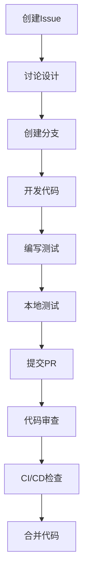
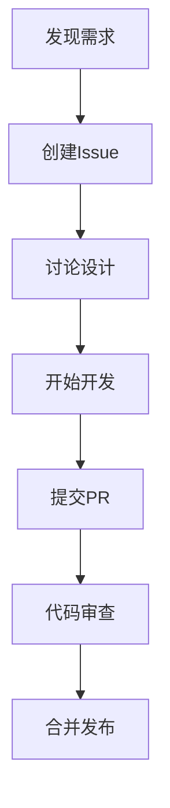

# 贡献指南

## 概念定义

### 项目贡献

项目贡献是指个人或组织通过代码、文档、问题报告、讨论等方式参与Formal Framework项目的开发和改进过程。贡献是开源项目的核心驱动力，体现了社区的协作精神和知识共享理念。

### 贡献类型

- **代码贡献**：功能开发、Bug修复、性能优化、重构改进
- **文档贡献**：文档编写、示例补充、最佳实践总结、教程制作
- **问题贡献**：Bug报告、功能建议、改进提案、使用反馈
- **社区贡献**：代码审查、问题解答、知识分享、社区建设

## 理论基础

### 开源协作理论

Formal Framework项目基于以下开源协作理论：

1. **透明性原则**
   - 所有开发过程公开透明
   - 决策过程可追溯和参与
   - 建立信任和可预测性

2. **包容性原则**
   - 欢迎不同背景的贡献者
   - 提供平等的参与机会
   - 建立友好的社区文化

3. **质量优先原则**
   - 通过审查确保贡献质量
   - 建立自动化质量检查
   - 持续改进和优化

4. **可持续性原则**
   - 建立长期维护机制
   - 培养核心维护者团队
   - 确保项目持续发展

### 贡献价值理论

- **个人价值**：技能提升、经验积累、职业发展
- **项目价值**：功能完善、质量提升、社区壮大
- **社会价值**：知识共享、技术创新、行业进步

## 贡献流程

### 1. 准备工作

#### 1.1 环境设置

```bash
# 克隆项目
git clone https://github.com/formal-framework/formal-framework.git
cd formal-framework

# 安装依赖
pip install -r requirements.txt

# 设置开发环境
python -m venv venv
source venv/bin/activate  # Linux/Mac
# 或
venv\Scripts\activate  # Windows
```

#### 1.2 分支策略

```yaml
# 分支命名规范
branch_naming:
  feature: "feature/功能名称-简短描述"
  bugfix: "bugfix/问题描述-修复方案"
  hotfix: "hotfix/紧急修复-问题描述"
  documentation: "docs/文档类型-内容描述"
  refactor: "refactor/重构范围-目标描述"
```

### 2. 开发流程

#### 2.1 功能开发流程



#### 2.2 代码质量标准

```python
# 代码质量检查标准
class CodeQualityStandards:
    def __init__(self):
        self.standards = {
            "python": {
                "pylint_score": ">=8.0",
                "test_coverage": ">=80%",
                "docstring_coverage": ">=90%",
                "complexity": "<=10"
            },
            "documentation": {
                "grammar_check": True,
                "link_validation": True,
                "format_consistency": True,
                "content_completeness": True
            }
        }
    
    def check_code_quality(self, code_file):
        """检查代码质量"""
        results = {}
        for tool, standard in self.standards.items():
            results[tool] = self.run_quality_check(tool, code_file, standard)
        return results
```

### 3. 代码审查流程

#### 3.1 审查标准

```yaml
# 代码审查检查清单
code_review_checklist:
  functionality:
    - "功能实现是否正确"
    - "边界条件是否处理"
    - "错误处理是否完善"
    - "性能是否可接受"
  
  code_quality:
    - "代码风格是否符合规范"
    - "命名是否清晰易懂"
    - "注释是否充分"
    - "复杂度是否合理"
  
  testing:
    - "单元测试是否覆盖"
    - "集成测试是否通过"
    - "测试用例是否充分"
    - "测试数据是否合理"
  
  documentation:
    - "API文档是否更新"
    - "README是否更新"
    - "变更日志是否记录"
    - "示例代码是否提供"
  
  security:
    - "是否存在安全漏洞"
    - "输入验证是否充分"
    - "权限控制是否正确"
    - "敏感信息是否保护"
```

#### 3.2 审查流程

```python
# 代码审查流程管理
class CodeReviewProcess:
    def __init__(self):
        self.review_stages = [
            "initial_review",
            "technical_review", 
            "security_review",
            "final_approval"
        ]
    
    def assign_reviewers(self, pr):
        """分配审查者"""
        reviewers = {
            "initial_review": self.get_community_reviewers(),
            "technical_review": self.get_technical_experts(),
            "security_review": self.get_security_experts(),
            "final_approval": self.get_maintainers()
        }
        return reviewers
    
    def review_criteria(self, stage):
        """获取审查标准"""
        criteria = {
            "initial_review": ["基本功能", "代码风格", "测试覆盖"],
            "technical_review": ["架构设计", "性能优化", "可维护性"],
            "security_review": ["安全漏洞", "数据保护", "权限控制"],
            "final_approval": ["整体质量", "项目一致性", "发布准备"]
        }
        return criteria.get(stage, [])
```

### 4. 质量保证机制

#### 4.1 自动化检查

```yaml
# CI/CD 质量检查配置
quality_checks:
  code_analysis:
    - tool: "pylint"
      threshold: 8.0
      config: ".pylintrc"
    
    - tool: "flake8"
      max_line_length: 100
      ignore: ["E203", "W503"]
    
    - tool: "black"
      line_length: 100
      target_version: "py38"
  
  testing:
    - tool: "pytest"
      coverage: 80
      parallel: true
    
    - tool: "tox"
      environments: ["py38", "py39", "py310"]
  
  documentation:
    - tool: "sphinx"
      build_docs: true
      check_links: true
    
    - tool: "markdownlint"
      config: ".markdownlint.json"
  
  security:
    - tool: "bandit"
      severity: "medium"
      confidence: "medium"
    
    - tool: "safety"
      check_packages: true
```

#### 4.2 手动审查

```python
# 手动审查流程
class ManualReviewProcess:
    def __init__(self):
        self.review_areas = [
            "business_logic",
            "user_experience", 
            "performance_impact",
            "security_implications"
        ]
    
    def conduct_review(self, pr, reviewer):
        """执行手动审查"""
        review_results = {}
        
        for area in self.review_areas:
            review_results[area] = self.review_area(pr, area, reviewer)
        
        return self.generate_review_report(review_results)
    
    def review_area(self, pr, area, reviewer):
        """审查特定领域"""
        criteria = self.get_area_criteria(area)
        findings = []
        
        for criterion in criteria:
            finding = self.evaluate_criterion(pr, criterion, reviewer)
            if finding:
                findings.append(finding)
        
        return findings
```

### 5. 贡献者成长路径

#### 5.1 技能发展计划

```yaml
# 贡献者技能发展路径
contributor_development:
  beginner:
    skills:
      - "Git基础操作"
      - "Markdown文档编写"
      - "Issue报告和讨论"
      - "简单Bug修复"
    
    activities:
      - "文档改进"
      - "问题报告"
      - "代码审查参与"
      - "社区讨论"
  
  intermediate:
    skills:
      - "功能开发"
      - "单元测试编写"
      - "代码审查执行"
      - "性能优化"
    
    activities:
      - "新功能开发"
      - "测试用例编写"
      - "代码审查"
      - "技术文档编写"
  
  advanced:
    skills:
      - "架构设计"
      - "系统集成"
      - "性能调优"
      - "安全审计"
    
    activities:
      - "架构设计"
      - "核心功能开发"
      - "安全审查"
      - "社区领导"
```

#### 5.2 激励机制

```python
# 贡献者激励机制
class ContributorIncentives:
    def __init__(self):
        self.incentive_types = [
            "recognition",
            "mentorship", 
            "learning_opportunities",
            "career_development"
        ]
    
    def recognize_contribution(self, contributor, contribution):
        """认可贡献"""
        recognition = {
            "contributor_of_month": self.evaluate_monthly_contribution(contributor),
            "feature_highlight": self.highlight_feature_contribution(contribution),
            "community_award": self.award_community_contribution(contributor)
        }
        return recognition
    
    def provide_mentorship(self, contributor):
        """提供指导"""
        mentor = self.assign_mentor(contributor)
        learning_plan = self.create_learning_plan(contributor)
        return {
            "mentor": mentor,
            "learning_plan": learning_plan,
            "progress_tracking": self.track_progress(contributor)
        }
```

## 应用案例

### 案例1：新功能开发贡献



**具体步骤**：

1. 在GitHub上创建Issue，描述新功能需求
2. 在Issue中进行讨论，确定技术方案
3. Fork项目到个人仓库
4. 创建功能分支进行开发
5. 编写代码和测试用例
6. 提交Pull Request
7. 通过代码审查后合并

### 案例2：文档改进贡献

```yaml
# 文档贡献流程
documentation_contribution:
  steps:
    - identify_improvement: "识别改进点"
    - create_issue: "创建文档Issue"
    - write_content: "编写内容"
    - submit_pr: "提交PR"
    - review_merge: "审查合并"
  
  quality_checks:
    - grammar_check: "语法检查"
    - link_validation: "链接验证"
    - format_consistency: "格式一致性"
    - content_completeness: "内容完整性"
```

### 案例3：问题报告贡献

```python
# 问题报告模板
class BugReport:
    def __init__(self):
        self.title = "简洁明确的问题标题"
        self.description = "详细的问题描述"
        self.reproduction_steps = "复现步骤"
        self.expected_behavior = "期望行为"
        self.actual_behavior = "实际行为"
        self.environment = "运行环境"
        self.additional_info = "附加信息"
```

## 学习资源

- 项目文档和教程
- 代码示例和模板
- 社区讨论和问答
- 导师指导和支持

## 成长路径

- 从文档贡献开始
- 逐步参与代码开发
- 参与代码审查
- 成为核心维护者

## 总结

Formal Framework项目欢迎所有形式的贡献，通过完善的贡献流程、质量保证机制和激励机制，为贡献者提供良好的协作体验。我们相信，通过社区的共同努力，Formal Framework将成为软件工程领域的重要基础设施。

---

**相关链接**：

- [项目文档](../docs/README.md)
- [问题报告](https://github.com/formal-framework/issues)
- [讨论区](https://github.com/formal-framework/discussions)
- [代码审查指南](../docs/CODE_REVIEW_GUIDE.md)
