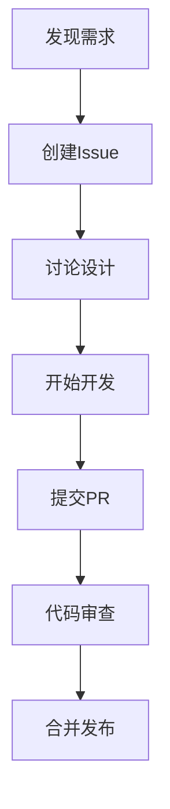

# 贡献指南

## 概念定义

### 项目贡献

项目贡献是指个人或组织通过代码、文档、问题报告、讨论等方式参与Formal Framework项目的开发和改进过程。贡献是开源项目的核心驱动力，体现了社区的协作精神和知识共享理念。

### 贡献类型

- **代码贡献**：功能开发、Bug修复、性能优化、重构改进
- **文档贡献**：文档编写、示例补充、最佳实践总结、教程制作
- **问题贡献**：Bug报告、功能建议、改进提案、使用反馈
- **社区贡献**：代码审查、问题解答、知识分享、社区建设

## 理论基础

### 开源协作理论

Formal Framework项目基于以下开源协作理论：

1. **透明性原则**
   - 所有开发过程公开透明
   - 决策过程可追溯和参与
   - 建立信任和可预测性

2. **包容性原则**
   - 欢迎不同背景的贡献者
   - 提供平等的参与机会
   - 建立友好的社区文化

3. **质量优先原则**
   - 通过审查确保贡献质量
   - 建立自动化质量检查
   - 持续改进和优化

4. **可持续性原则**
   - 建立长期维护机制
   - 培养核心维护者团队
   - 确保项目持续发展

### 贡献价值理论

- **个人价值**：技能提升、经验积累、职业发展
- **项目价值**：功能完善、质量提升、社区壮大
- **社会价值**：知识共享、技术创新、行业进步

## 应用案例

### 案例1：新功能开发贡献



**具体步骤**：

1. 在GitHub上创建Issue，描述新功能需求
2. 在Issue中进行讨论，确定技术方案
3. Fork项目到个人仓库
4. 创建功能分支进行开发
5. 编写代码和测试用例
6. 提交Pull Request
7. 通过代码审查后合并

### 案例2：文档改进贡献

```yaml
# 文档贡献流程
documentation_contribution:
  steps:
    - identify_improvement: "识别改进点"
    - create_issue: "创建文档Issue"
    - write_content: "编写内容"
    - submit_pr: "提交PR"
    - review_merge: "审查合并"
  
  quality_checks:
    - grammar_check: "语法检查"
    - link_validation: "链接验证"
    - format_consistency: "格式一致性"
    - content_completeness: "内容完整性"
```

### 案例3：问题报告贡献

```python
# 问题报告模板
class BugReport:
    def __init__(self):
        self.title = "简洁明确的问题标题"
        self.description = "详细的问题描述"
        self.reproduction_steps = "复现步骤"
        self.expected_behavior = "期望行为"
        self.actual_behavior = "实际行为"
        self.environment = "环境信息"
        self.additional_info = "附加信息"
    
    def validate(self):
        """验证问题报告的完整性"""
        required_fields = [
            self.title, self.description, 
            self.reproduction_steps
        ]
        return all(field.strip() for field in required_fields)
```

## 最佳实践

### 1. 代码贡献最佳实践

#### 开发环境设置

```bash
# 1. Fork项目
git clone https://github.com/your-username/formal-framework.git
cd formal-framework

# 2. 设置上游仓库
git remote add upstream https://github.com/formal-framework/formal-framework.git

# 3. 安装依赖
pip install -r requirements.txt

# 4. 运行测试
pytest tests/

# 5. 创建功能分支
git checkout -b feature/your-feature-name
```

#### 代码规范

```python
# 代码风格示例
class ExampleClass:
    """示例类的文档字符串"""
    
    def __init__(self, name: str, value: int):
        """
        初始化方法
        
        Args:
            name: 名称
            value: 数值
        """
        self.name = name
        self.value = value
    
    def process_data(self, data: List[str]) -> Dict[str, int]:
        """
        处理数据的方法
        
        Args:
            data: 输入数据列表
            
        Returns:
            处理结果字典
            
        Raises:
            ValueError: 当输入数据无效时
        """
        if not data:
            raise ValueError("输入数据不能为空")
        
        result = {}
        for item in data:
            result[item] = len(item)
        
        return result
```

#### 提交规范

```bash
# 提交信息格式
git commit -m "feat: 添加新的数据模型验证功能

- 实现数据模型验证器
- 添加单元测试用例
- 更新相关文档

Closes #123"
```

**提交类型**：

- `feat`: 新功能
- `fix`: Bug修复
- `docs`: 文档更新
- `style`: 代码格式调整
- `refactor`: 代码重构
- `test`: 测试相关
- `chore`: 构建过程或辅助工具的变动

### 2. 文档贡献最佳实践

#### 文档结构

```markdown
# 文档标题

## 概述
简要介绍文档内容

## 概念定义
定义相关概念和术语

## 理论基础
阐述相关的理论基础

## 应用案例
提供具体的应用案例

## 最佳实践
总结最佳实践

## 总结
文档总结

## 相关链接
- [相关文档链接]
- [外部资源链接]
```

#### 内容质量要求

- **准确性**：内容准确无误，技术细节正确
- **完整性**：覆盖所有必要的内容和细节
- **可读性**：语言清晰易懂，结构合理
- **实用性**：提供实际可用的信息和指导

### 3. 问题报告最佳实践

#### Bug报告模板

```markdown
## Bug描述
简要描述Bug的现象

## 复现步骤
1. 第一步
2. 第二步
3. 第三步

## 期望行为
描述期望的正确行为

## 实际行为
描述实际发生的错误行为

## 环境信息
- 操作系统：Windows 10
- Python版本：3.9.0
- 项目版本：v1.0.0

## 附加信息
其他相关信息，如错误日志、截图等
```

#### 功能建议模板

```markdown
## 功能描述
详细描述建议的功能

## 使用场景
描述功能的使用场景和价值

## 实现建议
提供实现思路和建议

## 优先级
高/中/低优先级

## 相关讨论
相关的讨论和参考
```

### 4. 代码审查最佳实践

#### 审查清单

```yaml
code_review_checklist:
  functionality:
    - "功能实现是否正确"
    - "边界条件是否处理"
    - "错误处理是否完善"
    - "性能影响是否可接受"
  
  code_quality:
    - "代码风格是否一致"
    - "命名是否清晰"
    - "复杂度是否合理"
    - "重复代码是否消除"
  
  testing:
    - "测试覆盖是否充分"
    - "测试用例是否有效"
    - "集成测试是否通过"
  
  documentation:
    - "代码注释是否清晰"
    - "API文档是否更新"
    - "变更日志是否记录"
```

#### 审查流程

```python
class CodeReviewProcess:
    def __init__(self):
        self.stages = [
            "automated_checks",
            "functionality_review", 
            "code_quality_review",
            "security_review",
            "final_approval"
        ]
    
    def review_pr(self, pr):
        """审查Pull Request"""
        # 1. 自动化检查
        if not self.run_automated_checks(pr):
            return "自动化检查失败"
        
        # 2. 功能审查
        if not self.review_functionality(pr):
            return "功能审查未通过"
        
        # 3. 代码质量审查
        if not self.review_code_quality(pr):
            return "代码质量审查未通过"
        
        # 4. 安全审查
        if not self.review_security(pr):
            return "安全审查未通过"
        
        # 5. 最终批准
        return "审查通过，可以合并"
```

## 贡献流程

### 1. 准备工作

#### 环境设置

```bash
# 克隆项目
git clone https://github.com/formal-framework/formal-framework.git
cd formal-framework

# 创建虚拟环境
python -m venv venv
source venv/bin/activate  # Linux/Mac
# 或
venv\Scripts\activate  # Windows

# 安装依赖
pip install -r requirements.txt

# 运行测试
pytest tests/
```

#### 了解项目

- 阅读项目README和文档
- 了解项目架构和技术栈
- 查看现有的Issues和PRs
- 参与项目讨论

### 2. 选择贡献任务

#### 任务类型

- **Good First Issue**：适合新手的简单任务
- **Bug Fix**：Bug修复任务
- **Feature Request**：功能开发任务
- **Documentation**：文档改进任务
- **Testing**：测试相关任务

#### 任务选择建议

```yaml
task_selection_guide:
  beginner:
    - documentation_updates: "文档更新"
    - simple_bug_fixes: "简单Bug修复"
    - test_improvements: "测试改进"
  
  intermediate:
    - feature_development: "功能开发"
    - code_refactoring: "代码重构"
    - performance_optimization: "性能优化"
  
  advanced:
    - architecture_improvements: "架构改进"
    - new_module_development: "新模块开发"
    - community_leadership: "社区领导"
```

### 3. 开发流程

#### 分支管理

```bash
# 更新主分支
git checkout main
git pull upstream main

# 创建功能分支
git checkout -b feature/your-feature-name

# 开发完成后提交
git add .
git commit -m "feat: 添加新功能"

# 推送到个人仓库
git push origin feature/your-feature-name
```

#### 测试要求

```python
# 测试覆盖率要求
class TestRequirements:
    def __init__(self):
        self.min_coverage = 0.8  # 最低80%覆盖率
        self.test_types = [
            "unit_tests",      # 单元测试
            "integration_tests", # 集成测试
            "performance_tests"  # 性能测试
        ]
    
    def run_tests(self):
        """运行测试套件"""
        # 运行单元测试
        pytest tests/unit/ --cov=src --cov-report=html
        
        # 运行集成测试
        pytest tests/integration/
        
        # 运行性能测试
        pytest tests/performance/
```

### 4. 提交和审查

#### Pull Request模板

```markdown
## 变更描述
简要描述本次变更的内容

## 变更类型
- [ ] Bug修复
- [ ] 新功能
- [ ] 文档更新
- [ ] 代码重构
- [ ] 其他

## 测试
- [ ] 单元测试已通过
- [ ] 集成测试已通过
- [ ] 手动测试已完成

## 检查清单
- [ ] 代码符合项目规范
- [ ] 文档已更新
- [ ] 变更日志已记录
- [ ] 相关Issue已链接

## 相关Issue
Closes #123
```

#### 审查流程1

1. **自动化检查**：CI/CD流水线自动运行
2. **功能审查**：维护者审查功能实现
3. **代码质量审查**：审查代码风格和质量
4. **安全审查**：检查安全相关问题
5. **最终批准**：通过所有审查后合并

## 激励机制

### 1. 贡献者等级

#### 等级体系

```yaml
contributor_levels:
  newcomer:
    requirements: "完成1-3个任务"
    benefits:
      - "新手徽章"
      - "欢迎邮件"
      - "导师指导"
  
  active_contributor:
    requirements: "完成5-10个任务"
    benefits:
      - "活跃贡献者徽章"
      - "参与评审权限"
      - "优先任务分配"
  
  core_contributor:
    requirements: "完成10+个任务"
    benefits:
      - "核心贡献者徽章"
      - "维护者权限"
      - "项目决策参与"
  
  expert_contributor:
    requirements: "完成20+个任务"
    benefits:
      - "专家贡献者徽章"
      - "项目领导权限"
      - "社区代表资格"
```

### 2. 奖励机制

#### 月度奖励

- **月度最佳贡献者**：贡献数量和质量最高的贡献者
- **月度最佳新人**：表现最突出的新贡献者
- **月度最佳创新**：最具创新性的贡献

#### 季度奖励

- **季度优秀贡献者**：持续贡献的优秀贡献者
- **季度优秀团队**：协作效果最好的团队
- **季度优秀项目**：最有价值的项目贡献

#### 年度奖励

- **年度杰出贡献者**：年度贡献最突出的个人
- **年度杰出团队**：年度协作最优秀的团队
- **年度杰出项目**：年度最有影响力的项目

### 3. 成长支持

#### 技能发展

```yaml
skill_development:
  technical_skills:
    - "编程语言精通"
    - "架构设计能力"
    - "测试驱动开发"
    - "性能优化技能"
  
  soft_skills:
    - "沟通协作能力"
    - "问题解决能力"
    - "项目管理能力"
    - "领导力培养"
  
  career_support:
    - "职业发展指导"
    - "推荐信支持"
    - "会议演讲机会"
    - "行业人脉网络"
```

## 联系方式

### 沟通渠道

- **GitHub Issues**：问题报告和功能讨论
- **GitHub Discussions**：一般性讨论和问答
- **邮件列表**：重要公告和决策
- **即时通讯**：实时协作和快速反馈

### 社区资源

- **项目文档**：[docs/README.md](docs/README.md)
- **贡献指南**：[CONTRIBUTING.md](CONTRIBUTING.md)
- **社区协作**：[docs/COMMUNITY_COLLABORATION.md](docs/COMMUNITY_COLLABORATION.md)
- **问题报告**：[GitHub Issues](https://github.com/formal-framework/issues)

### 获取帮助

- **新手入门**：查看[新贡献者指南](docs/COMMUNITY_COLLABORATION.md#新贡献者指南)
- **技术问题**：在GitHub Discussions中提问
- **项目方向**：参与项目讨论和决策
- **个人发展**：联系项目维护者获取指导

## 总结

Formal Framework项目欢迎所有形式的贡献，无论是代码、文档、问题报告还是社区建设。通过参与项目贡献，您可以：

1. **提升技能**：在实战中提升技术能力和项目管理能力
2. **积累经验**：获得开源项目开发和维护的宝贵经验
3. **建立人脉**：结识志同道合的开发者和行业专家
4. **推动创新**：参与前沿技术的开发和推广

我们相信，通过社区的共同努力，Formal Framework将成为软件工程领域的重要基础设施，为行业的数字化转型提供强有力的技术支撑。

感谢您的关注和贡献！

---

**相关链接**：

- [项目主页](../README.md)
- [社区协作](../docs/COMMUNITY_COLLABORATION.md)
- [开发指南](../docs/automation-toolchain.md)
- [问题报告](https://github.com/formal-framework/issues)
