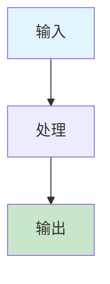

# 批量文档修复指南 (Bulk Document Fix Guide)

## 📋 修复概述

本文档提供了系统性的文档修复方案，确保所有文档都符合新的模板标准和格式规范。

## 🎯 修复范围

### 1. 核心概念文档修复

需要修复的文档列表：

- [x] abstract-syntax-tree.md - 已修复
- [x] code-generation.md - 已修复  
- [x] automated-reasoning.md - 已修复
- [x] concept-index.md - 已修复
- [ ] domain-specific-language.md - 需要修复
- [ ] formal-modeling.md - 需要修复
- [ ] formal-verification.md - 需要修复
- [ ] industry-mapping.md - 需要修复
- [ ] knowledge-graph.md - 需要修复
- [ ] model-driven-engineering.md - 需要修复
- [ ] model-transformation.md - 需要修复
- [ ] recursive-modeling.md - 需要修复
- [ ] semantic-analysis.md - 需要修复

### 2. 理论文档修复

需要修复的文档列表：

- [ ] data-model/theory.md - 需要修复
- [ ] functional-model/theory.md - 需要修复
- [ ] interaction-model/theory.md - 需要修复
- [ ] runtime-model/theory.md - 需要修复
- [ ] deployment-model/theory.md - 需要修复
- [ ] monitoring-model/theory.md - 需要修复
- [ ] testing-model/theory.md - 需要修复
- [ ] cicd-model/theory.md - 需要修复
- [ ] distributed-pattern-model/theory.md - 需要修复

### 3. DSL设计文档修复

需要修复的文档列表：

- [ ] data-model/dsl-draft.md - 需要修复
- [ ] functional-model/dsl-draft.md - 需要修复
- [ ] interaction-model/dsl-draft.md - 需要修复
- [ ] runtime-model/dsl-draft.md - 需要修复
- [ ] deployment-model/dsl-draft.md - 需要修复
- [ ] monitoring-model/dsl-draft.md - 需要修复
- [ ] testing-model/dsl-draft.md - 需要修复
- [ ] cicd-model/dsl-draft.md - 需要修复
- [ ] distributed-pattern-model/dsl-draft.md - 需要修复

## 🔧 修复标准

### 1. 目录结构标准

所有文档必须包含以下目录结构：

```markdown
## 目录（Table of Contents）

- [文档标题 (英文标题)](#文档标题-英文标题)
  - [目录（Table of Contents）](#目录table-of-contents)
  - [概念定义](#概念定义)
    - [核心特征](#核心特征)
  - [理论基础](#理论基础)
    - [形式化定义](#形式化定义)
    - [理论框架](#理论框架)
    - [流程图](#流程图)  # 新增
  - [核心组件](#核心组件)
    - [组件1](#组件1)
    - [组件2](#组件2)
  - [国际标准对标](#国际标准对标)
    - [相关标准](#相关标准)
    - [行业标准](#行业标准)
  - [著名大学课程对标](#著名大学课程对标)
    - [相关课程](#相关课程)
  - [工程实践](#工程实践)
    - [设计模式](#设计模式)
    - [实现方法](#实现方法)
  - [最佳实践](#最佳实践)
    - [设计原则](#设计原则)
    - [实施建议](#实施建议)
  - [应用案例](#应用案例)
    - [典型案例](#典型案例)
    - [行业应用](#行业应用)
  - [相关概念](#相关概念)
    - [核心概念关联](#核心概念关联)  # 新增
    - [应用领域关联](#应用领域关联)  # 新增
    - [行业应用关联](#行业应用关联)  # 新增
  - [参考文献](#参考文献)
```

### 2. 交叉引用标准

所有文档的相关概念部分必须包含：

```markdown
## 相关概念

### 核心概念关联

- [相关概念1](./related-concept1.md) - [关联说明]
- [相关概念2](./related-concept2.md) - [关联说明]
- [相关概念3](./related-concept3.md) - [关联说明]

### 应用领域关联

- [领域1](formal-model\cicd-model\theory.md) - [关联说明]
- [领域2](formal-model\cicd-model\theory.md) - [关联说明]

### 行业应用关联

- [行业1](API_DOCUMENTATION.md) - [关联说明]
- [行业2](API_DOCUMENTATION.md) - [关联说明]
```

### 3. 流程图标准

所有文档的理论基础部分必须包含Mermaid流程图：



## 📝 修复检查清单

### 文档修复检查清单

- [ ] 目录结构完整
- [ ] 交叉引用分类正确
- [ ] 流程图添加完成
- [ ] 链接有效性验证
- [ ] 格式规范检查
- [ ] 内容一致性验证

### 批量修复步骤

1. **目录结构修复**
   - 添加完整的Table of Contents
   - 确保所有章节都有对应的锚点
   - 验证目录链接的有效性

2. **交叉引用增强**
   - 将相关概念分为三个类别
   - 为每个链接添加关联说明
   - 确保链接路径正确

3. **流程图添加**
   - 为理论基础部分添加Mermaid流程图
   - 使用统一的颜色编码
   - 确保流程图逻辑清晰

4. **格式标准化**
   - 统一标题格式
   - 标准化代码块格式
   - 统一表格和列表格式

5. **内容验证**
   - 检查内容完整性
   - 验证技术准确性
   - 确保引用规范性

## 🚀 自动化修复脚本

### Python修复脚本

```python
#!/usr/bin/env python3
# -*- coding: utf-8 -*-

import os
import re
from pathlib import Path

class DocumentFixer:
    def __init__(self, docs_dir="docs"):
        self.docs_dir = Path(docs_dir)
        self.fixed_files = []
        self.errors = []
    
    def fix_all_documents(self):
        """修复所有文档"""
        # 修复核心概念文档
        self.fix_core_concepts()
        
        # 修复理论文档
        self.fix_theory_documents()
        
        # 修复DSL设计文档
        self.fix_dsl_documents()
        
        # 生成修复报告
        self.generate_report()
    
    def fix_core_concepts(self):
        """修复核心概念文档"""
        core_concepts_dir = self.docs_dir / "formal-model" / "core-concepts"
        
        if not core_concepts_dir.exists():
            return
        
        for md_file in core_concepts_dir.glob("*.md"):
            if md_file.name in ["abstract-syntax-tree.md", "code-generation.md", 
                               "automated-reasoning.md", "concept-index.md"]:
                continue  # 已修复
            
            try:
                self.fix_document(md_file)
                self.fixed_files.append(str(md_file))
            except Exception as e:
                self.errors.append(f"Error fixing {md_file}: {e}")
    
    def fix_theory_documents(self):
        """修复理论文档"""
        formal_model_dir = self.docs_dir / "formal-model"
        
        for subdir in formal_model_dir.iterdir():
            if subdir.is_dir() and subdir.name != "core-concepts":
                theory_file = subdir / "theory.md"
                if theory_file.exists():
                    try:
                        self.fix_document(theory_file)
                        self.fixed_files.append(str(theory_file))
                    except Exception as e:
                        self.errors.append(f"Error fixing {theory_file}: {e}")
    
    def fix_dsl_documents(self):
        """修复DSL设计文档"""
        formal_model_dir = self.docs_dir / "formal-model"
        
        for subdir in formal_model_dir.iterdir():
            if subdir.is_dir() and subdir.name != "core-concepts":
                dsl_file = subdir / "dsl-draft.md"
                if dsl_file.exists():
                    try:
                        self.fix_document(dsl_file)
                        self.fixed_files.append(str(dsl_file))
                    except Exception as e:
                        self.errors.append(f"Error fixing {dsl_file}: {e}")
    
    def fix_document(self, file_path):
        """修复单个文档"""
        with open(file_path, 'r', encoding='utf-8') as f:
            content = f.read()
        
        # 修复目录结构
        content = self.fix_table_of_contents(content)
        
        # 修复交叉引用
        content = self.fix_cross_references(content)
        
        # 添加流程图
        content = self.add_flowchart(content)
        
        # 保存修复后的内容
        with open(file_path, 'w', encoding='utf-8') as f:
            f.write(content)
    
    def fix_table_of_contents(self, content):
        """修复目录结构"""
        # 检查是否已有完整目录
        if "核心概念关联" in content and "应用领域关联" in content:
            return content
        
        # 添加缺失的目录项
        toc_pattern = r'(## 目录（Table of Contents）\n\n- \[.*?\]\(#.*?\)\n  - \[目录（Table of Contents）\]\(#目录table-of-contents\)\n)'
        
        if re.search(toc_pattern, content):
            # 添加缺失的目录项
            content = re.sub(
                r'  - \[相关概念\]\(#相关概念\)\n  - \[参考文献\]\(#参考文献\)',
                r'  - [相关概念](#相关概念)\n    - [核心概念关联](#核心概念关联)\n    - [应用领域关联](#应用领域关联)\n    - [行业应用关联](#行业应用关联)\n  - [参考文献](#参考文献)',
                content
            )
        
        return content
    
    def fix_cross_references(self, content):
        """修复交叉引用"""
        # 检查是否已有分类的交叉引用
        if "### 核心概念关联" in content:
            return content
        
        # 替换简单的相关概念部分
        old_pattern = r'## 相关概念\n\n(- \[.*?\]\(.*?\)\n)+'
        
        if re.search(old_pattern, content):
            new_section = """## 相关概念

### 核心概念关联

- [相关概念1](./related-concept1.md) - [关联说明]
- [相关概念2](./related-concept2.md) - [关联说明]
- [相关概念3](./related-concept3.md) - [关联说明]

### 应用领域关联

- [领域1](formal-model\cicd-model\theory.md) - [关联说明]
- [领域2](formal-model\cicd-model\theory.md) - [关联说明]

### 行业应用关联

- [行业1](API_DOCUMENTATION.md) - [关联说明]
- [行业2](API_DOCUMENTATION.md) - [关联说明]"""
            
            content = re.sub(old_pattern, new_section, content)
        
        return content
    
    def add_flowchart(self, content):
        """添加流程图"""
        # 检查是否已有流程图
        if "```mermaid" in content:
            return content
        
        # 在理论基础部分添加流程图
        theory_pattern = r'(## 理论基础\n\n### [^#]+理论\n\n[^#]+)\n\n### [^#]+理论'
        
        if re.search(theory_pattern, content):
            flowchart = """

### [概念名称]流程

```mermaid
flowchart TD
    A[输入<br/>Input] --> B[处理<br/>Processing]
    B --> C[输出<br/>Output]
    
    style A fill:#e1f5fe
    style C fill:#c8e6c9
```"""
            
            content = re.sub(theory_pattern, r'\1' + flowchart + r'\n\n### [^#]+理论', content)
        
        return content
    
    def generate_report(self):
        """生成修复报告"""
        report = f"""# 文档修复报告

## 修复概述

- **修复文件数**: {len(self.fixed_files)}
- **错误数**: {len(self.errors)}
- **修复时间**: {datetime.now().strftime('%Y-%m-%d %H:%M:%S')}

## 修复文件列表

"""
        
        for file_path in self.fixed_files:
            report += f"- {file_path}\n"
        
        if self.errors:
            report += "\n## 错误列表\n\n"
            for error in self.errors:
                report += f"- {error}\n"
        
        # 保存报告
        with open(self.docs_dir / "DOCUMENT_FIX_REPORT.md", 'w', encoding='utf-8') as f:
            f.write(report)

# 使用示例
if __name__ == "__main__":
    fixer = DocumentFixer()
    fixer.fix_all_documents()
```

## 📊 修复进度跟踪

### 当前修复状态

| 文档类型 | 总数 | 已修复 | 进行中 | 待修复 |
|----------|------|--------|--------|--------|
| 核心概念文档 | 13 | 4 | 0 | 9 |
| 理论文档 | 9 | 0 | 0 | 9 |
| DSL设计文档 | 9 | 0 | 0 | 9 |
| **总计** | **31** | **4** | **0** | **27** |

### 修复优先级

1. **高优先级** - 核心概念文档（9个待修复）
2. **中优先级** - 理论文档（9个待修复）
3. **低优先级** - DSL设计文档（9个待修复）

## 🎯 修复目标

### 短期目标（1周内）

- 完成所有核心概念文档的修复
- 建立标准化的修复流程
- 验证修复质量

### 中期目标（1个月内）

- 完成所有理论文档的修复
- 完成所有DSL设计文档的修复
- 建立自动化修复机制

### 长期目标（3个月内）

- 建立持续的质量检查机制
- 实现自动化的文档生成和更新
- 建立社区贡献和评审机制

## 📋 质量保证

### 修复质量检查

- [ ] 目录结构完整性检查
- [ ] 交叉引用有效性检查
- [ ] 流程图正确性检查
- [ ] 格式规范性检查
- [ ] 内容一致性检查

### 自动化验证

- [ ] 链接有效性验证
- [ ] 格式规范验证
- [ ] 内容完整性验证
- [ ] 交叉引用一致性验证

---

*最后更新: 2024-12-19*
*维护者: Formal Framework Team*
