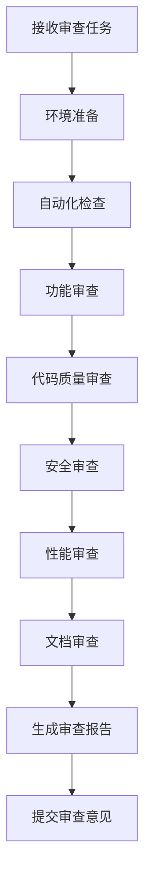

# 代码审查指南

## 概述

代码审查是Formal Framework项目质量保证的核心环节，通过系统化的审查流程确保代码质量、安全性和可维护性。本指南为审查者和被审查者提供详细的审查标准和流程。

## 审查目标

### 1. 质量保证

- **功能正确性**：确保代码实现符合需求
- **代码质量**：保证代码风格、结构和可读性
- **性能优化**：识别性能瓶颈和优化机会
- **安全性**：发现潜在的安全漏洞

### 2. 知识共享

- **技术交流**：促进团队成员间的技术交流
- **最佳实践**：传播和推广最佳实践
- **学习成长**：帮助开发者提升技能

### 3. 团队协作

- **一致性**：确保代码风格和架构的一致性
- **可维护性**：提高代码的可维护性和可扩展性
- **风险控制**：降低代码缺陷和项目风险

## 审查标准

### 1. 功能审查

#### 1.1 功能实现

```yaml
functionality_review:
  requirements:
    - "功能实现是否完整"
    - "是否满足所有需求"
    - "边界条件是否处理"
    - "错误场景是否覆盖"
  
  logic:
    - "业务逻辑是否正确"
    - "算法实现是否高效"
    - "数据处理是否准确"
    - "状态管理是否合理"
  
  integration:
    - "接口设计是否合理"
    - "模块间依赖是否正确"
    - "数据流是否清晰"
    - "异常处理是否完善"
```

#### 1.2 测试覆盖

```python
# 测试覆盖检查
class TestCoverageChecker:
    def __init__(self):
        self.min_coverage = 0.8  # 最低80%覆盖率
        self.critical_paths = [
            "business_logic",
            "error_handling", 
            "edge_cases",
            "integration_points"
        ]
    
    def check_coverage(self, test_results):
        """检查测试覆盖率"""
        coverage = test_results.get("coverage", 0)
        if coverage < self.min_coverage:
            return {
                "status": "failed",
                "message": f"测试覆盖率不足: {coverage:.1%} < {self.min_coverage:.1%}",
                "suggestions": self.generate_coverage_suggestions(test_results)
            }
        return {"status": "passed", "coverage": coverage}
    
    def generate_coverage_suggestions(self, test_results):
        """生成覆盖率改进建议"""
        uncovered_lines = test_results.get("uncovered_lines", [])
        suggestions = []
        
        for line in uncovered_lines:
            if self.is_critical_path(line):
                suggestions.append(f"关键路径未覆盖: {line}")
        
        return suggestions
```

### 2. 代码质量审查

#### 2.1 代码风格

```yaml
code_style_review:
  formatting:
    - "代码格式是否符合规范"
    - "缩进和空格是否一致"
    - "行长度是否合理"
    - "空行使用是否恰当"
  
  naming:
    - "变量命名是否清晰"
    - "函数命名是否描述性"
    - "常量命名是否规范"
    - "类命名是否准确"
  
  structure:
    - "函数长度是否合理"
    - "类设计是否合理"
    - "模块划分是否清晰"
    - "依赖关系是否明确"
```

#### 2.2 代码复杂度

```python
# 复杂度分析
class ComplexityAnalyzer:
    def __init__(self):
        self.max_cyclomatic_complexity = 10
        self.max_function_length = 50
        self.max_class_length = 500
    
    def analyze_complexity(self, code_file):
        """分析代码复杂度"""
        results = {
            "cyclomatic_complexity": self.calculate_cyclomatic_complexity(code_file),
            "function_lengths": self.analyze_function_lengths(code_file),
            "class_lengths": self.analyze_class_lengths(code_file),
            "nesting_depth": self.analyze_nesting_depth(code_file)
        }
        
        issues = []
        for metric, value in results.items():
            if self.is_complexity_issue(metric, value):
                issues.append(self.generate_issue(metric, value))
        
        return {
            "results": results,
            "issues": issues,
            "overall_score": self.calculate_overall_score(results)
        }
    
    def is_complexity_issue(self, metric, value):
        """判断是否存在复杂度问题"""
        thresholds = {
            "cyclomatic_complexity": self.max_cyclomatic_complexity,
            "function_length": self.max_function_length,
            "class_length": self.max_class_length
        }
        return value > thresholds.get(metric, float('inf'))
```

### 3. 安全审查

#### 3.1 安全漏洞检查

```yaml
security_review:
  input_validation:
    - "用户输入是否验证"
    - "SQL注入是否防护"
    - "XSS攻击是否防护"
    - "文件上传是否安全"
  
  authentication:
    - "身份验证是否完善"
    - "权限控制是否正确"
    - "会话管理是否安全"
    - "密码策略是否合理"
  
  data_protection:
    - "敏感数据是否加密"
    - "数据传输是否安全"
    - "日志记录是否安全"
    - "错误信息是否泄露"
```

#### 3.2 安全扫描

```python
# 安全扫描工具
class SecurityScanner:
    def __init__(self):
        self.security_tools = [
            "bandit",      # Python安全扫描
            "safety",      # 依赖包安全检查
            "semgrep",     # 语义化安全扫描
            "trivy"        # 容器安全扫描
        ]
    
    def run_security_scan(self, code_path):
        """运行安全扫描"""
        scan_results = {}
        
        for tool in self.security_tools:
            try:
                result = self.run_tool(tool, code_path)
                scan_results[tool] = result
            except Exception as e:
                scan_results[tool] = {"error": str(e)}
        
        return self.analyze_security_results(scan_results)
    
    def analyze_security_results(self, results):
        """分析安全扫描结果"""
        issues = []
        severity_levels = ["low", "medium", "high", "critical"]
        
        for tool, result in results.items():
            if "error" in result:
                continue
            
            for issue in result.get("issues", []):
                if issue["severity"] in ["high", "critical"]:
                    issues.append({
                        "tool": tool,
                        "issue": issue,
                        "priority": "high"
                    })
        
        return {
            "total_issues": len(issues),
            "critical_issues": len([i for i in issues if i["issue"]["severity"] == "critical"]),
            "high_issues": len([i for i in issues if i["issue"]["severity"] == "high"]),
            "issues": issues
        }
```

### 4. 性能审查

#### 4.1 性能分析

```python
# 性能分析工具
class PerformanceAnalyzer:
    def __init__(self):
        self.performance_metrics = [
            "execution_time",
            "memory_usage",
            "cpu_usage",
            "network_io",
            "disk_io"
        ]
    
    def analyze_performance(self, code_file):
        """分析代码性能"""
        analysis_results = {}
        
        # 静态分析
        static_analysis = self.perform_static_analysis(code_file)
        analysis_results["static"] = static_analysis
        
        # 动态分析
        dynamic_analysis = self.perform_dynamic_analysis(code_file)
        analysis_results["dynamic"] = dynamic_analysis
        
        return self.generate_performance_report(analysis_results)
    
    def perform_static_analysis(self, code_file):
        """执行静态性能分析"""
        issues = []
        
        # 检查算法复杂度
        complexity_issues = self.check_algorithm_complexity(code_file)
        issues.extend(complexity_issues)
        
        # 检查资源使用
        resource_issues = self.check_resource_usage(code_file)
        issues.extend(resource_issues)
        
        # 检查并发问题
        concurrency_issues = self.check_concurrency_issues(code_file)
        issues.extend(concurrency_issues)
        
        return issues
    
    def check_algorithm_complexity(self, code_file):
        """检查算法复杂度"""
        issues = []
        
        # 检查嵌套循环
        nested_loops = self.find_nested_loops(code_file)
        for loop in nested_loops:
            if self.calculate_loop_complexity(loop) > 100:
                issues.append({
                    "type": "high_complexity",
                    "location": loop["location"],
                    "description": "嵌套循环可能导致性能问题",
                    "suggestion": "考虑优化算法或使用更高效的数据结构"
                })
        
        return issues
```

## 审查流程

### 1. 审查准备

#### 1.1 审查者准备

```yaml
reviewer_preparation:
  understanding:
    - "理解变更的背景和目的"
    - "了解相关的需求和设计"
    - "熟悉相关的代码和架构"
    - "准备审查工具和环境"
  
  context:
    - "查看相关的Issue和讨论"
    - "了解变更的影响范围"
    - "检查相关的测试用例"
    - "准备审查清单"
```

#### 1.2 审查环境设置

```python
# 审查环境配置
class ReviewEnvironment:
    def __init__(self):
        self.tools = {
            "code_analysis": ["pylint", "flake8", "black"],
            "security_scan": ["bandit", "safety"],
            "performance": ["cProfile", "memory_profiler"],
            "testing": ["pytest", "coverage"]
        }
    
    def setup_review_environment(self, pr):
        """设置审查环境"""
        # 克隆PR分支
        self.clone_pr_branch(pr)
        
        # 安装依赖
        self.install_dependencies()
        
        # 配置工具
        self.configure_tools()
        
        # 运行自动化检查
        return self.run_automated_checks()
    
    def run_automated_checks(self):
        """运行自动化检查"""
        results = {}
        
        for category, tools in self.tools.items():
            results[category] = {}
            for tool in tools:
                try:
                    result = self.run_tool(tool)
                    results[category][tool] = result
                except Exception as e:
                    results[category][tool] = {"error": str(e)}
        
        return results
```

### 2. 审查执行

#### 2.1 审查步骤



#### 2.2 审查重点

```python
# 审查重点管理
class ReviewFocus:
    def __init__(self):
        self.review_priorities = {
            "critical": [
                "security_vulnerabilities",
                "data_loss_risks",
                "system_crashes",
                "performance_degradation"
            ],
            "high": [
                "functionality_correctness",
                "error_handling",
                "test_coverage",
                "code_quality"
            ],
            "medium": [
                "code_style",
                "documentation",
                "naming_conventions",
                "structure_improvements"
            ],
            "low": [
                "minor_formatting",
                "typo_fixes",
                "cosmetic_changes"
            ]
        }
    
    def prioritize_issues(self, issues):
        """对问题进行优先级排序"""
        prioritized_issues = {
            "critical": [],
            "high": [],
            "medium": [],
            "low": []
        }
        
        for issue in issues:
            priority = self.determine_priority(issue)
            prioritized_issues[priority].append(issue)
        
        return prioritized_issues
    
    def determine_priority(self, issue):
        """确定问题优先级"""
        issue_type = issue.get("type", "")
        
        for priority, types in self.review_priorities.items():
            if issue_type in types:
                return priority
        
        return "medium"  # 默认中等优先级
```

### 3. 审查反馈

#### 3.1 反馈格式

```yaml
review_feedback_format:
  structure:
    - "总体评价"
    - "主要问题"
    - "改进建议"
    - "后续行动"
  
  tone:
    - "建设性"
    - "专业性"
    - "鼓励性"
    - "具体性"
  
  content:
    - "问题描述清晰"
    - "建议具体可行"
    - "优先级明确"
    - "示例充分"
```

#### 3.2 反馈模板

```python
# 审查反馈模板
class ReviewFeedbackTemplate:
    def __init__(self):
        self.templates = {
            "positive": "👍 很好的实现！{comment}",
            "suggestion": "💡 建议考虑：{suggestion}",
            "question": "❓ 请确认：{question}",
            "issue": "⚠️ 发现问题：{issue}",
            "blocker": "🚫 阻塞问题：{blocker}"
        }
    
    def generate_feedback(self, review_results):
        """生成审查反馈"""
        feedback = {
            "summary": self.generate_summary(review_results),
            "issues": self.generate_issues_feedback(review_results),
            "suggestions": self.generate_suggestions(review_results),
            "next_steps": self.generate_next_steps(review_results)
        }
        
        return feedback
    
    def generate_summary(self, results):
        """生成总体评价"""
        total_issues = len(results.get("issues", []))
        critical_issues = len([i for i in results.get("issues", []) if i["priority"] == "critical"])
        
        if critical_issues > 0:
            return f"发现 {critical_issues} 个关键问题，需要优先解决"
        elif total_issues > 0:
            return f"发现 {total_issues} 个问题，建议在合并前解决"
        else:
            return "代码质量良好，可以合并"
```

## 审查工具

### 1. 自动化工具

#### 1.1 代码质量工具

```yaml
code_quality_tools:
  python:
    - name: "pylint"
      purpose: "代码质量检查"
      config: ".pylintrc"
    
    - name: "flake8"
      purpose: "代码风格检查"
      config: ".flake8"
    
    - name: "black"
      purpose: "代码格式化"
      config: "pyproject.toml"
  
  documentation:
    - name: "markdownlint"
      purpose: "Markdown格式检查"
      config: ".markdownlint.json"
    
    - name: "linkchecker"
      purpose: "链接有效性检查"
      config: "linkchecker.ini"
```

#### 1.2 安全工具

```yaml
security_tools:
  static_analysis:
    - name: "bandit"
      purpose: "Python安全漏洞扫描"
      config: ".bandit"
    
    - name: "semgrep"
      purpose: "语义化安全扫描"
      config: ".semgrep.yml"
  
  dependency_check:
    - name: "safety"
      purpose: "依赖包安全检查"
      config: "requirements.txt"
    
    - name: "trivy"
      purpose: "容器安全扫描"
      config: "Dockerfile"
```

### 2. 审查平台

#### 2.1 GitHub集成

```python
# GitHub审查集成
class GitHubReviewIntegration:
    def __init__(self):
        self.github_api = self.setup_github_api()
        self.review_tools = self.setup_review_tools()
    
    def setup_automated_review(self, pr):
        """设置自动化审查"""
        # 配置CI/CD流水线
        self.setup_ci_pipeline(pr)
        
        # 配置自动化检查
        self.setup_automated_checks(pr)
        
        # 配置审查机器人
        self.setup_review_bot(pr)
    
    def setup_ci_pipeline(self, pr):
        """设置CI/CD流水线"""
        pipeline_config = {
            "name": "Code Review Pipeline",
            "on": ["pull_request"],
            "jobs": {
                "code_quality": {
                    "runs-on": "ubuntu-latest",
                    "steps": [
                        {"name": "Checkout", "uses": "actions/checkout@v3"},
                        {"name": "Setup Python", "uses": "actions/setup-python@v4"},
                        {"name": "Install dependencies", "run": "pip install -r requirements.txt"},
                        {"name": "Run linting", "run": "pylint src/"},
                        {"name": "Run tests", "run": "pytest tests/"},
                        {"name": "Security scan", "run": "bandit -r src/"}
                    ]
                }
            }
        }
        
        return self.create_workflow(pipeline_config)
```

## 最佳实践

### 1. 审查者最佳实践

#### 1.1 审查态度

```yaml
reviewer_best_practices:
  attitude:
    - "保持建设性和专业性"
    - "关注代码而非个人"
    - "提供具体的改进建议"
    - "鼓励创新和实验"
  
  approach:
    - "先理解再评论"
    - "关注重要问题"
    - "提供上下文信息"
    - "使用清晰的语言"
  
  timing:
    - "及时响应审查请求"
    - "合理安排审查时间"
    - "避免过度审查"
    - "保持审查节奏"
```

#### 1.2 审查技巧

```python
# 审查技巧
class ReviewTechniques:
    def __init__(self):
        self.techniques = {
            "sandwich_method": {
                "description": "三明治反馈法",
                "structure": ["正面反馈", "改进建议", "鼓励总结"]
            },
            "specific_feedback": {
                "description": "具体反馈法",
                "structure": ["问题描述", "影响分析", "改进方案"]
            },
            "question_approach": {
                "description": "提问引导法",
                "structure": ["引导性问题", "思考方向", "解决方案"]
            }
        }
    
    def apply_technique(self, technique_name, feedback_data):
        """应用审查技巧"""
        technique = self.techniques.get(technique_name)
        if not technique:
            return feedback_data
        
        return self.format_feedback(technique, feedback_data)
```

### 2. 被审查者最佳实践

#### 2.1 提交准备

```yaml
submitter_best_practices:
  preparation:
    - "自我审查代码"
    - "运行所有测试"
    - "检查代码风格"
    - "更新相关文档"
  
  submission:
    - "提供清晰的变更描述"
    - "链接相关Issue"
    - "添加必要的测试"
    - "更新变更日志"
  
  response:
    - "及时响应审查意见"
    - "认真考虑建议"
    - "解释设计决策"
    - "积极改进代码"
```

#### 2.2 改进策略

```python
# 改进策略
class ImprovementStrategy:
    def __init__(self):
        self.improvement_areas = {
            "code_quality": [
                "提高代码可读性",
                "减少代码复杂度",
                "改进错误处理",
                "优化性能"
            ],
            "testing": [
                "增加测试覆盖率",
                "改进测试用例",
                "添加集成测试",
                "性能测试"
            ],
            "documentation": [
                "完善代码注释",
                "更新API文档",
                "添加使用示例",
                "改进README"
            ]
        }
    
    def generate_improvement_plan(self, review_feedback):
        """生成改进计划"""
        plan = {}
        
        for area, improvements in self.improvement_areas.items():
            if self.has_issues_in_area(review_feedback, area):
                plan[area] = self.prioritize_improvements(improvements, review_feedback)
        
        return plan
```

## 总结

代码审查是Formal Framework项目质量保证的重要环节。通过系统化的审查流程、标准化的审查标准和专业化的审查工具，我们可以：

1. **提高代码质量**：通过多层次的审查确保代码质量
2. **促进知识共享**：通过审查过程中的交流促进团队学习
3. **降低项目风险**：通过早期发现问题降低项目风险
4. **提升团队能力**：通过审查实践提升团队整体能力

我们鼓励所有贡献者积极参与代码审查，共同维护Formal Framework项目的高质量标准。

---

**相关链接**：

- [贡献指南](../CONTRIBUTING.md)
- [质量标准](../docs/QUALITY_STANDARDS.md)
- [社区协作](../docs/COMMUNITY_COLLABORATION.md)
- [自动化工具链](../docs/automation-toolchain.md)
