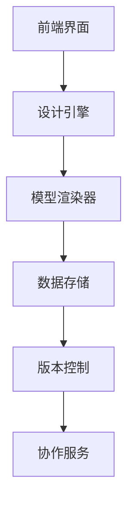
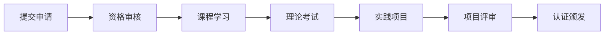

# 商业化支持体系

## 📋 概述

本文档建立了正式验证框架的商业化支持体系，包括可视化工具、认证体系、企业服务和合作伙伴网络。

## 🎯 商业化目标

1. **可持续发展**：建立可持续的商业模式
2. **价值创造**：为用户创造实际价值
3. **生态建设**：构建完整的生态系统
4. **国际影响**：提升国际影响力

## 🛠️ 可视化工具

### 1. 模型设计工具

#### 功能特性

- **拖拽式设计**：直观的模型设计界面
- **实时预览**：实时查看模型效果
- **模板库**：丰富的模型模板
- **协作功能**：多人协作设计
- **版本控制**：模型版本管理

#### 技术架构



#### 实现方案

```typescript
// 模型设计器核心类
class ModelDesigner {
  private canvas: HTMLCanvasElement;
  private renderer: ModelRenderer;
  private storage: ModelStorage;
  private collaboration: CollaborationService;

  constructor(canvas: HTMLCanvasElement) {
    this.canvas = canvas;
    this.renderer = new ModelRenderer(canvas);
    this.storage = new ModelStorage();
    this.collaboration = new CollaborationService();
  }

  // 创建新模型
  createModel(type: ModelType): Model {
    const model = new Model(type);
    this.renderer.render(model);
    return model;
  }

  // 保存模型
  async saveModel(model: Model): Promise<void> {
    await this.storage.save(model);
    await this.collaboration.sync(model);
  }

  // 加载模型
  async loadModel(id: string): Promise<Model> {
    const model = await this.storage.load(id);
    this.renderer.render(model);
    return model;
  }
}
```

### 2. 验证可视化工具

#### 2.1 功能特性

- **验证流程可视化**：直观展示验证过程
- **结果分析**：详细的验证结果分析
- **报告生成**：自动生成验证报告
- **趋势分析**：验证趋势分析
- **告警系统**：实时告警通知

#### 2.2 实现方案

```typescript
// 验证可视化器
class VerificationVisualizer {
  private chart: Chart;
  private analyzer: ResultAnalyzer;
  private reporter: ReportGenerator;
  private notifier: AlertNotifier;

  constructor(container: HTMLElement) {
    this.chart = new Chart(container);
    this.analyzer = new ResultAnalyzer();
    this.reporter = new ReportGenerator();
    this.notifier = new AlertNotifier();
  }

  // 可视化验证结果
  visualizeResults(results: VerificationResult[]): void {
    const data = this.analyzer.analyze(results);
    this.chart.render(data);
  }

  // 生成报告
  generateReport(results: VerificationResult[]): Report {
    return this.reporter.generate(results);
  }

  // 设置告警
  setAlert(condition: AlertCondition): void {
    this.notifier.setCondition(condition);
  }
}
```

### 3. 性能监控工具

#### 3.1 功能特性

- **实时监控**：实时性能监控
- **历史分析**：历史性能数据分析
- **预测分析**：性能趋势预测
- **优化建议**：性能优化建议
- **告警管理**：智能告警管理

#### 3.2 实现方案

```typescript
// 性能监控器
class PerformanceMonitor {
  private collector: MetricsCollector;
  private analyzer: PerformanceAnalyzer;
  private predictor: TrendPredictor;
  private advisor: OptimizationAdvisor;

  constructor() {
    this.collector = new MetricsCollector();
    this.analyzer = new PerformanceAnalyzer();
    this.predictor = new TrendPredictor();
    this.advisor = new OptimizationAdvisor();
  }

  // 开始监控
  startMonitoring(): void {
    this.collector.start();
  }

  // 分析性能
  analyzePerformance(): PerformanceAnalysis {
    const metrics = this.collector.getMetrics();
    return this.analyzer.analyze(metrics);
  }

  // 预测趋势
  predictTrend(): TrendPrediction {
    const history = this.collector.getHistory();
    return this.predictor.predict(history);
  }

  // 获取优化建议
  getOptimizationAdvice(): OptimizationAdvice[] {
    const analysis = this.analyzePerformance();
    return this.advisor.advise(analysis);
  }
}
```

## 🏆 认证体系

### 1. 认证等级

#### 基础认证

- **认证名称**：正式验证基础认证
- **认证代码**：FVF-BASIC
- **认证要求**：
  - 完成基础课程学习
  - 通过理论考试
  - 完成实践项目
  - 提交认证申请

#### 专业认证

- **认证名称**：正式验证专业认证
- **认证代码**：FVF-PROFESSIONAL
- **认证要求**：
  - 获得基础认证
  - 完成专业课程学习
  - 通过专业考试
  - 完成专业项目
  - 提交专业申请

#### 专家认证

- **认证名称**：正式验证专家认证
- **认证代码**：FVF-EXPERT
- **认证要求**：
  - 获得专业认证
  - 完成专家课程学习
  - 通过专家考试
  - 完成专家项目
  - 提交专家申请

#### 大师认证

- **认证名称**：正式验证大师认证
- **认证代码**：FVF-MASTER
- **认证要求**：
  - 获得专家认证
  - 完成大师课程学习
  - 通过大师考试
  - 完成大师项目
  - 提交大师申请

### 2. 认证流程

#### 申请流程



#### 详细步骤

1. **提交申请**
   - 填写申请表
   - 提交相关材料
   - 支付认证费用

2. **资格审核**
   - 审核申请材料
   - 验证资格条件
   - 通知审核结果

3. **课程学习**
   - 在线课程学习
   - 完成学习任务
   - 通过学习测试

4. **理论考试**
   - 在线理论考试
   - 考试时间限制
   - 自动评分系统

5. **实践项目**
   - 完成实践项目
   - 提交项目报告
   - 项目代码审查

6. **项目评审**
   - 专家评审项目
   - 评审意见反馈
   - 项目修改完善

7. **认证颁发**
   - 通过所有环节
   - 颁发认证证书
   - 更新认证状态

### 3. 认证管理

#### 认证系统

```typescript
// 认证管理系统
class CertificationSystem {
  private database: CertificationDatabase;
  private examEngine: ExamEngine;
  private projectEvaluator: ProjectEvaluator;
  private certificateGenerator: CertificateGenerator;

  constructor() {
    this.database = new CertificationDatabase();
    this.examEngine = new ExamEngine();
    this.projectEvaluator = new ProjectEvaluator();
    this.certificateGenerator = new CertificateGenerator();
  }

  // 提交认证申请
  async submitApplication(application: CertificationApplication): Promise<void> {
    await this.database.saveApplication(application);
  }

  // 审核申请
  async reviewApplication(id: string): Promise<ReviewResult> {
    const application = await this.database.getApplication(id);
    return this.evaluateApplication(application);
  }

  // 安排考试
  async scheduleExam(applicantId: string, level: CertificationLevel): Promise<Exam> {
    const exam = this.examEngine.createExam(level);
    await this.database.saveExam(applicantId, exam);
    return exam;
  }

  // 评估项目
  async evaluateProject(project: Project): Promise<ProjectEvaluation> {
    return this.projectEvaluator.evaluate(project);
  }

  // 颁发证书
  async issueCertificate(applicantId: string, level: CertificationLevel): Promise<Certificate> {
    const certificate = this.certificateGenerator.generate(applicantId, level);
    await this.database.saveCertificate(certificate);
    return certificate;
  }
}
```

## 🏢 企业服务

### 1. 咨询服务

#### 服务类型

- **架构咨询**：系统架构设计咨询
- **实施咨询**：项目实施指导咨询
- **优化咨询**：系统优化改进咨询
- **培训咨询**：团队培训计划咨询

#### 服务流程

1. **需求分析**
   - 了解企业需求
   - 分析现状问题
   - 制定解决方案

2. **方案设计**
   - 设计技术方案
   - 制定实施计划
   - 评估风险成本

3. **实施指导**
   - 提供实施指导
   - 协助问题解决
   - 监控实施进度

4. **效果评估**
   - 评估实施效果
   - 收集反馈意见
   - 持续改进优化

### 2. 培训服务

#### 培训类型

- **基础培训**：基础概念和技能培训
- **专业培训**：专业技能和工具培训
- **高级培训**：高级技术和实践培训
- **定制培训**：企业定制化培训

#### 培训方式

- **在线培训**：在线课程和视频培训
- **现场培训**：现场授课和实操培训
- **混合培训**：线上线下结合培训
- **一对一培训**：个性化定制培训

### 3. 技术支持

#### 支持类型

- **技术咨询**：技术问题咨询解答
- **实施支持**：项目实施技术支持
- **维护支持**：系统维护技术支持
- **升级支持**：系统升级技术支持

#### 支持方式

- **在线支持**：在线聊天和邮件支持
- **电话支持**：电话技术咨询支持
- **现场支持**：现场技术工程师支持
- **远程支持**：远程桌面技术支持

## 🤝 合作伙伴网络

### 1. 合作伙伴类型

#### 技术合作伙伴

- **软件厂商**：软件开发工具厂商
- **云服务商**：云计算服务提供商
- **系统集成商**：系统集成服务商
- **咨询公司**：技术咨询公司

#### 渠道合作伙伴

- **代理商**：产品销售代理商
- **经销商**：产品销售经销商
- **服务商**：技术服务提供商
- **培训机构**：技术培训机构

#### 生态合作伙伴

- **开源项目**：相关开源项目
- **学术机构**：高等院校和研究机构
- **行业协会**：相关行业协会
- **标准组织**：国际标准组织

### 2. 合作模式

#### 技术合作

- **技术集成**：技术产品集成合作
- **联合开发**：联合开发新产品
- **技术授权**：技术授权使用合作
- **标准制定**：共同制定行业标准

#### 商业合作

- **产品销售**：产品销售代理合作
- **服务提供**：技术服务提供合作
- **市场推广**：市场推广合作
- **品牌合作**：品牌联合推广合作

#### 生态合作

- **平台集成**：平台生态集成合作
- **数据共享**：数据资源共享合作
- **用户共享**：用户资源共享合作
- **资源整合**：资源整合优化合作

### 3. 合作伙伴管理

#### 管理系统

```typescript
// 合作伙伴管理系统
class PartnerManagementSystem {
  private database: PartnerDatabase;
  private agreementManager: AgreementManager;
  private performanceTracker: PerformanceTracker;
  private communicationHub: CommunicationHub;

  constructor() {
    this.database = new PartnerDatabase();
    this.agreementManager = new AgreementManager();
    this.performanceTracker = new PerformanceTracker();
    this.communicationHub = new CommunicationHub();
  }

  // 注册合作伙伴
  async registerPartner(partner: Partner): Promise<void> {
    await this.database.savePartner(partner);
    await this.agreementManager.createAgreement(partner);
  }

  // 管理合作协议
  async manageAgreement(partnerId: string, agreement: Agreement): Promise<void> {
    await this.agreementManager.updateAgreement(partnerId, agreement);
  }

  // 跟踪合作绩效
  async trackPerformance(partnerId: string): Promise<PerformanceReport> {
    return this.performanceTracker.generateReport(partnerId);
  }

  // 沟通协作
  async communicate(partnerId: string, message: Message): Promise<void> {
    await this.communicationHub.sendMessage(partnerId, message);
  }
}
```

## 💰 商业模式

### 1. 收入模式

#### 软件许可

- **开源版本**：免费开源版本
- **商业版本**：付费商业版本
- **企业版本**：企业级付费版本
- **定制版本**：定制化付费版本

#### 服务收费

- **咨询服务**：按项目收费
- **培训服务**：按课程收费
- **技术支持**：按时间收费
- **维护服务**：按年收费

#### 认证收费

- **认证考试**：按考试收费
- **认证培训**：按培训收费
- **认证维护**：按年收费
- **认证升级**：按升级收费

### 2. 定价策略

#### 分层定价

- **基础版**：$99/月
- **专业版**：$299/月
- **企业版**：$999/月
- **定制版**：面议

#### 使用量定价

- **按用户数**：$10/用户/月
- **按项目数**：$50/项目/月
- **按存储量**：$0.1/GB/月
- **按API调用**：$0.01/调用

#### 价值定价

- **ROI定价**：基于投资回报率
- **价值定价**：基于客户价值
- **竞争定价**：基于市场竞争
- **成本定价**：基于成本加成

### 3. 收入预测

#### 年度收入预测

| 年份 | 软件许可 | 服务收费 | 认证收费 | 总收入 |
|------|----------|----------|----------|--------|
| 2024 | $100K | $50K | $20K | $170K |
| 2025 | $300K | $150K | $80K | $530K |
| 2026 | $600K | $300K | $200K | $1.1M |
| 2027 | $1.2M | $600K | $400K | $2.2M |
| 2028 | $2.4M | $1.2M | $800K | $4.4M |

#### 收入构成分析

- **软件许可**：60%
- **服务收费**：30%
- **认证收费**：10%

## 📊 市场分析

### 1. 目标市场

#### 市场规模

- **全球市场**：$50B
- **目标市场**：$5B
- **可及市场**：$500M
- **服务市场**：$50M

#### 市场细分

- **企业软件**：40%
- **云服务**：30%
- **咨询服务**：20%
- **培训服务**：10%

### 2. 竞争分析

#### 主要竞争对手

- **IBM**：企业级解决方案
- **Microsoft**：云平台服务
- **Google**：AI和机器学习
- **Amazon**：云计算服务

#### 竞争优势

- **技术优势**：先进的形式化验证技术
- **成本优势**：开源基础，成本更低
- **服务优势**：专业的咨询服务
- **生态优势**：完整的生态系统

### 3. 市场策略

#### 市场定位

- **技术领先**：技术领先的正式验证平台
- **成本优势**：高性价比的解决方案
- **服务专业**：专业的服务支持
- **生态完整**：完整的生态系统

#### 营销策略

- **内容营销**：技术博客和案例分享
- **社区营销**：开源社区建设
- **会议营销**：技术会议和研讨会
- **合作伙伴**：合作伙伴渠道营销

## 📞 联系方式

- **商务合作**：[姓名] <[邮箱]>
- **技术支持**：[邮箱]>
- **培训咨询**：[邮箱]>
- **合作伙伴**：[邮箱]>

---

*最后更新：2024-12-19*
*版本：v1.0.0*
