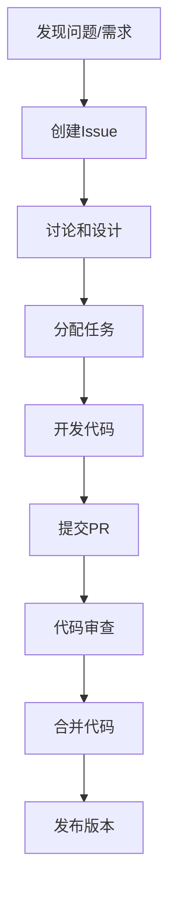

# 社区协作机制

## 目录（Table of Contents）

- [社区协作机制](#社区协作机制)
  - [概念定义](#概念定义)
  - [理论基础](#理论基础)
  - [应用案例](#应用案例)
  - [最佳实践](#最佳实践)
  - [实施指南](#实施指南)

## 概念定义

### 社区协作机制1

社区协作机制是指在开源项目中建立的一套系统化的协作流程和规范，旨在促进开发者之间的有效沟通、知识共享和项目贡献。
它包括贡献指南、代码审查、问题跟踪、版本管理等核心要素。

### 核心概念

- **贡献者**：参与项目开发、文档编写、问题报告的个人或组织
- **维护者**：负责项目整体方向、代码审查、版本发布的核心团队成员
- **社区**：由贡献者、维护者、用户组成的项目生态系统
- **协作流程**：从问题发现到代码合并的完整工作流程

## 理论基础

### 开源协作理论

开源协作基于以下理论原则：

1. **透明性原则**
   - 所有决策和讨论都在公开渠道进行
   - 代码、文档、问题跟踪完全透明
   - 建立信任和可追溯性

2. **包容性原则**
   - 欢迎不同背景和技能水平的贡献者
   - 提供清晰的入门指南和成长路径
   - 建立友好的社区文化

3. **质量优先原则**
   - 通过代码审查确保代码质量
   - 建立自动化测试和质量检查
   - 持续改进和优化

4. **可持续性原则**
   - 建立长期维护机制
   - 培养核心维护者团队
   - 确保项目的持续发展

### 协作模式

- **Fork-Pull Request模式**：贡献者fork项目，在本地开发后提交PR
- **Issue-First模式**：先讨论问题，再编写代码
- **Review-First模式**：代码审查优先，确保质量
- **Release-Train模式**：定期发布，保持稳定性

## 应用案例

### 案例1：新功能开发流程



**具体步骤**：

1. 在GitHub上创建Issue，描述问题或需求
2. 在Issue中进行讨论，确定解决方案
3. 分配开发任务给合适的贡献者
4. 开发者在本地分支进行开发
5. 提交Pull Request，包含详细说明
6. 维护者进行代码审查
7. 通过CI/CD检查后合并代码
8. 定期发布新版本

### 案例2：文档贡献流程

```yaml
# 文档贡献流程示例
documentation_contribution:
  steps:
    - identify_gap: "识别文档空白或错误"
    - create_issue: "创建文档Issue"
    - discuss_content: "讨论内容结构和要点"
    - write_draft: "编写初稿"
    - submit_pr: "提交文档PR"
    - review_content: "内容审查"
    - merge_publish: "合并并发布"
  
  quality_checks:
    - grammar_check: "语法检查"
    - link_validation: "链接验证"
    - format_consistency: "格式一致性"
    - content_completeness: "内容完整性"
```

### 案例3：问题报告和解决流程

```python
# 问题报告模板
class IssueTemplate:
    def __init__(self):
        self.title = "问题标题"
        self.description = "详细描述"
        self.reproduction_steps = "复现步骤"
        self.expected_behavior = "期望行为"
        self.actual_behavior = "实际行为"
        self.environment = "环境信息"
        self.additional_info = "附加信息"
    
    def validate(self):
        """验证问题报告的完整性"""
        required_fields = [
            self.title, self.description, 
            self.reproduction_steps
        ]
        return all(field.strip() for field in required_fields)
```

## 最佳实践

### 1. 贡献指南最佳实践

#### 代码贡献

```markdown
## 代码贡献指南

### 开发环境设置
1. Fork项目到个人仓库
2. Clone到本地开发环境
3. 安装依赖：`pip install -r requirements.txt`
4. 运行测试：`pytest tests/`

### 代码规范
- 遵循PEP 8代码风格
- 添加适当的注释和文档字符串
- 编写单元测试，覆盖率不低于80%
- 使用类型注解提高代码可读性

### 提交规范
- 使用清晰的提交信息
- 每个提交专注于一个功能或修复
- 包含测试用例
- 更新相关文档
```

#### 文档贡献

```markdown
## 文档贡献指南

### 文档结构
- 使用清晰的标题层级
- 包含目录和导航
- 提供代码示例
- 添加相关链接

### 内容质量
- 准确性和完整性
- 可读性和易懂性
- 实用性和可操作性
- 一致性和规范性
```

### 2. 代码审查最佳实践

#### 审查清单

```yaml
code_review_checklist:
  functionality:
    - "功能实现是否正确"
    - "边界条件是否处理"
    - "错误处理是否完善"
    - "性能影响是否可接受"
  
  code_quality:
    - "代码风格是否一致"
    - "命名是否清晰"
    - "复杂度是否合理"
    - "重复代码是否消除"
  
  testing:
    - "测试覆盖是否充分"
    - "测试用例是否有效"
    - "集成测试是否通过"
    - "性能测试是否完成"
  
  documentation:
    - "代码注释是否清晰"
    - "API文档是否更新"
    - "变更日志是否记录"
    - "用户文档是否更新"
```

#### 审查流程

```python
class CodeReviewProcess:
    def __init__(self):
        self.stages = [
            "automated_checks",
            "functionality_review", 
            "code_quality_review",
            "security_review",
            "final_approval"
        ]
    
    def automated_checks(self, pr):
        """自动化检查"""
        checks = [
            "linting",
            "unit_tests", 
            "integration_tests",
            "coverage_check",
            "security_scan"
        ]
        return all(check.pass() for check in checks)
    
    def review_comments(self, pr):
        """生成审查意见"""
        return {
            "positive": "代码质量很好，功能实现正确",
            "suggestions": "建议优化性能和错误处理",
            "required_changes": "必须修复的安全问题"
        }
```

### 3. 社区管理最佳实践

#### 沟通规范

```markdown
## 沟通规范

### 讨论渠道
- GitHub Issues：功能讨论和问题报告
- GitHub Discussions：一般性讨论和问答
- 邮件列表：重要公告和决策
- 即时通讯：实时协作和快速反馈

### 沟通原则
- 尊重他人，保持友好
- 使用清晰、准确的语言
- 提供具体的例子和证据
- 及时回应和跟进
```

#### 激励机制

```yaml
community_incentives:
  recognition:
    - contributor_spotlight: "贡献者展示"
    - achievement_badges: "成就徽章"
    - hall_of_fame: "名人堂"
  
  rewards:
    - swag_and_merchandise: "纪念品"
    - conference_invitations: "会议邀请"
    - mentorship_opportunities: "导师机会"
  
  growth:
    - skill_development: "技能发展"
    - networking: "人脉网络"
    - career_advancement: "职业发展"
```

### 4. 质量保证最佳实践

#### 自动化流程

```yaml
quality_assurance:
  continuous_integration:
    - trigger: "每次PR提交"
    - checks:
        - code_linting: "代码风格检查"
        - unit_tests: "单元测试"
        - integration_tests: "集成测试"
        - security_scan: "安全扫描"
        - performance_tests: "性能测试"
  
  continuous_deployment:
    - trigger: "main分支合并"
    - steps:
        - build: "构建应用"
        - test: "运行测试套件"
        - deploy: "部署到测试环境"
        - verify: "验证部署"
        - release: "发布到生产环境"
```

#### 质量指标

```python
class QualityMetrics:
    def __init__(self):
        self.metrics = {
            "code_coverage": 0.0,
            "test_pass_rate": 0.0,
            "security_issues": 0,
            "performance_score": 0.0,
            "documentation_coverage": 0.0
        }
    
    def calculate_quality_score(self):
        """计算综合质量分数"""
        weights = {
            "code_coverage": 0.25,
            "test_pass_rate": 0.25,
            "security_issues": 0.20,
            "performance_score": 0.15,
            "documentation_coverage": 0.15
        }
        
        score = 0.0
        for metric, weight in weights.items():
            score += self.metrics[metric] * weight
        
        return min(score, 1.0)
```

## 实施指南

### 1. 建立协作基础设施

#### 工具配置

```yaml
collaboration_tools:
  version_control:
    platform: "GitHub"
    features:
      - "Pull Requests"
      - "Code Review"
      - "Issue Tracking"
      - "Project Boards"
  
  communication:
    platform: "Discord/Slack"
    channels:
      - "general": "一般讨论"
      - "development": "开发讨论"
      - "help": "帮助支持"
      - "announcements": "重要公告"
  
  documentation:
    platform: "GitHub Wiki"
    features:
      - "Markdown支持"
      - "版本控制"
      - "协作编辑"
      - "搜索功能"
```

#### 流程自动化

```python
class CollaborationAutomation:
    def setup_workflows(self):
        """设置自动化工作流"""
        workflows = [
            "pr_template.yml",
            "issue_template.yml", 
            "code_review.yml",
            "release.yml"
        ]
        
        for workflow in workflows:
            self.deploy_workflow(workflow)
    
    def configure_bots(self):
        """配置自动化机器人"""
        bots = {
            "dependabot": "依赖更新",
            "stale": "清理过期Issue",
            "welcome": "欢迎新贡献者",
            "labeler": "自动标签"
        }
        
        for bot, purpose in bots.items():
            self.setup_bot(bot, purpose)
```

### 2. 培训和支持

#### 新贡献者指南

```markdown
# 新贡献者指南

## 快速开始
1. 阅读项目README和贡献指南
2. 设置开发环境
3. 选择一个简单的Issue开始
4. 提交第一个Pull Request

## 学习资源
- 项目文档和教程
- 代码示例和模板
- 社区讨论和问答
- 导师指导和支持

## 成长路径
- 从文档贡献开始
- 逐步参与代码开发
- 参与代码审查
- 成为核心维护者
```

#### 技能发展计划

```yaml
skill_development:
  beginner:
    - documentation_writing: "文档编写"
    - issue_reporting: "问题报告"
    - simple_bug_fixes: "简单Bug修复"
  
  intermediate:
    - feature_development: "功能开发"
    - code_review: "代码审查"
    - testing: "测试编写"
  
  advanced:
    - architecture_design: "架构设计"
    - performance_optimization: "性能优化"
    - community_leadership: "社区领导"
```

### 3. 持续改进

#### 反馈机制

```python
class FeedbackSystem:
    def collect_feedback(self):
        """收集反馈"""
        feedback_sources = [
            "contributor_surveys",
            "issue_comments", 
            "discussion_posts",
            "performance_metrics"
        ]
        
        feedback = {}
        for source in feedback_sources:
            feedback[source] = self.analyze_feedback(source)
        
        return feedback
    
    def implement_improvements(self, feedback):
        """实施改进"""
        improvements = self.prioritize_improvements(feedback)
        
        for improvement in improvements:
            self.execute_improvement(improvement)
            self.measure_impact(improvement)
```

#### 社区健康度监控

```yaml
community_health_metrics:
  engagement:
    - active_contributors: "活跃贡献者数量"
    - contribution_frequency: "贡献频率"
    - response_time: "响应时间"
  
  quality:
    - code_quality_score: "代码质量分数"
    - documentation_quality: "文档质量"
    - test_coverage: "测试覆盖率"
  
  growth:
    - new_contributors: "新贡献者数量"
    - retention_rate: "留存率"
    - community_size: "社区规模"
```

## 总结

社区协作机制是开源项目成功的关键因素。通过建立完善的协作流程、质量保证机制和激励机制，可以：

1. **提高项目质量**：通过代码审查、自动化测试等机制确保代码质量
2. **促进知识共享**：通过文档、讨论、培训等方式促进知识传播
3. **增强社区活力**：通过激励机制和成长路径保持社区活跃度
4. **确保项目可持续性**：通过长期维护机制确保项目持续发展

Formal Framework项目将继续完善社区协作机制，为贡献者提供更好的协作体验，推动项目的持续发展和创新。

---

**相关链接**：

- [贡献指南](../CONTRIBUTING.md)
- [项目文档](../README.md)
- [问题报告](https://github.com/formal-framework/issues)
- [讨论区](https://github.com/formal-framework/discussions)
