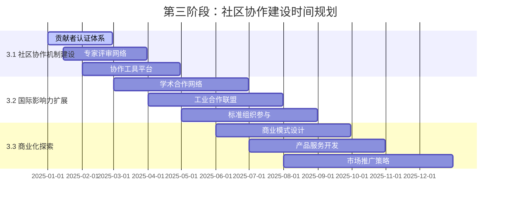

# Formal Framework 第三阶段：社区协作建设实施计划

## 概述

本文档详细规划了Formal Framework项目第三阶段"社区协作建设"的具体实施方案。该阶段将建立完整的社区协作机制，扩展国际影响力，并为商业化探索奠定基础。

## 1. 阶段目标与时间规划

### 1.1 总体目标

- **建立完整的社区协作生态系统**
- **实现国际影响力的显著提升**
- **为商业化发展奠定坚实基础**

### 1.2 时间规划（6-12个月）



## 2. 3.1 社区协作机制建设

### 2.1 贡献者认证体系

#### 2.1.1 认证等级设计

```yaml
contributor_levels:
  level_1_beginner:
    name: "初学者贡献者"
    requirements:
      - "完成基础贡献指南学习"
      - "提交至少1个有效Issue"
      - "通过基础技能测试"
    privileges:
      - "参与社区讨论"
      - "提交Issue和PR"
      - "获得基础徽章"
  
  level_2_regular:
    name: "常规贡献者"
    requirements:
      - "完成至少5个有效贡献"
      - "通过代码审查测试"
      - "获得2个维护者推荐"
    privileges:
      - "参与代码审查"
      - "指导新贡献者"
      - "获得常规贡献者徽章"
  
  level_3_expert:
    name: "专家贡献者"
    requirements:
      - "完成至少20个高质量贡献"
      - "通过专家评审"
      - "在特定领域有专长"
    privileges:
      - "参与架构决策"
      - "指导项目方向"
      - "获得专家徽章"
  
  level_4_maintainer:
    name: "维护者"
    requirements:
      - "长期稳定贡献"
      - "通过维护者委员会评审"
      - "具备项目管理能力"
    privileges:
      - "代码合并权限"
      - "版本发布权限"
      - "项目决策权"
```

#### 2.1.2 认证流程设计

```python
class ContributorCertificationSystem:
    """贡献者认证系统"""
    
    def __init__(self):
        self.levels = {
            "beginner": Level1Beginner(),
            "regular": Level2Regular(),
            "expert": Level3Expert(),
            "maintainer": Level4Maintainer()
        }
        self.certification_database = CertificationDatabase()
    
    def evaluate_contributor(self, contributor_id: str) -> CertificationResult:
        """评估贡献者等级"""
        contributor = self.certification_database.get_contributor(contributor_id)
        
        # 收集贡献数据
        contributions = self.collect_contributions(contributor_id)
        skills = self.assess_skills(contributor_id)
        recommendations = self.get_recommendations(contributor_id)
        
        # 评估等级
        for level_name, level in self.levels.items():
            if level.evaluate(contributions, skills, recommendations):
                return CertificationResult(
                    contributor_id=contributor_id,
                    level=level_name,
                    score=level.calculate_score(contributions, skills, recommendations),
                    valid_until=level.get_validity_period()
                )
        
        return CertificationResult(
            contributor_id=contributor_id,
            level="none",
            score=0,
            valid_until=None
        )
```

### 2.2 专家评审网络

#### 2.2.1 专家分类体系

```yaml
expert_categories:
  academic_experts:
    - "形式化方法专家"
    - "软件工程理论专家"
    - "数学逻辑专家"
    - "计算机科学专家"
  
  industry_experts:
    - "软件架构专家"
    - "DevOps专家"
    - "云原生专家"
    - "AI/ML专家"
  
  domain_experts:
    - "金融技术专家"
    - "医疗健康专家"
    - "工业互联网专家"
    - "Web3专家"
  
  methodology_experts:
    - "敏捷开发专家"
    - "质量保证专家"
    - "项目管理专家"
    - "标准化专家"
```

#### 2.2.2 评审流程设计

```python
class ExpertReviewNetwork:
    """专家评审网络"""
    
    def __init__(self):
        self.experts = ExpertDatabase()
        self.review_queue = ReviewQueue()
        self.quality_metrics = QualityMetrics()
    
    def assign_review(self, content_id: str, content_type: str) -> ReviewAssignment:
        """分配评审任务"""
        # 根据内容类型选择专家
        required_experts = self.select_experts_by_content(content_type)
        
        # 检查专家可用性
        available_experts = self.check_expert_availability(required_experts)
        
        # 分配评审任务
        assignments = []
        for expert in available_experts:
            assignment = ReviewAssignment(
                content_id=content_id,
                expert_id=expert.id,
                review_type=content_type,
                deadline=self.calculate_deadline(content_type),
                priority=self.calculate_priority(content_id)
            )
            assignments.append(assignment)
        
        return assignments
    
    def process_review(self, review_id: str) -> ReviewResult:
        """处理评审结果"""
        review = self.review_queue.get_review(review_id)
        
        # 收集所有专家评审意见
        expert_opinions = self.collect_expert_opinions(review_id)
        
        # 综合评审结果
        final_result = self.synthesize_review_results(expert_opinions)
        
        # 更新内容质量分数
        self.update_content_quality(review.content_id, final_result)
        
        return final_result
```

### 2.3 协作工具平台

#### 2.3.1 工具集成架构

```yaml
collaboration_tools:
  communication:
    - "Slack/Discord集成"
    - "邮件列表管理"
    - "实时聊天系统"
    - "视频会议工具"
  
  project_management:
    - "GitHub项目管理"
    - "Jira集成"
    - "看板系统"
    - "任务分配工具"
  
  content_collaboration:
    - "在线文档编辑"
    - "版本控制系统"
    - "评论和讨论系统"
    - "协作写作工具"
  
  quality_assurance:
    - "自动化测试"
    - "代码审查工具"
    - "质量检查系统"
    - "性能监控"
```

## 3. 3.2 国际影响力扩展

### 3.1 学术合作网络

#### 3.1.1 合作机构目标

```yaml
academic_partners:
  top_universities:
    - "MIT (麻省理工学院)"
    - "Stanford University (斯坦福大学)"
    - "UC Berkeley (加州大学伯克利分校)"
    - "Carnegie Mellon University (卡内基梅隆大学)"
    - "ETH Zurich (苏黎世联邦理工学院)"
  
  research_institutes:
    - "Max Planck Institute (马克斯·普朗克研究所)"
    - "INRIA (法国国家信息与自动化研究所)"
    - "Microsoft Research (微软研究院)"
    - "Google Research (谷歌研究院)"
    - "IBM Research (IBM研究院)"
  
  academic_societies:
    - "ACM (美国计算机协会)"
    - "IEEE (电气电子工程师学会)"
    - "IFIP (国际信息处理联合会)"
    - "EWICS (欧洲工业计算机系统安全委员会)"
```

#### 3.1.2 合作项目类型

```yaml
collaboration_projects:
  joint_research:
    - "形式化方法在软件工程中的应用"
    - "自动化推理技术研究"
    - "知识图谱构建方法"
    - "质量保证体系研究"
  
  academic_publications:
    - "联合发表学术论文"
    - "共同编写技术书籍"
    - "发布技术报告"
    - "组织学术会议"
  
  student_programs:
    - "研究生交换项目"
    - "暑期实习项目"
    - "联合培养项目"
    - "学术访问项目"
```

### 3.2 工业合作联盟

#### 3.2.1 目标企业类型

```yaml
industry_partners:
  technology_companies:
    - "Microsoft"
    - "Google"
    - "Amazon"
    - "Meta"
    - "Apple"
    - "Netflix"
    - "Uber"
    - "Airbnb"
  
  consulting_firms:
    - "McKinsey & Company"
    - "Boston Consulting Group"
    - "Bain & Company"
    - "Accenture"
    - "Deloitte"
    - "PwC"
    - "EY"
    - "KPMG"
  
  industry_associations:
    - "Linux Foundation"
    - "Cloud Native Computing Foundation"
    - "Open Source Initiative"
    - "Free Software Foundation"
    - "Apache Software Foundation"
```

#### 3.2.2 合作模式

```yaml
collaboration_modes:
  technology_development:
    - "联合技术开发"
    - "开源项目合作"
    - "技术标准制定"
    - "工具链集成"
  
  business_consulting:
    - "技术咨询服务"
    - "架构设计指导"
    - "最佳实践分享"
    - "培训和教育"
  
  ecosystem_building:
    - "开发者社区建设"
    - "技术会议组织"
    - "行业标准推广"
    - "人才培养"
```

### 3.3 标准组织参与

#### 3.3.1 目标标准组织

```yaml
standards_organizations:
  international_standards:
    - "ISO (国际标准化组织)"
    - "IEC (国际电工委员会)"
    - "ITU (国际电信联盟)"
    - "W3C (万维网联盟)"
  
  industry_standards:
    - "IEEE Standards Association"
    - "OMG (对象管理组织)"
    - "OASIS (结构化信息标准促进组织)"
    - "IETF (互联网工程任务组)"
  
  regional_standards:
    - "CEN (欧洲标准化委员会)"
    - "ANSI (美国国家标准学会)"
    - "BSI (英国标准学会)"
    - "DIN (德国标准学会)"
```

## 4. 3.3 商业化探索

### 4.1 商业模式设计

#### 4.1.1 收入模式

```yaml
revenue_models:
  freemium_model:
    basic_features: "免费使用基础功能"
    premium_features: "付费使用高级功能"
    enterprise_features: "企业级定制功能"
  
  subscription_model:
    monthly_subscription: "月度订阅服务"
    annual_subscription: "年度订阅服务"
    enterprise_subscription: "企业订阅服务"
  
  consulting_services:
    technical_consulting: "技术咨询服务"
    architecture_design: "架构设计服务"
    training_services: "培训服务"
    implementation_support: "实施支持服务"
  
  licensing_model:
    open_source_license: "开源许可证"
    commercial_license: "商业许可证"
    enterprise_license: "企业许可证"
```

#### 4.1.2 价值主张

```yaml
value_propositions:
  for_enterprises:
    - "降低软件开发风险"
    - "提高代码质量"
    - "加速开发周期"
    - "减少维护成本"
  
  for_developers:
    - "提升技术能力"
    - "获得最佳实践"
    - "参与开源社区"
    - "职业发展机会"
  
  for_academia:
    - "研究数据支持"
    - "学术合作机会"
    - "技术验证平台"
    - "人才培养基地"
```

### 4.2 产品服务开发

#### 4.2.1 核心产品

```yaml
core_products:
  formal_framework_platform:
    - "知识图谱平台"
    - "形式化验证工具"
    - "自动化推理引擎"
    - "质量检查系统"
  
  developer_tools:
    - "DSL编译器"
    - "代码生成器"
    - "静态分析工具"
    - "测试框架"
  
  enterprise_solutions:
    - "企业级部署方案"
    - "定制化开发服务"
    - "技术咨询服务"
    - "培训认证体系"
```

#### 4.2.2 服务产品

```yaml
service_products:
  professional_services:
    - "技术架构设计"
    - "系统集成服务"
    - "性能优化服务"
    - "安全审计服务"
  
  training_services:
    - "在线课程"
    - "现场培训"
    - "认证考试"
    - "技能评估"
  
  support_services:
    - "技术支持"
    - "问题诊断"
    - "升级服务"
    - "定制开发"
```

### 4.3 市场推广策略

#### 4.3.1 推广渠道

```yaml
marketing_channels:
  digital_marketing:
    - "官方网站"
    - "社交媒体"
    - "技术博客"
    - "在线广告"
  
  content_marketing:
    - "技术文章"
    - "案例分析"
    - "白皮书"
    - "视频教程"
  
  event_marketing:
    - "技术会议"
    - "行业展会"
    - "研讨会"
    - "黑客马拉松"
  
  partnership_marketing:
    - "技术合作伙伴"
    - "渠道合作伙伴"
    - "学术合作伙伴"
    - "行业联盟"
```

## 5. 实施监控与评估

### 5.1 关键绩效指标

```yaml
kpis:
  community_metrics:
    - "活跃贡献者数量"
    - "贡献质量分数"
    - "社区满意度"
    - "专家参与度"
  
  influence_metrics:
    - "国际合作伙伴数量"
    - "学术引用次数"
    - "媒体报道次数"
    - "行业认可度"
  
  business_metrics:
    - "收入增长率"
    - "客户满意度"
    - "市场份额"
    - "投资回报率"
```

### 5.2 评估周期

- **月度评估**：社区活跃度和基础指标
- **季度评估**：合作进展和影响力扩展
- **年度评估**：整体战略目标和商业化成果

## 6. 风险控制与应对

### 6.1 主要风险

1. **社区参与度不足**：可能缺乏足够的活跃贡献者
2. **国际合作困难**：可能面临文化和语言障碍
3. **商业化挑战**：可能难以找到合适的商业模式
4. **竞争压力**：可能面临其他项目的竞争

### 6.2 应对策略

1. **激励机制优化**：建立更有效的贡献者激励体系
2. **本地化策略**：针对不同地区制定本地化策略
3. **商业模式验证**：通过试点项目验证商业模式
4. **差异化竞争**：突出项目的独特价值和优势

## 7. 总结

第三阶段"社区协作建设"是Formal Framework项目发展的重要里程碑。通过建立完整的社区协作机制、扩展国际影响力、探索商业化路径，项目将实现从技术项目到知识基础设施平台的全面转型。

该阶段的成功实施将为项目的长期可持续发展奠定坚实基础，并为全球软件工程社区提供更有价值的服务。

---

**文档版本**：v1.0  
**创建日期**：2025-01-01  
**最后更新**：2025-01-01  
**负责人**：社区协作建设工作组
