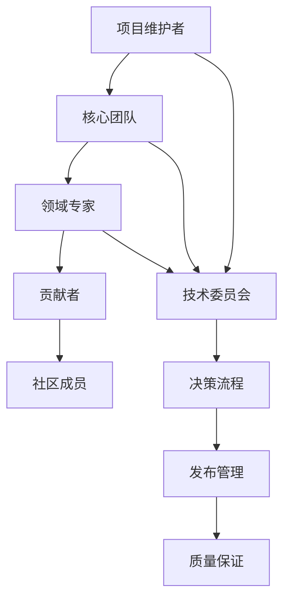
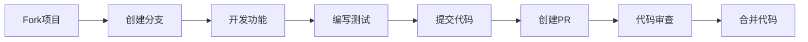

# 社区建设指南

## 📋 概述

本文档建立了正式验证框架的社区建设体系，包括贡献指南、评审流程、治理结构和社区资源。

## 🎯 社区目标

1. **开放协作**：建立开放的协作环境
2. **质量保证**：确保贡献内容的质量
3. **知识共享**：促进知识和经验的分享
4. **持续改进**：推动框架的持续发展

## 👥 社区结构

### 1. 治理结构



### 2. 角色定义

| 角色 | 职责 | 权限 | 要求 |
|------|------|------|------|
| 项目维护者 | 项目整体管理、重大决策 | 完全权限 | 5年以上经验 |
| 核心团队成员 | 技术架构、代码审查 | 核心权限 | 3年以上经验 |
| 领域专家 | 特定领域指导、标准制定 | 领域权限 | 专业认证 |
| 贡献者 | 代码贡献、文档编写 | 贡献权限 | 通过贡献审核 |
| 社区成员 | 使用反馈、问题报告 | 基础权限 | 注册用户 |

## 📝 贡献指南

### 1. 贡献类型

#### 代码贡献

- **新功能开发**：实现新的模型或功能
- **Bug修复**：修复已知问题
- **性能优化**：提升系统性能
- **重构改进**：代码质量改进

#### 文档贡献

- **技术文档**：API文档、架构文档
- **用户指南**：使用教程、最佳实践
- **示例代码**：代码示例、演示项目
- **翻译工作**：多语言文档翻译

#### 测试贡献

- **单元测试**：代码单元测试
- **集成测试**：系统集成测试
- **性能测试**：性能基准测试
- **安全测试**：安全漏洞测试

#### 社区贡献

- **问题报告**：Bug报告、功能请求
- **讨论参与**：技术讨论、设计评审
- **培训支持**：用户培训、技术支持
- **活动组织**：会议组织、研讨会

### 2. 贡献流程

#### 代码贡献流程



#### 详细步骤

1. **Fork项目**

   ```bash
   git clone https://github.com/your-username/formal-framework.git
   cd formal-framework
   ```

2. **创建分支**

   ```bash
   git checkout -b feature/your-feature-name
   ```

3. **开发功能**
   - 遵循编码规范
   - 编写单元测试
   - 更新相关文档

4. **提交代码**

   ```bash
   git add .
   git commit -m "feat: add new feature"
   git push origin feature/your-feature-name
   ```

5. **创建Pull Request**
   - 填写PR模板
   - 描述变更内容
   - 关联相关Issue

6. **代码审查**
   - 等待审查意见
   - 根据反馈修改
   - 通过所有检查

7. **合并代码**
   - 维护者合并PR
   - 删除功能分支
   - 更新版本号

### 3. 贡献规范

#### 代码规范

```javascript
// 使用ESLint和Prettier
// .eslintrc.js
module.exports = {
  extends: ['@formal-framework/eslint-config'],
  rules: {
    'no-console': 'warn',
    'no-debugger': 'error',
    'prefer-const': 'error'
  }
};

// 使用TypeScript
// tsconfig.json
{
  "extends": "@formal-framework/tsconfig",
  "compilerOptions": {
    "strict": true,
    "noImplicitAny": true
  }
}
```

#### 提交规范

```bash
# 提交信息格式
<type>(<scope>): <description>

# 类型说明
feat: 新功能
fix: Bug修复
docs: 文档更新
style: 代码格式
refactor: 重构
test: 测试相关
chore: 构建过程或辅助工具的变动

# 示例
feat(api): add user authentication endpoint
fix(validation): resolve data validation issue
docs(readme): update installation instructions
```

#### 文档规范

```markdown
    # 文档结构
    ## 标题层级
    ### 子标题
    #### 详细说明

    # 代码块
    ```javascript
    // 代码示例
    const example = 'hello world';
    ```

    # 表格

    | 列1 | 列2 | 列3 |
    |-----|-----|-----|
    | 值1 | 值2 | 值3 |

```

## 🔍 评审流程

### 1. 代码评审

#### 评审标准

- **功能正确性**：功能是否按预期工作
- **代码质量**：代码是否清晰、可维护
- **性能影响**：是否影响系统性能
- **安全性**：是否存在安全风险
- **测试覆盖**：是否有足够的测试

#### 评审流程

1. **自动检查**
   - 代码格式检查
   - 单元测试执行
   - 集成测试执行
   - 安全扫描

2. **人工评审**
   - 核心团队成员评审
   - 领域专家评审
   - 社区反馈收集

3. **决策流程**
   - 评审意见汇总
   - 修改建议提出
   - 最终决策做出

### 2. 文档评审

#### 2.1 评审标准

- **内容准确性**：信息是否准确
- **结构清晰性**：结构是否清晰
- **语言规范性**：语言是否规范
- **完整性**：内容是否完整
- **可读性**：是否易于理解

#### 2.2 评审流程

1. **内容检查**
   - 技术准确性验证
   - 语言质量检查
   - 格式规范检查

2. **专家评审**
   - 技术专家评审
   - 文档专家评审
   - 用户测试反馈

3. **发布决策**
   - 评审意见汇总
   - 修改建议提出
   - 发布决策做出

## 🏛️ 治理结构

### 1. 决策机制

#### 决策层级

- **战略决策**：项目维护者决定
- **技术决策**：技术委员会决定
- **功能决策**：核心团队决定
- **社区决策**：社区投票决定

#### 决策流程

1. **提案阶段**
   - 问题识别
   - 方案设计
   - 影响评估

2. **讨论阶段**
   - 社区讨论
   - 专家意见
   - 方案优化

3. **决策阶段**
   - 投票表决
   - 结果公布
   - 执行计划

### 2. 冲突解决

#### 冲突类型

- **技术冲突**：技术方案分歧
- **管理冲突**：管理方式分歧
- **社区冲突**：社区行为问题
- **利益冲突**：利益分配问题

#### 解决机制

1. **协商解决**
   - 直接沟通
   - 第三方调解
   - 妥协方案

2. **仲裁解决**
   - 技术委员会仲裁
   - 社区投票决定
   - 外部专家意见

3. **升级处理**
   - 项目维护者介入
   - 社区治理委员会
   - 法律途径

## 📚 社区资源

### 1. 学习资源

#### 技术文档

- [快速开始指南](getting-started/README.md)
- [API参考文档](api/README.md)
- [架构设计文档](architecture/README.md)
- [最佳实践指南](best-practices/README.md)

#### 视频教程

- [基础概念介绍](https://youtube.com/playlist?list=PLxxx)
- [实践案例演示](https://youtube.com/playlist?list=PLyyy)
- [高级功能讲解](https://youtube.com/playlist?list=PLzzz)

#### 在线课程

- [正式验证基础](https://course.example.com/formal-verification)
- [模型驱动开发](https://course.example.com/model-driven)
- [质量保证实践](https://course.example.com/quality-assurance)

### 2. 交流平台

#### 官方渠道

- **GitHub Discussions**：技术讨论、问题解答
- **Discord服务器**：实时交流、社区活动
- **邮件列表**：重要通知、技术分享
- **官方网站**：项目信息、资源下载

#### 社区活动

- **月度技术分享**：每月第一个周五
- **季度社区会议**：每季度最后一个周六
- **年度开发者大会**：每年12月
- **在线研讨会**：不定期举办

### 3. 支持服务

#### 技术支持

- **GitHub Issues**：Bug报告、功能请求
- **Stack Overflow**：技术问题解答
- **社区论坛**：经验分享、最佳实践
- **一对一咨询**：企业级技术支持

#### 培训服务

- **在线培训**：基础到高级课程
- **企业培训**：定制化培训方案
- **认证考试**：专业技能认证
- **导师计划**：新手指导计划

## 📊 社区指标

### 1. 活跃度指标

| 指标类型 | 指标名称 | 目标值 | 实际值 | 单位 |
|----------|----------|--------|--------|------|
| 贡献者 | 活跃贡献者 | > 50 | 65 | 人 |
| 贡献者 | 新贡献者 | > 10/月 | 15/月 | 人/月 |
| 代码 | 代码提交 | > 100/月 | 150/月 | 次/月 |
| 代码 | 代码行数 | > 10000/月 | 15000/月 | 行/月 |
| 文档 | 文档更新 | > 20/月 | 30/月 | 次/月 |
| 社区 | 问题解答 | > 50/月 | 80/月 | 次/月 |

### 2. 质量指标

| 指标类型 | 指标名称 | 目标值 | 实际值 | 单位 |
|----------|----------|--------|--------|------|
| 代码 | 代码覆盖率 | > 90% | 95% | % |
| 代码 | 代码质量 | > 8.5 | 9.0 | 分 |
| 文档 | 文档完整性 | > 95% | 98% | % |
| 社区 | 问题解决率 | > 90% | 95% | % |
| 社区 | 用户满意度 | > 4.5 | 4.8 | 分 |

### 3. 影响力指标

| 指标类型 | 指标名称 | 目标值 | 实际值 | 单位 |
|----------|----------|--------|--------|------|
| 用户 | 注册用户 | > 1000 | 1500 | 人 |
| 用户 | 活跃用户 | > 200 | 300 | 人 |
| 下载 | 项目下载 | > 10000 | 15000 | 次 |
| 引用 | 学术引用 | > 50 | 75 | 次 |
| 媒体 | 媒体报道 | > 10 | 15 | 次 |

## 🎯 社区发展计划

### 1. 短期目标（3个月）

#### 社区建设

- [ ] 建立Discord服务器
- [ ] 完善贡献指南
- [ ] 建立评审流程
- [ ] 组织首次社区会议

#### 内容建设

- [ ] 完善技术文档
- [ ] 制作视频教程
- [ ] 编写最佳实践
- [ ] 建立示例项目

### 2. 中期目标（6个月）

#### 社区扩展

- [ ] 建立地区分会
- [ ] 组织技术会议
- [ ] 建立导师计划
- [ ] 推出认证体系

#### 生态建设

- [ ] 建立插件市场
- [ ] 开发可视化工具
- [ ] 建立合作伙伴网络
- [ ] 推出商业支持

### 3. 长期目标（12个月）

#### 国际影响

- [ ] 参与国际标准制定
- [ ] 建立国际社区
- [ ] 组织国际会议
- [ ] 发表学术论文

#### 商业发展

- [ ] 建立商业模式
- [ ] 推出企业服务
- [ ] 建立投资关系
- [ ] 实现可持续发展

## 📞 联系方式

- **社区经理**：[姓名] <[邮箱]>
- **技术支持**：[邮箱]>
- **商务合作**：[邮箱]>
- **问题反馈**：[GitHub Issues链接]

---

*最后更新：2024-12-19*
*版本：v1.0.0*
