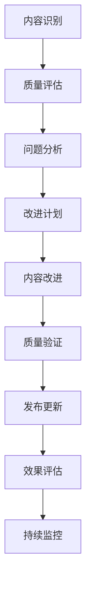

# 内容质量提升指南

## 概述

本指南为Formal Framework项目提供系统化的内容质量提升方法，确保所有文档内容达到高质量标准，支持项目的知识基础设施定位。

## 质量提升原则

### 1. 准确性原则

- **技术准确性**：确保所有技术内容准确无误
- **概念清晰性**：明确定义所有概念和术语
- **逻辑一致性**：保持内容逻辑的一致性和连贯性
- **引用可靠性**：所有引用和参考来源可靠

### 2. 完整性原则

- **内容完整性**：覆盖主题的所有重要方面
- **结构完整性**：文档结构清晰、层次分明
- **示例完整性**：提供完整、可运行的示例
- **链接完整性**：确保所有内部和外部链接有效

### 3. 可读性原则

- **语言清晰**：使用简洁、准确的语言
- **结构合理**：采用合理的文档结构
- **格式统一**：保持格式的一致性
- **易于理解**：确保内容易于理解和消化

### 4. 实用性原则

- **实际应用**：提供实际可用的信息和指导
- **最佳实践**：总结和分享最佳实践
- **问题解决**：帮助解决实际问题
- **持续更新**：保持内容的时效性

## 内容质量检查清单

### 1. 技术内容检查

#### 1.1 概念定义

- [ ] 所有概念都有清晰、准确的定义
- [ ] 术语使用一致，避免歧义
- [ ] 专业术语有适当的解释
- [ ] 概念之间的关系明确

#### 1.2 技术准确性

- [ ] 技术细节准确无误
- [ ] 代码示例可以正常运行
- [ ] 配置参数正确
- [ ] 版本信息准确

#### 1.3 逻辑一致性

- [ ] 内容逻辑清晰、连贯
- [ ] 前后内容一致
- [ ] 没有矛盾或冲突的信息
- [ ] 推理过程合理

### 2. 文档结构检查

#### 2.1 组织结构

- [ ] 文档结构层次清晰
- [ ] 标题层级合理
- [ ] 内容组织逻辑
- [ ] 导航和索引完整

#### 2.2 格式规范

- [ ] 格式统一、美观
- [ ] 代码块格式正确
- [ ] 表格和图表清晰
- [ ] 链接和引用格式正确

#### 2.3 可读性

- [ ] 语言简洁明了
- [ ] 段落长度适中
- [ ] 重点内容突出
- [ ] 易于扫描和查找

### 3. 实用性检查

#### 3.1 示例质量

- [ ] 示例完整、可运行
- [ ] 示例具有代表性
- [ ] 示例有适当的注释
- [ ] 示例覆盖主要场景

#### 3.2 最佳实践

- [ ] 提供实用的最佳实践
- [ ] 包含常见问题的解决方案
- [ ] 提供性能优化建议
- [ ] 包含安全考虑

#### 3.3 更新维护

- [ ] 内容保持最新
- [ ] 定期检查和更新
- [ ] 响应社区反馈
- [ ] 跟踪技术发展

## 内容改进方法

### 1. 系统性改进

#### 1.1 内容审计

```yaml
content_audit_process:
  step1: "内容扫描"
    - 识别所有文档
    - 评估当前质量
    - 识别改进机会
  
  step2: "优先级排序"
    - 按重要性排序
    - 按影响范围排序
    - 按改进难度排序
  
  step3: "改进计划"
    - 制定改进计划
    - 分配资源
    - 设定时间表
```

#### 1.2 质量评估

```python
class ContentQualityAssessor:
    def __init__(self):
        self.quality_dimensions = {
            "accuracy": "技术准确性",
            "completeness": "内容完整性", 
            "clarity": "表达清晰性",
            "usefulness": "实用性",
            "consistency": "一致性"
        }
    
    def assess_content(self, content):
        """评估内容质量"""
        scores = {}
        for dimension, description in self.quality_dimensions.items():
            scores[dimension] = self.evaluate_dimension(content, dimension)
        return self.calculate_overall_score(scores)
    
    def generate_improvement_suggestions(self, content, scores):
        """生成改进建议"""
        suggestions = []
        for dimension, score in scores.items():
            if score < 0.8:  # 质量阈值
                suggestions.extend(self.get_dimension_suggestions(dimension, content))
        return suggestions
```

### 2. 针对性改进

#### 2.1 技术内容改进

- **概念澄清**：重新定义模糊的概念
- **示例完善**：补充完整、可运行的示例
- **错误修正**：修正技术错误和不准确的信息
- **版本更新**：更新过时的技术信息

#### 2.2 结构优化

- **重新组织**：优化文档结构
- **标题优化**：改进标题的准确性和描述性
- **导航改进**：增强文档的导航性
- **格式统一**：统一文档格式

#### 2.3 表达优化

- **语言简化**：简化复杂的表达
- **逻辑梳理**：改进内容的逻辑结构
- **重点突出**：突出重要信息
- **可读性提升**：提高内容的可读性

### 3. 持续改进

#### 3.1 反馈机制

```yaml
feedback_mechanism:
  collection:
    - "用户反馈收集"
    - "社区讨论分析"
    - "使用情况统计"
    - "问题报告分析"
  
  analysis:
    - "反馈分类整理"
    - "问题优先级排序"
    - "改进建议生成"
    - "影响范围评估"
  
  implementation:
    - "改进计划制定"
    - "内容更新实施"
    - "质量验证"
    - "效果评估"
```

#### 3.2 质量监控

```python
class ContentQualityMonitor:
    def __init__(self):
        self.monitoring_metrics = {
            "readability_score": "可读性评分",
            "completeness_ratio": "完整性比例",
            "accuracy_rate": "准确率",
            "update_frequency": "更新频率"
        }
    
    def monitor_content_quality(self):
        """监控内容质量"""
        metrics = {}
        for metric, description in self.monitoring_metrics.items():
            metrics[metric] = self.calculate_metric(metric)
        return self.generate_quality_report(metrics)
    
    def detect_quality_issues(self, metrics):
        """检测质量问题"""
        issues = []
        for metric, value in metrics.items():
            if self.is_below_threshold(metric, value):
                issues.append(self.generate_issue_report(metric, value))
        return issues
```

## 改进工具和方法

### 1. 自动化工具

#### 1.1 质量检查工具

```yaml
quality_check_tools:
  grammar_check:
    - tool: "LanguageTool"
      purpose: "语法和拼写检查"
      config: "custom_rules.yaml"
  
  link_check:
    - tool: "LinkChecker"
      purpose: "链接有效性检查"
      config: "link_check_config.ini"
  
  format_check:
    - tool: "MarkdownLint"
      purpose: "Markdown格式检查"
      config: ".markdownlint.json"
  
  content_analysis:
    - tool: "CustomAnalyzer"
      purpose: "内容质量分析"
      config: "analysis_config.yaml"
```

#### 1.2 改进建议工具

```python
class ContentImprovementAdvisor:
    def __init__(self):
        self.improvement_patterns = {
            "clarity": [
                "简化复杂句子",
                "添加过渡词",
                "使用主动语态",
                "减少技术术语"
            ],
            "completeness": [
                "补充缺失信息",
                "添加示例",
                "完善步骤说明",
                "增加背景信息"
            ],
            "accuracy": [
                "验证技术信息",
                "更新版本号",
                "检查代码示例",
                "核实引用来源"
            ]
        }
    
    def suggest_improvements(self, content, issues):
        """生成改进建议"""
        suggestions = []
        for issue in issues:
            category = self.categorize_issue(issue)
            if category in self.improvement_patterns:
                suggestions.extend(self.get_pattern_suggestions(category, issue))
        return suggestions
```

### 2. 人工审查

#### 2.1 专家审查

- **技术专家**：确保技术内容的准确性
- **文档专家**：确保文档的质量和可读性
- **领域专家**：确保内容的专业性和实用性
- **用户代表**：确保内容的实用性和易用性

#### 2.2 同行评审

- **内容评审**：同行对内容进行评审
- **技术评审**：技术同行进行技术评审
- **用户体验评审**：从用户角度进行评审
- **质量评审**：专门的质量评审

## 质量提升流程

### 1. 改进流程



### 2. 质量控制

#### 2.1 质量门禁

```yaml
quality_gates:
  pre_improvement:
    - "内容识别完成"
    - "质量评估完成"
    - "改进计划制定"
  
  during_improvement:
    - "技术准确性验证"
    - "内容完整性检查"
    - "格式规范性检查"
  
  post_improvement:
    - "质量评分达标"
    - "专家评审通过"
    - "用户测试通过"
```

#### 2.2 质量指标

```python
class QualityMetrics:
    def __init__(self):
        self.metrics = {
            "technical_accuracy": {
                "weight": 0.3,
                "threshold": 0.9,
                "description": "技术准确性"
            },
            "content_completeness": {
                "weight": 0.25,
                "threshold": 0.8,
                "description": "内容完整性"
            },
            "readability": {
                "weight": 0.2,
                "threshold": 0.8,
                "description": "可读性"
            },
            "usefulness": {
                "weight": 0.15,
                "threshold": 0.8,
                "description": "实用性"
            },
            "consistency": {
                "weight": 0.1,
                "threshold": 0.9,
                "description": "一致性"
            }
        }
    
    def calculate_overall_score(self, scores):
        """计算总体质量分数"""
        total_score = 0
        for metric, score in scores.items():
            if metric in self.metrics:
                total_score += score * self.metrics[metric]["weight"]
        return total_score
    
    def check_quality_gates(self, scores):
        """检查质量门禁"""
        passed_gates = []
        for metric, score in scores.items():
            if metric in self.metrics:
                threshold = self.metrics[metric]["threshold"]
                if score >= threshold:
                    passed_gates.append(metric)
        return passed_gates
```

## 最佳实践

### 1. 内容创作最佳实践

#### 1.1 写作技巧

- **明确目标读者**：了解读者的背景和需求
- **结构清晰**：使用清晰的标题和层次结构
- **语言简洁**：使用简洁、准确的语言
- **示例丰富**：提供丰富、实用的示例

#### 1.2 技术内容

- **概念清晰**：明确定义所有概念
- **逻辑一致**：保持逻辑的一致性
- **示例完整**：提供完整、可运行的示例
- **版本准确**：确保版本信息的准确性

### 2. 质量保证最佳实践

#### 2.1 审查流程

- **多轮审查**：进行多轮审查确保质量
- **专家评审**：邀请专家进行专业评审
- **用户测试**：进行用户测试验证实用性
- **持续改进**：建立持续改进机制

#### 2.2 工具使用

- **自动化工具**：充分利用自动化工具
- **人工审查**：结合人工审查确保质量
- **反馈收集**：建立有效的反馈收集机制
- **质量监控**：建立持续的质量监控机制

## 总结

内容质量提升是Formal Framework项目成功的关键因素。通过系统化的质量提升方法、完善的工具支持、严格的审查流程，我们可以确保项目内容达到高质量标准，为学术界和工业界提供权威、准确、可验证的技术知识库。

持续的内容质量提升不仅能够提高项目的权威性和可信度，还能够增强用户体验，促进知识传播，推动行业发展。我们鼓励所有贡献者积极参与内容质量提升工作，共同维护Formal Framework项目的高质量标准。

---

**相关链接**：

- [质量标准](../docs/QUALITY_STANDARDS.md)
- [引用标准](../docs/CITATION_STANDARDS.md)
- [专家评审体系](../docs/EXPERT_REVIEW_SYSTEM.md)
- [贡献指南](../CONTRIBUTING.md)
