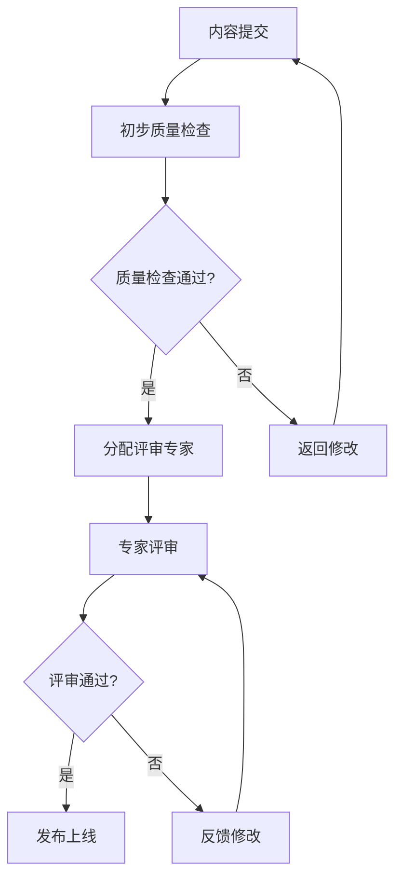

# Formal Framework 专家评审体系

## 1. 评审体系概述

### 1.1 评审目标

Formal Framework 建立多层次的专家评审体系，确保所有内容的权威性、准确性和学术价值：

- **质量保证**：通过专家评审确保内容质量达到学术标准
- **权威性验证**：由领域专家验证技术内容的准确性
- **学术价值**：确保内容具有学术价值和实用价值
- **社区协作**：促进学术界和工业界的知识共享和协作

### 1.2 评审原则

```yaml
review_principles:
  independence: "评审专家独立客观"
  expertise: "评审专家具备相应专业背景"
  transparency: "评审过程公开透明"
  fairness: "评审标准公平一致"
  timeliness: "评审及时高效"
```

## 2. 评审层级体系

### 2.1 三级评审体系

```yaml
review_hierarchy:
  level_1:
    name: "社区评审"
    reviewers: "社区成员"
    requirements: "基本技术背景，熟悉项目内容"
    time_limit: "7天"
    focus: "基本准确性和可读性"
    authority: "建议性评审"
  
  level_2:
    name: "领域专家评审"
    reviewers: "领域专家"
    requirements: "相关领域博士学位或10年以上经验"
    time_limit: "14天"
    focus: "技术准确性和完整性"
    authority: "实质性评审"
  
  level_3:
    name: "学术专家评审"
    reviewers: "学术专家"
    requirements: "知名大学教职或顶级研究机构职位"
    time_limit: "21天"
    focus: "理论严谨性和数学正确性"
    authority: "最终评审"
```

### 2.2 评审专家分类

#### 2.2.1 学术专家

```yaml
academic_experts:
  qualifications:
    - "知名大学计算机科学、软件工程等相关专业教授"
    - "顶级研究机构研究员"
    - "国际学术会议程序委员会委员"
    - "顶级期刊编委会成员"
  
  expertise_areas:
    - "形式化方法"
    - "软件工程"
    - "计算机科学理论"
    - "人工智能"
    - "分布式系统"
    - "数据科学"
  
  responsibilities:
    - "理论严谨性评审"
    - "数学正确性验证"
    - "学术价值评估"
    - "创新性评价"
```

#### 2.2.2 工业专家

```yaml
industry_experts:
  qualifications:
    - "大型科技公司技术专家"
    - "知名开源项目维护者"
    - "技术标准制定参与者"
    - "企业技术负责人"
  
  expertise_areas:
    - "软件架构"
    - "系统设计"
    - "技术实现"
    - "最佳实践"
    - "工程经验"
  
  responsibilities:
    - "实用性评估"
    - "工程可行性验证"
    - "最佳实践指导"
    - "实际应用价值评价"
```

#### 2.2.3 社区专家

```yaml
community_experts:
  qualifications:
    - "活跃的社区贡献者"
    - "技术博客作者"
    - "技术会议演讲者"
    - "开源项目贡献者"
  
  expertise_areas:
    - "技术传播"
    - "社区建设"
    - "用户需求"
    - "技术趋势"
  
  responsibilities:
    - "可读性评估"
    - "用户友好性检查"
    - "社区反馈收集"
    - "内容传播价值评价"
```

## 3. 评审流程

### 3.1 评审申请流程



### 3.2 详细评审流程

#### 3.2.1 内容提交阶段

```python
class ContentSubmission:
    def __init__(self):
        self.quality_checker = AdvancedQualityChecker()
        self.expert_assigner = ExpertAssigner()
    
    def submit_content(self, content, author, category):
        """提交内容进行评审"""
        # 初步质量检查
        quality_result = self.quality_checker.comprehensive_check(content)
        
        if quality_result.score < 0.6:
            return {
                'status': 'rejected',
                'reason': '质量检查未通过',
                'score': quality_result.score,
                'suggestions': quality_result.suggestions
            }
        
        # 分配评审专家
        experts = self.expert_assigner.assign_experts(category, content)
        
        # 创建评审任务
        review_task = self.create_review_task(content, author, experts)
        
        return {
            'status': 'submitted',
            'task_id': review_task.id,
            'experts': experts,
            'estimated_time': review_task.estimated_time
        }
```

#### 3.2.2 专家分配阶段

```python
class ExpertAssigner:
    def __init__(self):
        self.expert_database = ExpertDatabase()
        self.matching_engine = ExpertMatchingEngine()
    
    def assign_experts(self, category, content):
        """分配评审专家"""
        # 根据内容类别和复杂度确定需要的专家类型
        required_experts = self.determine_required_experts(category, content)
        
        # 查找合适的专家
        available_experts = self.expert_database.find_available_experts(required_experts)
        
        # 使用匹配引擎选择最佳专家组合
        selected_experts = self.matching_engine.select_experts(available_experts, content)
        
        return selected_experts
    
    def determine_required_experts(self, category, content):
        """确定需要的专家类型"""
        requirements = {
            'formal_methods': ['academic_expert', 'industry_expert'],
            'software_engineering': ['academic_expert', 'industry_expert'],
            'ai_ml': ['academic_expert', 'industry_expert'],
            'distributed_systems': ['academic_expert', 'industry_expert'],
            'best_practices': ['industry_expert', 'community_expert']
        }
        
        return requirements.get(category, ['academic_expert', 'industry_expert'])
```

#### 3.2.3 评审执行阶段

```python
class ReviewExecutor:
    def __init__(self):
        self.review_templates = ReviewTemplates()
        self.feedback_collector = FeedbackCollector()
    
    def execute_review(self, review_task):
        """执行评审"""
        # 发送评审通知
        self.notify_experts(review_task.experts, review_task)
        
        # 收集评审反馈
        reviews = []
        for expert in review_task.experts:
            review = self.collect_expert_review(expert, review_task)
            reviews.append(review)
        
        # 综合评审结果
        final_result = self.synthesize_reviews(reviews)
        
        return final_result
    
    def collect_expert_review(self, expert, review_task):
        """收集专家评审"""
        # 提供评审模板
        template = self.review_templates.get_template(expert.type)
        
        # 收集评审意见
        review = {
            'expert_id': expert.id,
            'expert_type': expert.type,
            'technical_accuracy': expert.rate_technical_accuracy(review_task.content),
            'completeness': expert.rate_completeness(review_task.content),
            'clarity': expert.rate_clarity(review_task.content),
            'usefulness': expert.rate_usefulness(review_task.content),
            'comments': expert.provide_comments(review_task.content),
            'recommendations': expert.provide_recommendations(review_task.content),
            'decision': expert.make_decision(review_task.content)
        }
        
        return review
```

### 3.3 评审标准

#### 3.3.1 技术准确性标准

```yaml
technical_accuracy_standards:
  mathematical_rigor:
    - "数学公式正确无误"
    - "定理证明逻辑严密"
    - "定义精确无歧义"
    - "推理过程正确"
  
  technical_correctness:
    - "技术概念准确"
    - "代码示例正确"
    - "架构设计合理"
    - "最佳实践有效"
  
  citation_quality:
    - "引用权威可靠"
    - "引用信息准确"
    - "引用来源可验证"
    - "引用覆盖充分"
```

#### 3.3.2 内容完整性标准

```yaml
completeness_standards:
  required_sections:
    - "概念定义完整"
    - "理论基础充分"
    - "应用案例丰富"
    - "最佳实践实用"
    - "参考文献完整"
  
  coverage_requirements:
    - "核心概念100%覆盖"
    - "重要应用场景80%覆盖"
    - "相关技术70%覆盖"
    - "延伸知识50%覆盖"
```

#### 3.3.3 表达清晰性标准

```yaml
clarity_standards:
  language_quality:
    - "表达清晰准确"
    - "逻辑结构合理"
    - "术语使用一致"
    - "格式规范统一"
  
  readability:
    - "易于理解"
    - "层次分明"
    - "重点突出"
    - "示例丰富"
```

#### 3.3.4 实用性标准

```yaml
usefulness_standards:
  practical_value:
    - "解决实际问题"
    - "提供实用指导"
    - "具有参考价值"
    - "易于应用"
  
  innovation:
    - "具有创新性"
    - "填补知识空白"
    - "推动技术进步"
    - "促进知识传播"
```

## 4. 评审管理系统

### 4.1 专家数据库

```python
class ExpertDatabase:
    def __init__(self):
        self.experts = {}
        self.expertise_areas = {}
        self.availability_schedule = {}
    
    def add_expert(self, expert):
        """添加专家"""
        self.experts[expert.id] = expert
        for area in expert.expertise_areas:
            if area not in self.expertise_areas:
                self.expertise_areas[area] = []
            self.expertise_areas[area].append(expert.id)
    
    def find_experts_by_area(self, area):
        """根据领域查找专家"""
        expert_ids = self.expertise_areas.get(area, [])
        return [self.experts[expert_id] for expert_id in expert_ids]
    
    def find_available_experts(self, required_experts):
        """查找可用的专家"""
        available_experts = []
        for expert_type in required_experts:
            experts = self.find_experts_by_type(expert_type)
            available = [expert for expert in experts if self.is_available(expert)]
            available_experts.extend(available)
        return available_experts
    
    def is_available(self, expert):
        """检查专家是否可用"""
        current_time = datetime.now()
        schedule = self.availability_schedule.get(expert.id, [])
        
        for time_slot in schedule:
            if time_slot['start'] <= current_time <= time_slot['end']:
                return time_slot['available']
        
        return True  # 默认可用
```

### 4.2 评审任务管理

```python
class ReviewTaskManager:
    def __init__(self):
        self.tasks = {}
        self.task_queue = []
        self.completed_tasks = {}
    
    def create_task(self, content, author, experts):
        """创建评审任务"""
        task_id = self.generate_task_id()
        
        task = {
            'id': task_id,
            'content': content,
            'author': author,
            'experts': experts,
            'status': 'pending',
            'created_at': datetime.now(),
            'deadline': datetime.now() + timedelta(days=21),
            'reviews': [],
            'final_decision': None
        }
        
        self.tasks[task_id] = task
        self.task_queue.append(task_id)
        
        return task
    
    def update_task_status(self, task_id, status, review=None):
        """更新任务状态"""
        if task_id in self.tasks:
            task = self.tasks[task_id]
            task['status'] = status
            
            if review:
                task['reviews'].append(review)
            
            # 检查是否所有专家都已完成评审
            if len(task['reviews']) == len(task['experts']):
                task['status'] = 'completed'
                final_decision = self.make_final_decision(task)
                task['final_decision'] = final_decision
                self.completed_tasks[task_id] = task
    
    def make_final_decision(self, task):
        """做出最终决定"""
        decisions = [review['decision'] for review in task['reviews']]
        
        # 如果所有专家都同意，采用一致决定
        if len(set(decisions)) == 1:
            return decisions[0]
        
        # 否则采用多数决定
        decision_counts = {}
        for decision in decisions:
            decision_counts[decision] = decision_counts.get(decision, 0) + 1
        
        return max(decision_counts, key=decision_counts.get)
```

### 4.3 评审反馈系统

```python
class ReviewFeedbackSystem:
    def __init__(self):
        self.feedback_templates = FeedbackTemplates()
        self.notification_system = NotificationSystem()
    
    def collect_feedback(self, task_id):
        """收集评审反馈"""
        task = self.get_task(task_id)
        
        feedback = {
            'task_id': task_id,
            'content_summary': self.summarize_content(task['content']),
            'expert_reviews': task['reviews'],
            'final_decision': task['final_decision'],
            'improvement_suggestions': self.generate_suggestions(task['reviews']),
            'next_steps': self.determine_next_steps(task['final_decision'])
        }
        
        return feedback
    
    def generate_suggestions(self, reviews):
        """生成改进建议"""
        suggestions = []
        
        for review in reviews:
            if review['decision'] == 'reject':
                suggestions.extend(review['recommendations'])
            elif review['decision'] == 'revise':
                suggestions.extend(review['recommendations'])
        
        return list(set(suggestions))  # 去重
    
    def determine_next_steps(self, decision):
        """确定后续步骤"""
        if decision == 'approve':
            return ['发布内容', '更新索引', '通知作者']
        elif decision == 'revise':
            return ['返回作者修改', '安排重新评审']
        else:  # reject
            return ['通知作者', '归档任务']
```

## 5. 质量监控与改进

### 5.1 评审质量监控

```python
class ReviewQualityMonitor:
    def __init__(self):
        self.metrics_collector = MetricsCollector()
        self.quality_analyzer = QualityAnalyzer()
    
    def monitor_review_quality(self):
        """监控评审质量"""
        metrics = self.metrics_collector.collect_review_metrics()
        
        quality_report = {
            'review_completion_rate': self.calculate_completion_rate(metrics),
            'average_review_time': self.calculate_average_time(metrics),
            'expert_satisfaction': self.calculate_satisfaction(metrics),
            'content_quality_improvement': self.calculate_improvement(metrics),
            'issues': self.identify_issues(metrics)
        }
        
        return quality_report
    
    def calculate_completion_rate(self, metrics):
        """计算评审完成率"""
        total_tasks = metrics['total_tasks']
        completed_tasks = metrics['completed_tasks']
        return completed_tasks / total_tasks if total_tasks > 0 else 0
    
    def calculate_average_time(self, metrics):
        """计算平均评审时间"""
        review_times = metrics['review_times']
        return sum(review_times) / len(review_times) if review_times else 0
    
    def identify_issues(self, metrics):
        """识别问题"""
        issues = []
        
        if metrics['completion_rate'] < 0.8:
            issues.append("评审完成率较低")
        
        if metrics['average_time'] > 14:  # 超过14天
            issues.append("评审时间过长")
        
        if metrics['expert_satisfaction'] < 0.7:
            issues.append("专家满意度较低")
        
        return issues
```

### 5.2 持续改进机制

```yaml
continuous_improvement:
  feedback_collection:
    - "专家反馈收集"
    - "作者反馈收集"
    - "用户反馈收集"
    - "质量指标监控"
  
  improvement_process:
    - "问题识别"
    - "原因分析"
    - "改进方案制定"
    - "实施改进"
    - "效果评估"
    - "标准化推广"
  
  improvement_areas:
    - "评审流程优化"
    - "专家匹配算法改进"
    - "评审标准完善"
    - "工具系统升级"
    - "专家培训加强"
```

## 6. 激励机制

### 6.1 专家激励

```yaml
expert_incentives:
  recognition:
    - "专家认证徽章"
    - "贡献者展示"
    - "专家排行榜"
    - "年度专家评选"
  
  rewards:
    - "优先参与项目决策"
    - "优先获得最新内容"
    - "优先参与学术活动"
    - "优先获得合作机会"
  
  development:
    - "专业发展机会"
    - "技能提升培训"
    - "学术交流机会"
    - "职业发展支持"
```

### 6.2 作者激励

```yaml
author_incentives:
  recognition:
    - "优质内容认证"
    - "作者展示页面"
    - "贡献者排行榜"
    - "年度作者评选"
  
  rewards:
    - "优先获得专家指导"
    - "优先参与项目活动"
    - "优先获得合作机会"
    - "优先获得资源支持"
  
  development:
    - "写作技能培训"
    - "技术能力提升"
    - "学术交流机会"
    - "职业发展支持"
```

## 7. 总结

通过建立完善的专家评审体系，Formal Framework确保所有内容的权威性、准确性和学术价值。这个体系将随着项目的发展不断完善，为用户提供高质量、可信赖的技术知识库。

---

**文档版本**：v1.0  
**创建日期**：2024-01-01  
**最后更新**：2024-01-01  
**负责人**：专家评审体系工作组
