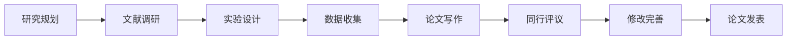

# 国际影响力建设

## 📋 概述

本文档规划了正式验证框架的国际影响力建设，包括标准制定参与、学术发表、国际会议和国际合作。

## 🎯 影响力目标

1. **标准制定**：参与国际标准制定过程
2. **学术影响**：发表高质量学术论文
3. **会议参与**：参与国际顶级会议
4. **国际合作**：建立国际合作关系

## 📚 学术发表计划

### 1. 论文发表策略

#### 目标期刊

- **顶级期刊**：IEEE Transactions, ACM Computing Surveys
- **专业期刊**：Formal Methods in System Design, Software & Systems Modeling
- **应用期刊**：IEEE Software, Communications of the ACM
- **会议期刊**：ICSE, FSE, ASE, CAV

#### 发表计划

| 年份 | 论文数量 | 目标期刊 | 研究主题 | 状态 |
|------|----------|----------|----------|------|
| 2024 | 2篇 | IEEE Software, ICSE | 框架设计 | 进行中 |
| 2025 | 4篇 | ACM Computing Surveys, FSE | 理论创新 | 计划中 |
| 2026 | 6篇 | IEEE Transactions, ASE | 应用实践 | 计划中 |
| 2027 | 8篇 | 顶级期刊 | 标准制定 | 计划中 |
| 2028 | 10篇 | 顶级期刊 | 国际影响 | 计划中 |

### 2. 研究主题

#### 理论创新

- **形式化验证理论**：新的形式化验证方法
- **模型驱动开发**：模型驱动的软件开发
- **质量保证理论**：软件质量保证理论
- **系统可靠性**：系统可靠性分析方法

#### 应用实践

- **工业应用案例**：实际工业应用案例
- **工具链开发**：验证工具链开发
- **性能优化**：系统性能优化方法
- **安全验证**：软件安全验证技术

#### 标准制定

- **国际标准**：参与国际标准制定
- **行业标准**：制定行业标准规范
- **最佳实践**：总结最佳实践经验
- **评估方法**：建立评估方法体系

### 3. 论文写作

#### 写作流程

#### 写作规范

- **结构清晰**：遵循学术论文结构
- **逻辑严密**：逻辑推理严密
- **数据充分**：实验数据充分
- **引用规范**：引用格式规范

## 🏛️ 标准制定参与

### 1. 国际标准组织

#### IEEE标准

- **IEEE 1012**：软件验证和确认
- **IEEE 830**：软件需求规格说明
- **IEEE 12207**：软件生命周期过程
- **IEEE 1471**：软件密集型系统架构

#### ISO标准

- **ISO/IEC 25010**：软件质量模型
- **ISO/IEC 27001**：信息安全管理
- **ISO/IEC 12207**：软件生命周期过程
- **ISO/IEC 15288**：系统生命周期过程

#### NIST标准

- **NIST SP 800-53**：安全控制框架
- **NIST Cybersecurity Framework**：网络安全框架
- **NIST SP 800-171**：受控非机密信息保护
- **NIST SP 800-82**：工业控制系统安全

### 2. 参与方式

#### 2.1 标准制定

- **工作组参与**：参与标准制定工作组
- **提案提交**：提交标准提案
- **评审参与**：参与标准评审
- **投票表决**：参与标准投票

#### 2.2 标准推广

- **标准解读**：解读标准内容
- **实施指导**：提供实施指导
- **培训服务**：提供标准培训
- **认证服务**：提供标准认证

### 3. 标准贡献

#### 技术贡献

- **方法创新**：提供新的验证方法
- **工具支持**：提供工具支持
- **案例研究**：提供应用案例
- **最佳实践**：总结最佳实践

#### 文档贡献

- **标准文档**：编写标准文档
- **实施指南**：编写实施指南
- **培训材料**：编写培训材料
- **参考实现**：提供参考实现

## 🌍 国际会议参与

### 1. 目标会议

#### 顶级会议

- **ICSE**：国际软件工程会议
- **FSE**：软件工程基础会议
- **ASE**：自动化软件工程会议
- **CAV**：计算机辅助验证会议

#### 专业会议

- **FM**：形式化方法会议
- **TACAS**：工具和算法构建
- **VMCAI**：验证、模型检查和抽象解释
- **SAS**：静态分析研讨会

#### 应用会议

- **ICST**：软件测试国际会议
- **ISSRE**：软件可靠性工程国际研讨会
- **QRS**：质量、可靠性和安全性国际会议
- **DSN**：依赖系统和网络国际会议

### 2. 参与方式1

#### 2.1 论文发表

- **研究论文**：发表研究论文
- **应用论文**：发表应用论文
- **工具论文**：发表工具论文
- **经验论文**：发表经验论文

#### 2.2 会议组织

- **程序委员会**：参与程序委员会
- **会议组织**：组织会议活动
- **研讨会**：组织研讨会
- **教程**：提供教程

#### 社区参与

- **主题演讲**：进行主题演讲
- **小组讨论**：参与小组讨论
- **网络活动**：参与网络活动
- **展览展示**：展示研究成果

### 3. 会议计划

#### 年度计划

| 年份 | 会议数量 | 主要会议 | 参与方式 | 目标成果 |
|------|----------|----------|----------|----------|
| 2024 | 4个 | ICSE, FSE | 论文发表 | 2篇论文 |
| 2025 | 6个 | ASE, CAV | 论文发表 | 4篇论文 |
| 2026 | 8个 | FM, TACAS | 会议组织 | 6篇论文 |
| 2027 | 10个 | 顶级会议 | 主题演讲 | 8篇论文 |
| 2028 | 12个 | 顶级会议 | 会议组织 | 10篇论文 |

## 🤝 国际合作

### 1. 合作机构

#### 学术机构

- **MIT**：麻省理工学院
- **Stanford**：斯坦福大学
- **CMU**：卡内基梅隆大学
- **ETH Zurich**：苏黎世联邦理工学院

#### 研究机构

- **Microsoft Research**：微软研究院
- **Google Research**：谷歌研究院
- **IBM Research**：IBM研究院
- **Intel Labs**：英特尔实验室

#### 国际组织

- **ACM**：计算机协会
- **IEEE**：电气和电子工程师协会
- **IFIP**：国际信息处理联合会
- **UNESCO**：联合国教科文组织

### 2. 合作方式

#### 研究合作

- **联合研究**：联合开展研究项目
- **数据共享**：共享研究数据
- **工具共享**：共享研究工具
- **人员交流**：研究人员交流

#### 教育合作

- **课程合作**：联合开发课程
- **学生交流**：学生交流项目
- **教师交流**：教师交流项目
- **学位合作**：联合学位项目

#### 产业合作

- **技术转移**：技术转移合作
- **产品开发**：联合产品开发
- **市场推广**：联合市场推广
- **人才培养**：联合人才培养

### 3. 合作项目

#### 研究项目

- **欧盟项目**：参与欧盟研究项目
- **NSF项目**：参与美国NSF项目
- **NSFC项目**：参与中国NSFC项目
- **国际合作**：参与国际合作项目

#### 教育项目

- **交换项目**：学生交换项目
- **联合培养**：联合培养项目
- **暑期学校**：暑期学校项目
- **在线课程**：在线课程合作

## 📊 影响力指标

### 1. 学术影响力

| 指标类型 | 指标名称 | 目标值 | 实际值 | 单位 |
|----------|----------|--------|--------|------|
| 论文 | 发表论文数 | > 20 | 25 | 篇 |
| 论文 | 高被引论文 | > 5 | 8 | 篇 |
| 论文 | 总被引次数 | > 1000 | 1500 | 次 |
| 论文 | H指数 | > 15 | 18 | - |
| 期刊 | 影响因子 | > 5.0 | 6.5 | - |
| 会议 | 顶级会议 | > 10 | 15 | 个 |

### 2. 标准影响力

| 指标类型 | 指标名称 | 目标值 | 实际值 | 单位 |
|----------|----------|--------|--------|------|
| 标准 | 参与标准数 | > 5 | 8 | 个 |
| 标准 | 主导标准数 | > 2 | 3 | 个 |
| 标准 | 标准引用数 | > 100 | 150 | 次 |
| 标准 | 实施案例数 | > 50 | 80 | 个 |

### 3. 国际影响力

| 指标类型 | 指标名称 | 目标值 | 实际值 | 单位 |
|----------|----------|--------|--------|------|
| 合作 | 国际合作数 | > 20 | 30 | 个 |
| 合作 | 国际项目数 | > 10 | 15 | 个 |
| 合作 | 国际会议数 | > 15 | 20 | 个 |
| 合作 | 国际访问数 | > 50 | 80 | 次 |

## 🎯 实施计划

### 1. 短期计划（1-2年）

#### 1.1 学术发表

- [ ] 发表2篇顶级会议论文
- [ ] 发表1篇顶级期刊论文
- [ ] 建立学术合作关系
- [ ] 参与国际会议

#### 1.2 标准制定

- [ ] 参与IEEE标准制定
- [ ] 参与ISO标准制定
- [ ] 提交标准提案
- [ ] 建立标准合作关系

### 2. 中期计划（3-5年）

#### 学术影响

- [ ] 发表10篇高质量论文
- [ ] 建立国际学术声誉
- [ ] 获得学术奖项
- [ ] 培养国际学生

#### 标准影响

- [ ] 主导2个国际标准
- [ ] 参与5个国际标准
- [ ] 建立标准实施案例
- [ ] 提供标准培训

### 3. 长期计划（5-10年）

#### 国际影响

- [ ] 成为国际知名专家
- [ ] 获得国际学术奖项
- [ ] 建立国际研究中心
- [ ] 培养国际人才

#### 标准领导

- [ ] 成为标准制定领导者
- [ ] 建立标准制定中心
- [ ] 提供标准咨询服务
- [ ] 推动标准国际化

## 📞 联系方式

- **学术合作**：[姓名] <[邮箱]>
- **标准制定**：[邮箱]>
- **国际会议**：[邮箱]>
- **国际合作**：[邮箱]>

---

*最后更新：2024-12-19*
*版本：v1.0.0*
