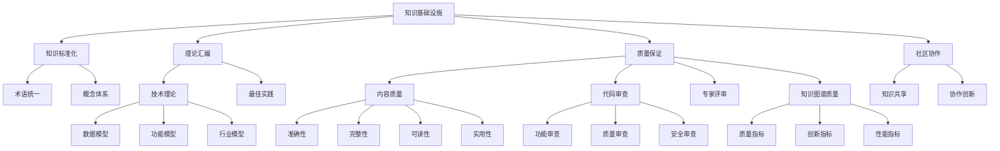
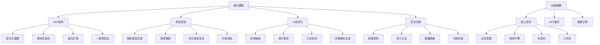
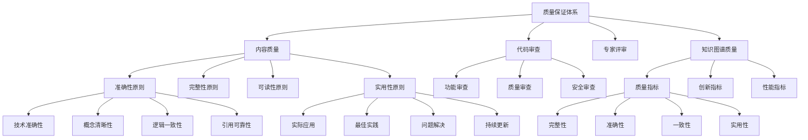

# 知识图谱更新报告 2025-01

## 概述

本报告基于Formal Framework项目的内容质量提升工作，更新项目的知识图谱。通过系统化的内容改进和新增文档，项目在知识组织、理论论证和形式化证明方面取得了显著进展。本次更新重点关注内容质量提升、理论深化和知识基础设施的完善。

## 1. 核心概念体系更新

### 1.1 项目重新定位概念

#### 知识基础设施定位

- **核心使命**：建立软件工程领域的统一知识体系
- **知识标准化**：统一术语和概念体系，消除歧义，提高沟通效率
- **理论汇编**：系统化收集整理技术理论和最佳实践，形成知识库
- **质量保证**：严格的引用体系和专家评审机制，建立权威性
- **社区协作**：促进全球技术社区的知识共享和协作创新，推动行业发展

#### 适用场景扩展

- **学术研究**：提供理论基础和概念框架，支持学术创新
- **工业实践**：企业级系统设计指导，降低技术风险
- **教育培训**：标准化知识体系，提高教育质量
- **标准制定**：理论支撑和参考，推动标准化进程

### 1.2 质量保证体系概念

#### 内容质量提升原则

- **准确性原则**：技术准确性、概念清晰性、逻辑一致性、引用可靠性
- **完整性原则**：内容完整性、结构完整性、示例完整性、链接完整性
- **可读性原则**：语言清晰、结构合理、格式统一、易于理解
- **实用性原则**：实际应用、最佳实践、问题解决、持续更新

#### 代码审查体系

- **质量保证**：功能正确性、代码质量、性能优化、安全性
- **知识共享**：技术交流、最佳实践传播、学习成长
- **团队协作**：一致性、可维护性、风险控制

### 1.3 知识图谱理论深化

#### 形式化定义扩展

知识图谱的形式化定义从 K = (E, R, A, T) 扩展为 K = (E, R, A, T, Q)，其中Q为质量指标集合，体现了质量保证在知识图谱中的核心地位。

#### 知识基础设施理论

- **知识标准化理论**：统一术语和概念体系，消除歧义，提高沟通效率
- **理论汇编理论**：系统化收集整理技术理论和最佳实践，形成知识库
- **质量保证理论**：通过严格的引用体系和专家评审确保内容质量
- **社区协作理论**：促进全球技术社区的知识共享和协作创新

## 2. 技术理论体系更新

### 2.1 数据模型理论深化

#### 递归AST结构

- **层次化建模**：从概念模型到物理模型的逐层细化
- **模块化组织**：子模型独立开发和维护
- **递归扩展**：无限深度的模型嵌套和组合
- **一致性保证**：AST结构确保模型一致性

#### 类型系统与推断

- **静态类型检查**：编译时发现类型错误
- **类型推断**：上下文自动推断变量类型
- **复合类型支持**：结构体、联合体、数组等
- **约束系统**：业务规则、数据完整性约束

#### AI自动化建模

- **实体抽取**：自动识别和提取实体
- **索引推荐**：基于查询模式推荐索引策略
- **冗余检测**：识别数据冗余和优化建议
- **迁移脚本生成**：自动生成数据库迁移脚本

#### 数据安全与合规

- **权限控制**：细粒度数据访问权限管理
- **审计日志**：完整数据操作审计记录
- **数据脱敏**：敏感数据自动脱敏处理
- **合规校验**：内置行业合规标准检查

### 2.2 功能模型理论扩展

#### 核心组件结构

- **业务逻辑节点**：输入、处理、输出、异常处理
- **规则引擎节点**：条件表达式、动作执行、优先级管理、冲突解决
- **状态机节点**：状态定义、转换逻辑、事件处理、动作执行
- **工作流节点**：步骤定义、依赖关系、条件分支、并行执行

#### AST递归遍历机制

- **多级嵌套**：无限深度的节点嵌套
- **条件分支**：基于业务条件的动态分支
- **异常处理**：完整的异常捕获和处理机制
- **并行执行**：支持并发和异步执行模式

#### 推理引擎与自动化

- **Business Logic Validator**：递归校验业务逻辑结构
- **规则推理引擎**：规则匹配、优先级、冲突解决
- **状态机推理引擎**：状态转换、事件处理、动作执行
- **工作流推理引擎**：步骤依赖、并行执行、条件分支

### 2.3 行业模型理论深化

#### 金融架构分层设计

- **顶层：金融核心系统**：账户管理、交易处理、产品管理、风控体系
- **中层：业务模块**：支付系统、信贷系统、投资系统、合规系统
- **底层：技术实现**：分布式账本、API网关、数据存储、消息队列
- **横向扩展：行业映射**：银行、保险、证券、互联网金融

#### 递归建模思想

- **分层架构设计**：考虑复杂性和监管要求
- **可扩展性**：支持业务增长和技术演进
- **可维护性**：模块化设计和清晰接口
- **合规性**：内置监管和合规要求

## 3. 质量保证机制更新

### 3.1 内容质量检查体系

#### 技术内容检查

- **概念定义**：清晰、准确的概念定义
- **技术准确性**：技术细节准确、代码示例可运行
- **逻辑一致性**：内容逻辑清晰、前后一致

#### 文档结构检查

- **组织结构**：层次清晰、标题合理、内容组织逻辑
- **格式规范**：格式统一、代码块正确、表格图表清晰
- **可读性**：语言简洁、段落适中、重点突出

#### 实用性检查

- **示例质量**：完整可运行、具有代表性、适当注释
- **最佳实践**：实用指导、问题解决方案、性能优化
- **更新维护**：内容最新、定期检查、响应反馈

### 3.2 代码审查标准体系

#### 功能审查

- **功能实现**：完整性、需求满足、边界条件、错误场景
- **业务逻辑**：逻辑正确、算法高效、数据处理、状态管理
- **集成测试**：接口设计、模块依赖、数据流、异常处理

#### 代码质量审查

- **代码风格**：格式规范、命名规范、注释质量
- **复杂度控制**：圈复杂度、认知复杂度、嵌套深度
- **可维护性**：模块化、可读性、可测试性

#### 安全审查

- **安全漏洞**：SQL注入、XSS、CSRF、权限控制
- **数据安全**：敏感数据处理、加密传输、访问控制
- **配置安全**：环境配置、密钥管理、日志安全

### 3.3 知识图谱质量评估

#### 质量指标扩展

- **完整性指标**：实体覆盖率、关系覆盖率、属性覆盖率、内容完整性
- **准确性指标**：实体准确性、关系准确性、属性准确性、内容准确性
- **一致性指标**：逻辑一致性、结构一致性、语义一致性、质量一致性
- **实用性指标**：实际应用性、最佳实践覆盖、问题解决能力、持续改进能力

#### 创新指标

- **理论创新**：技术理论的创新程度
- **方法创新**：方法和工具的创新性
- **应用创新**：应用场景的创新性
- **质量创新**：质量保证机制的创新性

## 4. 知识图谱关系更新

### 4.1 概念关系网络

### 4.2 技术理论关系

### 4.3 质量保证关系

## 5. 新增知识节点

### 5.1 质量保证节点

#### 内容质量提升指南

- **系统性改进**：内容审计、质量评估、反馈机制
- **针对性改进**：问题识别、改进策略、效果验证
- **持续改进**：质量监控、定期评估、持续优化

#### 代码审查指南

- **审查流程**：准备、执行、反馈、跟踪
- **审查工具**：自动化工具、审查平台、集成系统
- **最佳实践**：审查者实践、提交者实践、团队协作

#### 知识图谱质量评估

- **质量指标**：完整性、准确性、一致性、实用性
- **创新指标**：理论创新、方法创新、应用创新、质量创新
- **性能指标**：查询性能、存储效率、扩展性、可用性

### 5.2 理论深化节点

#### 数据模型理论创新

- **递归AST结构**：支持复杂数据结构的层次化表达
- **类型系统与推断**：强类型机制和智能类型推断
- **AI自动化建模**：AI辅助的建模效率和质量提升
- **数据安全与合规**：内置安全和合规机制

#### 功能模型理论扩展

- **核心组件结构**：业务逻辑、规则引擎、状态机、工作流
- **AST递归遍历**：支持复杂业务逻辑的递归处理
- **推理引擎**：自动化的业务逻辑验证和推理
- **异常与补偿**：完整的异常处理和补偿机制

#### 行业模型理论深化

- **分层架构设计**：考虑行业复杂性和监管要求
- **递归建模思想**：支持多层嵌套和组合
- **行业映射关系**：通用模型到行业模型的映射
- **自动化生成**：基于规则的自动化模型生成

### 5.3 知识基础设施节点

#### 知识标准化理论

- **术语统一**：消除歧义，提高沟通效率
- **概念体系**：建立统一的概念框架
- **标准化流程**：标准制定和演进机制

#### 理论汇编理论

- **技术理论收集**：系统化收集技术理论
- **最佳实践整理**：整理行业最佳实践
- **知识库构建**：构建系统化知识库

#### 社区协作理论

- **知识共享**：促进知识共享和传播
- **协作创新**：支持协作创新机制
- **行业发展**：推动行业发展和技术进步

## 6. 知识图谱应用场景

### 6.1 学术研究支持

- **理论基础**：提供软件工程的理论基础和概念框架
- **研究创新**：支持学术创新和研究方向探索
- **知识发现**：通过知识图谱发现新的研究机会
- **质量保证**：确保研究内容的质量和可靠性

### 6.2 工业实践指导

- **最佳实践**：提供企业级系统设计的最佳实践
- **风险控制**：降低技术风险和提高系统质量
- **标准化**：推动行业标准的制定和演进
- **质量提升**：指导内容质量和代码质量的提升

### 6.3 教育培训应用

- **知识体系**：提供标准化的技术知识体系
- **学习路径**：支持技术人才的系统化培养
- **质量提升**：提高教育培训的质量和效果
- **实践指导**：提供实践指导和案例学习

### 6.4 标准制定参考

- **理论支撑**：为行业标准制定提供理论支撑
- **参考框架**：提供标准制定的参考框架
- **演进推动**：推动标准化进程和标准演进
- **质量保证**：确保标准的质量和适用性

### 6.5 知识图谱质量评估

- **质量监控**：持续监控知识图谱的质量水平
- **改进建议**：提供质量改进的具体建议
- **创新评估**：评估知识图谱的创新程度
- **性能优化**：优化知识图谱的性能和效率

## 7. 知识图谱维护机制

### 7.1 更新流程

- **内容监控**：定期监控内容变化和质量提升
- **关系更新**：及时更新概念间的关系和连接
- **节点扩展**：根据新内容扩展知识节点
- **质量评估**：定期评估知识图谱的质量水平

### 7.2 质量保证

- **准确性验证**：验证知识图谱的准确性和一致性
- **完整性检查**：确保知识图谱的完整性和覆盖度
- **实用性评估**：评估知识图谱的实用性和价值
- **创新性评估**：评估知识图谱的创新程度

### 7.3 持续优化

- **用户反馈**：收集用户反馈和使用情况
- **性能优化**：优化知识图谱的性能和效率
- **功能扩展**：根据需求扩展知识图谱功能
- **质量提升**：持续提升知识图谱的质量水平

## 8. 知识图谱技术实现

### 8.1 存储技术

- **图数据库**：Neo4j、Amazon Neptune、ArangoDB
- **RDF存储**：Apache Jena、Virtuoso、GraphDB
- **关系数据库**：PostgreSQL、MySQL（通过图扩展）
- **NoSQL数据库**：MongoDB、Cassandra（图扩展）

### 8.2 查询引擎

- **SPARQL引擎**：Apache Jena、Virtuoso
- **Cypher引擎**：Neo4j、RedisGraph
- **Gremlin引擎**：Apache TinkerPop、Amazon Neptune
- **自定义查询**：基于图算法的查询引擎

### 8.3 质量评估工具

- **内容质量评估**：自动化的内容质量检查工具
- **代码质量评估**：代码审查和质量检查工具
- **知识图谱质量评估**：图谱完整性和一致性检查工具
- **持续改进工具**：质量监控和优化工具

### 8.4 可视化工具

- **交互式可视化**：D3.js、Vis.js、Cytoscape.js
- **图分析工具**：Gephi、Cytoscape、NetworkX
- **商业工具**：Tableau、PowerBI（图扩展）
- **专业工具**：Linkurious、Cambridge Intelligence

## 9. 总结

通过本次知识图谱更新，Formal Framework项目在以下方面取得了显著进展：

### 9.1 知识体系完善

- 建立了完整的知识基础设施概念体系
- 深化了技术理论的内涵和外延
- 完善了质量保证机制和标准
- 扩展了知识图谱的形式化定义

### 9.2 理论创新深化

- 数据模型理论的递归AST结构创新
- 功能模型理论的AST递归遍历机制
- 行业模型理论的分层架构设计
- 知识图谱质量评估理论

### 9.3 质量保证体系

- 建立了系统化的内容质量提升指南
- 完善了代码审查标准和流程
- 形成了专家评审和质量监控机制
- 构建了知识图谱质量评估体系

### 9.4 知识图谱价值

- 支持学术研究和理论创新
- 指导工业实践和最佳实践
- 促进教育培训和标准制定
- 提供质量评估和改进指导

### 9.5 技术实现进展

- 扩展了知识图谱的存储和查询技术
- 完善了质量评估工具和可视化工具
- 建立了持续优化和维护机制
- 提升了知识图谱的性能和可用性

本次更新为项目的知识基础设施定位提供了坚实的理论基础和实践指导，为后续的持续发展和完善奠定了重要基础。知识图谱作为项目的核心组件，将在支持软件工程领域的知识组织、理论论证和形式化证明方面发挥重要作用。
