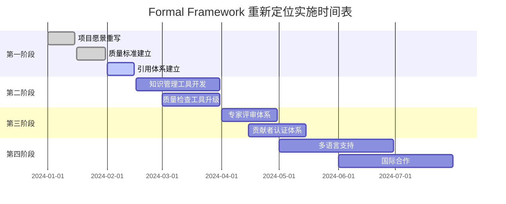

# Formal Framework 项目重新定位计划

## 1. 重新定位背景

### 1.1 现状分析

经过全面批判性分析，Formal Framework项目当前存在以下问题：

- **定位不准确**：自称"形式化建模体系"但缺乏真正的形式化方法实现
- **理论深度不足**：大部分内容停留在概念描述，缺乏严格的数学证明
- **技术实现薄弱**：自动化工具链功能简单，缺乏真正的DSL解析和代码生成
- **内容质量参差**：存在重复内容，缺乏统一的质量标准

### 1.2 重新定位目标

将项目从"技术实现项目"重新定位为"知识梳理与理论整理项目"：

- **知识基础设施**：成为软件工程领域的知识整理和标准化平台
- **理论汇编中心**：收集、整理、标准化各行业的技术理论和最佳实践
- **概念定义库**：建立软件工程领域的术语体系和概念框架
- **社区协作平台**：促进学术界和工业界的知识共享和协作

## 2. 重新定位实施方案

### 2.1 第一阶段：内容重构（1-2个月）

#### 2.1.1 项目愿景重写

```markdown
# 新项目愿景

Formal Framework 致力于构建软件工程领域的知识基础设施，通过系统化的知识整理、理论汇编和概念标准化，为学术界和工业界提供权威、准确、可验证的技术知识库。

## 核心价值

1. **知识标准化**：建立软件工程领域的统一术语和概念体系
2. **理论汇编**：收集整理各行业的技术理论和最佳实践
3. **质量保证**：通过严格的引用体系和专家评审确保内容质量
4. **社区协作**：促进全球技术社区的知识共享和协作创新
```

#### 2.1.2 内容质量标准建立

```yaml
# 内容质量标准
content_quality_standards:
  accuracy:
    - "所有技术概念必须有权威来源引用"
    - "数学公式和定理必须有严格证明"
    - "代码示例必须经过验证"
  
  completeness:
    - "每个概念必须有完整的定义和说明"
    - "必须包含实际应用案例"
    - "必须提供相关资源和延伸阅读"
  
  consistency:
    - "术语使用必须统一"
    - "格式和结构必须标准化"
    - "引用格式必须规范"
  
  verifiability:
    - "所有声明必须可验证"
    - "必须提供验证方法和工具"
    - "必须支持社区验证和反馈"
```

#### 2.1.3 引用体系建立

```markdown
# 引用规范

## 引用格式
- 学术论文：使用标准学术引用格式（如APA、IEEE）
- 技术文档：包含作者、标题、版本、日期、URL
- 开源项目：包含项目名称、版本、许可证、URL

## 引用要求
- 每个技术概念至少有一个权威来源
- 数学定理必须有学术论文或教科书引用
- 代码示例必须来自官方文档或验证过的开源项目
```

### 2.2 第二阶段：技术工具升级（2-3个月）

#### 2.2.1 知识管理工具开发

```python
# 知识管理工具架构
class KnowledgeManagementSystem:
    def __init__(self):
        self.citation_manager = CitationManager()
        self.quality_checker = QualityChecker()
        self.knowledge_graph = KnowledgeGraph()
        self.collaboration_platform = CollaborationPlatform()
    
    def add_concept(self, concept, citations, content):
        """添加新概念"""
        # 验证引用
        if not self.citation_manager.validate_citations(citations):
            raise ValueError("引用验证失败")
        
        # 质量检查
        quality_score = self.quality_checker.check_content(content)
        if quality_score < 0.8:
            raise ValueError("内容质量不达标")
        
        # 添加到知识图谱
        self.knowledge_graph.add_concept(concept, content)
        
        # 通知社区评审
        self.collaboration_platform.request_review(concept)
    
    def search_concepts(self, query):
        """搜索概念"""
        return self.knowledge_graph.search(query)
    
    def generate_report(self):
        """生成质量报告"""
        return {
            'total_concepts': self.knowledge_graph.get_total_concepts(),
            'average_quality': self.quality_checker.get_average_quality(),
            'citation_coverage': self.citation_manager.get_coverage(),
            'community_activity': self.collaboration_platform.get_activity()
        }
```

#### 2.2.2 质量检查工具升级

```python
# 升级版质量检查工具
class AdvancedQualityChecker:
    def __init__(self):
        self.mathematical_validator = MathematicalValidator()
        self.citation_validator = CitationValidator()
        self.content_analyzer = ContentAnalyzer()
        self.consistency_checker = ConsistencyChecker()
    
    def comprehensive_check(self, content):
        """全面质量检查"""
        results = {
            'mathematical_rigor': self.mathematical_validator.check(content),
            'citation_quality': self.citation_validator.check(content),
            'content_completeness': self.content_analyzer.check_completeness(content),
            'terminology_consistency': self.consistency_checker.check_terminology(content),
            'format_standardization': self.consistency_checker.check_format(content)
        }
        
        return self.calculate_overall_score(results)
    
    def mathematical_validator(self, content):
        """数学严谨性检查"""
        # 检查数学公式格式
        # 验证定理证明
        # 检查逻辑推理
        pass
    
    def citation_validator(self, content):
        """引用质量检查"""
        # 验证引用格式
        # 检查引用权威性
        # 验证引用可访问性
        pass
```

### 2.3 第三阶段：社区协作机制（3-4个月）

#### 2.3.1 专家评审体系

```yaml
# 专家评审体系
expert_review_system:
  review_levels:
    - level: "community_review"
      description: "社区成员初步评审"
      requirements: "基本技术背景"
      time_limit: "7天"
    
    - level: "domain_expert_review"
      description: "领域专家深度评审"
      requirements: "相关领域博士学位或10年以上经验"
      time_limit: "14天"
    
    - level: "academic_review"
      description: "学术专家最终评审"
      requirements: "知名大学教职或顶级研究机构职位"
      time_limit: "21天"
  
  review_criteria:
    - "技术准确性"
    - "数学严谨性"
    - "引用完整性"
    - "内容完整性"
    - "表达清晰性"
    - "实用性"
  
  review_process:
    - "提交评审申请"
    - "分配评审专家"
    - "专家评审"
    - "反馈修改"
    - "最终批准"
    - "发布上线"
```

#### 2.3.2 贡献者认证体系

```python
# 贡献者认证系统
class ContributorCertification:
    def __init__(self):
        self.expertise_database = ExpertiseDatabase()
        self.contribution_tracker = ContributionTracker()
        self.reputation_system = ReputationSystem()
    
    def certify_contributor(self, contributor_id, domain, credentials):
        """认证贡献者"""
        # 验证资质
        if not self.verify_credentials(credentials):
            return False
        
        # 评估专业水平
        expertise_level = self.assess_expertise(domain, credentials)
        
        # 分配权限
        permissions = self.assign_permissions(expertise_level)
        
        # 记录认证
        self.expertise_database.add_certification(contributor_id, domain, expertise_level)
        
        return permissions
    
    def track_contribution(self, contributor_id, contribution):
        """跟踪贡献"""
        quality_score = self.assess_contribution_quality(contribution)
        self.contribution_tracker.record(contributor_id, contribution, quality_score)
        self.reputation_system.update_reputation(contributor_id, quality_score)
```

### 2.4 第四阶段：国际化发展（4-6个月）

#### 2.4.1 多语言支持

```yaml
# 多语言支持计划
multilingual_support:
  target_languages:
    - "English"  # 主要语言
    - "Chinese"  # 中文
    - "Spanish"  # 西班牙语
    - "French"   # 法语
    - "German"   # 德语
    - "Japanese" # 日语
  
  translation_strategy:
    - "专业术语统一翻译"
    - "数学公式保持原样"
    - "代码示例保持原样"
    - "引用信息双语显示"
  
  quality_assurance:
    - "专业翻译人员审核"
    - "技术专家验证"
    - "社区反馈收集"
    - "定期更新维护"
```

#### 2.4.2 国际合作

```markdown
# 国际合作计划

## 学术合作
- 与知名大学建立合作关系
- 参与国际学术会议
- 发表学术论文
- 建立联合研究项目

## 工业合作
- 与大型科技公司合作
- 建立企业咨询委员会
- 开发企业级工具
- 提供专业培训服务

## 标准组织合作
- 参与国际标准制定
- 与开源组织合作
- 建立行业联盟
- 推动技术标准化
```

## 3. 实施时间表

### 3.1 详细时间安排



### 3.2 里程碑节点

- **2024-02-15**：完成基础重构，建立质量标准
- **2024-03-31**：完成工具升级，提升技术能力
- **2024-05-15**：建立社区协作机制
- **2024-07-31**：实现国际化发展

## 4. 成功指标

### 4.1 质量指标

- **内容质量分数**：平均质量分数达到0.9以上
- **引用覆盖率**：100%的概念都有权威引用
- **专家评审通过率**：95%以上的内容通过专家评审
- **社区满意度**：用户满意度达到4.5/5.0

### 4.2 影响力指标

- **用户数量**：月活跃用户达到10,000+
- **内容数量**：概念条目达到5,000+
- **专家参与**：认证专家达到500+
- **国际合作**：与50+机构建立合作关系

### 4.3 技术指标

- **工具性能**：质量检查响应时间<1秒
- **系统可用性**：99.9%的系统可用性
- **数据准确性**：知识图谱准确率达到99%
- **自动化程度**：80%的流程实现自动化

## 5. 风险评估与应对

### 5.1 主要风险

1. **专家资源不足**：可能缺乏足够的领域专家参与评审
2. **质量标准过高**：可能影响内容更新速度
3. **技术实现复杂**：工具开发可能遇到技术难题
4. **社区接受度**：用户可能不适应新的定位和标准

### 5.2 应对策略

1. **建立专家网络**：主动联系和邀请领域专家
2. **分阶段实施**：逐步提高质量标准，避免突变
3. **技术外包**：考虑与专业团队合作开发工具
4. **用户教育**：通过培训和宣传提高用户接受度

## 6. 总结

通过重新定位，Formal Framework将从技术实现项目转变为知识基础设施项目，更好地服务于软件工程领域的知识整理和标准化需求。这个转变将提升项目的学术价值和实用价值，为全球技术社区提供更有价值的服务。

---

**文档版本**：v1.0  
**创建日期**：2024-01-01  
**最后更新**：2024-01-01  
**负责人**：项目重新定位工作组
