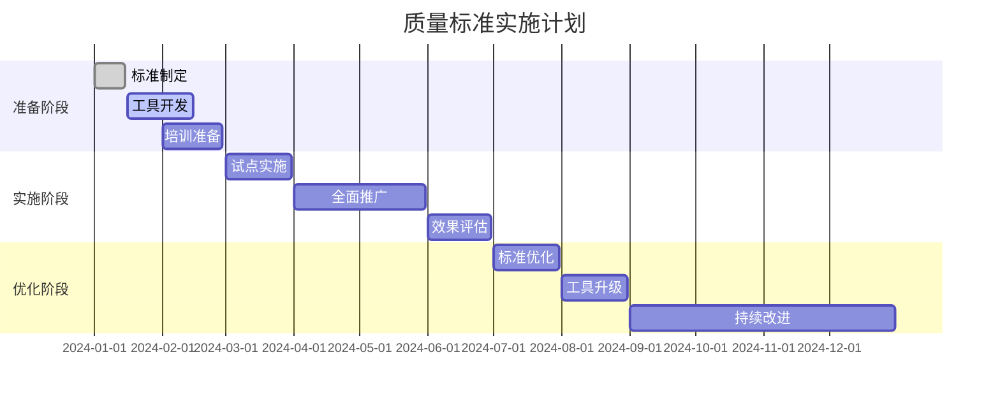

# Formal Framework 内容质量标准

## 目录（Table of Contents）

- [Formal Framework 内容质量标准](#formal-framework-内容质量标准)
  - [目录（Table of Contents）](#目录table-of-contents)
  - [1. 质量标准概述](#1-质量标准概述)
    - [1.1 质量目标](#11-质量目标)
    - [1.2 质量等级](#12-质量等级)
  - [2. 内容质量标准](#2-内容质量标准)
    - [2.1 准确性标准](#21-准确性标准)
      - [2.1.1 技术准确性](#211-技术准确性)
      - [2.1.2 数学严谨性](#212-数学严谨性)
    - [2.2 完整性标准](#22-完整性标准)
      - [2.2.1 内容完整性](#221-内容完整性)
      - [2.2.2 引用完整性](#222-引用完整性)
    - [2.3 一致性标准](#23-一致性标准)
      - [2.3.1 术语一致性](#231-术语一致性)
      - [2.3.2 格式一致性](#232-格式一致性)
    - [2.4 可验证性标准](#24-可验证性标准)
      - [2.4.1 验证方法](#241-验证方法)
      - [2.4.2 可追溯性](#242-可追溯性)
  - [3. 质量检查流程](#3-质量检查流程)
    - [3.1 自动检查](#31-自动检查)
    - [3.2 人工评审](#32-人工评审)
  - [4. 质量改进机制](#4-质量改进机制)
    - [4.1 持续改进](#41-持续改进)
    - [4.2 质量监控](#42-质量监控)
  - [5. 质量标准实施](#5-质量标准实施)
    - [5.1 实施计划](#51-实施计划)
    - [5.2 成功指标](#52-成功指标)
  - [6. 总结](#6-总结)

## 1. 质量标准概述

### 1.1 质量目标

Formal Framework 致力于成为软件工程领域的权威知识库，所有内容必须满足以下质量目标：

- **准确性**：所有技术概念和理论必须准确无误
- **完整性**：内容必须全面、系统、无遗漏
- **一致性**：术语使用、格式规范、结构统一
- **可验证性**：所有声明必须可验证、可追溯

### 1.2 质量等级

| 等级 | 分数范围 | 描述 | 要求 |
|------|----------|------|------|
| 优秀 | 0.9-1.0 | 达到学术标准 | 严格的数学证明、权威引用、完整验证 |
| 良好 | 0.8-0.9 | 达到工业标准 | 准确的技术描述、可靠引用、基本验证 |
| 一般 | 0.7-0.8 | 达到基础标准 | 基本准确、有引用、可理解 |
| 较差 | <0.7 | 不达标 | 需要大幅改进 |

## 2. 内容质量标准

### 2.1 准确性标准

#### 2.1.1 技术准确性

```yaml
technical_accuracy:
  requirements:
    - "所有技术概念必须有权威来源引用"
    - "技术描述必须与官方文档一致"
    - "代码示例必须经过验证可运行"
    - "版本信息必须准确无误"
  
  validation_methods:
    - "专家评审验证"
    - "官方文档对比"
    - "代码执行测试"
    - "社区反馈验证"
```

#### 2.1.2 数学严谨性

```yaml
mathematical_rigor:
  requirements:
    - "数学公式必须使用标准LaTeX格式"
    - "定理必须有严格的数学证明"
    - "定义必须精确、无歧义"
    - "推理过程必须逻辑严密"
  
  validation_methods:
    - "数学专家评审"
    - "形式化验证工具"
    - "逻辑一致性检查"
    - "同行评议"
```

### 2.2 完整性标准

#### 2.2.1 内容完整性

```yaml
content_completeness:
  required_sections:
    - "概念定义"
    - "理论基础"
    - "应用案例"
    - "最佳实践"
    - "参考文献"
    - "延伸阅读"
  
  coverage_requirements:
    - "核心概念100%覆盖"
    - "重要应用场景80%覆盖"
    - "相关技术70%覆盖"
    - "延伸知识50%覆盖"
```

#### 2.2.2 引用完整性

```yaml
citation_completeness:
  required_citations:
    - "每个技术概念至少1个权威引用"
    - "数学定理必须有学术论文引用"
    - "代码示例必须有官方文档引用"
    - "最佳实践必须有实际案例引用"
  
  citation_formats:
    academic_papers: "APA/IEEE标准格式"
    technical_docs: "包含作者、标题、版本、日期、URL"
    open_source: "包含项目名、版本、许可证、URL"
    books: "包含作者、书名、出版社、年份、ISBN"
```

### 2.3 一致性标准

#### 2.3.1 术语一致性

```yaml
terminology_consistency:
  requirements:
    - "同一概念使用统一术语"
    - "术语定义必须一致"
    - "缩写使用必须规范"
    - "多语言术语对应准确"
  
  terminology_management:
    - "维护统一术语表"
    - "定期术语审查"
    - "术语变更通知机制"
    - "多语言术语同步"
```

#### 2.3.2 格式一致性

```yaml
format_consistency:
  document_structure:
    - "统一的标题层级"
    - "标准化的章节结构"
    - "一致的列表格式"
    - "规范的代码块格式"
  
  visual_elements:
    - "统一的图表格式"
    - "标准化的颜色方案"
    - "一致的字体规范"
    - "规范的链接格式"
```

### 2.4 可验证性标准

#### 2.4.1 验证方法

```yaml
verification_methods:
  technical_verification:
    - "代码执行验证"
    - "API测试验证"
    - "工具功能验证"
    - "性能基准验证"
  
  academic_verification:
    - "文献引用验证"
    - "实验复现验证"
    - "理论推导验证"
    - "同行评议验证"
  
  community_verification:
    - "社区反馈验证"
    - "实际应用验证"
    - "专家评审验证"
    - "用户测试验证"
```

#### 2.4.2 可追溯性

```yaml
traceability:
  requirements:
    - "所有内容变更可追溯"
    - "引用来源可验证"
    - "评审过程可追踪"
    - "质量评估可重现"
  
  tracking_mechanisms:
    - "版本控制系统"
    - "变更日志记录"
    - "评审记录保存"
    - "质量指标监控"
```

## 3. 质量检查流程

### 3.1 自动检查

```python
# 自动质量检查工具
class QualityChecker:
    def __init__(self):
        self.citation_checker = CitationChecker()
        self.format_checker = FormatChecker()
        self.completeness_checker = CompletenessChecker()
        self.consistency_checker = ConsistencyChecker()
    
    def comprehensive_check(self, content):
        """全面质量检查"""
        results = {
            'citations': self.citation_checker.check(content),
            'format': self.format_checker.check(content),
            'completeness': self.completeness_checker.check(content),
            'consistency': self.consistency_checker.check(content)
        }
        
        return self.calculate_score(results)
    
    def calculate_score(self, results):
        """计算质量分数"""
        weights = {
            'citations': 0.3,
            'format': 0.2,
            'completeness': 0.3,
            'consistency': 0.2
        }
        
        score = sum(results[key] * weights[key] for key in weights)
        return min(score, 1.0)
```

### 3.2 人工评审

```yaml
manual_review_process:
  review_levels:
    - level: "community_review"
      reviewers: "社区成员"
      focus: "基本准确性和可读性"
      time_limit: "7天"
    
    - level: "domain_expert_review"
      reviewers: "领域专家"
      focus: "技术准确性和完整性"
      time_limit: "14天"
    
    - level: "academic_review"
      reviewers: "学术专家"
      focus: "理论严谨性和数学正确性"
      time_limit: "21天"
  
  review_criteria:
    - "技术准确性"
    - "内容完整性"
    - "表达清晰性"
    - "引用规范性"
    - "格式一致性"
    - "实用性"
```

## 4. 质量改进机制

### 4.1 持续改进

```yaml
continuous_improvement:
  feedback_collection:
    - "用户反馈收集"
    - "专家建议收集"
    - "质量指标监控"
    - "问题报告分析"
  
  improvement_process:
    - "问题识别"
    - "原因分析"
    - "改进方案制定"
    - "实施改进"
    - "效果评估"
    - "标准化推广"
```

### 4.2 质量监控

```python
# 质量监控系统
class QualityMonitor:
    def __init__(self):
        self.metrics_collector = MetricsCollector()
        self.alert_system = AlertSystem()
        self.report_generator = ReportGenerator()
    
    def monitor_quality(self):
        """质量监控"""
        metrics = self.metrics_collector.collect()
        
        # 检查质量指标
        for metric, value in metrics.items():
            if value < self.get_threshold(metric):
                self.alert_system.send_alert(metric, value)
        
        # 生成质量报告
        report = self.report_generator.generate(metrics)
        return report
    
    def get_threshold(self, metric):
        """获取质量阈值"""
        thresholds = {
            'average_quality': 0.8,
            'citation_coverage': 0.9,
            'completeness': 0.8,
            'consistency': 0.9
        }
        return thresholds.get(metric, 0.7)
```

## 5. 质量标准实施

### 5.1 实施计划



### 5.2 成功指标

```yaml
success_metrics:
  quality_metrics:
    - "平均质量分数达到0.9以上"
    - "引用覆盖率达到100%"
    - "专家评审通过率达到95%"
    - "用户满意度达到4.5/5.0"
  
  process_metrics:
    - "质量检查自动化率达到80%"
    - "评审周期缩短50%"
    - "质量问题发现率提高30%"
    - "内容更新速度提高20%"
  
  impact_metrics:
    - "内容准确性提升40%"
    - "用户投诉减少60%"
    - "专家参与度提高50%"
    - "社区活跃度提升30%"
```

## 6. 总结

通过建立严格的内容质量标准，Formal Framework将确保所有内容的准确性、完整性、一致性和可验证性，为用户提供高质量、可信赖的技术知识库。这些标准将随着项目的发展不断完善和优化，确保项目始终保持在高质量水平。

---

**文档版本**：v1.0  
**创建日期**：2024-01-01  
**最后更新**：2024-01-01  
**负责人**：质量保证工作组
