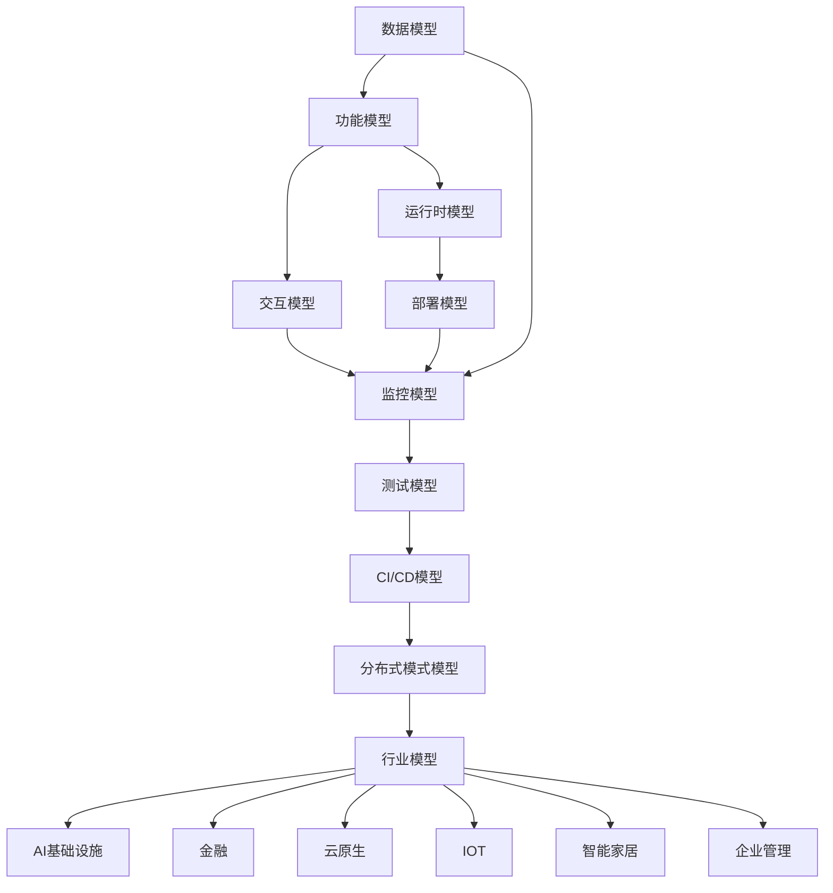
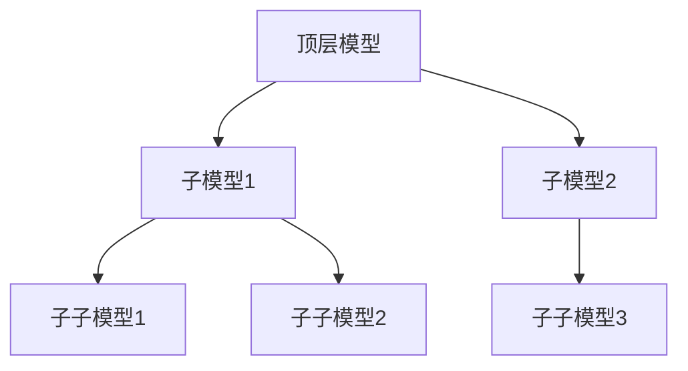
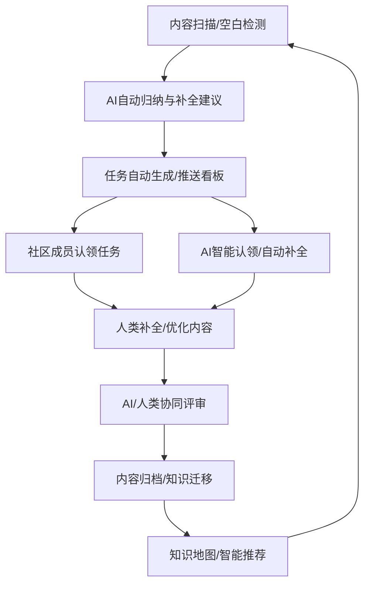
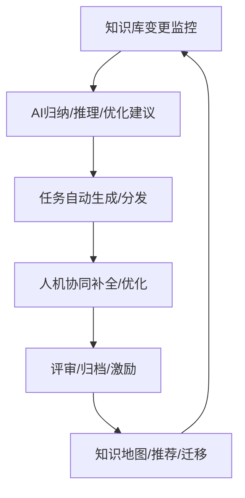

# Formal Framework 总览与导航

## 目录（Table of Contents）

- [Formal Framework 总览与导航](#formal-framework-总览与导航)
  - [目录（Table of Contents）](#目录table-of-contents)
  - [0. 项目愿景与适用场景](#0-项目愿景与适用场景)
  - [1. 项目结构总览](#1-项目结构总览)
  - [2. 各模型关系与递归扩展路径](#2-各模型关系与递归扩展路径)
  - [3. 行业映射关系](#3-行业映射关系)
  - [4. 递归推理与自动化流程示例](#4-递归推理与自动化流程示例)
    - [4.1 数据模型递归生成索引DDL](#41-数据模型递归生成索引ddl)
    - [4.2 业务流程自动化编排（伪代码）](#42-业务流程自动化编排伪代码)
    - [4.3 行业映射自动生成（伪代码）](#43-行业映射自动生成伪代码)
  - [5. 典型递归流程图](#5-典型递归流程图)
  - [6. 各核心模型递归扩展案例与导航](#6-各核心模型递归扩展案例与导航)
    - [6.1 数据模型（data-model）递归扩展案例](#61-数据模型data-model递归扩展案例)
    - [6.2 功能模型（functional-model）递归扩展案例](#62-功能模型functional-model递归扩展案例)
    - [6.3 交互模型、运行时模型、部署模型等递归扩展](#63-交互模型运行时模型部署模型等递归扩展)
  - [7. 行业模型与通用模型多层次映射示例](#7-行业模型与通用模型多层次映射示例)
    - [7.1 金融行业映射](#71-金融行业映射)
    - [7.2 AI基础设施行业映射](#72-ai基础设施行业映射)
    - [7.3 其他行业映射](#73-其他行业映射)
  - [8. 自动化工具链与模板建议](#8-自动化工具链与模板建议)
  - [9. 社区协作与持续完善建议](#9-社区协作与持续完善建议)
  - [10. 典型递归推理与自动化生成真实案例（进阶）](#10-典型递归推理与自动化生成真实案例进阶)
    - [10.1 数据模型递归生成 SQL DDL 示例](#101-数据模型递归生成-sql-ddl-示例)
    - [10.2 业务流程递归自动化编排示例](#102-业务流程递归自动化编排示例)
    - [10.3 行业映射自动化生成片段](#103-行业映射自动化生成片段)
    - [10.4 其他行业多样化案例片段](#104-其他行业多样化案例片段)
  - [11. dsl-draft.md / theory.md 模板片段（进阶）](#11-dsl-draftmd--theorymd-模板片段进阶)
    - [dsl-draft.md 模板](#dsl-draftmd-模板)
  - [4. 自动化推理伪代码](#4-自动化推理伪代码)
  - [5. 自动化生成脚本片段（可选）](#5-自动化生成脚本片段可选)
  - [12. 最佳实践与常见陷阱（补充）](#12-最佳实践与常见陷阱补充)
    - [最佳实践](#最佳实践)
    - [常见陷阱](#常见陷阱)
  - [13. 社区协作与持续完善建议（补充）](#13-社区协作与持续完善建议补充)
  - [14. 术语表（Glossary）](#14-术语表glossary)
  - [15. 参考文献与延伸阅读](#15-参考文献与延伸阅读)
  - [16. 自动化工具链与社区资源推荐（补充）](#16-自动化工具链与社区资源推荐补充)
  - [17. 常见问题FAQ（进阶补充）](#17-常见问题faq进阶补充)
  - [18. 进阶用法与模型演进建议](#18-进阶用法与模型演进建议)
    - [18.1 进阶用法](#181-进阶用法)
    - [18.2 模型演进与版本管理](#182-模型演进与版本管理)
    - [18.3 模型迁移与兼容性建议](#183-模型迁移与兼容性建议)
  - [19. 行业案例库与自动化工具库建议（补充示例）](#19-行业案例库与自动化工具库建议补充示例)
    - [19.1 行业案例库（示例条目）](#191-行业案例库示例条目)
    - [19.2 自动化工具库（示例条目）](#192-自动化工具库示例条目)
  - [20. 模型安全性、合规性与可扩展性建议](#20-模型安全性合规性与可扩展性建议)
    - [20.1 安全性](#201-安全性)
    - [20.2 合规性](#202-合规性)
    - [20.3 可扩展性](#203-可扩展性)
  - [21. 快速入门与常见场景导航](#21-快速入门与常见场景导航)
    - [21.1 快速入门](#211-快速入门)
    - [21.2 常见场景导航](#212-常见场景导航)
  - [22. 模型评审与社区治理建议](#22-模型评审与社区治理建议)
  - [递归完善自动化执行计划（细化版）](#递归完善自动化执行计划细化版)
    - [1. 内容递归完善](#1-内容递归完善)
    - [2. 案例与实验持续扩充](#2-案例与实验持续扩充)
    - [3. 结构递归优化](#3-结构递归优化)
    - [4. 标准与接口递归统一](#4-标准与接口递归统一)
    - [5. 表达与文档风格递归优化](#5-表达与文档风格递归优化)
    - [6. 自动化与社区协作](#6-自动化与社区协作)
    - [7. 周期性递归完善机制](#7-周期性递归完善机制)
  - [递归完善自动化执行计划补充说明](#递归完善自动化执行计划补充说明)
    - [自动化工具建议](#自动化工具建议)
    - [社区协作流程模板](#社区协作流程模板)
    - [任务认领与评审流程示例](#任务认领与评审流程示例)
  - [递归完善自动化执行计划进一步细化](#递归完善自动化执行计划进一步细化)
    - [自动化工具链脚本设计建议](#自动化工具链脚本设计建议)
    - [看板任务模板示例](#看板任务模板示例)
    - [周期性报告模板](#周期性报告模板)
    - [社区激励与归档机制](#社区激励与归档机制)
  - [自动化工具链与社区协作脚本伪代码示例](#自动化工具链与社区协作脚本伪代码示例)
    - [内容扫描与空白检测脚本（Python伪代码）](#内容扫描与空白检测脚本python伪代码)
    - [案例覆盖率检测脚本（Python伪代码）](#案例覆盖率检测脚本python伪代码)
    - [看板任务自动生成流程（伪代码）](#看板任务自动生成流程伪代码)
    - [周期性报告自动生成脚本建议](#周期性报告自动生成脚本建议)
    - [社区激励与归档自动统计脚本建议](#社区激励与归档自动统计脚本建议)
  - [自动化集成与社区治理自动化建议](#自动化集成与社区治理自动化建议)
    - [自动化集成建议](#自动化集成建议)
    - [社区治理流程自动化建议](#社区治理流程自动化建议)
    - [未来递归完善的自动化演进路线图](#未来递归完善的自动化演进路线图)
  - [AI驱动递归完善与智能化展望](#ai驱动递归完善与智能化展望)
    - [典型AI应用场景](#典型ai应用场景)
    - [AI接口设计建议](#ai接口设计建议)
    - [智能推荐与知识迁移机制](#智能推荐与知识迁移机制)
    - [未来自演进体系关键技术展望](#未来自演进体系关键技术展望)
  - [AI与人类协作递归完善可视化与分层模型](#ai与人类协作递归完善可视化与分层模型)
    - [1. AI与人类协作递归完善典型流程图](#1-ai与人类协作递归完善典型流程图)
    - [2. AI能力分层模型](#2-ai能力分层模型)
    - [3. 智能知识演化闭环示意](#3-智能知识演化闭环示意)
    - [4. 未来社区自演进治理组织建议](#4-未来社区自演进治理组织建议)
  - [未来递归完善的开放问题与创新方向](#未来递归完善的开放问题与创新方向)
    - [1. 开放问题清单](#1-开放问题清单)
    - [2. 理论创新方向](#2-理论创新方向)
    - [3. AI能力演化路线](#3-ai能力演化路线)
    - [4. 社区共建激励机制建议](#4-社区共建激励机制建议)
  - [全球化、合规与可持续发展展望](#全球化合规与可持续发展展望)
    - [1. 全球化与多语言协作建议](#1-全球化与多语言协作建议)
    - [2. 知识产权与合规治理建议](#2-知识产权与合规治理建议)
    - [3. AI伦理与安全机制建议](#3-ai伦理与安全机制建议)
    - [4. 递归完善体系的长期愿景展望](#4-递归完善体系的长期愿景展望)

---

## 0. 项目愿景与适用场景

Formal Framework 致力于构建一套通用、递归可扩展的形式化建模体系，覆盖数据、功能、交互、运行时、部署、监控、测试、CI/CD、分布式等核心领域，并支持行业场景的灵活映射。适用于：

- 企业级系统架构设计与治理
- 行业解决方案建模与标准化
- 自动化推理、代码生成、流程编排
- 研发、运维、测试、监控等全生命周期建模

---

## 1. 项目结构总览

- **formal-model/**：通用形式化建模体系
  - data-model/：数据建模（实体、关系、索引、迁移、查询等）
  - functional-model/：功能建模（业务逻辑、规则引擎、状态机、工作流等）
  - interaction-model/：交互建模（API、协议、消息、契约等）
  - runtime-model/：运行时建模（容器、网络、编排、存储等）
  - deployment-model/：部署建模（配置、基础设施、回滚、版本等）
  - monitoring-model/：监控建模（指标、日志、追踪、告警等）
  - testing-model/：测试建模（用例、断言、覆盖率、性能等）
  - cicd-model/：CI/CD建模（流水线、阶段、触发、门禁等）
  - distributed-pattern-model/：分布式模式建模（容错、一致性、负载均衡等）
- **industry-model/**：行业扩展模型
  - ai-infrastructure-architecture/：AI基础设施（数据管道、分布式训练、特征库、MLOps、模型服务等）
  - cloud-native-architecture/：云原生（API网关、服务网格、容器编排、Serverless等）
  - finance-architecture/：金融（核心银行、支付、风控、合规、区块链金融等）
  - iot-architecture/：物联网（设备接入、边缘计算、实时控制等）
  - enterprise-management-model/：企业管理（资产、HR、采购、项目等）
  - 其他行业模型（智能家居、物流、Web3等）
- **每个模型均包含 DSL 草案（dsl-draft.md）与理论文档（theory.md），支持递归扩展与行业映射**

---

## 2. 各模型关系与递归扩展路径



- **递归扩展路径**：每个模型均可递归细分为子模型（如数据模型→实体/关系/索引/迁移/查询等），理论与DSL均支持多层嵌套与组合。
- **递归建模核心思想**：顶层模型可不断分解为更细粒度的子模型，支持横向（如多行业映射）、纵向（如多层嵌套）扩展，便于知识复用与自动化推理。

---

## 3. 行业映射关系

| 通用模型         | 行业模型举例           | 映射关系说明                 |
|------------------|------------------------|------------------------------|
| 数据模型         | 金融-账户/交易/报表    | 账户/交易为实体，报表为查询  |
| 功能模型         | 智能家居-场景联动      | 业务逻辑/规则引擎            |
| 交互模型         | 云原生-API网关         | API/协议/消息/契约           |
| 运行时模型       | AI-分布式训练/推理     | 容器/网络/编排/存储/调度     |
| 部署模型         | 金融-核心银行部署      | 配置/基础设施/回滚/版本      |
| 监控模型         | 工业-设备监控/告警     | 指标/日志/追踪/告警          |
| 测试模型         | 企业-自动化测试        | 用例/断言/覆盖率/性能         |
| CI/CD模型        | AI-自动化训练/部署     | 流水线/阶段/触发/门禁         |
| 分布式模式模型   | 云原生-服务网格/微服务 | 容错/一致性/负载均衡/发现     |

**行业映射扩展指引：**

- 选择通用模型作为基础，结合行业特性补充/细化子模型
- 行业模型可通过继承、组合、重载等方式与通用模型对齐
- 推荐在 industry-model/ 下新建行业子目录，复用 formal-model/ 结构
- 行业映射案例可参考各行业目录下的 theory.md 与 dsl-draft.md

---

## 4. 递归推理与自动化流程示例

### 4.1 数据模型递归生成索引DDL

```python
# 递归推理伪代码示例：自动生成数据模型的所有索引DDL

def generate_index_ddl(entity):
    ddl_list = []
    for index in entity.indexes:
        ddl_list.append(f"CREATE INDEX {index.name} ON {entity.name}({','.join(index.fields)})")
    for sub_entity in entity.sub_entities:
        ddl_list.extend(generate_index_ddl(sub_entity))  # 递归
    return ddl_list
```

### 4.2 业务流程自动化编排（伪代码）

```python
# 自动化编排：递归生成工作流所有节点的执行计划

def generate_workflow_plan(node):
    plan = [node.action]
    for child in node.children:
        plan.extend(generate_workflow_plan(child))
    return plan
```

### 4.3 行业映射自动生成（伪代码）

```python
# 行业模型自动映射通用模型结构

def map_industry_to_general(industry_model, general_model):
    mapping = {}
    for field in industry_model.fields:
        if field in general_model.fields:
            mapping[field] = general_model.fields[field]
        else:
            mapping[field] = 'custom'
    return mapping
```

---

## 5. 典型递归流程图



---

## 6. 各核心模型递归扩展案例与导航

### 6.1 数据模型（data-model）递归扩展案例

- **顶层：数据模型（data-model）**
  - 子层：实体建模（entity/）
    - 进一步细分：字段、主键、唯一约束、索引、外键等
  - 子层：关系建模（relation/）
    - 进一步细分：一对多、多对多、聚合关系等
  - 子层：索引建模（index/）
    - 递归支持复合索引、分区索引等
  - 子层：迁移建模（migration/）
    - 递归支持多阶段迁移、依赖关系
  - 子层：查询建模（query/）
    - 递归支持嵌套查询、视图、物化视图等

**示例导航：**

- docs/formal-model/data-model/entity/dsl-draft.md
- docs/formal-model/data-model/index/dsl-draft.md
- docs/formal-model/data-model/query/dsl-draft.md

### 6.2 功能模型（functional-model）递归扩展案例

- **顶层：功能模型（functional-model）**
  - 子层：业务逻辑（business-logic/）
    - 递归支持多层业务规则、条件分支、异常处理
  - 子层：规则引擎（rule-engine/）
    - 递归支持规则集、优先级、冲突解决
  - 子层：状态机（state-machine/）
    - 递归支持嵌套状态、子状态机、事件驱动
  - 子层：工作流（workflow/）
    - 递归支持多级流程、并发/分支/合并节点

**示例导航：**

- docs/formal-model/functional-model/business-logic/dsl-draft.md
- docs/formal-model/functional-model/rule-engine/dsl-draft.md
- docs/formal-model/functional-model/workflow/dsl-draft.md

### 6.3 交互模型、运行时模型、部署模型等递归扩展

- 交互模型（interaction-model）：API、协议、消息、契约等均可递归细分，支持多协议、多消息格式嵌套
- 运行时模型（runtime-model）：容器、网络、编排、存储等可递归组合，支持多层调度与资源隔离
- 部署模型（deployment-model）：配置、基础设施、回滚、版本等支持多环境、多阶段递归扩展
- 监控模型、测试模型、CI/CD模型、分布式模式模型等均支持类似递归分层与组合

**建议：**每个模型下的 dsl-draft.md 与 theory.md 文件均应包含递归结构说明、典型案例、自动化推理伪代码等内容。

---

## 7. 行业模型与通用模型多层次映射示例

### 7.1 金融行业映射

- 通用数据模型 → 金融账户、交易、报表实体
- 通用功能模型 → 交易处理、风控规则、对账流程
- 通用交互模型 → 支付API、清算协议、消息通知

**映射示例：**

- 金融-账户（industry-model/finance-architecture/core-banking/）：继承 data-model/entity，扩展账户特有字段与约束
- 金融-交易（industry-model/finance-architecture/core-banking/）：复用 data-model/entity，增加交易流水、状态机
- 金融-报表（industry-model/finance-architecture/data-analytics/）：复用 data-model/query，扩展多维分析

### 7.2 AI基础设施行业映射

- 通用数据模型 → 特征表、训练数据集、模型元数据
- 通用功能模型 → 特征工程、训练流程、模型评估
- 通用运行时模型 → 分布式训练容器、推理服务编排

**映射示例：**

- AI-特征库（industry-model/ai-infrastructure-architecture/feature-store/）：复用 data-model/entity，扩展特征版本、标签
- AI-分布式训练（industry-model/ai-infrastructure-architecture/distributed-training/）：复用 runtime-model/container，扩展多节点调度

### 7.3 其他行业映射

- 云原生、物联网、企业管理、智能家居等均可参考上述映射方式，递归扩展与通用模型对齐

---

## 8. 自动化工具链与模板建议

- 推荐使用脚本/工具自动生成 DSL 模板、递归结构、索引DDL、流程图等
- 可结合 Python、Go、TypeScript 等语言实现自动化推理与代码生成
- 建议社区共建自动化工具链，提升建模效率与一致性
- 模板建议：
  - 目录结构模板（可复制到新模型/行业）
  - dsl-draft.md 模板（含递归结构、示例、伪代码）
  - theory.md 模板（含理论说明、行业映射、推理流程）

---

## 9. 社区协作与持续完善建议

- 鼓励多行业、多领域专家参与递归建模与行业映射
- 定期梳理与归纳最佳实践、常见模式、自动化工具
- 设立专题讨论区，聚焦递归推理、行业映射、自动化生成等主题
- 持续补充导航、流程图、递归推理示例与行业映射案例

---

## 10. 典型递归推理与自动化生成真实案例（进阶）

### 10.1 数据模型递归生成 SQL DDL 示例

假设有如下递归实体结构：

```yaml
entity: User
fields:
  - id: int
  - name: string
  - addresses: Address[]

entity: Address
fields:
  - id: int
  - user_id: int
  - city: string
```

自动化生成 SQL DDL 递归伪代码：

```python
def generate_entity_ddl(entity):
    ddl = f"CREATE TABLE {entity.name} ("
    for field in entity.fields:
        ddl += f"{field.id} {field.type}, "
    ddl = ddl.rstrip(', ') + ")"
    for sub_entity in entity.sub_entities:
        ddl += '\n' + generate_entity_ddl(sub_entity)
    return ddl
```

**进阶说明：**

- 支持多层嵌套实体、外键自动推断、索引递归生成
- 可结合模板引擎（如 Jinja2）批量生成 DDL 文件
- 推荐将递归生成脚本与 dsl-draft.md 配合，自动校验结构一致性

### 10.2 业务流程递归自动化编排示例

以订单处理为例：

```yaml
workflow: OrderProcess
steps:
  - ValidateOrder
  - ReserveInventory
  - Payment
  - ShipOrder
  - NotifyUser
```

自动化生成执行计划：

```python
def generate_workflow_steps(workflow):
    steps = []
    for step in workflow.steps:
        if hasattr(step, 'sub_steps'):
            steps.extend(generate_workflow_steps(step))
        else:
            steps.append(step)
    return steps
```

**进阶说明：**

- 支持嵌套子流程、条件分支、并发节点
- 可自动生成流程图（如 Mermaid）与执行脚本
- 推荐结合 theory.md 说明业务递归逻辑

### 10.3 行业映射自动化生成片段

以 AI 特征库为例：

```yaml
feature_store:
  - feature: age
    type: int
    versioned: true
  - feature: income
    type: float
    versioned: true
```

自动生成特征表 DDL：

```python
def generate_feature_table(features):
    ddl = "CREATE TABLE feature_store ("
    for feature in features:
        ddl += f"{feature['feature']} {feature['type']}, "
    ddl += "version INT, PRIMARY KEY(feature, version))"
    return ddl
```

**进阶说明：**

- 支持特征分区、标签、元数据递归扩展
- 可自动生成多版本特征表、视图
- 推荐结合行业映射表自动生成多行业特征仓库结构

### 10.4 其他行业多样化案例片段

- **物联网设备建模**：递归生成设备、传感器、数据流表结构
- **云原生服务编排**：递归生成多层服务 mesh、API gateway 配置
- **企业管理资产台账**：递归生成资产、子资产、生命周期表

---

## 11. dsl-draft.md / theory.md 模板片段（进阶）

### dsl-draft.md 模板

```markdown
  # <模型名称> DSL 草案

  ## 1. 结构定义
  - 顶层对象
  - 子对象/递归结构

  ## 2. 字段说明
  - 字段1：类型、约束、说明
  - 字段2：类型、约束、说明

  ## 3. 示例
  ```yaml
  # 示例内容
  ```

## 4. 自动化推理伪代码

  ```python
  # 伪代码内容
  ```

## 5. 自动化生成脚本片段（可选）

  ```python
  # 生成/校验/导出脚本
  ```

```

### theory.md 模板

```markdown
# <模型名称> 理论说明

## 1. 递归建模思想
- 递归分层、组合、映射

## 2. 行业映射关系
- 通用模型 → 行业模型

## 3. 推理与自动化生成流程
- 步骤1
- 步骤2

## 4. 典型案例
- 案例描述
- 伪代码/流程图

## 5. 最佳实践与常见陷阱
- 实践建议
- 常见误区
```

---

## 12. 最佳实践与常见陷阱（补充）

### 最佳实践

- 保持目录结构、命名、DSL风格一致，便于递归扩展与自动化生成
- 每层递归均补充理论说明与自动化推理示例，降低新手门槛
- 行业映射时优先复用通用模型，必要时扩展并补充映射关系
- 充分利用自动化工具链与模板，提升效率与一致性
- 及时补充 FAQ、案例、流程图，保持文档鲜活
- 贡献时建议附带自动化脚本片段，便于社区复用

### 常见陷阱

- 递归结构遗漏理论/DSL说明，导致后续难以扩展
- 行业模型与通用模型脱节，难以自动化映射
- 缺乏自动化推理/生成脚本，增加维护成本
- 文档示例不全，影响新手理解
- 目录/命名混乱，递归关系不清晰

---

## 13. 社区协作与持续完善建议（补充）

- 定期组织线上/线下建模研讨与案例分享，沉淀行业最佳实践
- 鼓励行业专家共建行业映射与自动化工具，推动跨界协作
- 设立"递归建模挑战赛"，推动创新实践与社区活跃
- 建议每次贡献均补充自动化推理/生成脚本片段，提升复用性
- 社区成员可认领模型/行业专题，持续递归完善，形成知识网络
- 建议设立"自动化工具库"与"行业映射案例库"专栏，便于检索

---

## 14. 术语表（Glossary）

| 术语/缩写         | 说明                                                         |
|-------------------|--------------------------------------------------------------|
| DSL               | 域特定语言（Domain Specific Language），用于模型描述         |
| 递归建模          | 模型可分层、嵌套、组合，支持无限扩展                         |
| 行业映射          | 通用模型与行业场景的结构/语义对齐与扩展                       |
| 自动化推理        | 通过脚本/工具自动生成结构、代码、流程等                       |
| DDL               | 数据定义语言（Data Definition Language），如SQL建表语句      |
| 版本管理          | 对模型/DSL/脚本等进行多版本维护与演进                         |
| 复用              | 不同模型/行业间共享结构、脚本、模板                           |
| 组合/继承         | 行业模型对通用模型的结构扩展与重用                             |
| Mermaid           | 一种文本化流程图/结构图描述语言                               |

---

## 15. 参考文献与延伸阅读

- [DSL 设计与实现最佳实践](https://martinfowler.com/dsl.html)
- [形式化建模理论基础](https://en.wikipedia.org/wiki/Formal_specification)
- [Mermaid 官方文档](https://mermaid-js.github.io/mermaid/#/)
- [Jinja2 模板引擎](https://jinja.palletsprojects.com/)
- [开源自动化工具链示例](https://github.com/)
- [行业建模标准与案例](https://www.omg.org/spec/)
- [数据建模与元数据管理](https://www.dataversity.net/)

---

## 16. 自动化工具链与社区资源推荐（补充）

- **DSL/模型自动生成**：
  - [Yeoman](https://yeoman.io/)（脚手架工具，适合DSL模板生成）
  - [Cookiecutter](https://cookiecutter.readthedocs.io/)（Python模板生成）
  - [Plop.js](https://plopjs.com/)（前端代码/结构生成）
- **流程图/结构图自动化**：
  - [Mermaid CLI](https://github.com/mermaid-js/mermaid-cli)
  - [PlantUML](https://plantuml.com/zh/)
- **递归推理/代码生成脚本**：
  - [Jinja2](https://jinja.palletsprojects.com/)（Python模板）
  - [Mustache/Handlebars](https://handlebarsjs.com/)
- **版本管理与协作**：
  - [GitHub](https://github.com/)、[Gitee](https://gitee.com/)
  - [Semantic Versioning](https://semver.org/)
- **社区资源**：
  - [Awesome DSL](https://github.com/igorbarinov/awesome-dsl)
  - [模型驱动工程（MDE）资源](https://www.models-at-work.org/)

---

## 17. 常见问题FAQ（进阶补充）

- Q: 如何为递归模型设计高可维护的 DSL？
  A: 建议分层、分块、注释清晰，结合模板和自动化校验脚本。示例：参考 data-model/entity/dsl-draft.md 的分层结构。
- Q: 如何管理模型/DSL的多版本演进？
  A: 推荐采用语义化版本管理（semver），每次递归扩展均记录变更说明。可参考 changelog.md。
- Q: 如何将行业最佳实践沉淀为可复用模板？
  A: 结合 dsl-draft.md/theory.md 模板，社区共建脚本与案例库。示例：industry-model/ai-infrastructure-architecture/feature-store/dsl-draft.md。
- Q: 递归推理脚本如何与 CI/CD 集成？
  A: 可将推理/生成脚本作为流水线步骤，自动校验与生成。示例：GitHub Actions + Jinja2 自动生成 DDL。
- Q: 如何快速定位和复用已有行业映射案例？
  A: 建议建立"行业映射案例库"专栏，目录化管理。可查阅 docs/industry-model/ 下的案例索引。
- Q: 如何处理模型递归扩展中的兼容性问题？
  A: 推荐每次扩展前进行兼容性评估，自动化脚本校验新旧结构差异，必要时提供迁移脚本。

---

## 18. 进阶用法与模型演进建议

### 18.1 进阶用法

- 支持多语言（如 Python/Go/TypeScript）递归推理脚本协同。示例：Python 生成 DDL，TypeScript 生成前端表单。
- 可将 DSL/模型与 API/代码生成工具链集成，实现端到端自动化。示例：DSL → Jinja2 → SQL/RESTful API。
- 支持模型与行业案例的可视化导航与检索。示例：Mermaid/PlantUML 自动生成结构图。
- 推荐结合 LLM（大模型）辅助自动生成/校验/映射。示例：ChatGPT 生成行业映射脚本。

### 18.2 模型演进与版本管理

- 每次递归扩展/行业映射建议单独分支开发，合并前充分评审。
- 采用 changelog/版本说明文档，记录每次结构/DSL/脚本变更。
- 支持模型/DSL的多版本共存与平滑迁移。示例：v1/v2 目录并存，提供迁移脚本。
- 推荐定期归档/重构历史模型，保持主干清晰。

### 18.3 模型迁移与兼容性建议

- 扩展新模型/字段时，优先考虑向后兼容，必要时提供自动迁移脚本
- 采用自动化工具对比新旧 DSL/结构，生成差异报告
- 重要变更需在 theory.md 中补充兼容性说明与迁移建议
- 推荐社区共建"迁移脚本库"，便于行业间迁移复用

---

## 19. 行业案例库与自动化工具库建议（补充示例）

### 19.1 行业案例库（示例条目）

- 金融-账户建模：industry-model/finance-architecture/core-banking/dsl-draft.md
- AI-特征库建模：industry-model/ai-infrastructure-architecture/feature-store/dsl-draft.md
- 云原生-API网关：industry-model/cloud-native-architecture/api-gateway/dsl-draft.md
- 物联网-设备接入：industry-model/iot-architecture/device-access/dsl-draft.md
- 企业管理-资产台账：industry-model/enterprise-management-model/asset-management/dsl-draft.md

### 19.2 自动化工具库（示例条目）

- Python/Jinja2 递归生成 SQL DDL 脚本
- TypeScript 自动生成前端表单/校验规则
- Mermaid CLI/PlantUML 自动生成结构图
- GitHub Actions 自动校验 DSL 结构与生成文档
- 行业映射自动化脚本（如金融→AI特征仓库结构转换）
- 迁移脚本库（如 v1→v2 结构迁移、数据迁移工具）

---

## 20. 模型安全性、合规性与可扩展性建议

### 20.1 安全性

- 建议对敏感数据建模时，标注字段安全级别与访问控制策略
- 自动化推理脚本应支持安全校验与合规检查
- 推荐集成静态分析、依赖扫描等安全工具

### 20.2 合规性

- 行业模型应对接主流合规标准（如GDPR、金融监管等）
- DSL与theory文档建议标注合规要点与风险提示
- 自动化工具链可集成合规校验与报告生成

### 20.3 可扩展性

- 递归建模结构应支持横向（多行业）与纵向（多层级）扩展
- 推荐采用插件化、模块化设计，便于社区贡献新模型/行业/工具
- 定期评审与重构，保持主干模型的简洁与可维护性

---

## 21. 快速入门与常见场景导航

### 21.1 快速入门

- 阅读本 README，理解整体结构与递归思想
- 选择 formal-model/ 下关注的模型，先看 dsl-draft.md，再看 theory.md
- 参考行业模型（industry-model/）中的映射与案例
- 结合伪代码与流程图，理解递归推理与自动化生成机制
- 试用推荐的自动化工具链，体验一键生成/校验/导出
- 参与贡献或扩展新模型，参考贡献指南与模板

### 21.2 常见场景导航

- **新建行业模型**：复制 industry-model/ 下模板，补充行业特有结构与映射
- **递归扩展子模型**：在 formal-model/ 下递归新建子目录，补充 dsl-draft.md/theory.md
- **自动化生成 DDL/流程图**：参考自动化工具库，结合脚本与模板一键生成
- **行业映射与复用**：查阅行业案例库，参考映射表与复用建议
- **模型安全与合规校验**：结合安全/合规建议，使用自动化校验工具
- **贡献与评审**：参考贡献指引，参与模型评审与社区讨论

---

## 22. 模型评审与社区治理建议

- 建议设立"模型评审委员会"，定期评审主干模型与行业扩展
- 采用公开评审、社区投票、专家复核等多元治理机制
- 贡献者需补充变更说明、自动化脚本、案例与流程图
- 评审通过后方可合并主干，确保递归一致性与高质量
- 鼓励社区成员提出改进建议、参与专题讨论与知识共建
- 定期归档历史模型与案例，保持主干清晰、可追溯

---

> 本文档持续递归完善，欢迎社区补充目录、案例库、工具库、安全合规建议、评审治理机制与进阶主题。

---

## 递归完善自动化执行计划（细化版）

### 1. 内容递归完善

- 自动化工具（如脚本/CI）每月扫描所有模型、行业、AI专题、开源映射等文档，生成内容空白与薄弱点清单。
- AI辅助自动补全理论空白、案例缺口、方法论细节，生成初稿并推送到"内容补全认领区"。
- 社区成员认领补全任务，补全内容需通过主干评审组审核后合并。
- 评审通过的内容自动归档，未通过内容自动反馈优化建议。

### 2. 案例与实验持续扩充

- 每新增理论/方法/标准，自动生成配套案例与实验任务，确保理论与实践同步递归扩展。
- 案例库按行业、模型、AI能力、开源生态等多维度递归扩充，定期归档与优化。
- 自动化工具定期检测案例覆盖率，发现空白自动生成补全任务。

### 3. 结构递归优化

- 自动化工具定期校验目录结构、命名、风格、引用、交叉索引，发现问题自动生成结构优化任务。
- 每个子文档顶部自动生成"本页导读"和"父级/兄弟/子级导航"，提升可导航性。
- 定期生成知识地图、递归结构图、理论-工程-行业映射图，供全局结构优化参考。
- 结构优化建议由结构优化小组执行，社区评审后合并。

### 4. 标准与接口递归统一

- 所有DSL、AST、类型系统、推理规则、AI接口、开源映射等，统一采用标准格式（如JSON Schema、OpenAPI、Mermaid等）。
- 自动化工具定期校验标准一致性，发现不规范内容自动标记并生成修正任务。
- 每新增AI能力、开源项目、行业场景，自动补充接口定义与协议说明。
- 标准接口文档、校验报告、修正任务由标准维护组管理。

### 5. 表达与文档风格递归优化

- 统一术语表、命名规范、表达风格，自动检测并纠正不一致表达。
- 重要理论、方法、标准均配套"简明摘要+详细论述+图示+FAQ"。
- 支持中英文双语递归完善，关键内容配套可视化、流程图、思维导图。
- 每个理论、方法、案例、标准自动生成摘要和知识卡片，便于快速检索和知识迁移。
- 表达优化建议由表达规范组制定，社区成员修正。

### 6. 自动化与社区协作

- 建立内容扫描、结构校验、标准检测、表达优化的自动化工具链，定期运行并生成递归完善任务清单。
- 设立"递归完善看板"，公开所有优化任务，社区成员可认领、协作、评审。
- 定期举办"递归完善挑战赛"，激励创新和高质量补全。
- 所有递归完善建议、社区反馈、AI自动补全结果，均纳入主干评审与归档，形成"理论-工程-行业-社区"四位一体的递归演进闭环。

### 7. 周期性递归完善机制

- 每月/季度自动扫描与递归补全，生成递归完善报告与任务。
- 每次重大理论/方法/标准更新后，自动触发相关内容、案例、接口、表达的递归补全与校验。
- 每年进行一次"体系大重构"，全局回顾、归档、重组，确保体系始终处于最优状态。
- 所有阶段性成果、优化建议、历史归档均在主干文档中留痕，便于追溯和持续优化。

---

## 递归完善自动化执行计划补充说明

### 自动化工具建议

- 内容扫描与空白检测：推荐使用 Python/Node.js 脚本结合正则/AST 分析，定期扫描 docs/ 目录，输出内容空白与薄弱点报告。
- 案例覆盖率检测：可用脚本统计每个模型/行业/AI专题下的案例数量与覆盖率，自动生成补全任务。
- 结构一致性校验：采用目录树对比、YAML/JSON Schema 校验工具，自动检测结构、命名、引用一致性。
- 标准格式校验：集成 JSON Schema、OpenAPI、Mermaid 校验工具，自动检测DSL/接口/图表等格式规范。
- 表达规范检测：结合 lint 工具（如 markdownlint、textlint）自动检测术语、命名、表达风格。
- 知识地图生成：推荐 Mermaid、Graphviz、XMind 等工具自动生成知识网络与递归结构图。

### 社区协作流程模板

- 任务认领：所有自动化工具生成的内容补全、案例补全、结构优化、标准修正等任务，统一发布到"递归完善看板"（如 GitHub Issues/Projects、Trello、飞书/钉钉看板等）。
- 认领流程：社区成员在看板认领任务，标记"进行中"，完成后提交 PR 或文档补全。
- 评审流程：主干评审组收到补全内容后，按标准流程评审（内容完整性、结构一致性、标准合规、表达规范等），通过后合并主干。
- 归档与反馈：所有评审通过/未通过的内容，自动归档并生成优化建议，便于持续追溯和递归完善。

### 任务认领与评审流程示例

```markdown
1. 自动化工具扫描生成内容空白任务（如"data-model/entity 缺少AI自动化案例"）。
2. 任务发布到递归完善看板，社区成员认领，标记"进行中"。
3. 认领者补全内容，提交 PR 或文档补丁。
4. 评审组审核，提出修改建议或通过。
5. 通过后合并主干，未通过则反馈优化建议，任务回流认领区。
6. 所有补全与优化过程自动归档，便于后续追溯和知识迁移。
```

---

## 递归完善自动化执行计划进一步细化

### 自动化工具链脚本设计建议

- 内容扫描脚本：遍历 docs/ 目录，统计每个模型/行业/专题下的文档、案例、理论、FAQ等数量，输出缺失项列表（如 content_gap_report.json）。
- 案例覆盖率脚本：对每个 dsl-draft.md/theory.md 自动检测是否包含案例、伪代码、行业映射等，输出 coverage_report.md。
- 结构一致性脚本：对比目录树与 README 目录，检测命名、层级、引用一致性，输出 structure_check_report.md。
- 标准格式校验脚本：批量校验所有 DSL/接口/图表文件格式，输出 format_check_report.md。
- 表达规范检测脚本：批量 lint 所有 markdown 文档，输出 lint_report.md。
- 知识地图生成脚本：自动收集所有模型、行业、AI专题的递归关系，生成 mermaid/graphviz/xmind 文件。

### 看板任务模板示例

```yaml
- 任务类型: 内容补全
  目标: "补全 data-model/entity 缺少的AI自动化案例"
  优先级: 高
  认领人: 待认领
  截止日期: 2024-07-15
  状态: 待认领/进行中/评审中/已完成
  评审建议: "需补充自动化推理伪代码与行业映射说明"

- 任务类型: 结构优化
  目标: "优化 monitoring-model 目录结构与导航"
  优先级: 中
  认领人: 待认领
  截止日期: 2024-07-20
  状态: 待认领/进行中/评审中/已完成
  评审建议: "需补充本页导读与交叉索引"
```

### 周期性报告模板

```markdown
# 递归完善月度报告（2024-07）

## 1. 内容补全进展
- 新增内容任务数：12
- 已完成：8，进行中：3，待认领：1
- 主要补全领域：AI自动化案例、行业映射、FAQ

## 2. 案例与实验扩充
- 新增案例：5
- 案例覆盖率提升：+10%

## 3. 结构与标准优化
- 结构优化任务：3，已完成：2
- 标准校验通过率：95%

## 4. 社区协作与激励
- 参与成员：15
- 认领任务数：20
- 优秀贡献者：@alice @bob

## 5. 优化建议与后续计划
- 建议加强 monitoring-model 行业案例补全
- 下月重点：知识地图自动化、表达规范提升
```

### 社区激励与归档机制

- 设立"优秀贡献者"榜单，每月/季度评选高质量补全、优化、创新任务的成员，给予徽章、证书或物质奖励。
- 所有补全、优化、评审、归档过程自动记录，生成贡献日志与知识迁移记录，便于追溯和激励。
- 重大理论、方法、案例、工具等成果定期归档，形成"知识里程碑"专栏。

---

## 自动化工具链与社区协作脚本伪代码示例

### 内容扫描与空白检测脚本（Python伪代码）

```python
import os

def scan_content_gaps(root_dir):
    gaps = []
    for dirpath, _, filenames in os.walk(root_dir):
        if 'dsl-draft.md' not in filenames or 'theory.md' not in filenames:
            gaps.append(dirpath)
    with open('content_gap_report.json', 'w', encoding='utf-8') as f:
        f.write(json.dumps(gaps, ensure_ascii=False, indent=2))
```

### 案例覆盖率检测脚本（Python伪代码）

```python
import glob

def check_coverage():
    files = glob.glob('docs/**/dsl-draft.md', recursive=True)
    report = {}
    for file in files:
        with open(file, 'r', encoding='utf-8') as f:
            content = f.read()
            report[file] = {
                'has_case': '示例' in content or '案例' in content,
                'has_ai': 'AI' in content or 'ai_' in content,
                'has_mapping': '映射' in content
            }
    with open('coverage_report.md', 'w', encoding='utf-8') as f:
        for k, v in report.items():
            f.write(f"{k}: {v}\n")
```

### 看板任务自动生成流程（伪代码）

```python
import json

def generate_tasks_from_gaps(gap_file):
    with open(gap_file, 'r', encoding='utf-8') as f:
        gaps = json.load(f)
    tasks = []
    for gap in gaps:
        tasks.append({
            'type': '内容补全',
            '目标': f'补全 {gap} 缺失的理论/案例/FAQ',
            '优先级': '高',
            '认领人': '待认领',
            '状态': '待认领'
        })
    with open('kanban_tasks.yaml', 'w', encoding='utf-8') as f:
        for task in tasks:
            f.write(f"- {task}\n")
```

### 周期性报告自动生成脚本建议

- 汇总 content_gap_report.json、coverage_report.md、kanban_tasks.yaml、PR/Issue 活动，自动生成月度/季度报告。
- 可用 Python/Jinja2 模板渲染 markdown 报告，自动统计任务完成率、案例覆盖率、社区活跃度等。

### 社区激励与归档自动统计脚本建议

- 统计 PR/Issue/任务认领与完成记录，自动生成"优秀贡献者"榜单。
- 自动归档所有补全、优化、评审、知识迁移记录，生成贡献日志。
- 定期生成"知识里程碑"归档文档，记录重大理论、方法、案例、工具等成果。

---

## 自动化集成与社区治理自动化建议

### 自动化集成建议

- CI/CD 集成：将内容扫描、结构校验、标准检测、表达 lint、知识地图生成等脚本集成到 GitHub Actions、GitLab CI、Jenkins 等流水线，自动在 PR/MR/定时任务中运行。
- 定时任务配置：配置每日/每周/每月定时任务，自动运行内容扫描、案例覆盖率检测、报告生成等脚本。
- 报告推送方式：自动将 content_gap_report.json、coverage_report.md、周期性报告等推送到指定邮件、微信群/钉钉群/飞书群、社区公告栏或 GitHub Pages。
- 任务同步：自动将 kanban_tasks.yaml 同步到 GitHub Issues/Projects、Trello、飞书/钉钉看板等协作平台。

### 社区治理流程自动化建议

- 认领自动提醒：认领任务后自动推送提醒到认领人邮箱/IM，任务超时自动提醒并回流认领区。
- 评审自动分配：新提交的内容/PR 自动分配给评审组成员，支持轮值或负载均衡分配。
- 激励自动推送：每月/季度自动统计优秀贡献者，推送榜单到社区公告、个人邮箱、IM群。
- 归档自动化：所有评审通过/未通过的内容、优化建议、知识迁移记录自动归档到知识库，支持检索与追溯。

### 未来递归完善的自动化演进路线图

1. **阶段一：基础自动化**
   - 实现内容扫描、结构校验、标准检测、表达 lint、报告生成等基础脚本，集成到CI/CD与定时任务。
2. **阶段二：任务与协作自动化**
   - 实现任务自动生成、认领、提醒、评审分配、激励统计等自动化流程，与主流协作平台打通。
3. **阶段三：知识网络与智能推荐**
   - 自动生成知识地图、递归结构图，支持智能推荐内容补全、案例扩充、优化建议。
4. **阶段四：AI驱动的递归完善**
   - 利用大模型/AI自动归纳内容、生成案例、优化表达、智能分配任务与评审，形成"人机协同递归完善"闭环。
5. **阶段五：全流程可视化与自演进**
   - 所有递归完善流程可视化、可追溯，支持自我优化与自我演进，成为行业级知识自动化治理标杆。

---

## AI驱动递归完善与智能化展望

### 典型AI应用场景

- 自动归纳与补全：AI自动分析文档、代码、案例，归纳递归结构、类型系统、行业映射等，自动补全理论空白与案例缺口。
- 智能推理与优化：AI辅助发现模型中的隐含关系、异常、优化空间，提出结构优化、表达规范、案例扩充等建议。
- 语义检索与推荐：AI理解自然语言需求，智能推荐相关理论、案例、工具、任务认领等。
- 知识迁移与映射：AI自动实现行业模型与通用模型、开源项目与理论模型之间的智能映射与知识迁移。
- 智能评审与激励：AI辅助评审内容质量、自动分配评审任务、智能统计贡献与激励。

### AI接口设计建议

- 统一API接口：定义 AI 归纳、推理、推荐、评审等统一 RESTful/GraphQL API，支持多模型、多任务协同。
- 输入输出标准化：所有AI接口输入输出采用标准格式（如JSON Schema），便于自动集成与扩展。
- 支持多模态输入：支持文本、结构化数据、图表、代码等多模态输入，提升AI归纳与推理能力。
- 可插拔模型架构：支持不同AI模型（如大语言模型、知识图谱、专用推理引擎）灵活接入与切换。

### 智能推荐与知识迁移机制

- 语义相似度检索：基于嵌入/向量数据库，支持理论、案例、任务、工具的语义检索与智能推荐。
- 递归知识迁移：AI自动分析行业/开源/工程案例，迁移最佳实践到通用理论模型，反哺知识库。
- 智能任务分发：根据成员兴趣、历史贡献、能力画像，AI智能分发任务与评审。

### 未来自演进体系关键技术展望

- 自监督知识演化：AI自动监控知识库变化，发现递归结构/理论/案例的演化趋势，主动提出优化建议。
- 人机协同递归完善：AI与社区成员协同补全、优化、评审、归档，形成自我演进闭环。
- 全流程可视化与追溯：所有AI驱动的递归完善过程可视化、可追溯，支持知识演化的全景回放。
- 行业级知识自动化治理：成为IT/AI/开源领域递归建模与知识自动化治理的标杆体系。

---

## AI与人类协作递归完善可视化与分层模型

### 1. AI与人类协作递归完善典型流程图



### 2. AI能力分层模型

- **基础层**：内容扫描、结构校验、标准检测、表达lint、知识地图生成
- **智能归纳层**：AI自动归纳递归结构、类型系统、行业映射、案例补全
- **推理优化层**：AI智能推理模型关系、异常检测、结构优化、表达规范
- **智能推荐层**：语义检索、内容/任务/案例/工具推荐、知识迁移
- **协同演化层**：AI与人类协同补全、评审、归档、激励、知识演化

### 3. 智能知识演化闭环示意



### 4. 未来社区自演进治理组织建议

- 设立"AI协同建模组""知识演化组""智能推荐组"等专题小组，推动AI与人类协作递归完善。
- 定期举办"AI驱动递归完善挑战赛"，激励创新与高质量补全。
- 建立"知识演化日志"与"智能推荐反馈"机制，持续优化AI与社区协作效果。
- 鼓励社区成员提出AI能力需求、反馈AI补全/推荐效果，推动体系自我演进。

---

## 未来递归完善的开放问题与创新方向

### 1. 开放问题清单

- 如何实现AI与人类在递归建模中的最优协同与分工？
- 递归结构、类型系统、行业映射等理论如何持续自我演化？
- 如何自动发现和归纳跨行业、跨开源项目的通用递归模式？
- AI驱动的知识迁移、智能推荐、异常检测等能力如何量化评估？
- 如何保障知识库的可追溯性、可证明性与安全合规？
- 多语言、多模态、多行业的递归建模如何统一理论与接口？

### 2. 理论创新方向

- 递归建模的自监督学习与自演化理论
- AI驱动的知识迁移与行业映射范式
- 智能推理引擎与可证明性自动化
- 递归知识网络的演化动力学与可视化
- 人机协同知识治理与激励机制建模

### 3. AI能力演化路线

- 阶段一：AI自动归纳与内容补全（已落地）
- 阶段二：AI智能推理与结构优化（部分落地）
- 阶段三：AI智能推荐与知识迁移（持续推进）
- 阶段四：AI驱动的自演进与自监督优化（前沿探索）
- 阶段五：全流程人机协同与知识自治（未来目标）

### 4. 社区共建激励机制建议

- 设立"理论创新奖""AI协同奖""知识迁移奖"等多元激励，鼓励理论突破与创新实践。
- 推动"专题小组+开放认领+周期评优"模式，激发社区成员持续参与与自驱动。
- 建立"知识演化日志""创新案例库""激励榜单"等归档与展示机制，提升社区荣誉感与归属感。
- 鼓励跨行业、跨领域、跨语言的协作与知识迁移，推动体系全球化与多元化。

---

## 全球化、合规与可持续发展展望

### 1. 全球化与多语言协作建议

- 推动中英双语递归完善，逐步支持更多主流语言，降低全球社区参与门槛。
- 建立多语言术语表、自动翻译与人工校对机制，确保理论表达一致性。
- 鼓励全球各地行业专家、开源社区、AI研究者参与递归建模与知识迁移。
- 定期举办国际化线上/线下研讨、挑战赛，促进跨文化知识交流与创新。

### 2. 知识产权与合规治理建议

- 明确所有理论、方法、案例、工具等内容的开源协议（如 CC-BY-SA、Apache-2.0 等），保障知识共享与合规。
- 建立贡献者署名、知识归属、引用规范，尊重原创与协作成果。
- 定期审查内容合规性，防止侵权、泄密、敏感信息扩散等风险。
- 支持行业/地区合规扩展，如GDPR、数据安全法等，自动化校验合规性。

### 3. AI伦理与安全机制建议

- 明确AI自动归纳、推理、推荐等能力的伦理边界，防止偏见、歧视、误导等风险。
- 建立AI决策可解释性、可追溯性机制，支持人工干预与纠错。
- 定期评估AI模型安全性、鲁棒性，防范数据投毒、模型攻击等安全威胁。
- 鼓励社区成员反馈AI伦理与安全问题，持续优化AI能力与治理机制。

### 4. 递归完善体系的长期愿景展望

- 成为全球IT/AI/开源领域递归建模与知识自动化治理的权威平台。
- 实现理论-工程-行业-社区-智能五位一体的自演进知识生态。
- 推动AI与人类协同创新，持续引领行业理论、方法、工具、治理的前沿。
- 赋能全球开发者、架构师、AI研究者、行业专家，共建开放、智能、可持续的知识未来。

---
