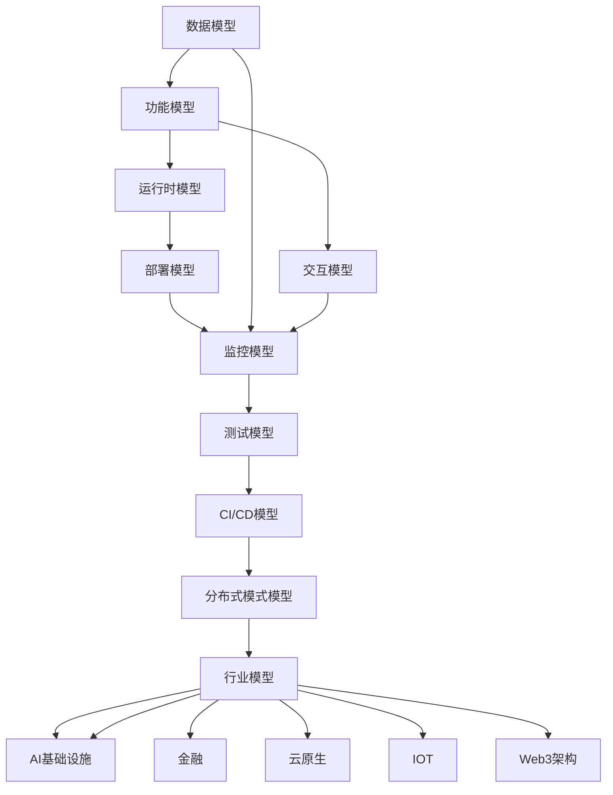

# 形式化框架 - 知识规范与模型设计平台

> **项目重新定位完成**：本项目已从"软件工程自动化构建平台"重新定位为"基于形式化方法的软件工程知识规范与模型设计平台"

**本节要点**：（1）L2 元模型 → L3 标准模型 → L4 行业模型的分层体系；（2）知识规范、模型设计、实践指南与参考资源四层结构；（3）行业映射与递归扩展路径；（4）快速导航与按角色入口；（5）工具生态与递归完善机制。  
**预计阅读时间**：全文约 15–20 分钟；仅读「快速导航」+ 第 1–2 节约 10 分钟。延伸内容（递归完善、AI、社区治理等）见 [README_EXTENDED](README_EXTENDED.md)。

## 项目概述

形式化框架是一个基于数学基础和形式化方法的软件工程知识规范与模型设计平台。我们致力于构建统一的理论范式，系统性对齐学术与工业知识，并以可验证、可追溯的方式沉淀标准化产物与跨行业映射。

### 核心定位

- **知识规范**：提供标准化的软件工程知识体系
- **模型设计**：提供形式化的系统建模方法  
- **理论实践化**：将理论转化为可操作的实践指南
- **行业通用化**：提供跨行业的通用解决方案

### 目标受众

1. **理论研究者**：形式化方法、软件工程理论研究者
2. **标准制定者**：行业标准、企业标准制定者
3. **系统架构师**：系统架构师、技术架构师
4. **教育工作者**：软件工程教育工作者
5. **行业专家**：各行业技术专家

### 局限与边界

本框架侧重**软件工程与系统建模的形式化与行业映射**，不替代具体实现或运行时系统；形式化覆盖以 L2/L3 规格与不变式为主，不涵盖所有形式化理论（如深度类型论、同伦论等）。学习与对标以「能用、能教、能对标」为目标，详见 [LEARNING_PATHS 局限与边界](LEARNING_PATHS.md#局限与边界)。

## 目录（Table of Contents）

- [形式化框架 - 知识规范与模型设计平台](#形式化框架---知识规范与模型设计平台)
  - [目录（Table of Contents）](#目录table-of-contents)
  - [🚀 快速导航](#-快速导航)
  - [1. 项目结构总览](#1-项目结构总览)
    - [1.1 知识规范层](#11-知识规范层)
    - [1.2 模型设计层](#12-模型设计层)
    - [1.3 实践指南层](#13-实践指南层)
    - [1.4 参考资源层](#14-参考资源层)
  - [2. 核心模型体系](#2-核心模型体系)
    - [2.1 通用形式化建模体系 (formal-model/)](#21-通用形式化建模体系-formal-model)
    - [2.2 行业扩展模型 (industry-model/)](#22-行业扩展模型-industry-model)
  - [3. 行业应用映射](#3-行业应用映射)
  - [4. 各模型关系与递归扩展路径](#4-各模型关系与递归扩展路径)
  - [5. 行业映射关系](#5-行业映射关系)
  - [6. 延伸阅读与扩展内容](#6-延伸阅读与扩展内容)
  - [7. 快速开始指南](#7-快速开始指南)
  - [8. 项目路线图](#8-项目路线图)
  - [9. 工具生态](#9-工具生态)
  - [10. 项目状态](#10-项目状态)
  - [11. 贡献指南](#11-贡献指南)

---

## 🚀 快速导航

**新用户推荐路径**：

1. [📖 项目总览](README.md) → [🎯 快速开始指南](QUICK_START_GUIDE.md) → [❓ 常见问题](FAQ.md)
2. [🗺️ 快速导航系统](QUICK_NAVIGATION.md) - 完整的文档导航和索引
3. [📊 项目状态](PROJECT_STATUS.md) - 了解当前完成度和质量指标

**按角色导航**：

- 👨‍💻 **开发者**: [快速开始](QUICK_START_GUIDE.md) → [API文档](API_DOCUMENTATION.md) → [代码示例](formal-model/core-concepts/code-generation.md)
- 🏗️ **架构师**: [L2元模型](L2_D01_交互元模型.md) → [L3标准模型](L3_D01_交互标准模型.md) → [行业应用](industry-model/)
- 🎓 **研究者**: [理论基础](formal-model/core-concepts/formal-modeling.md) → [形式化验证](formal-model/core-concepts/formal-verification.md)
- 🏭 **行业专家**: [行业映射](formal-model/core-concepts/industry-mapping.md) → [L4行业索引](L4_D90_CN_行业索引与对标.md)

**核心映射**：

- [📐 L2↔L3 映射总表](formal-model/alignment-L2-L3-matrix.md) - L2 元模型与 L3 标准模型的对象/属性/不变式对齐；完整 L2/L3 列表见 [快速导航系统](QUICK_NAVIGATION.md#l2l3-映射总表)。

**5 分钟版**：本项目为基于形式化方法的软件工程知识规范与模型设计平台；核心为 **L2 元模型（8 个）→ L3 标准模型（10 个）→ L4 行业模型（5 个）** 分层体系；知识规范、模型设计、实践指南、参考资源四层结构；按角色与目标入口见上表；学习路径见 [LEARNING_PATHS](LEARNING_PATHS.md)，复习清单见 [learning/REVIEW_CHECKLIST](learning/REVIEW_CHECKLIST.md)。

---

## 1. 项目结构总览

### 1.1 知识规范层

```text
docs/knowledge-standards/
├── formal-methods/              # 形式化方法规范
│   ├── set-theory/             # 集合论基础
│   ├── category-theory/        # 范畴论应用
│   ├── type-theory/            # 类型理论
│   ├── logic-foundation/       # 逻辑学基础
│   └── verification-methods/   # 验证方法
├── software-engineering/        # 软件工程规范
│   ├── architecture/           # 架构设计规范
│   ├── quality-assurance/      # 质量保证规范
│   ├── testing/               # 测试规范
│   └── lifecycle/             # 生命周期规范
├── system-architecture/         # 系统架构规范
│   ├── distributed-systems/    # 分布式系统
│   ├── microservices/         # 微服务架构
│   ├── cloud-native/          # 云原生架构
│   └── edge-computing/        # 边缘计算
└── industry-practices/          # 行业实践规范
    ├── finance/               # 金融行业实践
    ├── healthcare/            # 医疗行业实践
    ├── manufacturing/         # 制造业实践
    └── telecommunications/    # 电信行业实践
```

### 1.2 模型设计层

```text
docs/model-design/
├── meta-models/                # 元模型设计
│   ├── L2-metamodels/         # L2元模型（8个）
│   ├── L3-standard-models/    # L3标准模型（10个）
│   └── L4-industry-models/    # L4行业模型（5个）
├── domain-models/              # 领域模型设计
│   ├── data-model/            # 数据模型
│   ├── functional-model/      # 功能模型
│   ├── interaction-model/     # 交互模型
│   ├── runtime-model/         # 运行时模型
│   ├── deployment-model/      # 部署模型
│   ├── monitoring-model/      # 监控模型
│   ├── testing-model/         # 测试模型
│   ├── cicd-model/            # CI/CD模型
│   └── distributed-pattern/   # 分布式模式
├── system-models/              # 系统模型设计
│   ├── architecture/          # 架构模型
│   ├── integration/           # 集成模型
│   ├── security/              # 安全模型
│   └── performance/           # 性能模型
└── industry-models/            # 行业模型设计
    ├── cloud-native/          # 云原生模型
    ├── ai-infrastructure/     # AI基础设施模型
    ├── finance/               # 金融模型
    ├── iot/                   # 物联网模型
    └── web3/                  # Web3模型
```

### 1.3 实践指南层

```text
docs/practice-guides/
├── methodology/                # 方法论指南
│   ├── formal-methods/        # 形式化方法
│   ├── model-driven/          # 模型驱动开发
│   ├── architecture/          # 架构设计方法
│   └── quality/               # 质量保证方法
├── best-practices/             # 最佳实践指南
│   ├── design-patterns/       # 设计模式
│   ├── coding-standards/      # 编码标准
│   ├── testing-strategies/    # 测试策略
│   └── deployment/            # 部署实践
├── case-studies/               # 案例研究
│   ├── success-stories/       # 成功案例
│   ├── failure-analysis/      # 失败分析
│   ├── lessons-learned/       # 经验教训
│   └── industry-applications/ # 行业应用
└── tool-recommendations/       # 工具推荐
    ├── modeling-tools/        # 建模工具
    ├── verification-tools/    # 验证工具
    ├── testing-tools/         # 测试工具
    └── deployment-tools/      # 部署工具
```

### 1.4 参考资源层

```text
docs/reference/
├── standards/                  # 国际标准
│   ├── iso-standards/         # ISO标准
│   ├── ieee-standards/        # IEEE标准
│   ├── omg-standards/         # OMG标准
│   └── industry-standards/    # 行业标准
├── academic/                   # 学术资源
│   ├── university-courses/    # 大学课程
│   ├── research-papers/       # 研究论文
│   ├── textbooks/             # 教科书
│   └── conferences/           # 学术会议
└── industry/                   # 行业资源
    ├── open-source/           # 开源项目
    ├── commercial/            # 商业产品
    ├── case-studies/          # 行业案例
    └── trends/                # 技术趋势
```

权威对标与形式化规格语言：标准、课程、CNCF 见 [reference/AUTHORITY_ALIGNMENT_INDEX](reference/AUTHORITY_ALIGNMENT_INDEX.md)；形式化规格语言与工具族（Z、VDM、TLA+、Alloy、Why3）及与 L2 规格/不变式的对应见 [reference/FORMAL_SPEC_LANGUAGES](reference/FORMAL_SPEC_LANGUAGES.md)。业界采用（如 TLA+ 等）见 [evidence](evidence/README.md) 及对应 STD-* 条目。

---

## 2. 核心模型体系

**为何采用 L2→L3→L4 分层**：L2 元模型提供与实现无关的基础概念（数据、功能、交互、运行时等），便于统一术语与不变式；L3 标准模型在 L2 之上绑定具体标准与实现形态（如 REST/OpenAPI、容器/编排），便于审稿、对标与工具化；L4 行业模型在 L3 之上做行业映射与案例，便于跨行业复用与对标。学习与审稿时先掌握 L2 再对照 L3、最后看 L4，可减少认知负荷；详见 [LEARNING_PATHS 前置依赖关系图](LEARNING_PATHS.md#前置依赖关系图) 与各阶段「为何本顺序」。

### 2.1 通用形式化建模体系 (formal-model/)

```text
docs/formal-model/
├── core-concepts/           # 核心概念（17个文件）
│   ├── abstract-syntax-tree.md
│   ├── domain-specific-language.md
│   ├── formal-modeling.md
│   └── ...
├── data-model/             # 数据建模
│   ├── entity/            # 实体建模
│   ├── index/             # 索引建模
│   ├── migration/         # 迁移建模
│   ├── query/             # 查询建模
│   ├── dsl-draft.md       # 数据模型DSL设计
│   └── theory.md          # 数据建模理论
├── functional-model/       # 功能建模
│   ├── business-logic/    # 业务逻辑建模
│   ├── rule-engine/       # 规则引擎建模
│   ├── state-machine/     # 状态机建模
│   ├── workflow/          # 工作流建模
│   ├── dsl-draft.md       # 功能模型DSL设计
│   └── theory.md          # 功能建模理论
├── interaction-model/      # 交互建模
│   ├── api/               # API建模
│   ├── contract/          # 契约建模
│   ├── message/           # 消息建模
│   ├── protocol/          # 协议建模
│   ├── dsl-draft.md       # 交互模型DSL设计
│   └── theory.md          # 交互建模理论
├── runtime-model/          # 运行时建模
├── deployment-model/       # 部署建模
├── monitoring-model/       # 监控建模
├── testing-model/          # 测试建模
├── cicd-model/             # CI/CD建模
└── distributed-pattern-model/ # 分布式模式建模
```

### 2.2 行业扩展模型 (industry-model/)

```text
docs/industry-model/
├── ai-infrastructure-architecture/    # AI基础设施
│   ├── data-pipeline/                 # 数据管道
│   ├── distributed-training/          # 分布式训练
│   ├── feature-store/                 # 特征库
│   ├── mlops/                         # MLOps
│   ├── model-serving/                 # 模型服务
│   ├── dsl-draft.md                   # AI基础设施DSL设计
│   ├── theory.md                      # AI基础设施理论
│   └── README.md                      # AI基础设施概述
├── cloud-native-architecture/         # 云原生架构
│   ├── api-gateway/                   # API网关
│   ├── container-orchestration/       # 容器编排
│   ├── observability/                 # 可观测性
│   ├── serverless/                    # Serverless
│   ├── service-mesh/                  # 服务网格
│   ├── dsl-draft.md                   # 云原生DSL设计
│   ├── theory.md                      # 云原生理论
│   └── README.md                      # 云原生概述
├── finance-architecture/              # 金融架构
├── iot-architecture/                  # 物联网架构
└── web3-architecture/                 # Web3架构
```

---

## 3. 行业应用映射

### 3.1 L2元模型快速导航

- `docs/L2_D01_交互元模型.md` - 交互系统的基础抽象
- `docs/L2_D02_数据元模型.md` - 数据建模的基础概念
- `docs/L2_D03_功能元模型.md` - 功能建模的核心要素
- `docs/L2_D04_运行时元模型.md` - 运行时环境建模
- `docs/L2_D05_部署元模型.md` - 部署配置建模
- `docs/L2_D06_监控元模型.md` - 监控体系建模
- `docs/L2_D07_控制调度元模型.md` - 控制调度建模
- `docs/L2_D08_测试元模型.md` - 测试体系建模

### 3.2 L3标准模型快速导航

- `docs/L3_D01_交互标准模型.md` - API、协议、消息标准
- `docs/L3_D02_数据标准模型.md` - 数据存储、查询标准
- `docs/L3_D04_运行时标准模型.md` - 容器、编排标准
- `docs/L3_D05_部署标准模型.md` - 部署、配置标准
- `docs/L3_D06_监控标准模型.md` - 监控、告警标准
- `docs/L3_D07_控制调度标准模型.md` - 调度、控制标准
- `docs/L3_D08_测试标准模型.md` - 测试、验证标准
- `docs/L3_D09_CICD标准模型.md` - CI/CD流水线标准
- `docs/L3_D10_分布式模式标准模型.md` - 分布式系统模式

### 3.3 L4行业索引快速导航

- `docs/L4_D90_CN_行业索引与对标.md` - 云原生行业对标
- `docs/L4_D91_FIN_行业索引与对标.md` - 金融行业对标
- `docs/L4_D92_IOT_行业索引与对标.md` - 物联网行业对标
- `docs/L4_D93_AI_行业索引与对标.md` - AI基础设施对标
- `docs/L4_D94_W3_行业索引与对标.md` - Web3行业对标

## 4. 各模型关系与递归扩展路径



- **递归扩展路径**：每个模型均可递归细分为子模型（如数据模型→实体/关系/索引/迁移/查询等），理论与DSL均支持多层嵌套与组合。
- **递归建模核心思想**：顶层模型可不断分解为更细粒度的子模型，支持横向（如多行业映射）、纵向（如多层嵌套）扩展，便于知识复用与自动化推理。

---

## 5. 行业映射关系

| 通用模型         | 行业模型举例           | 映射关系说明                 |
|------------------|------------------------|------------------------------|
| 数据模型         | 金融-账户/交易/报表    | 账户/交易为实体，报表为查询  |
| 功能模型         | Web3-智能合约         | 业务逻辑/规则引擎            |
| 交互模型         | 云原生-API网关         | API/协议/消息/契约           |
| 运行时模型       | AI-分布式训练/推理     | 容器/网络/编排/存储/调度     |
| 部署模型         | 金融-核心银行部署      | 配置/基础设施/回滚/版本      |
| 监控模型         | 工业-设备监控/告警     | 指标/日志/追踪/告警          |
| 测试模型         | 金融-合规测试          | 用例/断言/覆盖率/性能         |
| CI/CD模型        | AI-自动化训练/部署     | 流水线/阶段/触发/门禁         |
| 分布式模式模型   | 云原生-服务网格/微服务 | 容错/一致性/负载均衡/发现     |

**行业映射扩展指引：**

- 选择通用模型作为基础，结合行业特性补充/细化子模型
- 行业模型可通过继承、组合、重载等方式与通用模型对齐
- 推荐在 industry-model/ 下新建行业子目录，复用 formal-model/ 结构
- 行业映射案例可参考各行业目录下的 theory.md 与 dsl-draft.md

---

### 5.1 跨行业理论模型索引与映射框架

- **索引结构（目录级别）**：
  - `docs/industry-model/ai-infrastructure-architecture/` ↔ `docs/formal-model/` 中的数据/运行时/部署/监控等子模型
  - `docs/industry-model/cloud-native-architecture/` ↔ 分布式模式、交互模型、运行时模型
  - `docs/industry-model/finance-architecture/` ↔ 数据模型（账户/交易/报表）、交互模型（支付/清算）、测试与合规
  - `docs/industry-model/iot-architecture/` ↔ 控制调度、运行时（边缘/网络）、监控与告警
  - `docs/industry-model/web3-architecture/` ↔ 分布式一致性、契约（智能合约）、协议与消息
- **映射产物（每个行业需提供）**：
  - 行业→通用模型映射表（字段/概念/约束）
  - 行业DSL草案与通用DSL片段的对齐说明
  - 验证与度量用例（一致性、完整性、性能、安全）
  - 参考与引用清单（标准/论文/课程/开源项目）
- **对齐流程**：行业术语表 → 概念/结构映射 → 约束/类型系统对齐 → 自动化推理/生成片段 → 评审与迭代。

> 导航：在各行业根目录 `README.md` 或 `theory.md` 顶部放置“行业↔通用模型对齐一览表”，并链接到对应 `formal-model/*` 位置。  
> **文档约定**：L2/L3/行业 README 中核心术语首次出现处建议链向 [术语表](knowledge-standards/glossary/GLOSSARY.md) 或 [概念索引](knowledge-standards/concept-index/CONCEPT_INDEX.md)，便于单点真相与审稿。

#### 行业对比维度模板（可复制粘贴到各行业 theory.md）

```markdown
# 行业对比占位模板

## 1. 术语与概念对齐
- 术语A ↔ 通用概念X（引用）
- 术语B ↔ 通用概念Y（引用）

## 2. 结构与约束映射
- 实体/对象/组件表（字段、类型、约束、关系）
- 状态机/流程/协议的映射（含前置/后置条件）

## 3. 方法与算法
- 关键算法/规约（复杂度、正确性要点）
- 形式化基础（逻辑/类型/不变式）

## 4. 接口与DSL对齐
- 行业DSL片段 ↔ 通用DSL片段（差异说明）

## 5. 验证与度量
- 正确性/一致性/性能/安全/合规用例与指标

## 6. 成熟应用对标
- 开源/标准/产品对比（特性矩阵、优缺点、适配建议）

## 7. 局限与开放问题
- 现有不足、边界条件、研究方向

## 8. 引用与参考
- 课程/论文/标准/文档（符合引用规范）
```


## 6. 延伸阅读与扩展内容

递归推理与自动化示例、各模型递归扩展案例、快速开始与路线图完整版、工具生态与项目状态、贡献指南的完整内容，以及递归完善计划、AI 与社区治理、模板与 FAQ、全球化与可持续发展等，见 **[README_EXTENDED](README_EXTENDED.md)**（约 30–40 分钟阅读）。

---

## 7. 快速开始指南

1. **了解项目定位**：阅读项目概述与 [LEARNING_PATHS](LEARNING_PATHS.md)。
2. **选择学习路径**：理论研究者 → formal-model/core-concepts/；架构师 → L2/L3 → industry-model/；行业专家 → L4 索引与对应行业 README。
3. **核心文档顺序**：README → formal-model/README → 选读 L2 → L3 → industry-model/*/README。详见 [QUICK_START_GUIDE](QUICK_START_GUIDE.md)。

---

## 8. 项目路线图

- **短期**：文档与证据完善、工具与质量提升。
- **中期**：形式化验证与工具生态、社区建设。
- **长期**：标准体系与认证、生态系统与创新。详见 [ROADMAP](ROADMAP.md)。

---

## 9. 工具生态

文档管理工具：索引生成、证据管理、质量度量、证据模板生成、综合工具。见 [scripts/README](../scripts/README.md) 与 README 第 11 节（完整版在 [README_EXTENDED](README_EXTENDED.md)）。

---

## 10. 项目状态

L2/L3/L4 与行业模型完成度、质量指标与最新更新见 [PROJECT_STATUS](PROJECT_STATUS.md)、[DOCUMENT_COMPLETION_CHECK](DOCUMENT_COMPLETION_CHECK.md)。

---

## 11. 贡献指南

贡献类型、流程与质量标准见 [CONTRIBUTING](CONTRIBUTING.md)。贡献与评审须对齐 [CITATION_STANDARDS](CITATION_STANDARDS.md)、[QUALITY_STANDARDS](QUALITY_STANDARDS.md)、[EXPERT_REVIEW_SYSTEM](EXPERT_REVIEW_SYSTEM.md)、[CODE_REVIEW_GUIDE](CODE_REVIEW_GUIDE.md)。

---
