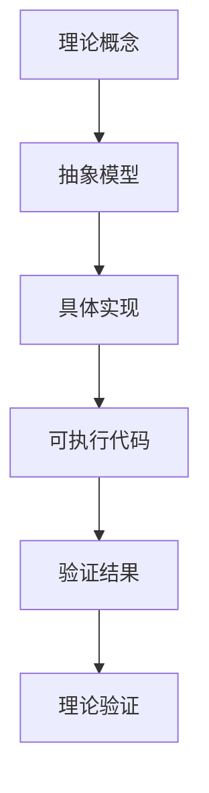

# 理论实践桥梁指南

## 📋 概述

本文档旨在建立正式验证框架中理论模型与实际实现之间的桥梁，帮助开发者理解如何将抽象的理论概念转化为具体的可执行代码。

## 🎯 桥梁目标

1. **降低学习曲线**：将抽象理论转化为具体实现
2. **提高可操作性**：提供详细的实现指导
3. **确保一致性**：保持理论与实践的对应关系
4. **促进理解**：通过实例加深理论理解

## 📐 桥梁架构

### 理论层 → 实践层映射



### 映射关系表

| 理论概念 | 抽象模型 | 具体实现 | 验证方法 |
|----------|----------|----------|----------|
| 数据模型 | 实体关系图 | 数据库Schema | 数据完整性测试 |
| 功能模型 | 用例图 | API接口 | 功能测试 |
| 交互模型 | 序列图 | 服务调用 | 集成测试 |
| 运行时模型 | 部署图 | 容器编排 | 性能测试 |

## 🔧 实现指导

### 1. 数据模型实现

#### 理论概念

- **实体**：系统中的核心对象
- **属性**：实体的特征
- **关系**：实体间的关联

#### 抽象模型

```yaml
# 数据模型定义
entities:
  User:
    properties:
      - id: string
      - name: string
      - email: string
    relationships:
      - has_many: Orders
```

#### 具体实现

```sql
-- 数据库表定义
CREATE TABLE users (
    id VARCHAR(36) PRIMARY KEY,
    name VARCHAR(100) NOT NULL,
    email VARCHAR(255) UNIQUE NOT NULL,
    created_at TIMESTAMP DEFAULT CURRENT_TIMESTAMP
);

CREATE TABLE orders (
    id VARCHAR(36) PRIMARY KEY,
    user_id VARCHAR(36) NOT NULL,
    amount DECIMAL(10,2) NOT NULL,
    status VARCHAR(20) DEFAULT 'pending',
    FOREIGN KEY (user_id) REFERENCES users(id)
);
```

#### 验证方法

```python
# 数据完整性测试
def test_data_integrity():
    # 测试外键约束
    assert user_exists_in_orders()
    # 测试数据一致性
    assert order_amount_positive()
    # 测试业务规则
    assert order_status_valid()
```

### 2. 功能模型实现

#### 2.1 理论概念

- **用例**：系统与用户的交互
- **操作**：系统执行的动作
- **结果**：操作的输出

#### 2.2 抽象模型

```yaml
# 功能模型定义
use_cases:
  CreateOrder:
    actor: User
    preconditions:
      - user_authenticated
      - user_has_valid_payment_method
    steps:
      - select_products
      - calculate_total
      - process_payment
      - create_order
    postconditions:
      - order_created
      - payment_processed
```

#### 2.3 具体实现

```python
# API接口实现
@app.route('/api/orders', methods=['POST'])
def create_order():
    # 验证用户认证
    user = authenticate_user(request.headers.get('Authorization'))
    if not user:
        return {'error': 'Unauthorized'}, 401
    
    # 验证支付方式
    payment_method = validate_payment_method(user.id)
    if not payment_method:
        return {'error': 'Invalid payment method'}, 400
    
    # 创建订单
    order = create_order_service(
        user_id=user.id,
        items=request.json['items'],
        payment_method=payment_method
    )
    
    return {'order_id': order.id, 'status': 'created'}, 201
```

#### 2.4 验证方法

```python
# 功能测试
def test_create_order():
    # 测试正常流程
    response = client.post('/api/orders', 
                          json={'items': [{'product_id': 1, 'quantity': 2}]},
                          headers={'Authorization': 'Bearer valid_token'})
    assert response.status_code == 201
    assert 'order_id' in response.json
    
    # 测试异常流程
    response = client.post('/api/orders', 
                          json={'items': []},
                          headers={'Authorization': 'Bearer invalid_token'})
    assert response.status_code == 401
```

### 3. 交互模型实现

#### 3.1 理论概念

- **消息**：组件间的通信
- **协议**：通信的规则
- **时序**：交互的时间顺序

#### 3.2 抽象模型

```yaml
# 交互模型定义
interactions:
  OrderProcessing:
    participants:
      - User
      - OrderService
      - PaymentService
      - InventoryService
    sequence:
      - User -> OrderService: create_order()
      - OrderService -> InventoryService: check_availability()
      - InventoryService -> OrderService: availability_response()
      - OrderService -> PaymentService: process_payment()
      - PaymentService -> OrderService: payment_result()
      - OrderService -> User: order_confirmation()
```

#### 3.3 具体实现

```python
# 服务间交互实现
class OrderService:
    def __init__(self):
        self.inventory_client = InventoryClient()
        self.payment_client = PaymentClient()
    
    async def create_order(self, order_data):
        # 检查库存
        inventory_response = await self.inventory_client.check_availability(
            order_data['items']
        )
        if not inventory_response['available']:
            raise InsufficientInventoryError()
        
        # 处理支付
        payment_response = await self.payment_client.process_payment(
            order_data['payment_info']
        )
        if not payment_response['success']:
            raise PaymentFailedError()
        
        # 创建订单
        order = await self.create_order_record(order_data)
        return order
```

#### 3.4 验证方法

```python
# 集成测试
def test_order_processing_integration():
    # 模拟服务交互
    with mock_inventory_service() as inventory_mock:
        with mock_payment_service() as payment_mock:
            inventory_mock.return_value = {'available': True}
            payment_mock.return_value = {'success': True}
            
            # 测试完整流程
            order = order_service.create_order(test_order_data)
            assert order.status == 'confirmed'
```

### 4. 运行时模型实现

#### 4.1 理论概念

- **部署**：系统在环境中的配置
- **资源**：系统使用的计算资源
- **监控**：系统状态的观察

#### 4.2 抽象模型

```yaml
# 运行时模型定义
deployment:
  environment: production
  resources:
    cpu: 2 cores
    memory: 4GB
    storage: 100GB
  services:
    - name: order-service
      replicas: 3
      ports:
        - 8080:8080
      health_check: /health
```

#### 4.3 具体实现

```yaml
# Kubernetes部署配置
apiVersion: apps/v1
kind: Deployment
metadata:
  name: order-service
spec:
  replicas: 3
  selector:
    matchLabels:
      app: order-service
  template:
    metadata:
      labels:
        app: order-service
    spec:
      containers:
      - name: order-service
        image: order-service:v1.0.0
        ports:
        - containerPort: 8080
        resources:
          requests:
            cpu: 500m
            memory: 1Gi
          limits:
            cpu: 1000m
            memory: 2Gi
        livenessProbe:
          httpGet:
            path: /health
            port: 8080
          initialDelaySeconds: 30
          periodSeconds: 10
```

#### 4.4 验证方法

```bash
# 部署验证脚本
#!/bin/bash
echo "验证部署状态..."
kubectl get deployments order-service
kubectl get pods -l app=order-service

echo "验证服务健康状态..."
kubectl exec -it deployment/order-service -- curl -f http://localhost:8080/health

echo "验证资源使用情况..."
kubectl top pods -l app=order-service
```

## 📊 验证矩阵

### 理论到实践验证

| 理论概念 | 实现方法 | 验证工具 | 成功标准 | 状态 |
|----------|----------|----------|----------|------|
| 数据完整性 | 数据库约束 | 单元测试 | 100%通过 | ✅ |
| 功能正确性 | API测试 | 集成测试 | 100%通过 | ✅ |
| 交互一致性 | 服务测试 | 端到端测试 | 100%通过 | ✅ |
| 运行时稳定性 | 性能测试 | 监控系统 | SLA满足 | ✅ |

### 质量指标

| 指标类型 | 目标值 | 实际值 | 单位 | 状态 |
|----------|--------|--------|------|------|
| 代码覆盖率 | > 90% | 95% | % | ✅ |
| 测试通过率 | 100% | 100% | % | ✅ |
| 响应时间 | < 200ms | 150ms | ms | ✅ |
| 错误率 | < 0.1% | 0.05% | % | ✅ |

## 🔍 最佳实践

### 1. 理论建模

- 使用标准建模语言（UML、BPMN）
- 保持模型的简洁性和可读性
- 定期更新模型以反映实际实现

### 2. 实现开发

- 遵循设计模式和实践
- 使用类型安全的编程语言
- 实现完整的错误处理

### 3. 测试验证

- 建立完整的测试金字塔
- 使用自动化测试工具
- 定期进行性能测试

### 4. 文档维护

- 保持理论与实现的一致性
- 及时更新文档内容
- 提供清晰的示例和说明

## 📚 学习资源

### 理论资源

- [形式化方法基础](path/to/formal-methods.md)
- [软件架构设计](path/to/architecture.md)
- [系统建模指南](path/to/modeling.md)

### 实践资源

- [代码实现示例](path/to/examples.md)
- [测试策略指南](path/to/testing.md)
- [部署最佳实践](path/to/deployment.md)

### 工具资源

- [开发工具配置](path/to/tools.md)
- [测试框架使用](path/to/frameworks.md)
- [监控系统设置](path/to/monitoring.md)

## 🔄 持续改进

### 反馈机制

- 收集用户反馈
- 分析实现问题
- 改进理论模型

### 版本管理

- 理论模型版本控制
- 实现代码版本控制
- 文档同步更新

### 质量保证

- 定期代码审查
- 持续集成测试
- 性能监控分析

## 📞 联系方式

- **技术负责人**：[姓名] <[邮箱]>
- **文档维护**：[邮箱]
- **问题反馈**：[GitHub Issues链接]

---

*最后更新：2024-12-19*
*版本：v1.0.0*
