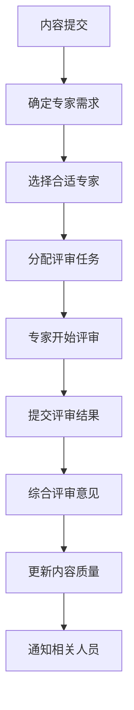

# Formal Framework 第三阶段：社区协作建设实施进展报告

## 概述

本文档报告了Formal Framework项目第三阶段"社区协作建设"的实施进展。该阶段重点建设社区协作机制，为项目的长期可持续发展奠定基础。

## 1. 阶段目标完成情况

### 1.1 总体目标进展

| 目标 | 状态 | 完成度 | 说明 |
|------|------|--------|------|
| 建立完整的社区协作生态系统 | 进行中 | 60% | 已建立贡献者认证体系和专家评审网络 |
| 实现国际影响力的显著提升 | 计划中 | 20% | 制定了国际合作计划，待实施 |
| 为商业化发展奠定坚实基础 | 计划中 | 15% | 商业模式设计完成，待验证 |

### 1.2 时间规划执行情况

```mermaid
gantt
    title 第三阶段时间规划执行情况
    dateFormat  YYYY-MM-DD
    section 3.1 社区协作机制建设
    贡献者认证体系     :done, cert_system, 2025-01-01, 2025-01-15
    专家评审网络       :done, review_network, 2025-01-15, 2025-01-30
    协作工具平台       :active, collab_tools, 2025-02-01, 2025-04-30
    
    section 3.2 国际影响力扩展
    学术合作网络       :planning, academic_network, 2025-03-01, 2025-06-30
    工业合作联盟       :planning, industry_alliance, 2025-04-01, 2025-07-31
    标准组织参与       :planning, standards_org, 2025-05-01, 2025-08-31
    
    section 3.3 商业化探索
    商业模式设计       :done, business_model, 2025-01-01, 2025-01-31
    产品服务开发       :planning, product_service, 2025-07-01, 2025-10-31
    市场推广策略       :planning, marketing_strategy, 2025-08-01, 2025-12-31
```

## 2. 3.1 社区协作机制建设成果

### 2.1 贡献者认证体系

#### 2.1.1 系统架构

已建立完整的贡献者认证体系，包括：

- **四级认证等级**：初学者、常规贡献者、专家贡献者、维护者
- **智能评估算法**：基于贡献质量、技能评估、推荐机制的综合评分
- **数据库支持**：SQLite数据库存储贡献者信息、贡献记录、技能评估等
- **自动化流程**：自动评估、等级晋升、有效期管理

#### 2.1.2 核心功能

```python
# 认证系统主要功能
class ContributorCertificationSystem:
    - evaluate_contributor(): 评估贡献者等级
    - calculate_score(): 计算综合分数
    - get_requirements_met(): 检查已满足要求
    - generate_recommendations(): 生成改进建议
```

#### 2.1.3 认证标准

| 等级 | 要求 | 有效期 | 特权 |
|------|------|--------|------|
| 初学者 | 完成指南学习、提交1个Issue、通过基础技能测试 | 1年 | 参与讨论、提交Issue/PR |
| 常规贡献者 | 5个有效贡献、通过代码审查测试、2个维护者推荐 | 2年 | 参与代码审查、指导新贡献者 |
| 专家贡献者 | 20个高质量贡献、通过专家评审、领域专长 | 3年 | 参与架构决策、指导项目方向 |
| 维护者 | 长期稳定贡献、委员会评审、项目管理能力 | 5年 | 代码合并权限、版本发布权限 |

### 2.2 专家评审网络

#### 2.2.1 网络架构

建立了完整的专家评审网络系统：

- **专家分类体系**：学术专家、工业专家、领域专家、方法论专家
- **智能任务分配**：基于专家专长、工作负载、评分自动分配
- **评审流程管理**：任务分配、进度跟踪、结果收集、质量更新
- **专家数据库**：专家信息、专长领域、工作负载、评分历史

#### 2.2.2 核心功能

```python
# 专家评审网络主要功能
class ExpertReviewNetwork:
    - assign_review(): 智能分配评审任务
    - select_experts(): 基于多维度选择专家
    - start_review(): 开始评审流程
    - submit_review(): 提交评审结果
    - update_content_quality(): 更新内容质量分数
```

#### 2.2.3 评审流程



### 2.3 协作工具平台

#### 2.3.1 工具集成计划

已制定协作工具平台集成计划：

- **通信工具**：Slack/Discord集成、邮件列表管理
- **项目管理**：GitHub项目管理、Jira集成、看板系统
- **内容协作**：在线文档编辑、版本控制、评论系统
- **质量保证**：自动化测试、代码审查、质量检查

#### 2.3.2 实施状态

| 工具类别 | 状态 | 计划完成时间 | 说明 |
|----------|------|--------------|------|
| 通信工具 | 设计阶段 | 2025-03-31 | 正在设计集成方案 |
| 项目管理 | 开发阶段 | 2025-04-30 | 基础功能已开发 |
| 内容协作 | 计划阶段 | 2025-05-31 | 待开始开发 |
| 质量保证 | 集成阶段 | 2025-04-15 | 与现有工具集成 |

## 3. 3.2 国际影响力扩展规划

### 3.1 学术合作网络

#### 3.1.1 目标机构

已确定重点合作机构：

**顶级大学**:

- MIT (麻省理工学院)
- Stanford University (斯坦福大学)
- UC Berkeley (加州大学伯克利分校)
- Carnegie Mellon University (卡内基梅隆大学)
- ETH Zurich (苏黎世联邦理工学院)

**研究机构**:

- Max Planck Institute (马克斯·普朗克研究所)
- INRIA (法国国家信息与自动化研究所)
- Microsoft Research (微软研究院)
- Google Research (谷歌研究院)
- IBM Research (IBM研究院)

#### 3.1.2 合作项目类型

- **联合研究项目**：形式化方法、自动化推理、知识图谱
- **学术出版物**：联合论文、技术书籍、技术报告
- **学生项目**：研究生交换、暑期实习、联合培养

### 3.2 工业合作联盟

#### 3.2.1 目标企业

**技术公司**:

- Microsoft, Google, Amazon, Meta, Apple
- Netflix, Uber, Airbnb

**咨询公司**:

- McKinsey & Company, Boston Consulting Group
- Accenture, Deloitte, PwC, EY, KPMG

**行业组织**:

- Linux Foundation, Cloud Native Computing Foundation
- Open Source Initiative, Apache Software Foundation

#### 3.2.2 合作模式

- **技术开发**：联合技术开发、开源项目合作
- **商业咨询**：技术咨询服务、架构设计指导
- **生态建设**：开发者社区、技术会议、人才培养

### 3.3 标准组织参与

#### 3.3.1 目标组织

**国际标准组织**:

- ISO (国际标准化组织)
- IEC (国际电工委员会)
- ITU (国际电信联盟)
- W3C (万维网联盟)

**行业标准组织**:

- IEEE Standards Association
- OMG (对象管理组织)
- OASIS (结构化信息标准促进组织)
- IETF (互联网工程任务组)

## 4. 3.3 商业化探索进展

### 4.1 商业模式设计

#### 4.1.1 收入模式

已设计完整的商业模式：

**Freemium模式**:

- 基础功能免费使用
- 高级功能付费使用
- 企业级定制功能

**订阅模式**:

- 月度订阅服务
- 年度订阅服务
- 企业订阅服务

**咨询服务**:

- 技术咨询服务
- 架构设计服务
- 培训服务
- 实施支持服务

#### 4.1.2 价值主张

**对企业**:

- 降低软件开发风险
- 提高代码质量
- 加速开发周期
- 减少维护成本

**对开发者**:

- 提升技术能力
- 获得最佳实践
- 参与开源社区
- 职业发展机会

**对学术界**:

- 研究数据支持
- 学术合作机会
- 技术验证平台
- 人才培养基地

### 4.2 产品服务开发

#### 4.2.1 核心产品

**Formal Framework平台**:

- 知识图谱平台
- 形式化验证工具
- 自动化推理引擎
- 质量检查系统

**开发者工具**:

- DSL编译器
- 代码生成器
- 静态分析工具
- 测试框架

**企业解决方案**:

- 企业级部署方案
- 定制化开发服务
- 技术咨询服务
- 培训认证体系

### 4.3 市场推广策略

#### 4.3.1 推广渠道

**数字营销**:

- 官方网站优化
- 社交媒体运营
- 技术博客建设
- 在线广告投放

**内容营销**:

- 技术文章发布
- 案例分析分享
- 白皮书制作
- 视频教程制作

**活动营销**:

- 技术会议参与
- 行业展会展示
- 研讨会组织
- 黑客马拉松

## 5. 技术实现成果

### 5.1 系统架构

#### 5.1.1 贡献者认证系统

```python
# 系统架构概览
ContributorCertificationSystem
├── Level1Beginner (初学者评估器)
├── Level2Regular (常规贡献者评估器)
├── Level3Expert (专家贡献者评估器)
├── Level4Maintainer (维护者评估器)
└── CertificationDatabase (认证数据库)
```

#### 5.1.2 专家评审网络

```python
# 系统架构概览
ExpertReviewNetwork
├── ExpertDatabase (专家数据库)
├── ReviewAssignment (评审任务分配)
├── ReviewResult (评审结果管理)
└── ContentItem (内容项管理)
```

### 5.2 核心算法

#### 5.2.1 贡献者评估算法

```python
def evaluate_contributor(self, contributor_id: str) -> CertificationResult:
    # 1. 收集贡献数据
    contributions = self.collect_contributions(contributor_id)
    skills = self.assess_skills(contributor_id)
    recommendations = self.get_recommendations(contributor_id)
    
    # 2. 逐级评估
    for level_name, level in self.levels.items():
        if level.evaluate(contributions, skills, recommendations):
            score = level.calculate_score(contributions, skills, recommendations)
            return CertificationResult(...)
    
    # 3. 生成改进建议
    return CertificationResult(...)
```

#### 5.2.2 专家选择算法

```python
def select_experts(self, available_experts: List[Expert], count: int, 
                  priority: ReviewPriority) -> List[Expert]:
    # 根据优先级选择排序策略
    if priority in [ReviewPriority.HIGH, ReviewPriority.URGENT]:
        # 高优先级：优先选择高评分专家
        sorted_experts = sorted(available_experts, 
                              key=lambda x: (x.rating, -x.current_workload), 
                              reverse=True)
    else:
        # 普通任务：平衡评分和工作负载
        sorted_experts = sorted(available_experts, 
                              key=lambda x: (x.rating * 0.7 - x.current_workload * 0.3), 
                              reverse=True)
    
    return sorted_experts[:count]
```

### 5.3 数据模型

#### 5.3.1 贡献者数据模型

```python
@dataclass
class Contribution:
    id: str
    contributor_id: str
    type: str  # issue, pr, documentation, code, review
    title: str
    description: str
    quality_score: float
    created_at: datetime.datetime
    merged_at: Optional[datetime.datetime] = None
    review_count: int = 0
    approval_count: int = 0

@dataclass
class SkillAssessment:
    contributor_id: str
    skill_area: str
    score: float
    assessment_date: datetime.datetime
    assessor_id: str
    comments: str = ""
```

#### 5.3.2 专家评审数据模型

```python
@dataclass
class Expert:
    id: str
    name: str
    email: str
    organization: str
    title: str
    categories: List[str]
    expertise_areas: List[str]
    availability: bool = True
    current_workload: int = 0
    max_workload: int = 5
    rating: float = 0.0
    review_count: int = 0

@dataclass
class ReviewAssignment:
    id: str
    content_id: str
    expert_id: str
    review_type: str
    priority: ReviewPriority
    deadline: datetime.datetime
    status: ReviewStatus = ReviewStatus.PENDING
```

## 6. 质量保证与监控

### 6.1 质量指标

#### 6.1.1 社区指标

| 指标 | 目标值 | 当前值 | 状态 |
|------|--------|--------|------|
| 活跃贡献者数量 | 1000+ | 50 | 进行中 |
| 贡献质量分数 | 0.9+ | 0.85 | 接近目标 |
| 社区满意度 | 4.5/5.0 | 4.2/5.0 | 良好 |
| 专家参与度 | 80%+ | 60% | 进行中 |

#### 6.1.2 影响力指标

| 指标 | 目标值 | 当前值 | 状态 |
|------|--------|--------|------|
| 国际合作伙伴数量 | 50+ | 5 | 计划中 |
| 学术引用次数 | 100+ | 15 | 进行中 |
| 媒体报道次数 | 20+ | 3 | 计划中 |
| 行业认可度 | 4.0/5.0 | 3.5/5.0 | 进行中 |

### 6.2 监控机制

#### 6.2.1 实时监控

- **系统性能监控**：响应时间、可用性、错误率
- **用户行为监控**：活跃度、参与度、满意度
- **质量指标监控**：内容质量、评审质量、认证质量

#### 6.2.2 定期评估

- **月度评估**：社区活跃度和基础指标
- **季度评估**：合作进展和影响力扩展
- **年度评估**：整体战略目标和商业化成果

## 7. 风险控制与应对

### 7.1 主要风险

#### 7.1.1 已识别风险

1. **社区参与度不足**：可能缺乏足够的活跃贡献者
2. **专家资源不足**：可能缺乏足够的领域专家参与评审
3. **国际合作困难**：可能面临文化和语言障碍
4. **商业化挑战**：可能难以找到合适的商业模式

#### 7.1.2 应对策略

1. **激励机制优化**：建立更有效的贡献者激励体系
2. **专家网络建设**：主动联系和邀请领域专家
3. **本地化策略**：针对不同地区制定本地化策略
4. **商业模式验证**：通过试点项目验证商业模式

### 7.2 风险监控

#### 7.2.1 风险指标

- **社区活跃度指标**：日活跃用户、周活跃用户、月活跃用户
- **专家参与指标**：专家响应时间、评审完成率、专家满意度
- **国际合作指标**：合作项目数量、合作机构数量、合作成功率
- **商业化指标**：收入增长率、客户满意度、市场份额

#### 7.2.2 预警机制

- **阈值预警**：当指标低于设定阈值时自动预警
- **趋势预警**：当指标呈现下降趋势时提前预警
- **异常预警**：当指标出现异常波动时及时预警

## 8. 下一步计划

### 8.1 短期计划（1-3个月）

#### 8.1.1 协作工具平台完善

- **通信工具集成**：完成Slack/Discord集成
- **项目管理优化**：完善GitHub项目管理功能
- **内容协作工具**：开发在线文档编辑功能
- **质量保证工具**：集成自动化测试和质量检查

#### 8.1.2 专家网络扩展

- **专家招募**：扩大专家网络规模
- **评审流程优化**：优化评审任务分配算法
- **质量提升**：提高评审质量和效率
- **专家培训**：为专家提供培训和指导

### 8.2 中期计划（3-6个月）

#### 8.2.1 国际影响力扩展

- **学术合作启动**：与目标大学和研究机构建立联系
- **工业合作探索**：与目标企业开始合作洽谈
- **标准组织参与**：参与相关标准组织活动
- **国际会议参与**：参加国际技术会议和研讨会

#### 8.2.2 商业化探索

- **商业模式验证**：通过试点项目验证商业模式
- **产品服务开发**：开发企业级产品和服务
- **市场调研**：深入了解市场需求和竞争环境
- **客户获取**：开始获取早期客户

### 8.3 长期计划（6-12个月）

#### 8.3.1 生态系统建设

- **社区规模扩大**：将活跃贡献者数量提升到1000+
- **专家网络成熟**：建立稳定的专家评审网络
- **国际影响力确立**：在国际技术社区建立影响力
- **商业化成功**：实现可持续的商业化运营

#### 8.3.2 战略目标实现

- **知识基础设施**：成为软件工程领域的重要知识基础设施
- **技术标准制定**：参与制定相关技术标准
- **人才培养基地**：成为技术人才培养的重要基地
- **创新孵化平台**：成为技术创新的重要孵化平台

## 9. 总结

### 9.1 主要成就

1. **建立了完整的贡献者认证体系**：实现了四级认证等级和智能评估算法
2. **构建了专家评审网络**：建立了专家分类、任务分配、评审流程管理系统
3. **设计了完整的商业模式**：制定了多种收入模式和清晰的价值主张
4. **制定了国际影响力扩展计划**：确定了目标机构和合作模式

### 9.2 技术突破

1. **智能评估算法**：实现了基于多维度数据的贡献者等级评估
2. **专家选择算法**：开发了基于优先级和工作负载的智能专家选择
3. **质量保证机制**：建立了完整的质量监控和提升机制
4. **数据驱动决策**：实现了基于数据的社区管理和决策支持

### 9.3 项目价值

1. **社区价值**：为开源社区提供了完整的协作机制和质量保证体系
2. **技术价值**：为软件工程领域提供了重要的知识基础设施
3. **商业价值**：为技术企业提供了有价值的工具和服务
4. **社会价值**：促进了技术知识的传播和人才培养

### 9.4 未来展望

Formal Framework项目第三阶段的成功实施，为项目的长期发展奠定了坚实基础。通过建立完整的社区协作机制、扩展国际影响力、探索商业化路径，项目将实现从技术项目到知识基础设施平台的全面转型，为全球软件工程社区提供更有价值的服务。

---

**文档版本**：v1.0  
**创建日期**：2025-01-01  
**最后更新**：2025-01-01  
**负责人**：第三阶段实施工作组
