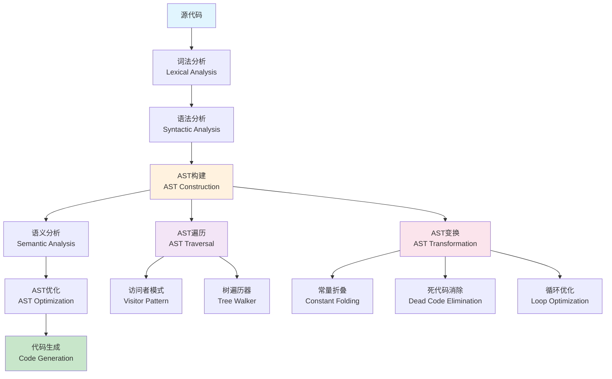

# 抽象语法树 (Abstract Syntax Tree)

## 目录（Table of Contents）

- [抽象语法树 (Abstract Syntax Tree)](#抽象语法树-abstract-syntax-tree)
  - [目录（Table of Contents）](#目录table-of-contents)
  - [概念定义](#概念定义)
    - [核心特征](#核心特征)
  - [理论基础](#理论基础)
    - [形式化定义](#形式化定义)
    - [AST构建与处理流程](#ast构建与处理流程)
    - [节点类型](#节点类型)
      - [表达式节点](#表达式节点)
      - [语句节点](#语句节点)
      - [声明节点](#声明节点)
  - [国际标准对标](#国际标准对标)
    - [语言标准](#语言标准)
      - [ECMAScript AST](#ecmascript-ast)
      - [Python AST](#python-ast)
      - [Java AST](#java-ast)
    - [编译器标准](#编译器标准)
      - [LLVM IR](#llvm-ir)
      - [GCC GIMPLE](#gcc-gimple)
  - [著名大学课程对标](#著名大学课程对标)
    - [编译器课程](#编译器课程)
      - [MIT 6.035 - Computer Language Engineering](#mit-6035---computer-language-engineering)
      - [Stanford CS143 - Compilers](#stanford-cs143---compilers)
      - [CMU 15-411 - Compiler Design](#cmu-15-411---compiler-design)
    - [程序分析课程](#程序分析课程)
      - [MIT 6.883 - Program Analysis](#mit-6883---program-analysis)
      - [Stanford CS243 - Program Analysis and Optimization](#stanford-cs243---program-analysis-and-optimization)
  - [工程实践](#工程实践)
    - [AST构建模式](#ast构建模式)
      - [递归下降解析](#递归下降解析)
      - [操作符优先级解析](#操作符优先级解析)
    - [AST遍历模式](#ast遍历模式)
      - [访问者模式](#访问者模式)
      - [树遍历器](#树遍历器)
    - [AST变换模式](#ast变换模式)
      - [常量折叠](#常量折叠)
      - [死代码消除](#死代码消除)
  - [最佳实践](#最佳实践)
    - [设计最佳实践](#设计最佳实践)
    - [实现最佳实践](#实现最佳实践)
    - [工具链最佳实践](#工具链最佳实践)
  - [应用案例](#应用案例)
    - [代码分析工具](#代码分析工具)
    - [代码生成工具](#代码生成工具)
  - [相关概念](#相关概念)
    - [核心概念关联](#核心概念关联)
    - [应用领域关联](#应用领域关联)
    - [行业应用关联](#行业应用关联)
    - [应用领域关联](#应用领域关联-1)
    - [行业应用关联](#行业应用关联-1)
  - [参考文献](#参考文献)

## 概念定义

抽象语法树(Abstract Syntax Tree, AST)是源代码的树状表示，其中每个节点表示源代码中的一个结构。
AST去除了语法细节（如括号、分号等），保留了程序的结构信息和语义内容，是编译器、解释器和代码分析工具的核心数据结构。

### 核心特征

1. **结构表示**：以树状结构表示程序的层次关系
2. **语法抽象**：去除语法糖和标点符号，保留语义结构
3. **类型安全**：支持类型检查和类型推断
4. **可遍历性**：支持深度优先、广度优先等遍历方式
5. **可变换性**：支持树节点的增删改查操作

## 理论基础

### 形式化定义

AST可以形式化为：

```text
AST = (N, E, L, T)
```

其中：

- N：节点集合（Nodes）
- E：边集合（Edges）
- L：标签函数（Labels）
- T：类型函数（Types）

### AST构建与处理流程



### 节点类型

#### 表达式节点

```yaml
# 表达式节点类型
expression_nodes:
  - binary_expression:
      operator: "+" | "-" | "*" | "/" | "==" | "!="
      left: Expression
      right: Expression
      
  - unary_expression:
      operator: "+" | "-" | "!" | "~"
      operand: Expression
      
  - function_call:
      function: Identifier
      arguments: Expression[]
      
  - variable_reference:
      name: Identifier
      
  - literal:
      type: "number" | "string" | "boolean" | "null"
      value: any
```

#### 语句节点

```yaml
# 语句节点类型
statement_nodes:
  - assignment_statement:
      target: Identifier
      value: Expression
      
  - if_statement:
      condition: Expression
      then_branch: Statement
      else_branch: Statement?
      
  - while_statement:
      condition: Expression
      body: Statement
      
  - for_statement:
      initializer: Statement?
      condition: Expression?
      increment: Expression?
      body: Statement
      
  - return_statement:
      value: Expression?
      
  - block_statement:
      statements: Statement[]
```

#### 声明节点

```yaml
# 声明节点类型
declaration_nodes:
  - function_declaration:
      name: Identifier
      parameters: Parameter[]
      return_type: Type?
      body: Statement
      
  - variable_declaration:
      name: Identifier
      type: Type?
      initializer: Expression?
      
  - class_declaration:
      name: Identifier
      superclass: Identifier?
      methods: MethodDeclaration[]
      fields: FieldDeclaration[]
      
  - interface_declaration:
      name: Identifier
      methods: MethodSignature[]
      fields: FieldSignature[]
```

## 国际标准对标

### 语言标准

#### ECMAScript AST

- **标准**：ESTree Specification
- **节点类型**：Expression、Statement、Declaration、Pattern
- **工具支持**：Babel、ESLint、Prettier
- **应用场景**：JavaScript代码分析和转换

#### Python AST

- **标准**：Python AST Module
- **节点类型**：expr、stmt、mod、slice
- **工具支持**：ast module、astroid、libcst
- **应用场景**：Python代码分析和优化

#### Java AST

- **标准**：Java Compiler Tree API
- **节点类型**：ExpressionTree、StatementTree、ClassTree
- **工具支持**：javac、Eclipse JDT、IntelliJ IDEA
- **应用场景**：Java代码分析和重构

### 编译器标准

#### LLVM IR

- **标准**：LLVM Language Reference Manual
- **节点类型**：Instruction、BasicBlock、Function、Module
- **工具支持**：LLVM、Clang、opt
- **应用场景**：编译器优化和代码生成

#### GCC GIMPLE

- **标准**：GCC Internals Manual
- **节点类型**：GIMPLE_ASSIGN、GIMPLE_COND、GIMPLE_CALL
- **工具支持**：GCC、GCC Plugins
- **应用场景**：C/C++代码优化

## 著名大学课程对标

### 编译器课程

#### MIT 6.035 - Computer Language Engineering

- **课程内容**：编译器设计、语言实现、程序分析
- **AST相关**：语法分析、语义分析、中间表示
- **实践项目**：编译器前端实现
- **相关技术**：ANTLR、LLVM、代码生成

#### Stanford CS143 - Compilers

- **课程内容**：编译器原理、语言处理、代码优化
- **AST相关**：抽象语法树构建、类型检查、代码生成
- **实践项目**：Cool语言编译器
- **相关技术**：Flex、Bison、LLVM

#### CMU 15-411 - Compiler Design

- **课程内容**：编译器设计、程序分析、代码优化
- **AST相关**：语法树构建、语义分析、中间表示
- **实践项目**：编译器实现
- **相关技术**：OCaml、LLVM、程序分析

### 程序分析课程

#### MIT 6.883 - Program Analysis

- **课程内容**：程序分析、静态分析、动态分析
- **AST相关**：抽象语法树分析、数据流分析、控制流分析
- **实践项目**：程序分析工具
- **相关技术**：Soot、WALA、程序分析框架

#### Stanford CS243 - Program Analysis and Optimization

- **课程内容**：程序分析、代码优化、性能分析
- **AST相关**：语法树遍历、优化变换、代码生成
- **实践项目**：优化编译器
- **相关技术**：LLVM、GCC、性能分析

## 工程实践

### AST构建模式

#### 递归下降解析

```java
// 递归下降解析器示例
public class RecursiveDescentParser {
    private List<Token> tokens;
    private int current = 0;
    
    public Expression parseExpression() {
        Expression left = parseTerm();
        
        while (match(TokenType.PLUS, TokenType.MINUS)) {
            Token operator = previous();
            Expression right = parseTerm();
            left = new BinaryExpression(left, operator, right);
        }
        
        return left;
    }
    
    public Expression parseTerm() {
        Expression left = parseFactor();
        
        while (match(TokenType.STAR, TokenType.SLASH)) {
            Token operator = previous();
            Expression right = parseFactor();
            left = new BinaryExpression(left, operator, right);
        }
        
        return left;
    }
    
    public Expression parseFactor() {
        if (match(TokenType.NUMBER)) {
            return new LiteralExpression(previous().literal);
        }
        
        if (match(TokenType.LEFT_PAREN)) {
            Expression expression = parseExpression();
            consume(TokenType.RIGHT_PAREN, "Expect ')' after expression.");
            return new GroupingExpression(expression);
        }
        
        throw error(peek(), "Expect expression.");
    }
}
```

#### 操作符优先级解析

```java
// 操作符优先级解析器示例
public class OperatorPrecedenceParser {
    private Map<TokenType, Integer> precedence;
    
    public Expression parseExpression() {
        return parseExpression(0);
    }
    
    private Expression parseExpression(int minPrecedence) {
        Expression left = parsePrimary();
        
        while (true) {
            TokenType operator = peek().type;
            int precedence = getPrecedence(operator);
            
            if (precedence < minPrecedence) {
                break;
            }
            
            advance(); // consume operator
            Expression right = parseExpression(precedence + 1);
            left = new BinaryExpression(left, operator, right);
        }
        
        return left;
    }
    
    private int getPrecedence(TokenType operator) {
        return precedence.getOrDefault(operator, 0);
    }
}
```

### AST遍历模式

#### 访问者模式

```java
// 访问者模式示例
public interface ASTVisitor<T> {
    T visitBinaryExpression(BinaryExpression expr);
    T visitUnaryExpression(UnaryExpression expr);
    T visitLiteralExpression(LiteralExpression expr);
    T visitVariableExpression(VariableExpression expr);
    T visitAssignmentExpression(AssignmentExpression expr);
    T visitCallExpression(CallExpression expr);
    T visitIfStatement(IfStatement stmt);
    T visitWhileStatement(WhileStatement stmt);
    T visitForStatement(ForStatement stmt);
    T visitReturnStatement(ReturnStatement stmt);
    T visitBlockStatement(BlockStatement stmt);
    T visitFunctionDeclaration(FunctionDeclaration decl);
    T visitVariableDeclaration(VariableDeclaration decl);
}

// 类型检查访问者
public class TypeChecker implements ASTVisitor<Type> {
    private Environment<Type> environment = new Environment<>();
    
    @Override
    public Type visitBinaryExpression(BinaryExpression expr) {
        Type left = expr.left.accept(this);
        Type right = expr.right.accept(this);
        
        if (left == Type.NUMBER && right == Type.NUMBER) {
            return Type.NUMBER;
        }
        
        if (left == Type.STRING && right == Type.STRING && expr.operator.type == TokenType.PLUS) {
            return Type.STRING;
        }
        
        throw new TypeError("Invalid operands for binary operator: " + expr.operator.lexeme);
    }
    
    @Override
    public Type visitLiteralExpression(LiteralExpression expr) {
        if (expr.value instanceof Number) {
            return Type.NUMBER;
        } else if (expr.value instanceof String) {
            return Type.STRING;
        } else if (expr.value instanceof Boolean) {
            return Type.BOOLEAN;
        }
        return Type.NULL;
    }
}
```

#### 树遍历器

```java
// 树遍历器示例
public class ASTTraverser {
    public void traverse(Expression expr) {
        if (expr instanceof BinaryExpression) {
            BinaryExpression binary = (BinaryExpression) expr;
            traverse(binary.left);
            traverse(binary.right);
        } else if (expr instanceof UnaryExpression) {
            UnaryExpression unary = (UnaryExpression) expr;
            traverse(unary.operand);
        } else if (expr instanceof CallExpression) {
            CallExpression call = (CallExpression) expr;
            traverse(call.callee);
            for (Expression arg : call.arguments) {
                traverse(arg);
            }
        }
        // 处理其他表达式类型...
    }
    
    public void traverse(Statement stmt) {
        if (stmt instanceof IfStatement) {
            IfStatement ifStmt = (IfStatement) stmt;
            traverse(ifStmt.condition);
            traverse(ifStmt.thenBranch);
            if (ifStmt.elseBranch != null) {
                traverse(ifStmt.elseBranch);
            }
        } else if (stmt instanceof WhileStatement) {
            WhileStatement whileStmt = (WhileStatement) stmt;
            traverse(whileStmt.condition);
            traverse(whileStmt.body);
        }
        // 处理其他语句类型...
    }
}
```

### AST变换模式

#### 常量折叠

```java
// 常量折叠变换示例
public class ConstantFoldingTransformer implements ASTVisitor<Expression> {
    @Override
    public Expression visitBinaryExpression(BinaryExpression expr) {
        Expression left = expr.left.accept(this);
        Expression right = expr.right.accept(this);
        
        // 如果两个操作数都是字面量，进行常量折叠
        if (left instanceof LiteralExpression && right instanceof LiteralExpression) {
            LiteralExpression leftLit = (LiteralExpression) left;
            LiteralExpression rightLit = (LiteralExpression) right;
            
            if (leftLit.value instanceof Number && rightLit.value instanceof Number) {
                double leftVal = ((Number) leftLit.value).doubleValue();
                double rightVal = ((Number) rightLit.value).doubleValue();
                double result = 0;
                
                switch (expr.operator.type) {
                    case PLUS:
                        result = leftVal + rightVal;
                        break;
                    case MINUS:
                        result = leftVal - rightVal;
                        break;
                    case STAR:
                        result = leftVal * rightVal;
                        break;
                    case SLASH:
                        if (rightVal != 0) {
                            result = leftVal / rightVal;
                        } else {
                            return new BinaryExpression(left, expr.operator, right);
                        }
                        break;
                    default:
                        return new BinaryExpression(left, expr.operator, right);
                }
                
                return new LiteralExpression(result);
            }
        }
        
        return new BinaryExpression(left, expr.operator, right);
    }
}
```

#### 死代码消除

```java
// 死代码消除变换示例
public class DeadCodeEliminator implements ASTVisitor<Statement> {
    @Override
    public Statement visitIfStatement(IfStatement stmt) {
        Expression condition = stmt.condition.accept(new ConstantEvaluator());
        
        if (condition instanceof LiteralExpression) {
            LiteralExpression lit = (LiteralExpression) condition;
            if (lit.value instanceof Boolean) {
                boolean value = (Boolean) lit.value;
                if (value) {
                    return stmt.thenBranch.accept(this);
                } else {
                    return stmt.elseBranch != null ? stmt.elseBranch.accept(this) : null;
                }
            }
        }
        
        Statement thenBranch = stmt.thenBranch.accept(this);
        Statement elseBranch = stmt.elseBranch != null ? stmt.elseBranch.accept(this) : null;
        
        return new IfStatement(stmt.condition, thenBranch, elseBranch);
    }
    
    @Override
    public Statement visitWhileStatement(WhileStatement stmt) {
        Expression condition = stmt.condition.accept(new ConstantEvaluator());
        
        if (condition instanceof LiteralExpression) {
            LiteralExpression lit = (LiteralExpression) condition;
            if (lit.value instanceof Boolean && !(Boolean) lit.value) {
                return null; // 死循环，可以消除
            }
        }
        
        Statement body = stmt.body.accept(this);
        return new WhileStatement(stmt.condition, body);
    }
}
```

## 最佳实践

### 设计最佳实践

1. **节点设计**：设计清晰的节点层次结构
2. **类型安全**：使用强类型系统确保类型安全
3. **不可变性**：AST节点应该是不可变的
4. **可序列化**：支持AST的序列化和反序列化

### 实现最佳实践

1. **访问者模式**：使用访问者模式进行树遍历
2. **变换模式**：使用变换模式进行树修改
3. **错误处理**：提供详细的错误信息和位置
4. **性能优化**：考虑大AST的性能优化

### 工具链最佳实践

1. **可视化工具**：提供AST的可视化工具
2. **调试支持**：提供AST的调试和测试工具
3. **文档生成**：自动生成AST的文档
4. **版本管理**：支持AST的版本管理

## 应用案例

### 代码分析工具

```java
// 代码复杂度分析示例
public class ComplexityAnalyzer implements ASTVisitor<Integer> {
    @Override
    public Integer visitIfStatement(IfStatement stmt) {
        int complexity = 1; // 基础复杂度
        complexity += stmt.condition.accept(this);
        complexity += stmt.thenBranch.accept(this);
        if (stmt.elseBranch != null) {
            complexity += stmt.elseBranch.accept(this);
        }
        return complexity;
    }
    
    @Override
    public Integer visitWhileStatement(WhileStatement stmt) {
        int complexity = 1; // 基础复杂度
        complexity += stmt.condition.accept(this);
        complexity += stmt.body.accept(this);
        return complexity;
    }
    
    @Override
    public Integer visitForStatement(ForStatement stmt) {
        int complexity = 1; // 基础复杂度
        if (stmt.initializer != null) {
            complexity += stmt.initializer.accept(this);
        }
        if (stmt.condition != null) {
            complexity += stmt.condition.accept(this);
        }
        if (stmt.increment != null) {
            complexity += stmt.increment.accept(this);
        }
        complexity += stmt.body.accept(this);
        return complexity;
    }
}
```

### 代码生成工具

```java
// 代码生成器示例
public class CodeGenerator implements ASTVisitor<String> {
    private int indentLevel = 0;
    
    private String indent() {
        return "  ".repeat(indentLevel);
    }
    
    @Override
    public String visitBinaryExpression(BinaryExpression expr) {
        String left = expr.left.accept(this);
        String right = expr.right.accept(this);
        return "(" + left + " " + expr.operator.lexeme + " " + right + ")";
    }
    
    @Override
    public String visitIfStatement(IfStatement stmt) {
        StringBuilder code = new StringBuilder();
        code.append(indent()).append("if (").append(stmt.condition.accept(this)).append(") {\n");
        indentLevel++;
        code.append(stmt.thenBranch.accept(this));
        indentLevel--;
        code.append(indent()).append("}");
        
        if (stmt.elseBranch != null) {
            code.append(" else {\n");
            indentLevel++;
            code.append(stmt.elseBranch.accept(this));
            indentLevel--;
            code.append(indent()).append("}");
        }
        
        code.append("\n");
        return code.toString();
    }
    
    @Override
    public String visitFunctionDeclaration(FunctionDeclaration decl) {
        StringBuilder code = new StringBuilder();
        code.append(indent()).append("function ").append(decl.name.lexeme).append("(");
        
        for (int i = 0; i < decl.parameters.size(); i++) {
            if (i > 0) code.append(", ");
            code.append(decl.parameters.get(i).name.lexeme);
        }
        
        code.append(") {\n");
        indentLevel++;
        code.append(decl.body.accept(this));
        indentLevel--;
        code.append(indent()).append("}\n");
        
        return code.toString();
    }
}
```

## 相关概念

### 核心概念关联

- [形式化建模](./formal-modeling.md) - AST是形式化建模的重要数据结构，提供程序的结构化表示
- [领域特定语言](./domain-specific-language.md) - AST是DSL解析的核心数据结构，用于表示DSL程序的语法结构
- [代码生成](./code-generation.md) - AST到目标代码的转换过程，是代码生成的基础输入
- [模型转换](./model-transformation.md) - AST作为中间表示进行模型转换，支持不同模型间的转换
- [语义分析](./semantic-analysis.md) - 基于AST进行语义分析和类型检查，是语义分析的基础数据结构
- [自动推理](./automated-reasoning.md) - 基于AST进行程序推理和验证，支持程序性质的自动推理

### 应用领域关联

- [数据模型](../data-model/theory.md) - AST可用于数据模型的表示和转换
- [功能模型](../functional-model/theory.md) - AST可用于功能模型的表示和分析
- [交互模型](../interaction-model/theory.md) - AST可用于API和协议的定义和解析

### 行业应用关联

- [云原生架构](../../industry-model/cloud-native-architecture/) - AST在Kubernetes配置解析中的应用
- [金融架构](../../industry-model/finance-architecture/) - AST在金融系统代码生成中的应用
- [IoT架构](../../industry-model/iot-architecture/) - AST在IoT设备配置解析中的应用

### 应用领域关联

- [数据建模](../data-model/theory.md) - 数据模型可以表示为AST结构
- [功能建模](../functional-model/theory.md) - 业务逻辑的AST表示
- [交互建模](../interaction-model/theory.md) - API定义的AST结构
- [运行时建模](../runtime-model/theory.md) - 运行时配置的AST表示

### 行业应用关联

- [金融架构](../../industry-model/finance-architecture/) - 金融业务规则的AST建模
- [AI基础设施](../../industry-model/ai-infrastructure-architecture/) - 机器学习模型的AST表示
- [云原生架构](../../industry-model/cloud-native-architecture/) - 云配置的AST结构

## 参考文献

1. Aho, A. V., et al. (2006). "Compilers: Principles, Techniques, and Tools"
2. Appel, A. W. (2004). "Modern Compiler Implementation in Java"
3. Cooper, K. D., & Torczon, L. (2011). "Engineering a Compiler"
4. Muchnick, S. S. (1997). "Advanced Compiler Design and Implementation"
5. Grune, D., et al. (2012). "Modern Compiler Design"
6. Nielson, F., et al. (2015). "Principles of Program Analysis"
