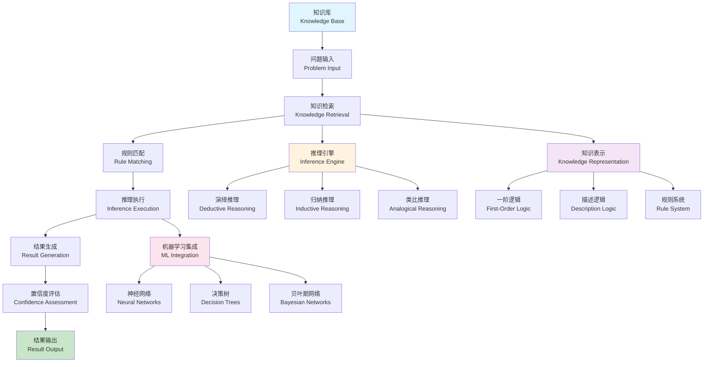

# 自动推理机制 (Automated Reasoning)

**本节要点**：（1）自动推理的概念、逻辑推理理论与推理类型；（2）核心组件（知识表示、推理引擎、推理策略）与国际标准对标（SMT、Model Checking、OWL/RDF）；（3）名校课程对标与工程实践。  
**预计阅读时间**：约 50–60 分钟；建议分 2–4 次阅读，每次 1–2 节。

## 目录（Table of Contents）

- [自动推理机制 (Automated Reasoning)](#自动推理机制-automated-reasoning)
  - [目录（Table of Contents）](#目录table-of-contents)
  - [概念定义](#概念定义)
    - [核心特征](#核心特征)
  - [理论基础](#理论基础)
    - [逻辑推理理论](#逻辑推理理论)
    - [自动推理流程](#自动推理流程)
    - [推理类型理论](#推理类型理论)
  - [核心组件](#核心组件)
    - [知识表示模型](#知识表示模型)
    - [推理引擎模型](#推理引擎模型)
    - [推理策略模型](#推理策略模型)
    - [机器学习集成模型](#机器学习集成模型)
  - [国际标准对标](#国际标准对标)
    - [逻辑编程标准](#逻辑编程标准)
      - [Prolog](#prolog)
      - [Datalog](#datalog)
      - [Answer Set Programming (ASP)](#answer-set-programming-asp)
    - [推理引擎标准](#推理引擎标准)
      - [OWL (Web Ontology Language)](#owl-web-ontology-language)
      - [RDF (Resource Description Framework)](#rdf-resource-description-framework)
      - [SPARQL](#sparql)
    - [形式化验证标准](#形式化验证标准)
      - [SMT (Satisfiability Modulo Theories)](#smt-satisfiability-modulo-theories)
      - [Model Checking](#model-checking)
  - [著名大学课程对标](#著名大学课程对标)
    - [逻辑与推理课程](#逻辑与推理课程)
      - [MIT 6.042 - Mathematics for Computer Science](#mit-6042---mathematics-for-computer-science)
      - [Stanford CS103 - Mathematical Foundations of Computing](#stanford-cs103---mathematical-foundations-of-computing)
      - [CMU 15-317 - Constructive Logic](#cmu-15-317---constructive-logic)
    - [人工智能课程](#人工智能课程)
      - [MIT 6.034 - Artificial Intelligence](#mit-6034---artificial-intelligence)
      - [Stanford CS221 - Artificial Intelligence: Principles and Techniques](#stanford-cs221---artificial-intelligence-principles-and-techniques)
      - [CMU 15-381 - Artificial Intelligence: Representation and Problem Solving](#cmu-15-381---artificial-intelligence-representation-and-problem-solving)
  - [工程实践](#工程实践)
    - [推理系统设计模式](#推理系统设计模式)
      - [专家系统模式](#专家系统模式)
      - [知识图谱推理模式](#知识图谱推理模式)
    - [推理优化策略](#推理优化策略)
      - [推理性能优化](#推理性能优化)
      - [推理质量保证](#推理质量保证)
  - [最佳实践](#最佳实践)
    - [推理系统设计原则](#推理系统设计原则)
    - [知识表示原则](#知识表示原则)
    - [推理算法选择原则](#推理算法选择原则)
  - [应用案例](#应用案例)
    - [智能问答系统](#智能问答系统)
    - [智能决策系统](#智能决策系统)
  - [相关概念](#相关概念)
    - [核心概念关联](#核心概念关联)
    - [应用领域关联](#应用领域关联)
    - [行业应用关联](#行业应用关联)
  - [参考文献](#参考文献)

## 概念定义

自动推理机制是一种基于逻辑规则和算法实现自动化推理和决策的技术。
它通过形式化逻辑、规则引擎、机器学习等方法，实现从已知事实和规则中自动推导出新结论的过程。

### 核心特征

1. **形式化逻辑**：基于数学逻辑的形式化推理
2. **规则驱动**：基于规则引擎的自动化推理
3. **机器学习集成**：结合机器学习的智能推理
4. **可解释性**：推理过程可追溯和解释
5. **可扩展性**：支持复杂推理场景的扩展

## 理论基础

理论深化与形式化展开见 [自动推理理论](../theory-enhancement/automated-reasoning-theory.md)；与 [逻辑学基础](../theory-enhancement/logic-foundation.md)、[形式化验证理论](../theory-enhancement/formal-verification-theory.md) 的衔接见各理论文档。

### 逻辑推理理论

自动推理基于以下逻辑理论：

```text
Reasoning = (Knowledge, Rules, Inference, Conclusion)
```

其中：

- Knowledge：知识库（事实、断言、约束）
- Rules：推理规则（逻辑规则、业务规则）
- Inference：推理引擎（推理算法、策略）
- Conclusion：推理结论（结果、置信度）

### 自动推理流程



### 推理类型理论

```yaml
# 推理类型分类
reasoning_types:
  deductive_reasoning:
    description: "演绎推理"
    characteristics:
      - "从一般到特殊"
      - "确定性推理"
      - "逻辑必然性"
    examples:
      - "所有A都是B，C是A，所以C是B"
      - "如果P则Q，P为真，所以Q为真"
      
  inductive_reasoning:
    description: "归纳推理"
    characteristics:
      - "从特殊到一般"
      - "概率性推理"
      - "经验性结论"
    examples:
      - "观察到多个A都是B，推测所有A都是B"
      - "基于历史数据预测未来趋势"
      
  abductive_reasoning:
    description: "溯因推理"
    characteristics:
      - "从结果到原因"
      - "假设性推理"
      - "最佳解释"
    examples:
      - "观察到现象Q，假设原因P能解释Q"
      - "故障诊断中的根因分析"
      
  analogical_reasoning:
    description: "类比推理"
    characteristics:
      - "基于相似性"
      - "跨领域推理"
      - "创造性思维"
    examples:
      - "A与B相似，A有属性X，推测B也有属性X"
      - "生物进化与算法优化的类比"
```

## 核心组件

### 知识表示模型

```yaml
# 知识表示定义
knowledge_representation:
  - name: "propositional_logic"
    description: "命题逻辑"
    syntax:
      - atoms: "P, Q, R"
      - connectives: "∧, ∨, ¬, →, ↔"
      - formulas: "(P ∧ Q) → R"
    semantics:
      - truth_tables: true
      - interpretation: "assignment of truth values"
      
  - name: "first_order_logic"
    description: "一阶逻辑"
    syntax:
      - predicates: "P(x), Q(x,y)"
      - quantifiers: "∀, ∃"
      - functions: "f(x), g(x,y)"
      - formulas: "∀x(P(x) → Q(x))"
    semantics:
      - interpretation: "domain + function assignment"
      - satisfaction: "truth under interpretation"
      
  - name: "description_logic"
    description: "描述逻辑"
    syntax:
      - concepts: "Person, Student"
      - roles: "hasParent, studiesAt"
      - individuals: "john, mary"
      - axioms: "Student ⊑ Person"
    semantics:
      - interpretation: "domain + concept/role assignment"
      - reasoning: "subsumption, satisfiability"
      
  - name: "rule_based_knowledge"
    description: "基于规则的知识"
    syntax:
      - facts: "temperature(room1, 25)"
      - rules: "IF temperature(X, T) AND T > 30 THEN hot(X)"
      - queries: "hot(room1)?"
    semantics:
      - forward_chaining: "data-driven reasoning"
      - backward_chaining: "goal-driven reasoning"
```

### 推理引擎模型

```yaml
# 推理引擎定义
reasoning_engines:
  - name: "resolution_engine"
    description: "归结推理引擎"
    algorithm: "resolution"
    features:
      - "clausal_form"
      - "unification"
      - "refutation"
    example:
      premises:
        - "P ∨ Q"
        - "¬P ∨ R"
      conclusion: "Q ∨ R"
      
  - name: "tableau_engine"
    description: "表推演引擎"
    algorithm: "tableau"
    features:
      - "branching"
      - "closure_detection"
      - "model_construction"
    example:
      formula: "¬(P ∧ Q) → (¬P ∨ ¬Q)"
      method: "construct_tableau"
      
  - name: "model_checking_engine"
    description: "模型检查引擎"
    algorithm: "model_checking"
    features:
      - "state_exploration"
      - "temporal_logic"
      - "counterexample_generation"
    example:
      model: "Kripke_structure"
      property: "AG(request → AF(response))"
      
  - name: "rule_engine"
    description: "规则引擎"
    algorithm: "forward/backward_chaining"
    features:
      - "pattern_matching"
      - "conflict_resolution"
      - "agenda_management"
    example:
      rules:
        - "IF temperature > 30 THEN turn_on_cooling"
        - "IF humidity > 80 THEN turn_on_dehumidifier"
      facts:
        - "temperature(35)"
        - "humidity(85)"
```

### 推理策略模型

```yaml
# 推理策略定义
reasoning_strategies:
  - name: "forward_chaining"
    description: "前向链接"
    strategy: "data_driven"
    process:
      - "从已知事实开始"
      - "应用匹配的规则"
      - "生成新事实"
      - "重复直到无新事实"
    advantages:
      - "自动发现所有结论"
      - "适合数据丰富场景"
    disadvantages:
      - "可能产生无关结论"
      - "计算复杂度高"
      
  - name: "backward_chaining"
    description: "后向链接"
    strategy: "goal_driven"
    process:
      - "从目标开始"
      - "寻找支持目标的规则"
      - "递归求解子目标"
      - "构建证明树"
    advantages:
      - "目标导向"
      - "计算效率高"
    disadvantages:
      - "可能遗漏其他结论"
      - "需要明确的查询"
      
  - name: "hybrid_chaining"
    description: "混合链接"
    strategy: "bidirectional"
    process:
      - "结合前向和后向链接"
      - "动态选择推理方向"
      - "优化推理路径"
      - "平衡效率和完整性"
    advantages:
      - "结合两种方法优点"
      - "适应性强"
    disadvantages:
      - "实现复杂"
      - "策略选择困难"
```

### 机器学习集成模型

```yaml
# 机器学习集成定义
ml_integration:
  - name: "neural_reasoning"
    description: "神经推理"
    approach: "neural_networks"
    components:
      - name: "neural_program_induction"
        description: "神经程序归纳"
        architecture: "sequence_to_sequence"
        applications:
          - "程序合成"
          - "代码生成"
          - "逻辑推理"
          
      - name: "graph_neural_networks"
        description: "图神经网络"
        architecture: "message_passing"
        applications:
          - "知识图谱推理"
          - "关系推理"
          - "图结构学习"
          
  - name: "probabilistic_reasoning"
    description: "概率推理"
    approach: "probabilistic_models"
    components:
      - name: "bayesian_networks"
        description: "贝叶斯网络"
        structure: "directed_acyclic_graph"
        applications:
          - "因果推理"
          - "不确定性建模"
          - "决策支持"
          
      - name: "markov_logic_networks"
        description: "马尔可夫逻辑网络"
        structure: "first_order_logic + markov_networks"
        applications:
          - "关系学习"
          - "统计关系学习"
          - "知识图谱补全"
          
  - name: "symbolic_neural_integration"
    description: "符号神经集成"
    approach: "neuro_symbolic"
    components:
      - name: "neural_symbolic_reasoning"
        description: "神经符号推理"
        architecture: "neural + symbolic"
        applications:
          - "逻辑推理"
          - "知识表示"
          - "可解释AI"
          
      - name: "differentiable_logic"
        description: "可微分逻辑"
        architecture: "continuous_logic"
        applications:
          - "逻辑编程"
          - "规则学习"
          - "推理优化"
```

## 国际标准对标

### 逻辑编程标准

#### Prolog

- **版本**：ISO Prolog 2012
- **标准**：ISO/IEC 13211
- **核心概念**：Horn Clauses、Unification、Backtracking
- **工具支持**：SWI-Prolog、GNU Prolog、YAP

#### Datalog

- **版本**：Datalog 2010+
- **标准**：Datalog Standard
- **核心概念**：Datalog Rules、Stratification、Negation
- **工具支持**：LogicBlox、Soufflé、Datalog

#### Answer Set Programming (ASP)

- **版本**：ASP 2010+
- **标准**：ASP Standard
- **核心概念**：Stable Models、Non-monotonic Reasoning
- **工具支持**：clingo、DLV、Smodels

### 推理引擎标准

#### OWL (Web Ontology Language)

- **版本**：OWL 2 (W3C)
- **标准**：W3C OWL 2
- **核心概念**：Ontology、Description Logic、Reasoning
- **工具支持**：Protégé、HermiT、Pellet

#### RDF (Resource Description Framework)

- **版本**：RDF 1.1 (W3C)
- **标准**：W3C RDF 1.1
- **核心概念**：Triples、Graphs、SPARQL
- **工具支持**：Apache Jena、RDF4J、GraphDB

#### SPARQL

- **版本**：SPARQL 1.1 (W3C)
- **标准**：W3C SPARQL 1.1
- **核心概念**：Query Language、Graph Patterns、Aggregation
- **工具支持**：Apache Jena、RDF4J、Virtuoso

### 形式化验证标准

#### SMT (Satisfiability Modulo Theories)

- **版本**：SMT-LIB 2.6
- **标准**：SMT-LIB Standard
- **核心概念**：SMT Solving、Theory Combination
- **工具支持**：Z3、CVC4、Yices

#### Model Checking

- **标准**：Model Checking Standard
- **核心概念**：State Space、Temporal Logic、Verification
- **工具支持**：SPIN、NuSMV、UPPAAL

## 著名大学课程对标

### 逻辑与推理课程

#### MIT 6.042 - Mathematics for Computer Science

- **课程内容**：离散数学、逻辑、证明
- **推理相关**：逻辑推理、证明技术、归纳推理
- **实践项目**：逻辑证明系统
- **相关技术**：Coq、Isabelle、Lean

#### Stanford CS103 - Mathematical Foundations of Computing

- **课程内容**：数学基础、逻辑、集合论
- **推理相关**：形式化推理、证明系统、逻辑编程
- **实践项目**：逻辑推理工具
- **相关技术**：Prolog、Datalog、SMT求解器

#### CMU 15-317 - Constructive Logic

- **课程内容**：构造逻辑、类型论、证明论
- **推理相关**：直觉逻辑、类型推理、证明构造
- **实践项目**：证明助手实现
- **相关技术**：Coq、Agda、Idris

### 人工智能课程

#### MIT 6.034 - Artificial Intelligence

- **课程内容**：人工智能、知识表示、推理
- **推理相关**：逻辑推理、规则系统、不确定性推理
- **实践项目**：专家系统
- **相关技术**：Prolog、CLIPS、Jess

#### Stanford CS221 - Artificial Intelligence: Principles and Techniques

- **课程内容**：AI原理、搜索、推理
- **推理相关**：逻辑推理、概率推理、机器学习推理
- **实践项目**：智能推理系统
- **相关技术**：Prolog、概率图模型、神经网络

#### CMU 15-381 - Artificial Intelligence: Representation and Problem Solving

- **课程内容**：AI表示、问题求解、推理
- **推理相关**：知识表示、逻辑推理、启发式搜索
- **实践项目**：智能推理引擎
- **相关技术**：Prolog、LISP、Python

## 工程实践

### 推理系统设计模式

#### 专家系统模式

```yaml
# 专家系统架构
expert_system_pattern:
  description: "基于规则的专家系统"
  components:
    - name: "知识库"
      description: "存储领域知识"
      content:
        - "事实库"
        - "规则库"
        - "元知识"
        
    - name: "推理引擎"
      description: "执行推理过程"
      features:
        - "前向链接"
        - "后向链接"
        - "混合链接"
        
    - name: "解释器"
      description: "解释推理过程"
      features:
        - "推理路径"
        - "规则追踪"
        - "置信度计算"
        
    - name: "用户界面"
      description: "用户交互界面"
      features:
        - "查询输入"
        - "结果展示"
        - "解释显示"
```

#### 知识图谱推理模式

```yaml
# 知识图谱推理
knowledge_graph_reasoning:
  description: "基于知识图谱的推理"
  components:
    - name: "实体识别"
      description: "识别实体和关系"
      methods:
        - "命名实体识别"
        - "关系抽取"
        - "实体链接"
        
    - name: "图推理"
      description: "在图结构上推理"
      algorithms:
        - "路径推理"
        - "相似性推理"
        - "规则推理"
        
    - name: "嵌入推理"
      description: "基于嵌入的推理"
      methods:
        - "TransE"
        - "TransH"
        - "RotatE"
        
    - name: "神经推理"
      description: "基于神经网络的推理"
      models:
        - "Graph Neural Networks"
        - "Graph Convolutional Networks"
        - "Graph Attention Networks"
```

### 推理优化策略

#### 推理性能优化

```yaml
# 推理性能优化
reasoning_optimization:
  description: "推理系统性能优化"
  strategies:
    - name: "索引优化"
      description: "优化知识索引"
      methods:
        - "B树索引"
        - "哈希索引"
        - "图索引"
        
    - name: "缓存优化"
      description: "推理结果缓存"
      strategies:
        - "查询缓存"
        - "中间结果缓存"
        - "规则缓存"
        
    - name: "并行推理"
      description: "并行执行推理"
      approaches:
        - "数据并行"
        - "任务并行"
        - "流水线并行"
        
    - name: "近似推理"
      description: "近似推理算法"
      methods:
        - "采样推理"
        - "变分推理"
        - "蒙特卡洛推理"
```

#### 推理质量保证

```yaml
# 推理质量保证
reasoning_quality_assurance:
  description: "推理质量保证机制"
  components:
    - name: "一致性检查"
      description: "检查推理一致性"
      methods:
        - "逻辑一致性"
        - "语义一致性"
        - "约束一致性"
        
    - name: "完整性检查"
      description: "检查推理完整性"
      methods:
        - "覆盖度分析"
        - "遗漏检测"
        - "冗余分析"
        
    - name: "正确性验证"
      description: "验证推理正确性"
      methods:
        - "形式化验证"
        - "测试验证"
        - "专家验证"
        
    - name: "可解释性分析"
      description: "分析推理可解释性"
      methods:
        - "推理路径分析"
        - "决策树生成"
        - "规则提取"
```

## 最佳实践

### 推理系统设计原则

1. **模块化设计**：推理系统应该模块化，便于维护和扩展
2. **可解释性**：推理过程应该可解释，便于理解和调试
3. **性能优化**：推理系统应该高效，支持大规模数据处理
4. **质量保证**：推理结果应该准确可靠，有质量保证机制

### 知识表示原则

1. **形式化**：知识应该形式化表示，便于机器处理
2. **一致性**：知识库应该保持逻辑一致性
3. **完整性**：知识库应该尽可能完整
4. **可扩展性**：知识表示应该支持扩展和演化

### 推理算法选择原则

1. **问题匹配**：选择适合问题类型的推理算法
2. **性能要求**：考虑性能要求选择合适的算法
3. **可解释性**：根据可解释性要求选择算法
4. **可扩展性**：考虑未来扩展需求选择算法

## 应用案例

### 智能问答系统

```yaml
# 智能问答系统
intelligent_qa_system:
  description: "基于自动推理的智能问答"
  components:
    - name: "问题理解"
      description: "理解用户问题"
      methods:
        - "自然语言处理"
        - "意图识别"
        - "实体识别"
        
    - name: "知识检索"
      description: "检索相关知识"
      methods:
        - "语义搜索"
        - "图查询"
        - "规则匹配"
        
    - name: "推理生成"
      description: "生成推理过程"
      methods:
        - "逻辑推理"
        - "概率推理"
        - "类比推理"
        
    - name: "答案生成"
      description: "生成最终答案"
      methods:
        - "答案抽取"
        - "答案合成"
        - "答案验证"
```

### 智能决策系统

```yaml
# 智能决策系统
intelligent_decision_system:
  description: "基于自动推理的智能决策"
  components:
    - name: "情境感知"
      description: "感知决策情境"
      methods:
        - "环境监测"
        - "状态识别"
        - "趋势分析"
        
    - name: "知识推理"
      description: "基于知识推理"
      methods:
        - "规则推理"
        - "案例推理"
        - "模型推理"
        
    - name: "决策生成"
      description: "生成决策方案"
      methods:
        - "多目标优化"
        - "风险评估"
        - "方案评估"
        
    - name: "决策执行"
      description: "执行决策方案"
      methods:
        - "行动规划"
        - "执行监控"
        - "效果评估"
```

## 相关概念

### 核心概念关联

- [自动推理理论](../theory-enhancement/automated-reasoning-theory.md) - 本概念的形式化理论与深化
- [形式化建模](./formal-modeling.md) - 形式化建模为自动推理提供基础模型
- [形式化验证](./formal-verification.md) - 形式化验证使用自动推理进行模型验证
- [语义分析](./semantic-analysis.md) - 语义分析基于自动推理进行语义理解
- [知识图谱](./knowledge-graph.md) - 知识图谱为自动推理提供结构化知识
- [抽象语法树](./abstract-syntax-tree.md) - AST为自动推理提供程序结构信息
- [递归建模](./recursive-modeling.md) - 递归建模支持复杂推理结构的处理

### 应用领域关联

- [数据建模](../data-model/theory.md) - 数据模型推理和约束验证
- [功能建模](../functional-model/theory.md) - 业务逻辑推理和规则验证
- [交互建模](../interaction-model/theory.md) - API推理和协议验证
- [运行时建模](../runtime-model/theory.md) - 运行时推理和状态验证

### 行业应用关联

- [金融架构](../../industry-model/finance-architecture/) - 金融风控推理和合规验证
- [AI基础设施](../../industry-model/ai-infrastructure-architecture/) - AI模型推理和性能优化
- [云原生架构](../../industry-model/cloud-native-architecture/) - 云资源推理和调度优化

## 参考文献

1. Russell, S., & Norvig, P. (2020). "Artificial Intelligence: A Modern Approach"
2. Genesereth, M. R., & Nilsson, N. J. (1987). "Logical Foundations of Artificial Intelligence"
3. Lloyd, J. W. (2012). "Foundations of Logic Programming"
4. Baader, F., et al. (2017). "The Description Logic Handbook"
5. Huth, M., & Ryan, M. (2004). "Logic in Computer Science: Modelling and Reasoning about Systems"
6. Mitchell, T. M. (1997). "Machine Learning"
