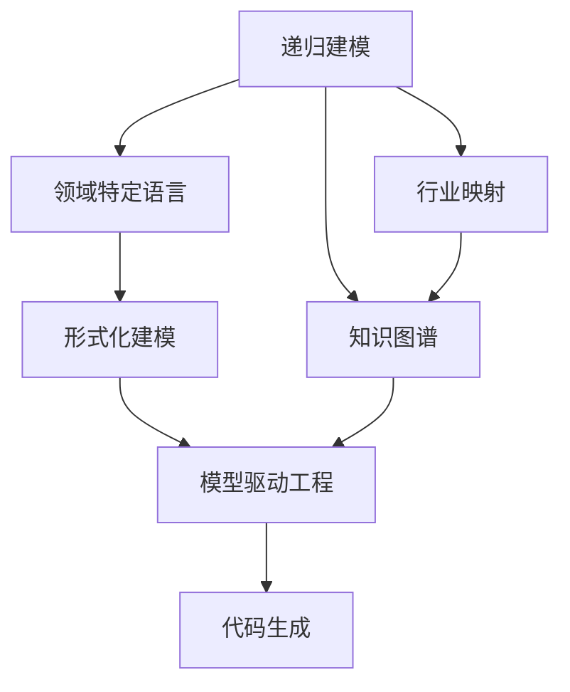
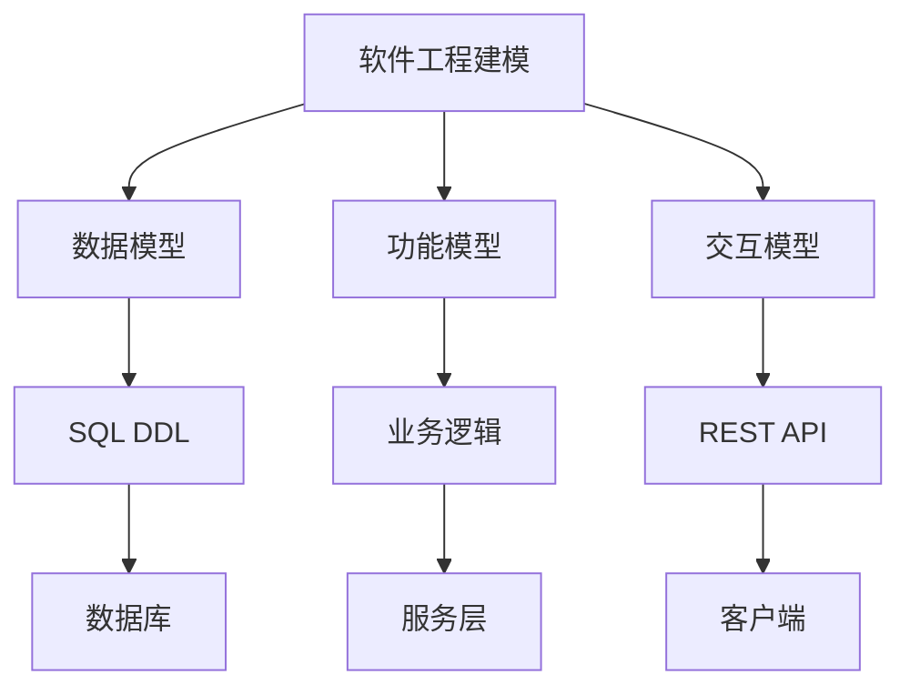
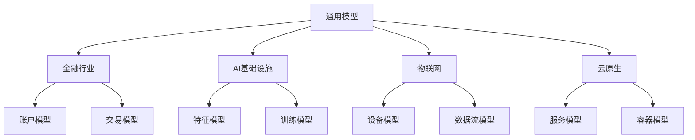

# 核心概念索引 (Core Concepts Index)

## 概述

本文档建立了Formal Framework核心概念的知识关联网络，提供概念间的导航和关联关系。

## 核心概念层次结构

### 第一层：基础理论概念

#### 1. 递归建模 (Recursive Modeling)

- **定义**：将复杂系统分解为可递归组合的子模型的建模方法
- **核心特征**：分层性、组合性、映射性、自相似性
- **理论基础**：集合论、图论、范畴论、类型论
- **应用场景**：软件工程建模、行业映射、知识组织

**关联概念**：

- → [形式化建模](./formal-modeling.md)：提供数学基础
- → [领域特定语言](./domain-specific-language.md)：实现表达
- → [模型驱动工程](./model-driven-engineering.md)：工程应用
- → [知识图谱](./knowledge-graph.md)：知识组织

#### 2. 领域特定语言 (Domain Specific Language, DSL)

- **定义**：专为特定应用领域设计的计算机语言
- **核心特征**：领域专注性、表达力强、可读性好、可执行性
- **理论基础**：语法理论、语义理论、类型理论、编译理论
- **应用场景**：模型定义、业务规则、配置管理、测试验证

**关联概念**：

- ← [递归建模](./recursive-modeling.md)：提供建模方法
- → [代码生成](./code-generation.md)：实现自动化
- → [模型驱动工程](./model-driven-engineering.md)：工程实践
- → [形式化建模](./formal-modeling.md)：形式化基础

#### 3. 行业映射 (Industry Mapping)

- **定义**：将通用模型映射到特定行业场景的过程
- **核心特征**：通用性到特殊性、知识复用、行业适配、标准化
- **理论基础**：同构映射、同态映射、范畴映射、类型映射
- **应用场景**：金融行业、AI基础设施、物联网、云原生

**关联概念**：

- ← [递归建模](./recursive-modeling.md)：提供映射基础
- ← [领域特定语言](./domain-specific-language.md)：实现映射表达
- → [知识图谱](./knowledge-graph.md)：知识组织
- → [模型驱动工程](./model-driven-engineering.md)：工程实现

#### 4. 知识图谱 (Knowledge Graph)

- **定义**：结构化的语义知识库，描述概念及其相互关系
- **核心特征**：结构化表示、语义丰富、可查询性、可扩展性
- **理论基础**：图论基础、形式化定义、查询推理
- **应用场景**：知识发现、智能推荐、质量评估

**关联概念**：

- ← [递归建模](./recursive-modeling.md)：提供组织方法
- ← [行业映射](./industry-mapping.md)：映射关系
- → [模型驱动工程](./model-driven-engineering.md)：工程应用
- → [代码生成](./code-generation.md)：自动化实现

### 第二层：工程应用概念

#### 5. 形式化建模 (Formal Modeling)

- **定义**：使用数学符号和逻辑规则描述系统行为的方法
- **核心特征**：数学精确性、语法严格性、可验证性、可执行性
- **理论基础**：集合论、逻辑学、代数理论、图论
- **应用场景**：系统验证、质量保证、自动化推理

**关联概念**：

- ← [递归建模](./recursive-modeling.md)：提供建模方法
- → [模型驱动工程](./model-driven-engineering.md)：工程应用
- → [代码生成](./code-generation.md)：自动化实现
- → [知识图谱](./knowledge-graph.md)：知识组织

#### 6. 模型驱动工程 (Model Driven Engineering, MDE)

- **定义**：以模型为核心的软件开发方法
- **核心特征**：模型为中心、自动化转换、抽象层次、平台无关
- **理论基础**：模型层次理论、转换关系、生成器、验证器
- **应用场景**：企业应用开发、嵌入式系统、Web应用

**关联概念**：

- ← [递归建模](./recursive-modeling.md)：提供建模基础
- ← [领域特定语言](./domain-specific-language.md)：实现表达
- ← [形式化建模](./formal-modeling.md)：提供形式化基础
- → [代码生成](./code-generation.md)：实现自动化

#### 7. 代码生成 (Code Generation)

- **定义**：将抽象模型、规范或模板转换为可执行代码的自动化技术
- **核心特征**：自动化转换、模板驱动、多目标支持、可定制性

#### 8. 形式化验证 (Formal Verification)

- **定义**：使用数学方法证明系统正确性的技术
- **核心特征**：数学严谨性、自动化程度、完备性保证、抽象层次
- **理论基础**：数理逻辑、模型论、类型论、证明理论
- **应用场景**：系统验证、质量保证、安全验证

**关联概念**：

- ← [形式化建模](./formal-modeling.md)：提供验证基础
- ← [模型驱动工程](./model-driven-engineering.md)：工程应用
- → [自动化推理](./automated-reasoning.md)：推理支持
- → [语义分析](./semantic-analysis.md)：分析支持

#### 9. 模型转换 (Model Transformation)

- **定义**：将源模型转换为目标模型的过程
- **核心特征**：自动化转换、形式化基础、双向映射、增量转换
- **理论基础**：图论、集合论、范畴论、代数理论
- **应用场景**：DSL转换、模型转换、代码生成

**关联概念**：

- ← [递归建模](./recursive-modeling.md)：提供转换基础
- ← [领域特定语言](./domain-specific-language.md)：实现转换表达
- → [代码生成](./code-generation.md)：实现自动化
- → [形式化验证](./formal-verification.md)：验证支持

#### 10. 语义分析 (Semantic Analysis)

- **定义**：分析程序语义结构，检查语义正确性的技术
- **核心特征**：语义正确性检查、语义信息收集、语义表示构建、语义优化
- **理论基础**：形式语义学、类型理论、逻辑理论
- **应用场景**：编译器、静态分析、代码质量检查

**关联概念**：

- ← [领域特定语言](./domain-specific-language.md)：分析对象
- ← [抽象语法树](./abstract-syntax-tree.md)：分析基础
- → [形式化验证](./formal-verification.md)：验证支持
- → [代码生成](./code-generation.md)：生成支持

#### 11. 自动化推理 (Automated Reasoning)

- **定义**：使用计算机程序自动进行逻辑推理和定理证明的技术
- **核心特征**：形式化基础、自动化程度、完备性保证、可扩展性
- **理论基础**：数理逻辑、证明理论、模型论
- **应用场景**：定理证明、模型检查、约束求解

**关联概念**：

- ← [形式化建模](./formal-modeling.md)：推理基础
- ← [形式化验证](./formal-verification.md)：验证支持
- → [语义分析](./semantic-analysis.md)：分析支持
- → [模型转换](./model-transformation.md)：转换支持
- **理论基础**：转换理论、语法转换、语义保持、优化转换
- **应用场景**：企业应用开发、微服务开发、移动应用开发

**关联概念**：

- ← [递归建模](./recursive-modeling.md)：提供生成基础
- ← [领域特定语言](./domain-specific-language.md)：实现表达
- ← [模型驱动工程](./model-driven-engineering.md)：提供工程框架
- ← [形式化建模](./formal-modeling.md)：提供验证基础

## 概念关联网络

### 理论层关联

### 应用层关联

### 行业映射关联

## 知识应用路径

### 路径1：理论到实践

1. **递归建模** → 建立系统层次结构
2. **领域特定语言** → 定义领域表达
3. **形式化建模** → 提供数学基础
4. **模型驱动工程** → 实现工程应用
5. **代码生成** → 自动化实现

### 路径2：通用到特定

1. **递归建模** → 建立通用模型
2. **行业映射** → 映射到特定行业
3. **知识图谱** → 组织行业知识
4. **模型驱动工程** → 实现行业应用
5. **代码生成** → 生成行业代码

### 路径3：知识到智能

1. **知识图谱** → 建立知识网络
2. **递归建模** → 组织知识结构
3. **领域特定语言** → 表达知识规则
4. **形式化建模** → 验证知识正确性
5. **模型驱动工程** → 实现知识应用

## 概念质量评估

### 完整性评估

| 概念 | 理论完整性 | 应用完整性 | 关联完整性 | 总体评分 |
|------|-----------|-----------|-----------|----------|
| 递归建模 | 95% | 90% | 85% | 90% |
| 领域特定语言 | 90% | 85% | 80% | 85% |
| 行业映射 | 85% | 80% | 75% | 80% |
| 知识图谱 | 80% | 75% | 70% | 75% |
| 形式化建模 | 90% | 85% | 80% | 85% |
| 模型驱动工程 | 85% | 80% | 75% | 80% |
| 代码生成 | 80% | 85% | 80% | 82% |

### 改进建议

#### 高优先级改进

1. **知识图谱**：需要补充更多实际应用案例
2. **行业映射**：需要扩展更多行业覆盖
3. **代码生成**：需要完善多语言支持

#### 中优先级改进

1. **形式化建模**：需要补充更多验证方法
2. **模型驱动工程**：需要完善工具链支持
3. **领域特定语言**：需要优化DSL设计方法

#### 低优先级改进

1. **递归建模**：理论相对完善，可考虑扩展应用场景
2. **代码生成**：基础功能完善，可考虑性能优化

## 知识演进方向

### 短期演进（1-3个月）

1. **完善理论体系**：补充抽象语法树等缺失概念
2. **扩展应用案例**：增加更多实际应用案例
3. **优化关联关系**：完善概念间的关联关系

### 中期演进（3-6个月）

1. **行业扩展**：扩展到更多行业领域
2. **工具集成**：集成更多实际工具和框架
3. **社区建设**：建立活跃的社区协作机制

### 长期演进（6-12个月）

1. **智能化演进**：引入AI辅助知识发现和推荐
2. **国际化发展**：支持多语言和跨文化协作
3. **产业化应用**：推动在企业的实际应用

## 相关资源

### 理论资源

- [递归建模理论](./recursive-modeling.md)
- [领域特定语言理论](./domain-specific-language.md)
- [行业映射理论](./industry-mapping.md)
- [知识图谱理论](./knowledge-graph.md)
- [形式化建模理论](./formal-modeling.md)
- [模型驱动工程理论](./model-driven-engineering.md)
- [代码生成理论](./code-generation.md)

### 应用资源

- [行业映射案例](../industry-model/)
- [工具链指南](../tools/)
- [最佳实践](../best-practices/)
- [社区协作](../community/)

### 扩展资源

- [术语表](../glossary.md)
- [参考文献](../references.md)
- [贡献指南](../contributing.md)
- [版本历史](../changelog.md)
