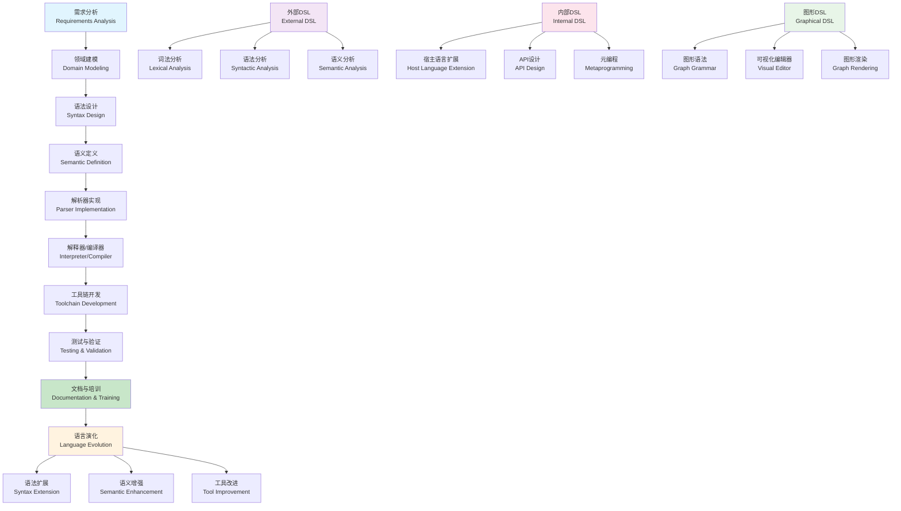

# 领域特定语言 (Domain-Specific Language)

**本节要点**：（1）DSL 的概念、语言理论与设计/实现流程；（2）分类体系、设计原则与国际标准/课程对标；（3）工程实践与相关概念。  
**预计阅读时间**：约 45–55 分钟；建议分 2–4 次阅读，每次 1–2 节。

## 目录（Table of Contents）

- [领域特定语言 (Domain-Specific Language)](#领域特定语言-domain-specific-language)
  - [目录（Table of Contents）](#目录table-of-contents)
  - [概念定义](#概念定义)
    - [核心特征](#核心特征)
  - [理论基础](#理论基础)
    - [语言理论](#语言理论)
    - [DSL设计与实现流程](#dsl设计与实现流程)
    - [分类体系](#分类体系)
      - [按实现方式分类](#按实现方式分类)
      - [按应用领域分类](#按应用领域分类)
  - [设计原则](#设计原则)
    - [语言设计原则](#语言设计原则)
    - [工具设计原则](#工具设计原则)
  - [国际标准对标](#国际标准对标)
    - [语言标准](#语言标准)
      - [SQL (Structured Query Language)](#sql-structured-query-language)
      - [GraphQL](#graphql)
      - [YAML (YAML Ain't Markup Language)](#yaml-yaml-aint-markup-language)
    - [建模标准](#建模标准)
      - [UML (Unified Modeling Language)](#uml-unified-modeling-language)
      - [BPMN (Business Process Model and Notation)](#bpmn-business-process-model-and-notation)
      - [SysML (Systems Modeling Language)](#sysml-systems-modeling-language)
  - [著名大学课程对标](#著名大学课程对标)
    - [编程语言课程](#编程语言课程)
      - [MIT 6.035 - Computer Language Engineering](#mit-6035---computer-language-engineering)
      - [Stanford CS242 - Programming Languages](#stanford-cs242---programming-languages)
      - [CMU 15-312 - Foundations of Programming Languages](#cmu-15-312---foundations-of-programming-languages)
    - [软件工程课程](#软件工程课程)
      - [MIT 6.170 - Software Studio](#mit-6170---software-studio)
      - [Stanford CS210 - Software Engineering](#stanford-cs210---software-engineering)
  - [工程实践](#工程实践)
    - [DSL设计模式](#dsl设计模式)
      - [声明式DSL模式](#声明式dsl模式)
      - [命令式DSL模式](#命令式dsl模式)
      - [图形DSL模式](#图形dsl模式)
    - [工具链实现](#工具链实现)
      - [解析器生成](#解析器生成)
      - [代码生成](#代码生成)
      - [编辑器支持](#编辑器支持)
  - [最佳实践](#最佳实践)
    - [设计最佳实践](#设计最佳实践)
    - [实现最佳实践](#实现最佳实践)
    - [工具链最佳实践](#工具链最佳实践)
  - [应用案例](#应用案例)
    - [配置管理DSL](#配置管理dsl)
    - [测试DSL](#测试dsl)
    - [部署DSL](#部署dsl)
  - [相关概念](#相关概念)
    - [核心概念关联](#核心概念关联)
    - [应用领域关联](#应用领域关联)
    - [行业应用关联](#行业应用关联)
  - [参考文献](#参考文献)

## 概念定义

领域特定语言(Domain-Specific Language, DSL)是一种专门为特定问题域设计的编程语言，具有针对该领域的语法、语义和工具支持。DSL通过提供领域专家熟悉的抽象和概念，提高开发效率和代码可读性。

### 核心特征

1. **领域专注性**：专门针对特定问题域设计
2. **表达力强**：提供领域专家熟悉的抽象
3. **简洁性**：相比通用语言更简洁易读
4. **工具支持**：提供专门的编辑器、调试器和分析工具
5. **可扩展性**：支持领域概念的自然扩展

## 理论基础

理论深化与形式化展开见 [领域特定语言理论](../theory-enhancement/domain-specific-language-theory.md)；与 L2/L3 各 model theory/dsl-draft 的对应见该理论文档。

### 语言理论

DSL基于形式语言理论，可形式化为：

```text
DSL = (Σ, Γ, R, I, T)
```

其中：

- Σ：词汇表（Terminal Symbols）
- Γ：语法规则（Grammar Rules）
- R：语义规则（Semantic Rules）
- I：解释器（Interpreter）
- T：工具链（Toolchain）

### DSL设计与实现流程



### 分类体系

#### 按实现方式分类

1. **外部DSL**：独立的语言，有自己的语法和解析器
   - 示例：SQL、正则表达式、YAML配置
   - 工具：ANTLR、Xtext、Tree-sitter

2. **内部DSL**：嵌入在宿主语言中的DSL
   - 示例：RSpec、Cucumber、Spring DSL
   - 工具：宿主语言的元编程能力

3. **图形DSL**：基于图形的DSL
   - 示例：UML、BPMN、流程图
   - 工具：Graphviz、D3.js、专业建模工具

#### 按应用领域分类

1. **数据建模DSL**：SQL、GraphQL、Prisma Schema
2. **配置DSL**：YAML、TOML、HCL
3. **测试DSL**：Cucumber、RSpec、Jest
4. **部署DSL**：Dockerfile、Kubernetes YAML、Terraform
5. **业务规则DSL**：Drools、DMN、决策表

## 设计原则

### 语言设计原则

1. **最小惊讶原则**：语法和语义应该符合用户期望
2. **一致性原则**：相似概念使用相似的语法
3. **可读性优先**：优先考虑可读性而非简洁性
4. **渐进式复杂性**：从简单到复杂的渐进式学习曲线

### 工具设计原则

1. **即时反馈**：提供实时的语法检查和错误提示
2. **智能补全**：基于上下文提供智能代码补全
3. **可视化支持**：提供图形化的编辑和查看工具
4. **调试支持**：提供专门的调试和测试工具

## 国际标准对标

### 语言标准

#### SQL (Structured Query Language)

- **标准**：ISO/IEC 9075 (SQL:2016)
- **类型**：声明式数据查询语言
- **核心概念**：SELECT、FROM、WHERE、JOIN
- **工具支持**：各种数据库管理系统

#### GraphQL

- **标准**：GraphQL Specification (2021)
- **类型**：查询语言和运行时
- **核心概念**：Schema、Query、Mutation、Subscription
- **工具支持**：Apollo、Relay、GraphQL Playground

#### YAML (YAML Ain't Markup Language)

- **标准**：YAML 1.2 Specification
- **类型**：数据序列化语言
- **核心概念**：Mapping、Sequence、Scalar、Anchor
- **工具支持**：各种编程语言的YAML库

### 建模标准

#### UML (Unified Modeling Language)

- **标准**：OMG UML 2.5
- **类型**：图形化建模语言
- **核心概念**：Class、Use Case、Sequence、Activity
- **工具支持**：Enterprise Architect、Visual Paradigm、Lucidchart

#### BPMN (Business Process Model and Notation)

- **标准**：OMG BPMN 2.0
- **类型**：业务流程建模语言
- **核心概念**：Process、Activity、Gateway、Event
- **工具支持**：Camunda、Activiti、jBPM

#### SysML (Systems Modeling Language)

- **标准**：OMG SysML 1.6
- **类型**：系统建模语言
- **核心概念**：Block、Requirement、Activity、State
- **工具支持**：Enterprise Architect、MagicDraw、Rhapsody

## 著名大学课程对标

### 编程语言课程

#### MIT 6.035 - Computer Language Engineering

- **课程内容**：编译器设计、语言实现、DSL设计
- **DSL相关**：语法分析、语义分析、代码生成
- **实践项目**：DSL编译器实现
- **相关技术**：ANTLR、LLVM、编译器前端

#### Stanford CS242 - Programming Languages

- **课程内容**：编程语言理论、类型系统、语言设计
- **DSL相关**：语言抽象、类型安全、语义定义
- **实践项目**：领域特定语言设计
- **相关技术**：Haskell、OCaml、类型理论

#### CMU 15-312 - Foundations of Programming Languages

- **课程内容**：编程语言基础、λ演算、类型理论
- **DSL相关**：形式语义、类型系统、语言抽象
- **实践项目**：函数式DSL实现
- **相关技术**：Coq、Agda、证明助手

### 软件工程课程

#### MIT 6.170 - Software Studio

- **课程内容**：软件设计、架构、开发方法
- **DSL相关**：模型驱动开发、代码生成、工具链
- **实践项目**：DSL工具链开发
- **相关技术**：Xtext、Eclipse Modeling、代码生成

#### Stanford CS210 - Software Engineering

- **课程内容**：软件工程原理、开发方法、工具
- **DSL相关**：领域建模、抽象设计、工具支持
- **实践项目**：领域特定工具开发
- **相关技术**：Spring DSL、Ruby DSL、元编程

## 工程实践

### DSL设计模式

#### 声明式DSL模式

```yaml
# 声明式DSL示例 - 配置DSL
database_config:
  type: "postgresql"
  host: "localhost"
  port: 5432
  database: "myapp"
  username: "user"
  password: "password"
  
  connection_pool:
    min_size: 5
    max_size: 20
    timeout: 30s
    
  migrations:
    enabled: true
    directory: "db/migrations"
    table: "schema_migrations"
```

#### 命令式DSL模式

```ruby
# 命令式DSL示例 - 测试DSL
describe User do
  context "when creating a new user" do
    it "should validate email format" do
      user = User.new(email: "invalid-email")
      expect(user).not_to be_valid
      expect(user.errors[:email]).to include("is invalid")
    end
    
    it "should require password" do
      user = User.new(email: "test@example.com")
      expect(user).not_to be_valid
      expect(user.errors[:password]).to include("can't be blank")
    end
  end
end
```

#### 图形DSL模式

```mermaid
# 图形DSL示例 - 流程图
graph TD
    A[开始] --> B{条件判断}
    B -->|条件1| C[处理1]
    B -->|条件2| D[处理2]
    C --> E[结束]
    D --> E
```

### 工具链实现

#### 解析器生成

```yaml
# ANTLR语法定义示例
grammar ConfigDSL;

config: section+;
section: IDENTIFIER '{' property* '}';
property: IDENTIFIER ':' value ';';
value: STRING | NUMBER | BOOLEAN | object;
object: '{' property* '}';

IDENTIFIER: [a-zA-Z_][a-zA-Z0-9_]*;
STRING: '"' .*? '"';
NUMBER: [0-9]+ ('.' [0-9]+)?;
BOOLEAN: 'true' | 'false';
WS: [ \t\r\n]+ -> skip;
```

#### 代码生成

```java
// 代码生成器示例
public class DSLCodeGenerator {
    public String generateCode(ASTNode ast) {
        StringBuilder code = new StringBuilder();
        
        if (ast instanceof ConfigNode) {
            ConfigNode config = (ConfigNode) ast;
            code.append("public class GeneratedConfig {\n");
            
            for (SectionNode section : config.getSections()) {
                code.append(generateSection(section));
            }
            
            code.append("}\n");
        }
        
        return code.toString();
    }
    
    private String generateSection(SectionNode section) {
        StringBuilder code = new StringBuilder();
        code.append("    public static class ").append(section.getName()).append(" {\n");
        
        for (PropertyNode property : section.getProperties()) {
            code.append("        public static final ")
                .append(getJavaType(property.getType()))
                .append(" ")
                .append(property.getName())
                .append(" = ")
                .append(property.getValue())
                .append(";\n");
        }
        
        code.append("    }\n");
        return code.toString();
    }
}
```

#### 编辑器支持

```typescript
// VS Code扩展示例
export class DSLCompletionProvider implements vscode.CompletionItemProvider {
    provideCompletionItems(
        document: vscode.TextDocument,
        position: vscode.Position
    ): vscode.CompletionItem[] {
        const items: vscode.CompletionItem[] = [];
        
        // 基于上下文提供补全
        const context = this.getContext(document, position);
        
        if (context.isInSection) {
            items.push(
                new vscode.CompletionItem('type', vscode.CompletionItemKind.Keyword),
                new vscode.CompletionItem('host', vscode.CompletionItemKind.Keyword),
                new vscode.CompletionItem('port', vscode.CompletionItemKind.Keyword)
            );
        } else {
            items.push(
                new vscode.CompletionItem('database_config', vscode.CompletionItemKind.Class),
                new vscode.CompletionItem('api_config', vscode.CompletionItemKind.Class),
                new vscode.CompletionItem('logging_config', vscode.CompletionItemKind.Class)
            );
        }
        
        return items;
    }
}
```

## 最佳实践

### 设计最佳实践

1. **领域专家参与**：让领域专家参与DSL设计
2. **渐进式设计**：从简单开始，逐步增加复杂性
3. **工具优先**：优先考虑工具支持而非语言特性
4. **文档完善**：提供详细的文档和示例

### 实现最佳实践

1. **模块化设计**：将DSL分解为可组合的模块
2. **错误处理**：提供清晰的错误信息和修复建议
3. **性能考虑**：考虑解析和执行的性能影响
4. **版本管理**：设计向后兼容的版本管理策略

### 工具链最佳实践

1. **集成开发环境**：提供完整的IDE支持
2. **调试支持**：提供专门的调试工具
3. **测试框架**：提供DSL的测试框架
4. **文档生成**：自动生成API文档和示例

## 应用案例

### 配置管理DSL

```yaml
# 应用配置DSL
application:
  name: "MyApp"
  version: "1.0.0"
  
  server:
    port: 8080
    host: "0.0.0.0"
    
  database:
    type: "postgresql"
    url: "postgresql://localhost/myapp"
    
  logging:
    level: "INFO"
    format: "json"
    output: "stdout"
    
  features:
    cache:
      enabled: true
      type: "redis"
      ttl: 3600
      
    monitoring:
      enabled: true
      metrics: ["cpu", "memory", "requests"]
```

### 测试DSL

```gherkin
# 行为驱动测试DSL
Feature: User Registration
  As a user
  I want to register for an account
  So that I can access the application

  Scenario: Successful registration with valid data
    Given I am on the registration page
    When I fill in "Email" with "test@example.com"
    And I fill in "Password" with "password123"
    And I fill in "Confirm Password" with "password123"
    And I click "Register"
    Then I should see "Registration successful"
    And I should be logged in
    And a confirmation email should be sent

  Scenario: Registration fails with invalid email
    Given I am on the registration page
    When I fill in "Email" with "invalid-email"
    And I fill in "Password" with "password123"
    And I click "Register"
    Then I should see "Invalid email format"
    And I should not be logged in
```

### 部署DSL

```yaml
# Kubernetes部署DSL
apiVersion: apps/v1
kind: Deployment
metadata:
  name: myapp
  labels:
    app: myapp
spec:
  replicas: 3
  selector:
    matchLabels:
      app: myapp
  template:
    metadata:
      labels:
        app: myapp
    spec:
      containers:
      - name: myapp
        image: myapp:1.0.0
        ports:
        - containerPort: 8080
        env:
        - name: DATABASE_URL
          valueFrom:
            secretKeyRef:
              name: db-secret
              key: url
        resources:
          requests:
            memory: "64Mi"
            cpu: "250m"
          limits:
            memory: "128Mi"
            cpu: "500m"
```

## 相关概念

### 核心概念关联

- [领域特定语言理论](../theory-enhancement/domain-specific-language-theory.md) - 本概念的形式化理论与深化
- [抽象语法树](./abstract-syntax-tree.md) - AST为DSL解析提供程序结构信息
- [代码生成](./code-generation.md) - 代码生成与DSL相结合实现从DSL到代码的转换
- [模型转换](./model-transformation.md) - 模型转换用于DSL的模型处理和转换
- [形式化建模](./formal-modeling.md) - 形式化建模为DSL提供理论基础
- [自动推理](./automated-reasoning.md) - 自动推理用于DSL的智能处理
- [递归建模](./recursive-modeling.md) - 递归建模支持DSL的复杂结构处理

### 应用领域关联

- [数据建模](../data-model/theory.md) - 数据模型DSL和数据库代码生成
- [功能建模](../functional-model/theory.md) - 功能模型DSL和业务逻辑生成
- [交互建模](../interaction-model/theory.md) - 交互模型DSL和接口代码生成
- [运行时建模](../runtime-model/theory.md) - 运行时模型DSL和配置生成

### 行业应用关联

- [金融架构](../../industry-model/finance-architecture/) - 金融业务DSL和交易系统生成
- [AI基础设施](../../industry-model/ai-infrastructure-architecture/) - AI模型DSL和推理代码生成
- [云原生架构](../../industry-model/cloud-native-architecture/) - 云配置DSL和部署代码生成

## 参考文献

1. Fowler, M. (2010). "Domain-Specific Languages"
2. Parr, T. (2013). "Language Implementation Patterns"
3. Kleppe, A. (2003). "MDA Explained: The Model Driven Architecture"
4. Voelter, M., et al. (2013). "DSL Engineering: Designing, Implementing and Using Domain-Specific Languages"
5. Spinellis, D. (2001). "Notable Design Patterns for Domain-Specific Languages"
6. Mernik, M., et al. (2005). "When and How to Develop Domain-Specific Languages"
