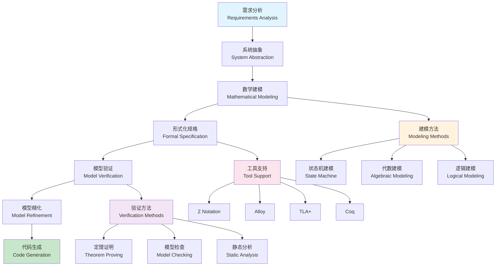

# 形式化建模 (Formal Modeling)

## 目录（Table of Contents）

- [形式化建模 (Formal Modeling)](#形式化建模-formal-modeling)
  - [目录（Table of Contents）](#目录table-of-contents)
  - [概念定义](#概念定义)
    - [核心特征](#核心特征)
  - [理论基础](#理论基础)
    - [数学基础](#数学基础)
    - [形式化建模流程](#形式化建模流程)
    - [形式化定义](#形式化定义)
  - [建模方法](#建模方法)
    - [状态机建模](#状态机建模)
    - [代数建模](#代数建模)
    - [逻辑建模](#逻辑建模)
  - [在Formal Framework中的应用](#在formal-framework中的应用)
    - [数据模型形式化](#数据模型形式化)
    - [业务逻辑形式化](#业务逻辑形式化)
    - [系统行为形式化](#系统行为形式化)
  - [验证方法](#验证方法)
    - [模型检查](#模型检查)
    - [定理证明](#定理证明)
    - [静态分析](#静态分析)
  - [工具和技术](#工具和技术)
    - [形式化语言](#形式化语言)
    - [验证工具](#验证工具)
    - [集成环境](#集成环境)
  - [最佳实践](#最佳实践)
    - [建模原则](#建模原则)
    - [验证策略](#验证策略)
    - [工具选择](#工具选择)
  - [应用案例](#应用案例)
    - [金融系统验证](#金融系统验证)
    - [安全协议验证](#安全协议验证)
  - [评估标准](#评估标准)
    - [质量指标](#质量指标)
    - [成功标准](#成功标准)
  - [相关概念](#相关概念)
    - [核心概念关联](#核心概念关联)
    - [应用领域关联](#应用领域关联)
    - [行业应用关联](#行业应用关联)
  - [参考文献](#参考文献)

## 概念定义

形式化建模是一种使用数学符号和逻辑规则来描述系统行为的方法，通过精确的语法和语义定义，实现系统行为的严格规范和验证。

### 核心特征

1. **数学精确性**：使用数学符号和逻辑规则进行精确描述
2. **语法严格性**：具有严格的语法规则和语义定义
3. **可验证性**：支持形式化验证和证明
4. **可执行性**：能够转换为可执行的代码或配置

## 理论基础

### 数学基础

形式化建模基于以下数学理论：

- **集合论**：用于描述对象集合和关系
- **逻辑学**：用于描述推理规则和约束条件
- **代数理论**：用于描述操作和变换
- **图论**：用于描述结构和关系

### 形式化建模流程



### 形式化定义

设 S 为系统，F 为形式化模型，则形式化建模可形式化为：

```text
F = (Σ, Γ, R, I)
```

其中：

- Σ 为符号集合（词汇表）
- Γ 为语法规则集合
- R 为推理规则集合
- I 为解释函数

## 建模方法

### 状态机建模

使用有限状态机描述系统行为：

```yaml
# 状态机模型示例
state_machine: OrderProcess
states:
  - pending
  - confirmed
  - shipped
  - delivered
  - cancelled

transitions:
  - from: pending
    to: confirmed
    trigger: confirm_order
    condition: payment_received
    
  - from: confirmed
    to: shipped
    trigger: ship_order
    condition: inventory_available
    
  - from: shipped
    to: delivered
    trigger: deliver_order
    condition: delivery_completed
```

### 代数建模

使用代数结构描述系统操作：

```yaml
# 代数模型示例
algebra: UserManagement
operations:
  - name: create_user
    signature: (UserInfo) → User
    preconditions:
      - email_not_exists
      - valid_email_format
    postconditions:
      - user_created
      - user_id_assigned
      
  - name: update_user
    signature: (User, UserInfo) → User
    preconditions:
      - user_exists
      - user_accessible
    postconditions:
      - user_updated
      - changes_logged
```

### 逻辑建模

使用逻辑公式描述系统约束：

```yaml
# 逻辑模型示例
logic: BusinessRules
axioms:
  - name: account_balance_non_negative
    formula: "∀a ∈ Account : balance(a) ≥ 0"
    
  - name: transaction_amount_positive
    formula: "∀t ∈ Transaction : amount(t) > 0"
    
  - name: user_email_unique
    formula: "∀u1,u2 ∈ User : u1 ≠ u2 → email(u1) ≠ email(u2)"

theorems:
  - name: transaction_balance_preservation
    formula: "∀t ∈ Transaction : balance(before(t)) + amount(t) = balance(after(t))"
    proof: "通过交易规则和余额更新逻辑证明"
```

## 在Formal Framework中的应用

### 数据模型形式化

```yaml
# 数据模型形式化示例
formal_data_model:
  entities:
    - name: User
      attributes:
        - id: string
          constraint: "unique ∧ not_null"
        - email: string
          constraint: "email_format ∧ unique"
        - name: string
          constraint: "not_null ∧ length > 0"
      relationships:
        - target: Order
          type: "one_to_many"
          constraint: "cascade_delete"
          
  constraints:
    - name: user_email_domain
      formula: "∀u ∈ User : email(u) ∈ EmailDomain"
      
    - name: user_order_consistency
      formula: "∀o ∈ Order : ∃u ∈ User : user(o) = u"
```

### 业务逻辑形式化

```yaml
# 业务逻辑形式化示例
formal_business_logic:
  rules:
    - name: order_validation
      condition: "order.total_amount > 0 ∧ order.items ≠ ∅"
      action: "validate_order"
      
    - name: payment_processing
      condition: "payment.amount > 0 ∧ payment.method ∈ ValidMethods"
      action: "process_payment"
      
    - name: inventory_check
      condition: "∀item ∈ order.items : inventory.available(item) ≥ item.quantity"
      action: "reserve_inventory"
```

### 系统行为形式化

```yaml
# 系统行为形式化示例
formal_system_behavior:
  processes:
    - name: order_fulfillment
      steps:
        - step: validate_order
          precondition: "order.status = 'pending'"
          postcondition: "order.status = 'validated'"
          
        - step: process_payment
          precondition: "order.status = 'validated'"
          postcondition: "payment.status = 'processed'"
          
        - step: ship_order
          precondition: "payment.status = 'processed'"
          postcondition: "order.status = 'shipped'"
```

## 验证方法

### 模型检查

使用模型检查器验证系统属性：

```yaml
# 模型检查示例
model_checking:
  properties:
    - name: deadlock_freedom
      formula: "AG(EF(progress))"
      description: "系统永远不会进入死锁状态"
      
    - name: liveness
      formula: "AG(request → AF(response))"
      description: "每个请求最终都会得到响应"
      
    - name: safety
      formula: "AG(¬(error_state))"
      description: "系统永远不会进入错误状态"
```

### 定理证明

使用定理证明器验证系统正确性：

```yaml
# 定理证明示例
theorem_proving:
  theorems:
    - name: transaction_atomicity
      statement: "∀t ∈ Transaction : atomic(t)"
      proof: "通过事务日志和回滚机制证明"
      
    - name: data_consistency
      statement: "∀d ∈ Database : consistent(d)"
      proof: "通过约束检查和事务隔离证明"
      
    - name: system_reliability
      statement: "∀s ∈ System : reliable(s)"
      proof: "通过冗余和故障恢复机制证明"
```

### 静态分析

使用静态分析工具检查代码正确性：

```yaml
# 静态分析示例
static_analysis:
  checks:
    - name: type_safety
      description: "检查类型安全"
      tools: ["TypeScript", "Flow", "Haskell"]
      
    - name: null_safety
      description: "检查空指针安全"
      tools: ["Kotlin", "Swift", "Rust"]
      
    - name: memory_safety
      description: "检查内存安全"
      tools: ["Rust", "Ada", "SPARK"]
```

## 工具和技术

### 形式化语言

1. **Z语言**：基于集合论和谓词逻辑的形式化语言
2. **B方法**：用于软件开发的数学方法
3. **VDM**：维也纳开发方法
4. **Alloy**：基于关系代数的形式化语言

### 验证工具

1. **模型检查器**：SPIN、NuSMV、UPPAAL
2. **定理证明器**：Coq、Isabelle、PVS
3. **静态分析器**：Frama-C、CBMC、SMACK
4. **SMT求解器**：Z3、CVC4、Yices

### 集成环境

1. **Rodin**：B方法的集成开发环境
2. **Atelier B**：B方法的商业工具
3. **VDM Toolbox**：VDM的集成环境
4. **Alloy Analyzer**：Alloy的分析工具

## 最佳实践

### 建模原则

1. **抽象性**：关注系统的核心行为，忽略实现细节
2. **精确性**：使用精确的数学符号和逻辑规则
3. **简洁性**：保持模型的简洁和可理解性
4. **可验证性**：设计可验证的模型和属性

### 验证策略

1. **分层验证**：从简单到复杂的分层验证策略
2. **增量验证**：逐步增加验证的复杂性和覆盖范围
3. **自动化验证**：尽可能使用自动化验证工具
4. **人工验证**：对关键部分进行人工验证和评审

### 工具选择

1. **语言匹配**：选择与问题域匹配的形式化语言
2. **工具成熟度**：选择成熟稳定的验证工具
3. **社区支持**：选择有活跃社区支持的工具
4. **学习成本**：考虑团队的学习成本和培训需求

## 应用案例

### 金融系统验证

```yaml
# 金融系统形式化验证
financial_verification:
  properties:
    - name: transaction_atomicity
      description: "交易要么完全成功，要么完全失败"
      verification: "通过事务日志和回滚机制验证"
      
    - name: balance_consistency
      description: "账户余额始终为非负数"
      verification: "通过约束检查和余额更新逻辑验证"
      
    - name: audit_trail_completeness
      description: "所有操作都有完整的审计记录"
      verification: "通过日志记录和审计机制验证"
```

### 安全协议验证

```yaml
# 安全协议形式化验证
security_verification:
  properties:
    - name: authentication_correctness
      description: "只有合法用户能够通过认证"
      verification: "通过密码学和认证协议验证"
      
    - name: authorization_safety
      description: "用户只能访问授权的资源"
      verification: "通过访问控制矩阵和权限检查验证"
      
    - name: confidentiality_preservation
      description: "敏感信息不会被泄露"
      verification: "通过加密和访问控制验证"
```

## 评估标准

### 质量指标

- **完整性**：模型覆盖系统行为的程度
- **正确性**：模型与系统实际行为的一致性
- **可验证性**：模型支持验证和证明的程度
- **可理解性**：模型的可读性和可维护性

### 成功标准

1. **形式化覆盖**：关键系统行为都有形式化模型
2. **验证通过**：所有关键属性都通过形式化验证
3. **缺陷发现**：通过形式化验证发现并修复缺陷
4. **质量提升**：系统质量因形式化建模而显著提升

## 相关概念

### 核心概念关联

- [递归建模](./recursive-modeling.md) - 递归建模是形式化建模的重要方法
- [领域特定语言](./domain-specific-language.md) - DSL为形式化建模提供领域特定表达
- [模型驱动工程](./model-driven-engineering.md) - MDE基于形式化建模实现自动化
- [形式化验证](./formal-verification.md) - 形式化验证基于形式化建模进行系统验证
- [抽象语法树](./abstract-syntax-tree.md) - AST为形式化建模提供结构化表示
- [自动推理](./automated-reasoning.md) - 自动推理用于形式化建模的自动化处理

### 应用领域关联

- [数据建模](../data-model/theory.md) - 数据模型的形式化建模和验证
- [功能建模](../functional-model/theory.md) - 业务逻辑的形式化建模和验证
- [交互建模](../interaction-model/theory.md) - 接口协议的形式化建模和验证
- [运行时建模](../runtime-model/theory.md) - 运行时行为的形式化建模和验证

### 行业应用关联

- [金融架构](../../industry-model/finance-architecture/) - 金融业务规则的形式化建模和合规验证
- [AI基础设施](../../industry-model/ai-infrastructure-architecture/) - AI模型的形式化建模和性能验证
- [云原生架构](../../industry-model/cloud-native-architecture/) - 云服务的形式化建模和可靠性验证

## 参考文献

1. Abrial, J. R. (2010). "Modeling in Event-B: System and Software Engineering"
2. Bjørner, D., & Havelund, K. (2014). "40 Years of Formal Methods"
3. Clarke, E. M., et al. (2018). "Model Checking"
4. Jackson, D. (2012). "Software Abstractions: Logic, Language, and Analysis"
