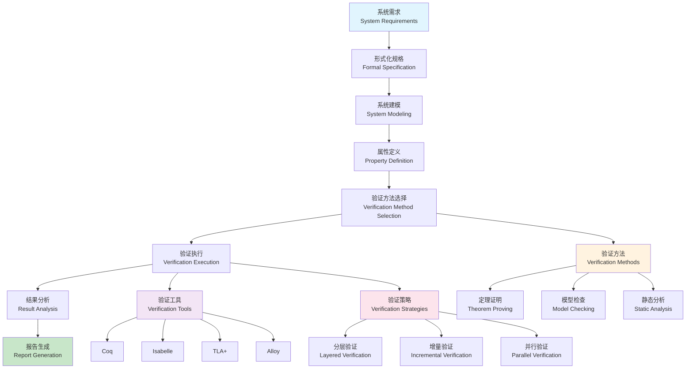

# 形式化验证理论与技术 (Formal Verification Theory and Technology)

**本节要点**：（1）形式化验证的概念、理论与流程（含 Z Notation 集成框架）；（2）核心组件与多线程并行验证；（3）工程实践、应用案例与相关概念。  
**预计阅读时间**：约 45–55 分钟；建议分 2–4 次阅读，每次 1–2 节。

## 目录（Table of Contents）

- [形式化验证理论与技术 (Formal Verification Theory and Technology)](#形式化验证理论与技术-formal-verification-theory-and-technology)
  - [目录（Table of Contents）](#目录table-of-contents)
  - [概念定义](#概念定义)
    - [核心特征](#核心特征)
  - [理论基础](#理论基础)
    - [形式化验证理论](#形式化验证理论)
    - [形式化验证流程](#形式化验证流程)
    - [Z Notation集成框架](#z-notation集成框架)
    - [多线程验证架构](#多线程验证架构)
  - [核心组件](#核心组件)
    - [Z Notation解析器](#z-notation解析器)
    - [Z模型生成器](#z模型生成器)
    - [Z证明助手](#z证明助手)
  - [多线程并行验证](#多线程并行验证)
    - [并行证明策略](#并行证明策略)
    - [线程管理](#线程管理)
  - [工程实践](#工程实践)
    - [多线程验证框架设计](#多线程验证框架设计)
    - [性能优化策略](#性能优化策略)
  - [应用案例](#应用案例)
    - [并发系统验证](#并发系统验证)
    - [分布式系统验证](#分布式系统验证)
  - [相关概念](#相关概念)
    - [核心概念关联](#核心概念关联)
    - [应用领域关联](#应用领域关联)
    - [行业应用关联](#行业应用关联)
  - [参考文献](#参考文献)

## 概念定义

形式化验证是一种使用数学方法证明软件系统正确性的技术。它通过形式化规格说明、定理证明、模型检查等方法，确保系统满足其规格说明的要求。

### 核心特征

1. **数学严谨性**：基于严格的数学理论
2. **自动化程度高**：支持自动化验证工具
3. **完整性保证**：能够证明系统的完整正确性
4. **可重用性**：验证结果可以重用
5. **标准化**：支持国际标准的形式化方法

## 理论基础

理论深化与形式化展开见 [形式化验证理论](../theory-enhancement/formal-verification-theory.md)；与 L2/L3 的衔接见该理论文档及 [AUTHORITY_ALIGNMENT_INDEX](../../reference/AUTHORITY_ALIGNMENT_INDEX.md) 中 IEEE 1012 对标。

### 形式化验证理论

形式化验证基于以下理论：

```text
FormalVerification = (Specification, Model, Proof, Verification)
```

其中：

- Specification：形式化规格说明
- Model：系统模型
- Proof：证明过程
- Verification：验证结果

### 形式化验证流程



### Z Notation集成框架

```yaml
# Z Notation集成框架
z_notation_integration:
  description: "Z Notation形式化规格语言集成"
  components:
    - name: "z_specification_parser"
      description: "Z规格说明解析器"
      features:
        - "Z语言语法解析"
        - "类型检查"
        - "语义分析"
        - "错误报告"
      
    - name: "z_model_generator"
      description: "Z模型生成器"
      features:
        - "抽象状态生成"
        - "操作定义生成"
        - "不变式生成"
        - "前置条件生成"
      
    - name: "z_proof_assistant"
      description: "Z证明助手"
      features:
        - "定理证明"
        - "证明策略"
        - "反例生成"
        - "证明验证"
      
    - name: "z_code_generator"
      description: "Z代码生成器"
      features:
        - "Java代码生成"
        - "Python代码生成"
        - "C++代码生成"
        - "测试代码生成"
```

### 多线程验证架构

```yaml
# 多线程验证架构
multi_threaded_verification:
  description: "支持多线程并行的验证架构"
  architecture:
    - name: "verification_orchestrator"
      description: "验证编排器"
      features:
        - "任务分解"
        - "线程管理"
        - "负载均衡"
        - "结果聚合"
      
    - name: "parallel_prover"
      description: "并行证明器"
      features:
        - "多线程证明"
        - "证明策略并行化"
        - "资源管理"
        - "性能监控"
      
    - name: "distributed_verification"
      description: "分布式验证"
      features:
        - "集群验证"
        - "任务分发"
        - "结果同步"
        - "故障恢复"
```

## 核心组件

### Z Notation解析器

```yaml
# Z Notation解析器
z_parser:
  description: "Z语言解析器实现"
  components:
    - name: "lexical_analyzer"
      description: "词法分析器"
      implementation:
        - "Z语言词法规则"
        - "Token识别"
        - "错误处理"
        - "位置跟踪"
      
    - name: "syntax_analyzer"
      description: "语法分析器"
      implementation:
        - "Z语言语法规则"
        - "抽象语法树构建"
        - "语法错误检测"
        - "错误恢复"
      
    - name: "semantic_analyzer"
      description: "语义分析器"
      implementation:
        - "类型检查"
        - "作用域分析"
        - "引用检查"
        - "语义错误检测"
```

### Z模型生成器

```yaml
# Z模型生成器
z_model_generator:
  description: "从Z规格说明生成系统模型"
  generation_process:
    - name: "state_schema_generation"
      description: "状态模式生成"
      process:
        - "分析状态变量"
        - "生成状态结构"
        - "定义不变式"
        - "验证状态一致性"
      
    - name: "operation_schema_generation"
      description: "操作模式生成"
      process:
        - "分析操作定义"
        - "生成前置条件"
        - "生成后置条件"
        - "验证操作正确性"
      
    - name: "invariant_generation"
      description: "不变式生成"
      process:
        - "分析系统约束"
        - "生成不变式"
        - "验证不变式"
        - "优化不变式"
```

### Z证明助手

```yaml
# Z证明助手
z_proof_assistant:
  description: "辅助Z规格说明的证明过程"
  proof_methods:
    - name: "theorem_proving"
      description: "定理证明"
      methods:
        - "自然演绎"
        - "归结证明"
        - "归纳证明"
        - "反证法"
      
    - name: "model_checking"
      description: "模型检查"
      methods:
        - "状态空间搜索"
        - "属性验证"
        - "反例生成"
        - "性能优化"
      
    - name: "proof_strategies"
      description: "证明策略"
      strategies:
        - "自动证明"
        - "交互式证明"
        - "证明提示"
        - "证明模板"
```

## 多线程并行验证

### 并行证明策略

```yaml
# 并行证明策略
parallel_proof_strategies:
  description: "多线程并行证明策略"
  strategies:
    - name: "proof_decomposition"
      description: "证明分解策略"
      approach:
        - "将复杂证明分解为子证明"
        - "并行处理子证明"
        - "合并子证明结果"
        - "验证整体正确性"
      
    - name: "strategy_parallelization"
      description: "策略并行化"
      approach:
        - "并行尝试不同证明策略"
        - "选择最快成功的策略"
        - "共享证明中间结果"
        - "优化证明效率"
      
    - name: "case_parallelization"
      description: "情况并行化"
      approach:
        - "并行处理不同情况"
        - "独立验证每种情况"
        - "聚合验证结果"
        - "处理异常情况"
```

### 线程管理

```yaml
# 线程管理
thread_management:
  description: "多线程验证的线程管理"
  management_aspects:
    - name: "thread_pool"
      description: "线程池管理"
      features:
        - "动态线程创建"
        - "线程复用"
        - "负载均衡"
        - "资源控制"
      
    - name: "task_scheduling"
      description: "任务调度"
      features:
        - "任务优先级"
        - "任务依赖关系"
        - "负载分配"
        - "死锁预防"
      
    - name: "resource_management"
      description: "资源管理"
      features:
        - "内存管理"
        - "CPU调度"
        - "I/O优化"
        - "缓存管理"
```

## 工程实践

### 多线程验证框架设计

```yaml
# 多线程验证框架设计
multi_threaded_framework:
  description: "多线程验证框架的设计原则"
  design_principles:
    - name: "modularity"
      description: "模块化设计"
      principles:
        - "清晰的模块边界"
        - "松耦合设计"
        - "高内聚实现"
        - "接口标准化"
      
    - name: "scalability"
      description: "可扩展性设计"
      principles:
        - "水平扩展能力"
        - "垂直扩展能力"
        - "动态负载调整"
        - "性能线性增长"
      
    - name: "reliability"
      description: "可靠性设计"
      principles:
        - "故障隔离"
        - "错误恢复"
        - "数据一致性"
        - "服务可用性"
```

### 性能优化策略

```yaml
# 性能优化策略
performance_optimization:
  description: "多线程验证的性能优化策略"
  optimization_strategies:
    - name: "memory_optimization"
      description: "内存优化"
      strategies:
        - "内存池管理"
        - "垃圾回收优化"
        - "缓存策略"
        - "内存压缩"
      
    - name: "cpu_optimization"
      description: "CPU优化"
      strategies:
        - "指令级并行"
        - "分支预测优化"
        - "缓存优化"
        - "向量化处理"
      
    - name: "io_optimization"
      description: "I/O优化"
      strategies:
        - "异步I/O"
        - "批量处理"
        - "预读取策略"
        - "I/O调度优化"
```

## 应用案例

### 并发系统验证

```yaml
# 并发系统验证
concurrent_system_verification:
  description: "使用多线程验证并发系统"
  verification_scenarios:
    - name: "mutual_exclusion"
      description: "互斥锁验证"
      verification:
        - "死锁检测"
        - "饥饿检测"
        - "公平性验证"
        - "性能分析"
      
    - name: "producer_consumer"
      description: "生产者消费者模式验证"
      verification:
        - "缓冲区一致性"
        - "数据完整性"
        - "同步正确性"
        - "性能优化"
      
    - name: "reader_writer"
      description: "读写锁验证"
      verification:
        - "读写一致性"
        - "优先级管理"
        - "公平性保证"
        - "性能平衡"
```

### 分布式系统验证

```yaml
# 分布式系统验证
distributed_system_verification:
  description: "使用多线程验证分布式系统"
  verification_aspects:
    - name: "consistency_verification"
      description: "一致性验证"
      aspects:
        - "强一致性"
        - "最终一致性"
        - "因果一致性"
        - "会话一致性"
      
    - name: "availability_verification"
      description: "可用性验证"
      aspects:
        - "故障检测"
        - "故障恢复"
        - "负载均衡"
        - "服务降级"
      
    - name: "partition_tolerance"
      description: "分区容错性验证"
      aspects:
        - "网络分区处理"
        - "数据同步"
        - "冲突解决"
        - "一致性保证"
```

## 相关概念

### 核心概念关联

- [形式化验证理论](../theory-enhancement/formal-verification-theory.md) - 本概念的形式化理论与深化；[逻辑学基础](../theory-enhancement/logic-foundation.md) - 形式化验证的推理基础
- [形式化建模](./formal-modeling.md) - 形式化建模为形式化验证提供基础模型
- [抽象语法树](./abstract-syntax-tree.md) - AST为形式化验证提供程序结构信息
- [代码生成](./code-generation.md) - 代码生成与形式化验证相结合确保代码正确性
- [模型转换](./model-transformation.md) - 模型转换需要形式化验证确保转换正确性
- [自动推理](./automated-reasoning.md) - 自动推理用于形式化验证的自动化证明
- [递归建模](./recursive-modeling.md) - 递归建模支持复杂系统的形式化验证

### 应用领域关联

- [数据建模](../data-model/theory.md) - 数据模型的形式化验证和约束检查
- [功能建模](../functional-model/theory.md) - 业务逻辑的形式化验证和规则检查
- [交互建模](../interaction-model/theory.md) - 接口协议的形式化验证和兼容性检查
- [运行时建模](../runtime-model/theory.md) - 运行时行为的形式化验证和性能检查

### 行业应用关联

- [金融架构](../../industry-model/finance-architecture/) - 金融业务规则的形式化验证和合规检查
- [AI基础设施](../../industry-model/ai-infrastructure-architecture/) - AI模型的形式化验证和安全性检查
- [云原生架构](../../industry-model/cloud-native-architecture/) - 云服务的形式化验证和可靠性检查

## 参考文献

1. Spivey, J. M. (1989). "The Z Notation: A Reference Manual"
2. Woodcock, J., & Davies, J. (1996). "Using Z: Specification, Refinement, and Proof"
3. Bowen, J. P. (2003). "Formal Specification and Documentation Using Z"
4. Abrial, J. R. (2010). "Modeling in Event-B: System and Software Engineering"
5. Jackson, D. (2012). "Software Abstractions: Logic, Language, and Analysis"
6. Clarke, E. M., et al. (2018). "Model Checking"
