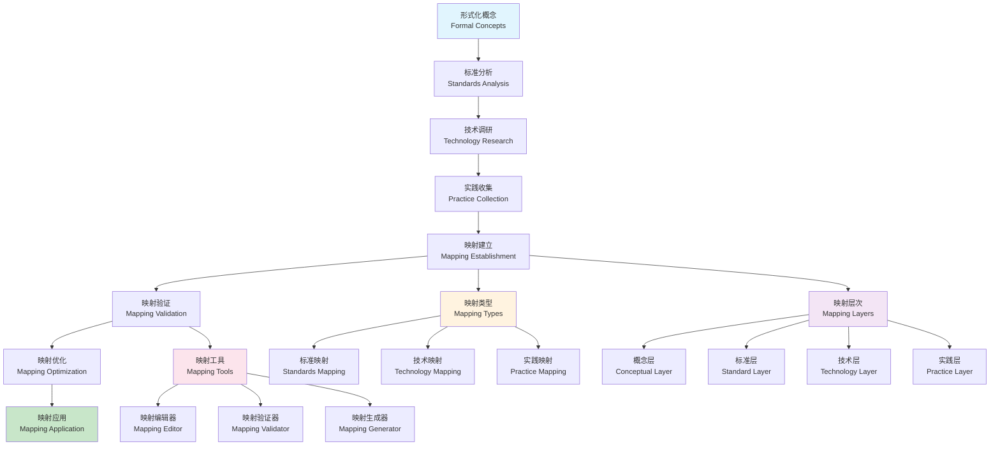

# 行业映射理论 (Industry Mapping Theory)

## 目录（Table of Contents）

- [行业映射理论 (Industry Mapping Theory)](#行业映射理论-industry-mapping-theory)
  - [目录（Table of Contents）](#目录table-of-contents)
  - [概念定义](#概念定义)
    - [核心特征](#核心特征)
  - [理论基础](#理论基础)
    - [行业映射理论](#行业映射理论)
    - [行业映射流程](#行业映射流程)
    - [行业映射层次理论](#行业映射层次理论)
  - [核心组件](#核心组件)
    - [标准映射模型](#标准映射模型)
    - [技术映射模型](#技术映射模型)
    - [实践映射模型](#实践映射模型)
    - [演进映射模型](#演进映射模型)
    - [交叉映射模型](#交叉映射模型)
  - [国际标准对标](#国际标准对标)
    - [行业标准组织](#行业标准组织)
      - [OMG (Object Management Group)](#omg-object-management-group)
      - [ISO/IEC](#isoiec)
      - [W3C (World Wide Web Consortium)](#w3c-world-wide-web-consortium)
    - [开源标准](#开源标准)
      - [Apache Software Foundation](#apache-software-foundation)
      - [Eclipse Foundation](#eclipse-foundation)
  - [行业实践对标](#行业实践对标)
    - [企业实践](#企业实践)
      - [大型科技公司](#大型科技公司)
      - [传统企业](#传统企业)
    - [开源社区](#开源社区)
      - [编程语言社区](#编程语言社区)
      - [框架社区](#框架社区)
  - [工程实践](#工程实践)
    - [映射实施模式](#映射实施模式)
      - [标准映射模式](#标准映射模式)
      - [技术映射模式](#技术映射模式)
    - [映射维护模式](#映射维护模式)
      - [演进跟踪模式](#演进跟踪模式)
  - [最佳实践](#最佳实践)
    - [映射设计原则](#映射设计原则)
    - [映射实施原则](#映射实施原则)
    - [映射维护原则](#映射维护原则)
  - [应用案例](#应用案例)
    - [企业标准映射](#企业标准映射)
    - [技术栈映射](#技术栈映射)
  - [相关概念](#相关概念)
    - [核心概念关联](#核心概念关联)
    - [应用领域关联](#应用领域关联)
    - [行业应用关联](#行业应用关联)
  - [参考文献](#参考文献)

## 概念定义

行业映射理论是一种形式化建模方法，用于建立形式化建模概念与行业标准、技术栈、最佳实践之间的映射关系。它通过系统化的映射机制，实现理论概念到实际应用的桥梁，确保形式化建模理论能够有效指导行业实践。

### 核心特征

1. **标准映射**：形式化概念与行业标准的对应关系
2. **技术映射**：理论模型与技术实现的映射
3. **实践映射**：概念框架与最佳实践的映射
4. **演进映射**：技术发展与理论演进的同步
5. **交叉映射**：不同领域间的概念关联

## 理论基础

### 行业映射理论

行业映射基于以下理论：

```text
IndustryMapping = (Standards, Technologies, Practices, Evolution, CrossMapping)
```

其中：

- Standards：标准映射（国际标准、行业标准、企业标准）
- Technologies：技术映射（技术栈、工具链、平台）
- Practices：实践映射（最佳实践、设计模式、方法论）
- Evolution：演进映射（技术演进、标准更新、理论发展）
- CrossMapping：交叉映射（跨领域、跨技术、跨标准）

### 行业映射流程



### 行业映射层次理论

```yaml
# 行业映射层次
industry_mapping_hierarchy:
  conceptual_layer:
    - "理论概念"
    - "抽象模型"
    - "形式化定义"
    - "数学基础"
    
  standard_layer:
    - "国际标准"
    - "行业标准"
    - "企业标准"
    - "开源标准"
    
  technology_layer:
    - "技术栈"
    - "工具链"
    - "平台框架"
    - "实现技术"
    
  practice_layer:
    - "最佳实践"
    - "设计模式"
    - "方法论"
    - "工程实践"
    
  application_layer:
    - "应用场景"
    - "解决方案"
    - "案例分析"
    - "效果评估"
```

## 核心组件

### 标准映射模型

```yaml
# 标准映射定义
standard_mapping_definitions:
  - name: "modeling_standards"
    description: "建模标准映射"
    
    standards:
      - name: "UML"
        description: "统一建模语言"
        organization: "OMG"
        version: "2.5.1"
        concepts:
          - name: "Class Diagram"
            formal_concept: "Entity Model"
            mapping:
              - formal: "Entity"
                uml: "Class"
                description: "实体映射到UML类"
              - formal: "Relationship"
                uml: "Association"
                description: "关系映射到UML关联"
              - formal: "Attribute"
                uml: "Property"
                description: "属性映射到UML属性"
              - formal: "Method"
                uml: "Operation"
                description: "方法映射到UML操作"
                
          - name: "Sequence Diagram"
            formal_concept: "Interaction Model"
            mapping:
              - formal: "Message"
                uml: "Message"
                description: "消息映射到UML消息"
              - formal: "Actor"
                uml: "Lifeline"
                description: "参与者映射到UML生命线"
              - formal: "Interaction"
                uml: "Interaction"
                description: "交互映射到UML交互"
                
          - name: "Activity Diagram"
            formal_concept: "Process Model"
            mapping:
              - formal: "Process"
                uml: "Activity"
                description: "流程映射到UML活动"
              - formal: "Decision"
                uml: "Decision Node"
                description: "决策映射到UML决策节点"
              - formal: "Flow"
                uml: "Control Flow"
                description: "流程映射到UML控制流"
                
      - name: "BPMN"
        description: "业务流程建模符号"
        organization: "OMG"
        version: "2.0.2"
        concepts:
          - name: "Process"
            formal_concept: "Business Process Model"
            mapping:
              - formal: "Business Process"
                bpmn: "Process"
                description: "业务流程映射到BPMN流程"
              - formal: "Activity"
                bpmn: "Task"
                description: "活动映射到BPMN任务"
              - formal: "Gateway"
                bpmn: "Gateway"
                description: "网关映射到BPMN网关"
              - formal: "Event"
                bpmn: "Event"
                description: "事件映射到BPMN事件"
                
      - name: "SysML"
        description: "系统建模语言"
        organization: "OMG"
        version: "1.6"
        concepts:
          - name: "System"
            formal_concept: "System Model"
            mapping:
              - formal: "System"
                sysml: "Block"
                description: "系统映射到SysML块"
              - formal: "Interface"
                sysml: "Interface Block"
                description: "接口映射到SysML接口块"
              - formal: "Requirement"
                sysml: "Requirement"
                description: "需求映射到SysML需求"
                
  - name: "verification_standards"
    description: "验证标准映射"
    
    standards:
      - name: "TLA+"
        description: "时序逻辑算法"
        organization: "Microsoft"
        concepts:
          - name: "Specification"
            formal_concept: "Formal Specification"
            mapping:
              - formal: "Specification"
                tla: "TLA+ Specification"
                description: "形式化规约映射到TLA+规约"
              - formal: "Property"
                tla: "Temporal Property"
                description: "属性映射到TLA+时序属性"
              - formal: "Invariant"
                tla: "Invariant"
                description: "不变量映射到TLA+不变量"
                
      - name: "Alloy"
        description: "关系逻辑语言"
        organization: "MIT"
        concepts:
          - name: "Model"
            formal_concept: "Formal Model"
            mapping:
              - formal: "Model"
                alloy: "Alloy Model"
                description: "形式化模型映射到Alloy模型"
              - formal: "Constraint"
                alloy: "Constraint"
                description: "约束映射到Alloy约束"
              - formal: "Assertion"
                alloy: "Assertion"
                description: "断言映射到Alloy断言"
                
      - name: "Z Notation"
        description: "Z形式化规约语言"
        organization: "ISO/IEC"
        version: "13568"
        concepts:
          - name: "Schema"
            formal_concept: "Formal Schema"
            mapping:
              - formal: "Schema"
                z: "Z Schema"
                description: "形式化模式映射到Z模式"
              - formal: "Operation"
                z: "Z Operation"
                description: "操作映射到Z操作"
              - formal: "Predicate"
                z: "Z Predicate"
                description: "谓词映射到Z谓词"
```

### 技术映射模型

```yaml
# 技术映射定义
technology_mapping_definitions:
  - name: "programming_languages"
    description: "编程语言映射"
    
    languages:
      - name: "Java"
        description: "Java编程语言"
        version: "17+"
        concepts:
          - name: "Class"
            formal_concept: "Entity Model"
            mapping:
              - formal: "Entity"
                java: "Class"
                description: "实体映射到Java类"
              - formal: "Attribute"
                java: "Field"
                description: "属性映射到Java字段"
              - formal: "Method"
                java: "Method"
                description: "方法映射到Java方法"
              - formal: "Relationship"
                java: "Reference"
                description: "关系映射到Java引用"
                
          - name: "Interface"
            formal_concept: "Interface Model"
            mapping:
              - formal: "Interface"
                java: "Interface"
                description: "接口映射到Java接口"
              - formal: "Operation"
                java: "Method"
                description: "操作映射到Java方法"
              - formal: "Contract"
                java: "Annotation"
                description: "契约映射到Java注解"
                
      - name: "TypeScript"
        description: "TypeScript编程语言"
        version: "5.0+"
        concepts:
          - name: "Type"
            formal_concept: "Type Model"
            mapping:
              - formal: "Type"
                typescript: "Type"
                description: "类型映射到TypeScript类型"
              - formal: "Interface"
                typescript: "Interface"
                description: "接口映射到TypeScript接口"
              - formal: "Generic"
                typescript: "Generic"
                description: "泛型映射到TypeScript泛型"
                
      - name: "Python"
        description: "Python编程语言"
        version: "3.11+"
        concepts:
          - name: "Class"
            formal_concept: "Entity Model"
            mapping:
              - formal: "Entity"
                python: "Class"
                description: "实体映射到Python类"
              - formal: "Attribute"
                python: "Attribute"
                description: "属性映射到Python属性"
              - formal: "Method"
                python: "Method"
                description: "方法映射到Python方法"
                
  - name: "frameworks"
    description: "框架映射"
    
    frameworks:
      - name: "Spring Framework"
        description: "Spring框架"
        version: "6.0+"
        concepts:
          - name: "Service"
            formal_concept: "Service Model"
            mapping:
              - formal: "Service"
                spring: "@Service"
                description: "服务映射到Spring服务"
              - formal: "Repository"
                spring: "@Repository"
                description: "仓储映射到Spring仓储"
              - formal: "Controller"
                spring: "@Controller"
                description: "控制器映射到Spring控制器"
              - formal: "Dependency"
                spring: "@Autowired"
                description: "依赖映射到Spring自动注入"
                
      - name: "React"
        description: "React前端框架"
        version: "18+"
        concepts:
          - name: "Component"
            formal_concept: "Component Model"
            mapping:
              - formal: "Component"
                react: "Component"
                description: "组件映射到React组件"
              - formal: "State"
                react: "State"
                description: "状态映射到React状态"
              - formal: "Props"
                react: "Props"
                description: "属性映射到React属性"
              - formal: "Event"
                react: "Event Handler"
                description: "事件映射到React事件处理器"
                
      - name: "Node.js"
        description: "Node.js运行时"
        version: "18+"
        concepts:
          - name: "Module"
            formal_concept: "Module Model"
            mapping:
              - formal: "Module"
                nodejs: "Module"
                description: "模块映射到Node.js模块"
              - formal: "Package"
                nodejs: "Package"
                description: "包映射到Node.js包"
              - formal: "Dependency"
                nodejs: "Dependency"
                description: "依赖映射到Node.js依赖"
                
  - name: "databases"
    description: "数据库映射"
    
    databases:
      - name: "PostgreSQL"
        description: "PostgreSQL数据库"
        version: "15+"
        concepts:
          - name: "Table"
            formal_concept: "Entity Model"
            mapping:
              - formal: "Entity"
                postgresql: "Table"
                description: "实体映射到PostgreSQL表"
              - formal: "Attribute"
                postgresql: "Column"
                description: "属性映射到PostgreSQL列"
              - formal: "Relationship"
                postgresql: "Foreign Key"
                description: "关系映射到PostgreSQL外键"
              - formal: "Constraint"
                postgresql: "Constraint"
                description: "约束映射到PostgreSQL约束"
                
      - name: "MongoDB"
        description: "MongoDB文档数据库"
        version: "6.0+"
        concepts:
          - name: "Collection"
            formal_concept: "Entity Model"
            mapping:
              - formal: "Entity"
                mongodb: "Collection"
                description: "实体映射到MongoDB集合"
              - formal: "Document"
                mongodb: "Document"
                description: "文档映射到MongoDB文档"
              - formal: "Field"
                mongodb: "Field"
                description: "字段映射到MongoDB字段"
              - formal: "Index"
                mongodb: "Index"
                description: "索引映射到MongoDB索引"
                
      - name: "Redis"
        description: "Redis缓存数据库"
        version: "7.0+"
        concepts:
          - name: "Key-Value"
            formal_concept: "Cache Model"
            mapping:
              - formal: "Cache"
                redis: "Key-Value Store"
                description: "缓存映射到Redis键值存储"
              - formal: "TTL"
                redis: "TTL"
                description: "过期时间映射到Redis TTL"
              - formal: "Pattern"
                redis: "Pattern"
                description: "模式映射到Redis模式"
```

### 实践映射模型

```yaml
# 实践映射定义
practice_mapping_definitions:
  - name: "design_patterns"
    description: "设计模式映射"
    
    patterns:
      - name: "Creational Patterns"
        description: "创建型模式"
        patterns:
          - name: "Singleton"
            formal_concept: "Singleton Model"
            mapping:
              - formal: "Singleton"
                pattern: "Singleton Pattern"
                description: "单例映射到单例模式"
              - formal: "Instance"
                pattern: "Instance"
                description: "实例映射到单例实例"
              - formal: "Access"
                pattern: "getInstance()"
                description: "访问映射到getInstance方法"
                
          - name: "Factory"
            formal_concept: "Factory Model"
            mapping:
              - formal: "Factory"
                pattern: "Factory Pattern"
                description: "工厂映射到工厂模式"
              - formal: "Product"
                pattern: "Product"
                description: "产品映射到工厂产品"
              - formal: "Creation"
                pattern: "create()"
                description: "创建映射到create方法"
                
      - name: "Structural Patterns"
        description: "结构型模式"
        patterns:
          - name: "Adapter"
            formal_concept: "Adapter Model"
            mapping:
              - formal: "Adapter"
                pattern: "Adapter Pattern"
                description: "适配器映射到适配器模式"
              - formal: "Target"
                pattern: "Target Interface"
                description: "目标映射到目标接口"
              - formal: "Adaptee"
                pattern: "Adaptee"
                description: "被适配者映射到被适配者"
                
          - name: "Decorator"
            formal_concept: "Decorator Model"
            mapping:
              - formal: "Decorator"
                pattern: "Decorator Pattern"
                description: "装饰器映射到装饰器模式"
              - formal: "Component"
                pattern: "Component"
                description: "组件映射到装饰器组件"
              - formal: "Behavior"
                pattern: "Additional Behavior"
                description: "行为映射到附加行为"
                
      - name: "Behavioral Patterns"
        description: "行为型模式"
        patterns:
          - name: "Observer"
            formal_concept: "Observer Model"
            mapping:
              - formal: "Observer"
                pattern: "Observer Pattern"
                description: "观察者映射到观察者模式"
              - formal: "Subject"
                pattern: "Subject"
                description: "主题映射到观察者主题"
              - formal: "Notification"
                pattern: "Notification"
                description: "通知映射到观察者通知"
                
          - name: "Strategy"
            formal_concept: "Strategy Model"
            mapping:
              - formal: "Strategy"
                pattern: "Strategy Pattern"
                description: "策略映射到策略模式"
              - formal: "Context"
                pattern: "Context"
                description: "上下文映射到策略上下文"
              - formal: "Algorithm"
                pattern: "Algorithm"
                description: "算法映射到策略算法"
                
  - name: "methodologies"
    description: "方法论映射"
    
    methodologies:
      - name: "Agile"
        description: "敏捷开发方法论"
        concepts:
          - name: "Sprint"
            formal_concept: "Iteration Model"
            mapping:
              - formal: "Iteration"
                agile: "Sprint"
                description: "迭代映射到敏捷冲刺"
              - formal: "Backlog"
                agile: "Product Backlog"
                description: "待办事项映射到产品待办事项"
              - formal: "Story"
                agile: "User Story"
                description: "故事映射到用户故事"
              - formal: "Review"
                agile: "Sprint Review"
                description: "评审映射到冲刺评审"
                
      - name: "DevOps"
        description: "DevOps方法论"
        concepts:
          - name: "Pipeline"
            formal_concept: "Pipeline Model"
            mapping:
              - formal: "Pipeline"
                devops: "CI/CD Pipeline"
                description: "流水线映射到CI/CD流水线"
              - formal: "Stage"
                devops: "Pipeline Stage"
                description: "阶段映射到流水线阶段"
              - formal: "Deployment"
                devops: "Deployment"
                description: "部署映射到DevOps部署"
              - formal: "Monitoring"
                devops: "Monitoring"
                description: "监控映射到DevOps监控"
                
      - name: "Domain-Driven Design"
        description: "领域驱动设计"
        concepts:
          - name: "Domain"
            formal_concept: "Domain Model"
            mapping:
              - formal: "Domain"
                ddd: "Domain"
                description: "领域映射到DDD领域"
              - formal: "Entity"
                ddd: "Entity"
                description: "实体映射到DDD实体"
              - formal: "Value Object"
                ddd: "Value Object"
                description: "值对象映射到DDD值对象"
              - formal: "Service"
                ddd: "Domain Service"
                description: "服务映射到DDD领域服务"
```

### 演进映射模型

```yaml
# 演进映射定义
evolution_mapping_definitions:
  - name: "technology_evolution"
    description: "技术演进映射"
    
    evolution:
      - name: "Programming Languages"
        description: "编程语言演进"
        timeline:
          - period: "1950s-1960s"
            languages: ["Fortran", "COBOL", "ALGOL"]
            formal_concepts: ["Algorithm Model", "Procedure Model"]
            
          - period: "1970s-1980s"
            languages: ["C", "Pascal", "Smalltalk"]
            formal_concepts: ["Object Model", "Type Model"]
            
          - period: "1990s-2000s"
            languages: ["Java", "C++", "Python"]
            formal_concepts: ["Class Model", "Interface Model"]
            
          - period: "2010s-2020s"
            languages: ["TypeScript", "Rust", "Go"]
            formal_concepts: ["Type Safety Model", "Memory Safety Model"]
            
      - name: "Web Technologies"
        description: "Web技术演进"
        timeline:
          - period: "1990s"
            technologies: ["HTML", "CSS", "JavaScript"]
            formal_concepts: ["Document Model", "Style Model"]
            
          - period: "2000s"
            technologies: ["AJAX", "REST", "JSON"]
            formal_concepts: ["API Model", "Data Model"]
            
          - period: "2010s"
            technologies: ["React", "Angular", "Vue"]
            formal_concepts: ["Component Model", "State Model"]
            
          - period: "2020s"
            technologies: ["WebAssembly", "GraphQL", "Micro Frontends"]
            formal_concepts: ["Assembly Model", "Query Model"]
            
      - name: "Database Technologies"
        description: "数据库技术演进"
        timeline:
          - period: "1970s-1980s"
            databases: ["IBM DB2", "Oracle", "SQL Server"]
            formal_concepts: ["Relational Model", "ACID Model"]
            
          - period: "1990s-2000s"
            databases: ["MySQL", "PostgreSQL", "SQLite"]
            formal_concepts: ["Open Source Model", "Transaction Model"]
            
          - period: "2010s"
            databases: ["MongoDB", "Redis", "Cassandra"]
            formal_concepts: ["NoSQL Model", "CAP Model"]
            
          - period: "2020s"
            databases: ["NewSQL", "Time Series DB", "Graph DB"]
            formal_concepts: ["Hybrid Model", "Specialized Model"]
            
  - name: "standard_evolution"
    description: "标准演进映射"
    
    evolution:
      - name: "Modeling Standards"
        description: "建模标准演进"
        timeline:
          - period: "1990s"
            standards: ["OMG CORBA", "UML 1.x"]
            formal_concepts: ["Object Model", "Component Model"]
            
          - period: "2000s"
            standards: ["UML 2.x", "BPMN 1.x", "MDA"]
            formal_concepts: ["Process Model", "Architecture Model"]
            
          - period: "2010s"
            standards: ["BPMN 2.x", "DMN", "CMMN"]
            formal_concepts: ["Decision Model", "Case Model"]
            
          - period: "2020s"
            standards: ["UML 2.6", "SysML 1.6", "Archimate 3.1"]
            formal_concepts: ["System Model", "Enterprise Model"]
            
      - name: "Verification Standards"
        description: "验证标准演进"
        timeline:
          - period: "1980s-1990s"
            standards: ["Z Notation", "VDM", "B Method"]
            formal_concepts: ["Formal Specification", "Refinement Model"]
            
          - period: "2000s"
            standards: ["TLA+", "Alloy", "SPIN"]
            formal_concepts: ["Model Checking", "Temporal Logic"]
            
          - period: "2010s"
            standards: ["SMT-LIB", "DIMACS", "TPTP"]
            formal_concepts: ["Satisfiability", "Theorem Proving"]
            
          - period: "2020s"
            standards: ["SMT-LIB 2.6", "CVC4", "Z3"]
            formal_concepts: ["SMT Solving", "Automated Reasoning"]
```

### 交叉映射模型

```yaml
# 交叉映射定义
cross_mapping_definitions:
  - name: "domain_cross_mapping"
    description: "领域交叉映射"
    
    mappings:
      - name: "software_engineering_to_ai"
        description: "软件工程到人工智能"
        concepts:
          - name: "Design Pattern"
            ai_concept: "Neural Network Architecture"
            mapping:
              - software: "Singleton"
                ai: "Single Instance Network"
                description: "单例模式映射到单实例网络"
              - software: "Factory"
                ai: "Model Factory"
                description: "工厂模式映射到模型工厂"
              - software: "Observer"
                ai: "Event-Driven Learning"
                description: "观察者模式映射到事件驱动学习"
                
      - name: "database_to_distributed_systems"
        description: "数据库到分布式系统"
        concepts:
          - name: "Transaction"
            distributed_concept: "Distributed Transaction"
            mapping:
              - database: "ACID"
                distributed: "CAP"
                description: "ACID特性映射到CAP定理"
              - database: "Isolation"
                distributed: "Consistency"
                description: "隔离性映射到一致性"
              - database: "Durability"
                distributed: "Partition Tolerance"
                description: "持久性映射到分区容错性"
                
      - name: "web_to_mobile"
        description: "Web到移动端"
        concepts:
          - name: "Component"
            mobile_concept: "Mobile Component"
            mapping:
              - web: "React Component"
                mobile: "React Native Component"
                description: "React组件映射到React Native组件"
              - web: "State Management"
                mobile: "Mobile State Management"
                description: "状态管理映射到移动端状态管理"
              - web: "Navigation"
                mobile: "Mobile Navigation"
                description: "导航映射到移动端导航"
                
  - name: "technology_cross_mapping"
    description: "技术交叉映射"
    
    mappings:
      - name: "java_to_kotlin"
        description: "Java到Kotlin"
        concepts:
          - name: "Class"
            kotlin_concept: "Kotlin Class"
            mapping:
              - java: "Class"
                kotlin: "Class"
                description: "Java类映射到Kotlin类"
              - java: "Interface"
                kotlin: "Interface"
                description: "Java接口映射到Kotlin接口"
              - java: "Annotation"
                kotlin: "Annotation"
                description: "Java注解映射到Kotlin注解"
                
      - name: "python_to_javascript"
        description: "Python到JavaScript"
        concepts:
          - name: "Function"
            js_concept: "JavaScript Function"
            mapping:
              - python: "Function"
                js: "Function"
                description: "Python函数映射到JavaScript函数"
              - python: "Class"
                js: "Class"
                description: "Python类映射到JavaScript类"
              - python: "Module"
                js: "Module"
                description: "Python模块映射到JavaScript模块"
                
      - name: "sql_to_nosql"
        description: "SQL到NoSQL"
        concepts:
          - name: "Table"
            nosql_concept: "Collection/Document"
            mapping:
              - sql: "Table"
                nosql: "Collection"
                description: "SQL表映射到NoSQL集合"
              - sql: "Row"
                nosql: "Document"
                description: "SQL行映射到NoSQL文档"
              - sql: "Column"
                nosql: "Field"
                description: "SQL列映射到NoSQL字段"
```

## 国际标准对标

### 行业标准组织

#### OMG (Object Management Group)

- **标准范围**：建模语言、中间件、实时系统
- **核心标准**：UML、BPMN、SysML、DMN、MDA
- **映射关系**：形式化建模概念与OMG标准的对应关系
- **工具支持**：Enterprise Architect、MagicDraw、Papyrus

#### ISO/IEC

- **标准范围**：信息技术、软件工程、形式化方法
- **核心标准**：Z Notation、VDM、B Method、SQL
- **映射关系**：形式化理论与ISO/IEC标准的对应关系
- **工具支持**：形式化验证工具、数据库系统

#### W3C (World Wide Web Consortium)

- **标准范围**：Web技术、语义网、知识表示
- **核心标准**：HTML、CSS、JavaScript、RDF、OWL、SPARQL
- **映射关系**：Web技术与形式化建模的对应关系
- **工具支持**：浏览器、语义网工具、知识图谱工具

### 开源标准

#### Apache Software Foundation

- **标准范围**：大数据、中间件、Web服务
- **核心标准**：Hadoop、Kafka、Spark、Tomcat
- **映射关系**：开源技术与形式化建模的对应关系
- **工具支持**：Apache项目、开发工具、运维工具

#### Eclipse Foundation

- **标准范围**：开发工具、建模工具、代码生成
- **核心标准**：EMF、ATL、QVT、Xtext、Xtend
- **映射关系**：Eclipse技术与形式化建模的对应关系
- **工具支持**：Eclipse IDE、建模工具、代码生成工具

## 行业实践对标

### 企业实践

#### 大型科技公司

- **Google**：大规模分布式系统、机器学习、云计算
- **Microsoft**：企业软件、云计算、开发工具
- **Amazon**：电子商务、云计算、微服务架构
- **Netflix**：流媒体、微服务、云原生架构

#### 传统企业

- **IBM**：企业软件、中间件、人工智能
- **Oracle**：数据库、企业软件、云计算
- **SAP**：企业资源规划、业务流程管理
- **Salesforce**：客户关系管理、云平台

### 开源社区

#### 编程语言社区

- **Java社区**：企业级开发、Spring生态系统
- **Python社区**：数据科学、机器学习、Web开发
- **JavaScript社区**：前端开发、Node.js生态系统
- **Go社区**：云原生、微服务、系统编程

#### 框架社区

- **Spring社区**：企业级Java开发
- **React社区**：前端开发、组件化架构
- **Kubernetes社区**：容器编排、云原生架构
- **TensorFlow社区**：机器学习、深度学习

## 工程实践

### 映射实施模式

#### 标准映射模式

```yaml
# 标准映射模式
standard_mapping_pattern:
  description: "标准映射实施模式"
  process:
    - name: "标准分析"
      description: "分析目标标准"
      activities:
        - "标准文档阅读"
        - "概念提取"
        - "结构分析"
        - "关系识别"
        
    - name: "概念映射"
      description: "建立概念映射"
      activities:
        - "概念对比"
        - "映射建立"
        - "验证确认"
        - "文档记录"
        
    - name: "工具集成"
      description: "集成相关工具"
      activities:
        - "工具选择"
        - "配置设置"
        - "集成测试"
        - "文档更新"
        
    - name: "实践验证"
      description: "验证映射效果"
      activities:
        - "案例实施"
        - "效果评估"
        - "问题修复"
        - "经验总结"
```

#### 技术映射模式

```yaml
# 技术映射模式
technology_mapping_pattern:
  description: "技术映射实施模式"
  process:
    - name: "技术调研"
      description: "调研目标技术"
      activities:
        - "技术文档阅读"
        - "API分析"
        - "示例代码研究"
        - "社区调研"
        
    - name: "概念映射"
      description: "建立概念映射"
      activities:
        - "概念识别"
        - "映射建立"
        - "验证测试"
        - "文档编写"
        
    - name: "实现验证"
      description: "验证映射实现"
      activities:
        - "代码实现"
        - "功能测试"
        - "性能测试"
        - "集成测试"
        
    - name: "最佳实践"
      description: "总结最佳实践"
      activities:
        - "经验总结"
        - "模式提取"
        - "文档更新"
        - "知识分享"
```

### 映射维护模式

#### 演进跟踪模式

```yaml
# 演进跟踪模式
evolution_tracking_pattern:
  description: "演进跟踪维护模式"
  activities:
    - name: "版本监控"
      description: "监控标准和技术版本"
      tasks:
        - "版本发布监控"
        - "变更内容分析"
        - "影响评估"
        - "更新计划制定"
        
    - name: "映射更新"
      description: "更新映射关系"
      tasks:
        - "新概念识别"
        - "映射关系更新"
        - "废弃概念清理"
        - "文档更新"
        
    - name: "兼容性维护"
      description: "维护向后兼容性"
      tasks:
        - "兼容性分析"
        - "迁移策略制定"
        - "工具更新"
        - "测试验证"
        
    - name: "知识传播"
      description: "传播更新知识"
      tasks:
        - "培训材料更新"
        - "社区分享"
        - "最佳实践更新"
        - "案例更新"
```

## 最佳实践

### 映射设计原则

1. **准确性**：确保映射关系的准确性
2. **完整性**：覆盖所有重要概念
3. **一致性**：保持映射关系的一致性
4. **可维护性**：便于维护和更新

### 映射实施原则

1. **渐进式**：采用渐进式映射实施
2. **验证驱动**：通过验证驱动映射质量
3. **工具支持**：充分利用工具支持
4. **社区参与**：鼓励社区参与和贡献

### 映射维护原则

1. **持续监控**：持续监控标准和技术的演进
2. **及时更新**：及时更新映射关系
3. **向后兼容**：保持向后兼容性
4. **知识传播**：及时传播更新知识

## 应用案例

### 企业标准映射

```yaml
# 企业标准映射
enterprise_standard_mapping:
  description: "企业内部标准映射"
  components:
    - name: "建模标准"
      description: "企业建模标准"
      standards:
        - "企业UML规范"
        - "业务流程标准"
        - "数据建模标准"
        - "接口设计标准"
        
    - name: "开发标准"
      description: "企业开发标准"
      standards:
        - "编码规范"
        - "架构标准"
        - "测试标准"
        - "部署标准"
        
    - name: "工具标准"
      description: "企业工具标准"
      standards:
        - "开发工具"
        - "建模工具"
        - "测试工具"
        - "运维工具"
        
    - name: "流程标准"
      description: "企业流程标准"
      standards:
        - "开发流程"
        - "测试流程"
        - "部署流程"
        - "维护流程"
        
    - name: "映射关系"
      description: "标准间映射关系"
      mappings:
        - "建模标准到开发标准"
        - "开发标准到工具标准"
        - "工具标准到流程标准"
        - "流程标准到建模标准"
```

### 技术栈映射

```yaml
# 技术栈映射
technology_stack_mapping:
  description: "技术栈映射关系"
  components:
    - name: "前端技术栈"
      description: "前端技术栈映射"
      technologies:
        - "React + TypeScript"
        - "Vue + JavaScript"
        - "Angular + TypeScript"
        - "Svelte + JavaScript"
      mappings:
        - "组件模型映射"
        - "状态管理映射"
        - "路由映射"
        - "样式映射"
        
    - name: "后端技术栈"
      description: "后端技术栈映射"
      technologies:
        - "Spring Boot + Java"
        - "Express + Node.js"
        - "Django + Python"
        - "ASP.NET Core + C#"
      mappings:
        - "服务模型映射"
        - "数据访问映射"
        - "API映射"
        - "安全映射"
        
    - name: "数据库技术栈"
      description: "数据库技术栈映射"
      technologies:
        - "PostgreSQL + Redis"
        - "MySQL + Memcached"
        - "MongoDB + Redis"
        - "SQL Server + Redis"
      mappings:
        - "数据模型映射"
        - "查询映射"
        - "缓存映射"
        - "事务映射"
        
    - name: "云原生技术栈"
      description: "云原生技术栈映射"
      technologies:
        - "Kubernetes + Docker"
        - "OpenShift + Podman"
        - "ECS + Fargate"
        - "AKS + ACR"
      mappings:
        - "容器映射"
        - "编排映射"
        - "服务映射"
        - "监控映射"
```

## 相关概念

### 核心概念关联

- [概念索引](./concept-index.md) - 概念索引为行业映射提供概念分类和组织基础
- [模型转换](./model-transformation.md) - 模型转换实现行业映射的自动化处理
- [知识图谱](./knowledge-graph.md) - 知识图谱为行业映射提供关系网络支持
- [模型驱动工程](./model-driven-engineering.md) - MDE基于行业映射实现自动化工程
- [形式化建模](./formal-modeling.md) - 形式化建模为行业映射提供理论基础
- [递归建模](./recursive-modeling.md) - 递归建模支持复杂行业映射的层次化处理

### 应用领域关联

- [数据建模](../data-model/theory.md) - 数据模型与行业数据标准的映射
- [功能建模](../functional-model/theory.md) - 功能模型与行业业务标准的映射
- [交互建模](../interaction-model/theory.md) - 交互模型与行业接口标准的映射
- [运行时建模](../runtime-model/theory.md) - 运行时模型与行业部署标准的映射

### 行业应用关联

- [金融架构](../../industry-model/finance-architecture/) - 金融行业标准映射和合规要求
- [AI基础设施](../../industry-model/ai-infrastructure-architecture/) - AI行业标准映射和技术栈
- [云原生架构](../../industry-model/cloud-native-architecture/) - 云原生标准映射和最佳实践

## 参考文献

1. OMG (2023). "Object Management Group Standards"
2. ISO/IEC (2023). "Information Technology Standards"
3. W3C (2023). "World Wide Web Consortium Standards"
4. Apache Software Foundation (2023). "Apache Projects"
5. Eclipse Foundation (2023). "Eclipse Projects"
6. Fowler, M. (2018). "Refactoring: Improving the Design of Existing Code"
