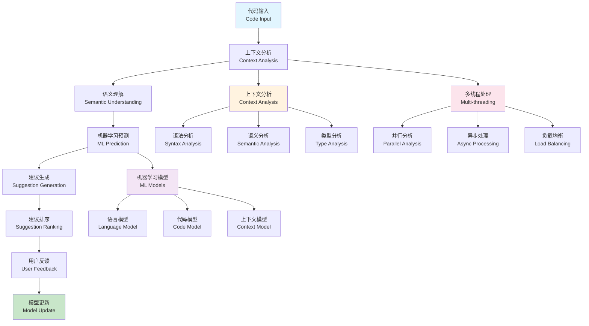

# 智能代码补全 (Intelligent Code Completion)

## 目录（Table of Contents）

- [智能代码补全 (Intelligent Code Completion)](#智能代码补全-intelligent-code-completion)
  - [目录（Table of Contents）](#目录table-of-contents)
  - [概念定义](#概念定义)
    - [核心特征](#核心特征)
  - [理论基础](#理论基础)
    - [智能代码补全理论](#智能代码补全理论)
    - [智能代码补全流程](#智能代码补全流程)
    - [多线程智能补全架构](#多线程智能补全架构)
  - [核心组件](#核心组件)
    - [上下文分析器](#上下文分析器)
    - [语义理解引擎](#语义理解引擎)
    - [机器学习预测引擎](#机器学习预测引擎)
  - [多线程并行处理](#多线程并行处理)
    - [并行分析策略](#并行分析策略)
    - [线程管理策略](#线程管理策略)
  - [工程实践](#工程实践)
    - [智能代码补全框架设计](#智能代码补全框架设计)
    - [性能优化策略](#性能优化策略)
  - [应用案例](#应用案例)
    - [大规模代码库智能补全](#大规模代码库智能补全)
    - [实时协作开发支持](#实时协作开发支持)
  - [国际标准对标](#国际标准对标)
    - [智能代码补全标准](#智能代码补全标准)
      - [Language Server Protocol (LSP)](#language-server-protocol-lsp)
      - [IntelliSense](#intellisense)
      - [TabNine](#tabnine)
    - [机器学习标准](#机器学习标准)
      - [TensorFlow](#tensorflow)
      - [PyTorch](#pytorch)
      - [Hugging Face Transformers](#hugging-face-transformers)
  - [著名大学课程对标](#著名大学课程对标)
    - [人工智能课程](#人工智能课程)
      - [MIT 6.034 - Artificial Intelligence](#mit-6034---artificial-intelligence)
      - [Stanford CS224N - Natural Language Processing with Deep Learning](#stanford-cs224n---natural-language-processing-with-deep-learning)
      - [CMU 15-445 - Database Systems](#cmu-15-445---database-systems)
    - [软件工程课程](#软件工程课程)
      - [MIT 6.170 - Software Studio](#mit-6170---software-studio)
      - [Stanford CS210 - Software Engineering](#stanford-cs210---software-engineering)
      - [CMU 15-413 - Software Engineering](#cmu-15-413---software-engineering)
  - [相关概念](#相关概念)
    - [核心概念关联](#核心概念关联)
    - [应用领域关联](#应用领域关联)
    - [行业应用关联](#行业应用关联)
  - [参考文献](#参考文献)

## 概念定义

智能代码补全是一种基于人工智能和机器学习的代码辅助技术，通过分析代码上下文、语义信息和用户意图，为开发者提供智能化的代码建议、自动补全和错误修复功能。

### 核心特征

1. **上下文感知**：基于代码上下文提供准确建议
2. **语义理解**：理解代码语义和用户意图
3. **多线程处理**：支持大规模代码库的并行分析
4. **实时响应**：提供实时的代码建议和补全
5. **学习能力**：从用户行为中学习和改进

## 理论基础

### 智能代码补全理论

智能代码补全基于以下理论：

```text
IntelligentCodeCompletion = (Context, Semantics, ML, Parallelism, Learning)
```

其中：

- Context：代码上下文分析
- Semantics：语义理解和分析
- ML：机器学习算法
- Parallelism：并行处理能力
- Learning：持续学习机制

### 智能代码补全流程



### 多线程智能补全架构

```yaml
# 多线程智能补全架构
multi_threaded_intelligent_completion:
  description: "支持多线程并行的智能代码补全架构"
  architecture:
    - name: "context_analyzer_thread_pool"
      description: "上下文分析器线程池"
      features:
        - "并行分析多个文件"
        - "异步上下文提取"
        - "增量分析支持"
        - "内存优化管理"
      
    - name: "semantic_analyzer_engine"
      description: "语义分析引擎"
      features:
        - "并行语义分析"
        - "语义模型缓存"
        - "分析结果验证"
        - "性能监控"
      
    - name: "ml_prediction_parallel_processor"
      description: "并行ML预测处理器"
      features:
        - "并行模型推理"
        - "分布式预测支持"
        - "预测结果聚合"
        - "模型更新管理"
```

## 核心组件

### 上下文分析器

```yaml
# 上下文分析器
context_analyzer:
  description: "代码上下文分析器实现"
  components:
    - name: "syntax_context_extractor"
      description: "语法上下文提取器"
      implementation:
        - "抽象语法树分析"
        - "作用域分析"
        - "类型信息提取"
        - "依赖关系分析"
      
    - name: "semantic_context_analyzer"
      description: "语义上下文分析器"
      implementation:
        - "变量使用分析"
        - "函数调用分析"
        - "控制流分析"
        - "数据流分析"
      
    - name: "parallel_context_processor"
      description: "并行上下文处理器"
      implementation:
        - "多线程文件分析"
        - "上下文分片处理"
        - "结果合并算法"
        - "负载均衡策略"
```

### 语义理解引擎

```yaml
# 语义理解引擎
semantic_understanding_engine:
  description: "代码语义理解和分析引擎"
  understanding_process:
    - name: "code_structure_analysis"
      description: "代码结构分析"
      process:
        - "模块结构分析"
        - "类层次分析"
        - "接口定义分析"
        - "继承关系分析"
      
    - name: "semantic_pattern_recognition"
      description: "语义模式识别"
      process:
        - "设计模式识别"
        - "代码模式识别"
        - "反模式检测"
        - "最佳实践识别"
      
    - name: "intent_inference"
      description: "意图推断"
      process:
        - "用户行为分析"
        - "代码风格分析"
        - "命名约定分析"
        - "意图预测"
```

### 机器学习预测引擎

```yaml
# 机器学习预测引擎
ml_prediction_engine:
  description: "基于机器学习的代码预测引擎"
  prediction_methods:
    - name: "statistical_models"
      description: "统计模型"
      methods:
        - "N-gram模型"
        - "马尔可夫链"
        - "隐马尔可夫模型"
        - "条件随机场"
      
    - name: "neural_networks"
      description: "神经网络"
      methods:
        - "循环神经网络"
        - "长短期记忆网络"
        - "Transformer模型"
        - "图神经网络"
      
    - name: "ensemble_methods"
      description: "集成方法"
      methods:
        - "随机森林"
        - "梯度提升"
        - "投票机制"
        - "堆叠集成"
```

## 多线程并行处理

### 并行分析策略

```yaml
# 并行分析策略
parallel_analysis_strategies:
  description: "多线程并行分析策略"
  strategies:
    - name: "file_level_parallelism"
      description: "文件级并行策略"
      approach:
        - "按文件并行分析"
        - "依赖关系管理"
        - "结果聚合"
        - "负载均衡"
      
    - name: "function_level_parallelism"
      description: "函数级并行策略"
      approach:
        - "按函数并行分析"
        - "上下文共享"
        - "结果合并"
        - "内存优化"
      
    - name: "token_level_parallelism"
      description: "Token级并行策略"
      approach:
        - "按Token并行处理"
        - "流水线处理"
        - "结果同步"
        - "性能优化"
```

### 线程管理策略

```yaml
# 线程管理策略
thread_management_strategies:
  description: "智能代码补全的线程管理策略"
  management_aspects:
    - name: "adaptive_thread_pool"
      description: "自适应线程池"
      configuration:
        - "动态线程数调整"
        - "负载感知调度"
        - "资源使用优化"
        - "性能监控"
      
    - name: "priority_based_scheduling"
      description: "基于优先级的调度"
      scheduling:
        - "用户交互优先级"
        - "分析任务优先级"
        - "学习任务优先级"
        - "维护任务优先级"
      
    - name: "resource_management"
      description: "资源管理"
      management:
        - "内存使用优化"
        - "CPU使用优化"
        - "GPU加速支持"
        - "缓存策略优化"
```

## 工程实践

### 智能代码补全框架设计

```yaml
# 智能代码补全框架设计
intelligent_completion_framework:
  description: "智能代码补全框架的设计原则"
  design_principles:
    - name: "real_time_responsiveness"
      description: "实时响应性"
      principles:
        - "低延迟响应"
        - "增量更新"
        - "异步处理"
        - "缓存优化"
      
    - name: "accuracy_and_relevance"
      description: "准确性和相关性"
      principles:
        - "上下文感知"
        - "语义理解"
        - "用户意图识别"
        - "质量评估"
      
    - name: "scalability_and_performance"
      description: "可扩展性和性能"
      principles:
        - "水平扩展能力"
        - "垂直扩展能力"
        - "性能线性增长"
        - "资源优化"
```

### 性能优化策略

```yaml
# 性能优化策略
performance_optimization:
  description: "智能代码补全的性能优化策略"
  optimization_strategies:
    - name: "inference_optimization"
      description: "推理优化"
      strategies:
        - "模型量化"
        - "模型剪枝"
        - "知识蒸馏"
        - "缓存机制"
      
    - name: "context_analysis_optimization"
      description: "上下文分析优化"
      strategies:
        - "增量分析"
        - "懒加载"
        - "预计算"
        - "并行分析"
      
    - name: "user_experience_optimization"
      description: "用户体验优化"
      strategies:
        - "预测性加载"
        - "智能缓存"
        - "渐进式增强"
        - "离线支持"
```

## 应用案例

### 大规模代码库智能补全

```yaml
# 大规模代码库智能补全
large_scale_codebase_intelligent_completion:
  description: "处理大规模代码库的智能补全"
  completion_scenarios:
    - name: "enterprise_codebase"
      description: "企业级代码库"
      completion:
        - "并行代码分析"
        - "分布式语义理解"
        - "集群预测服务"
        - "实时学习更新"
      
    - name: "open_source_projects"
      description: "开源项目"
      completion:
        - "多语言支持"
        - "跨项目学习"
        - "社区知识共享"
        - "持续改进"
      
    - name: "legacy_systems"
      description: "遗留系统"
      completion:
        - "逆向工程分析"
        - "文档生成"
        - "现代化建议"
        - "迁移支持"
```

### 实时协作开发支持

```yaml
# 实时协作开发支持
real_time_collaborative_development:
  description: "支持实时协作开发的智能补全"
  collaboration_aspects:
    - name: "multi_user_completion"
      description: "多用户补全"
      aspects:
        - "用户偏好学习"
        - "团队知识共享"
        - "冲突解决"
        - "一致性保证"
      
    - name: "version_aware_completion"
      description: "版本感知补全"
      aspects:
        - "分支感知"
        - "变更影响分析"
        - "合并冲突检测"
        - "回滚支持"
      
    - name: "collaborative_learning"
      description: "协作学习"
      aspects:
        - "集体智慧"
        - "知识传播"
        - "质量改进"
        - "创新促进"
```

## 国际标准对标

### 智能代码补全标准

#### Language Server Protocol (LSP)

- **标准**：Microsoft LSP
- **版本**：LSP 3.17
- **核心概念**：语言服务器、客户端、协议
- **工具支持**：VS Code、Eclipse、IntelliJ IDEA

#### IntelliSense

- **标准**：Microsoft IntelliSense
- **版本**：IntelliSense 2.0
- **核心概念**：智能感知、自动补全、参数提示
- **工具支持**：Visual Studio、VS Code、Visual Studio for Mac

#### TabNine

- **标准**：TabNine AI Code Completion
- **版本**：TabNine 3.0
- **核心概念**：深度学习、代码预测、多语言支持
- **工具支持**：VS Code、IntelliJ、Vim、Emacs

### 机器学习标准

#### TensorFlow

- **标准**：Google TensorFlow
- **版本**：TensorFlow 2.10+
- **核心概念**：深度学习、神经网络、模型训练
- **工具支持**：TensorFlow Serving、TensorFlow Lite、TensorFlow.js

#### PyTorch

- **标准**：Facebook PyTorch
- **版本**：PyTorch 1.12+
- **核心概念**：动态图、自动微分、GPU加速
- **工具支持**：TorchServe、TorchScript、TorchVision

#### Hugging Face Transformers

- **标准**：Hugging Face Transformers
- **版本**：Transformers 4.20+
- **核心概念**：预训练模型、自然语言处理、代码生成
- **工具支持**：Transformers Hub、Datasets、Tokenizers

## 著名大学课程对标

### 人工智能课程

#### MIT 6.034 - Artificial Intelligence

- **课程内容**：人工智能、机器学习、自然语言处理
- **智能补全相关**：机器学习、模式识别、智能系统
- **实践项目**：智能代码补全系统
- **相关技术**：TensorFlow、PyTorch、Scikit-learn

#### Stanford CS224N - Natural Language Processing with Deep Learning

- **课程内容**：自然语言处理、深度学习、Transformer模型
- **智能补全相关**：语言模型、代码生成、序列预测
- **实践项目**：代码语言模型
- **相关技术**：BERT、GPT、Transformer

#### CMU 15-445 - Database Systems

- **课程内容**：数据库系统、查询优化、索引设计
- **智能补全相关**：查询补全、SQL生成、数据库设计
- **实践项目**：智能数据库助手
- **相关技术**：PostgreSQL、MySQL、MongoDB

### 软件工程课程

#### MIT 6.170 - Software Studio

- **课程内容**：软件设计、开发工具、用户体验
- **智能补全相关**：开发工具集成、用户体验设计、工具链
- **实践项目**：智能开发环境
- **相关技术**：VS Code、Eclipse、IntelliJ IDEA

#### Stanford CS210 - Software Engineering

- **课程内容**：软件工程、开发方法、质量保证
- **智能补全相关**：代码质量、开发效率、工具支持
- **实践项目**：智能代码审查工具
- **相关技术**：SonarQube、CodeClimate、ESLint

#### CMU 15-413 - Software Engineering

- **课程内容**：软件工程、架构设计、性能优化
- **智能补全相关**：架构感知、性能优化、最佳实践
- **实践项目**：智能架构助手
- **相关技术**：Spring Boot、Django、Express.js

## 相关概念

### 核心概念关联

- [抽象语法树](./abstract-syntax-tree.md) - AST为智能代码补全提供程序结构信息
- [代码生成](./code-generation.md) - 代码生成与智能代码补全相结合提供完整代码
- [语义分析](./semantic-analysis.md) - 语义分析为智能代码补全提供语义理解能力
- [模型转换](./model-transformation.md) - 模型转换用于智能代码补全的模型处理
- [自动推理](./automated-reasoning.md) - 自动推理用于智能代码补全的智能推理
- [递归建模](./recursive-modeling.md) - 递归建模支持智能代码补全的复杂结构处理

### 应用领域关联

- [数据建模](../data-model/theory.md) - 数据模型智能补全和数据库代码生成
- [功能建模](../functional-model/theory.md) - 功能模型智能补全和业务逻辑生成
- [交互建模](../interaction-model/theory.md) - 交互模型智能补全和接口代码生成
- [运行时建模](../runtime-model/theory.md) - 运行时模型智能补全和配置生成

### 行业应用关联

- [金融架构](../../industry-model/finance-architecture/) - 金融业务代码智能补全和交易系统生成
- [AI基础设施](../../industry-model/ai-infrastructure-architecture/) - AI模型代码智能补全和推理代码生成
- [云原生架构](../../industry-model/cloud-native-architecture/) - 云配置智能补全和部署代码生成

## 参考文献

1. Vaswani, A., et al. (2017). "Attention Is All You Need"
2. Devlin, J., et al. (2018). "BERT: Pre-training of Deep Bidirectional Transformers"
3. Brown, T., et al. (2020). "Language Models are Few-Shot Learners"
4. Allamanis, M., et al. (2018). "The Naturalness of Software"
5. Hellendoorn, V. J., et al. (2019). "Deep Learning Code Fragments for Code Clone Detection"
6. Svyatkovskiy, A., et al. (2020). "IntelliCode Compose: Code Generation Using Transformer"
