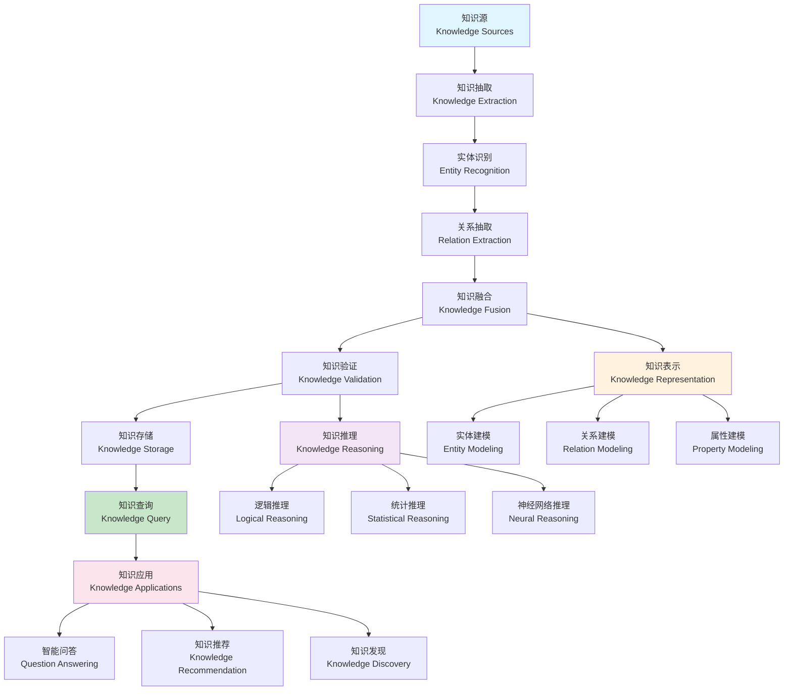

# 知识图谱建模理论 (Knowledge Graph Modeling Theory)

## 目录（Table of Contents）

- [知识图谱建模理论 (Knowledge Graph Modeling Theory)](#知识图谱建模理论-knowledge-graph-modeling-theory)
  - [目录（Table of Contents）](#目录table-of-contents)
  - [概念定义](#概念定义)
    - [核心特征](#核心特征)
  - [理论基础](#理论基础)
    - [知识图谱建模理论](#知识图谱建模理论)
    - [知识图谱构建流程](#知识图谱构建流程)
    - [知识图谱设计层次理论](#知识图谱设计层次理论)
  - [核心组件](#核心组件)
    - [实体模型](#实体模型)
    - [关系模型](#关系模型)
    - [本体模型](#本体模型)
    - [推理模型](#推理模型)
    - [查询模型](#查询模型)
  - [国际标准对标](#国际标准对标)
    - [知识表示标准](#知识表示标准)
      - [RDF (Resource Description Framework)](#rdf-resource-description-framework)
      - [OWL (Web Ontology Language)](#owl-web-ontology-language)
      - [SPARQL](#sparql)
    - [图数据库标准](#图数据库标准)
      - [Neo4j](#neo4j)
      - [Apache TinkerPop](#apache-tinkerpop)
      - [Amazon Neptune](#amazon-neptune)
  - [著名大学课程对标](#著名大学课程对标)
    - [人工智能课程](#人工智能课程)
      - [MIT 6.034 - Artificial Intelligence](#mit-6034---artificial-intelligence)
      - [Stanford CS224W - Machine Learning with Graphs](#stanford-cs224w---machine-learning-with-graphs)
      - [CMU 15-780 - Graduate Artificial Intelligence](#cmu-15-780---graduate-artificial-intelligence)
    - [数据库课程](#数据库课程)
      - [MIT 6.830 - Database Systems](#mit-6830---database-systems)
      - [Stanford CS245 - Principles of Data-Intensive Systems](#stanford-cs245---principles-of-data-intensive-systems)
  - [工程实践](#工程实践)
    - [知识图谱设计模式](#知识图谱设计模式)
      - [本体设计模式](#本体设计模式)
      - [知识融合模式](#知识融合模式)
    - [知识图谱实现模式](#知识图谱实现模式)
      - [存储模式](#存储模式)
      - [查询模式](#查询模式)
  - [最佳实践](#最佳实践)
    - [知识图谱设计原则](#知识图谱设计原则)
    - [知识图谱构建原则](#知识图谱构建原则)
    - [知识图谱应用原则](#知识图谱应用原则)
  - [应用案例](#应用案例)
    - [企业知识图谱](#企业知识图谱)
    - [学术知识图谱](#学术知识图谱)
  - [相关概念](#相关概念)
    - [核心概念关联](#核心概念关联)
    - [应用领域关联](#应用领域关联)
    - [行业应用关联](#行业应用关联)
  - [参考文献](#参考文献)

## 概念定义

知识图谱建模理论是一种形式化建模方法，用于构建和管理结构化的知识表示系统。它通过实体、关系、属性的形式化定义，实现知识的语义化表示、推理和查询，支持复杂知识的自动化处理和智能应用。

### 核心特征

1. **语义表示**：基于语义的知识表示和建模
2. **关系推理**：支持复杂关系的推理和发现
3. **知识融合**：多源知识的融合和集成
4. **智能查询**：支持语义查询和智能问答
5. **知识演化**：支持知识的动态更新和演化

## 理论基础

### 知识图谱建模理论

知识图谱建模基于以下理论：

```text
KnowledgeGraph = (Entities, Relations, Properties, Axioms, Rules)
```

其中：

- Entities：实体（概念、实例、对象）
- Relations：关系（实体间的语义关系）
- Properties：属性（实体的特征和描述）
- Axioms：公理（领域知识和约束）
- Rules：规则（推理规则和逻辑）

### 知识图谱构建流程



### 知识图谱设计层次理论

```yaml
# 知识图谱设计层次
knowledge_graph_design_hierarchy:
  conceptual_layer:
    - "领域概念"
    - "实体类型"
    - "关系类型"
    - "属性定义"
    
  logical_layer:
    - "本体设计"
    - "模式定义"
    - "约束规则"
    - "推理规则"
    
  physical_layer:
    - "存储模型"
    - "索引策略"
    - "查询优化"
    - "性能调优"
    
  application_layer:
    - "查询接口"
    - "推理引擎"
    - "可视化"
    - "应用集成"
```

## 核心组件

### 实体模型

```yaml
# 实体定义
entity_definitions:
  - name: "person_entity"
    description: "人员实体"
    type: "concept"
    
    properties:
      - name: "id"
        type: "string"
        description: "唯一标识符"
        constraints:
          - "unique"
          - "not_null"
          
      - name: "name"
        type: "string"
        description: "姓名"
        constraints:
          - "not_null"
          - "max_length: 100"
          
      - name: "birth_date"
        type: "date"
        description: "出生日期"
        constraints:
          - "valid_date"
          
      - name: "email"
        type: "string"
        description: "电子邮件"
        constraints:
          - "email_format"
          - "unique"
          
      - name: "phone"
        type: "string"
        description: "电话号码"
        constraints:
          - "phone_format"
          
      - name: "address"
        type: "object"
        description: "地址信息"
        structure:
          - name: "street"
            type: "string"
          - name: "city"
            type: "string"
          - name: "state"
            type: "string"
          - name: "country"
            type: "string"
          - name: "postal_code"
            type: "string"
            
    relationships:
      - name: "works_for"
        target: "organization_entity"
        type: "many_to_one"
        description: "工作关系"
        
      - name: "knows"
        target: "person_entity"
        type: "many_to_many"
        description: "认识关系"
        
      - name: "lives_in"
        target: "location_entity"
        type: "many_to_one"
        description: "居住关系"
        
  - name: "organization_entity"
    description: "组织实体"
    type: "concept"
    
    properties:
      - name: "id"
        type: "string"
        description: "唯一标识符"
        constraints:
          - "unique"
          - "not_null"
          
      - name: "name"
        type: "string"
        description: "组织名称"
        constraints:
          - "not_null"
          - "max_length: 200"
          
      - name: "founded_date"
        type: "date"
        description: "成立日期"
        
      - name: "industry"
        type: "string"
        description: "所属行业"
        
      - name: "size"
        type: "enum"
        description: "组织规模"
        values: ["startup", "small", "medium", "large", "enterprise"]
        
      - name: "revenue"
        type: "number"
        description: "年收入"
        unit: "USD"
        
    relationships:
      - name: "has_employees"
        target: "person_entity"
        type: "one_to_many"
        description: "员工关系"
        
      - name: "located_in"
        target: "location_entity"
        type: "many_to_one"
        description: "位置关系"
        
      - name: "competes_with"
        target: "organization_entity"
        type: "many_to_many"
        description: "竞争关系"
        
  - name: "location_entity"
    description: "位置实体"
    type: "concept"
    
    properties:
      - name: "id"
        type: "string"
        description: "唯一标识符"
        constraints:
          - "unique"
          - "not_null"
          
      - name: "name"
        type: "string"
        description: "位置名称"
        constraints:
          - "not_null"
          
      - name: "type"
        type: "enum"
        description: "位置类型"
        values: ["country", "state", "city", "district", "address"]
        
      - name: "coordinates"
        type: "object"
        description: "地理坐标"
        structure:
          - name: "latitude"
            type: "number"
            range: [-90, 90]
          - name: "longitude"
            type: "number"
            range: [-180, 180]
            
      - name: "population"
        type: "number"
        description: "人口数量"
        
    relationships:
      - name: "contains"
        target: "location_entity"
        type: "one_to_many"
        description: "包含关系"
        
      - name: "part_of"
        target: "location_entity"
        type: "many_to_one"
        description: "属于关系"
```

### 关系模型

```yaml
# 关系定义
relationship_definitions:
  - name: "employment_relationship"
    description: "雇佣关系"
    source: "person_entity"
    target: "organization_entity"
    
    properties:
      - name: "start_date"
        type: "date"
        description: "开始日期"
        
      - name: "end_date"
        type: "date"
        description: "结束日期"
        
      - name: "position"
        type: "string"
        description: "职位"
        
      - name: "department"
        type: "string"
        description: "部门"
        
      - name: "salary"
        type: "number"
        description: "薪资"
        unit: "USD"
        
      - name: "employment_type"
        type: "enum"
        description: "雇佣类型"
        values: ["full_time", "part_time", "contract", "intern"]
        
    constraints:
      - name: "valid_date_range"
        condition: "start_date <= end_date"
        description: "开始日期不能晚于结束日期"
        
      - name: "active_employment"
        condition: "end_date IS NULL OR end_date >= CURRENT_DATE"
        description: "当前有效雇佣关系"
        
  - name: "friendship_relationship"
    description: "朋友关系"
    source: "person_entity"
    target: "person_entity"
    
    properties:
      - name: "since_date"
        type: "date"
        description: "成为朋友的日期"
        
      - name: "strength"
        type: "enum"
        description: "关系强度"
        values: ["acquaintance", "friend", "close_friend", "best_friend"]
        
      - name: "interaction_frequency"
        type: "enum"
        description: "互动频率"
        values: ["rarely", "occasionally", "frequently", "daily"]
        
    constraints:
      - name: "self_friendship"
        condition: "source_id != target_id"
        description: "不能与自己建立朋友关系"
        
  - name: "location_relationship"
    description: "位置关系"
    source: "location_entity"
    target: "location_entity"
    
    properties:
      - name: "distance"
        type: "number"
        description: "距离"
        unit: "kilometers"
        
      - name: "travel_time"
        type: "number"
        description: "旅行时间"
        unit: "minutes"
        
      - name: "transport_mode"
        type: "enum"
        description: "交通方式"
        values: ["walking", "driving", "public_transport", "flying"]
        
    constraints:
      - name: "positive_distance"
        condition: "distance >= 0"
        description: "距离必须为非负数"
```

### 本体模型

```yaml
# 本体定义
ontology_definitions:
  - name: "business_ontology"
    description: "商业领域本体"
    version: "1.0.0"
    
    classes:
      - name: "Person"
        description: "人员类"
        superclass: "Entity"
        properties:
          - "name"
          - "birth_date"
          - "email"
          - "phone"
        relationships:
          - "worksFor"
          - "knows"
          - "livesIn"
          
      - name: "Organization"
        description: "组织类"
        superclass: "Entity"
        properties:
          - "name"
          - "founded_date"
          - "industry"
          - "size"
          - "revenue"
        relationships:
          - "hasEmployees"
          - "locatedIn"
          - "competesWith"
          
      - name: "Location"
        description: "位置类"
        superclass: "Entity"
        properties:
          - "name"
          - "type"
          - "coordinates"
          - "population"
        relationships:
          - "contains"
          - "partOf"
          
    object_properties:
      - name: "worksFor"
        domain: "Person"
        range: "Organization"
        description: "工作关系"
        
      - name: "hasEmployees"
        domain: "Organization"
        range: "Person"
        description: "员工关系"
        inverse_of: "worksFor"
        
      - name: "knows"
        domain: "Person"
        range: "Person"
        description: "认识关系"
        symmetric: true
        
      - name: "livesIn"
        domain: "Person"
        range: "Location"
        description: "居住关系"
        
      - name: "locatedIn"
        domain: "Organization"
        range: "Location"
        description: "位置关系"
        
      - name: "contains"
        domain: "Location"
        range: "Location"
        description: "包含关系"
        transitive: true
        
      - name: "partOf"
        domain: "Location"
        range: "Location"
        description: "属于关系"
        
    data_properties:
      - name: "name"
        domain: "Entity"
        range: "string"
        description: "名称"
        
      - name: "email"
        domain: "Person"
        range: "string"
        description: "电子邮件"
        
      - name: "birth_date"
        domain: "Person"
        range: "date"
        description: "出生日期"
        
      - name: "founded_date"
        domain: "Organization"
        range: "date"
        description: "成立日期"
        
      - name: "revenue"
        domain: "Organization"
        range: "decimal"
        description: "年收入"
        
      - name: "coordinates"
        domain: "Location"
        range: "geometry"
        description: "地理坐标"
        
    axioms:
      - name: "person_organization_constraint"
        axiom: "Person ⊓ Organization = ⊥"
        description: "人员和组织是互斥的"
        
      - name: "location_hierarchy"
        axiom: "Location ⊑ ∃partOf.Location"
        description: "位置可以属于其他位置"
        
      - name: "employment_constraint"
        axiom: "∃worksFor.Organization ⊑ Person"
        description: "有工作关系的人必须是人员"
        
    rules:
      - name: "senior_employee_rule"
        condition: "worksFor(?p, ?o) ∧ hasPosition(?p, 'Manager')"
        conclusion: "SeniorEmployee(?p)"
        description: "经理是高级员工"
        
      - name: "location_inference_rule"
        condition: "livesIn(?p, ?l) ∧ partOf(?l, ?c)"
        conclusion: "livesIn(?p, ?c)"
        description: "居住位置推理"
```

### 推理模型

```yaml
# 推理定义
reasoning_definitions:
  - name: "logical_reasoning"
    description: "逻辑推理"
    
    inference_rules:
      - name: "transitive_closure"
        description: "传递闭包推理"
        pattern:
          - premise: "R(a, b)"
          - premise: "R(b, c)"
          - conclusion: "R(a, c)"
        example:
          - premise: "partOf(Beijing, China)"
          - premise: "partOf(China, Asia)"
          - conclusion: "partOf(Beijing, Asia)"
          
      - name: "symmetric_closure"
        description: "对称闭包推理"
        pattern:
          - premise: "R(a, b)"
          - conclusion: "R(b, a)"
        example:
          - premise: "knows(Alice, Bob)"
          - conclusion: "knows(Bob, Alice)"
          
      - name: "inverse_relationship"
        description: "逆关系推理"
        pattern:
          - premise: "R(a, b)"
          - conclusion: "R_inverse(b, a)"
        example:
          - premise: "worksFor(Alice, Google)"
          - conclusion: "hasEmployee(Google, Alice)"
          
  - name: "semantic_reasoning"
    description: "语义推理"
    
    reasoning_patterns:
      - name: "subclass_inference"
        description: "子类推理"
        pattern:
          - premise: "C(a) ∧ C ⊑ D"
          - conclusion: "D(a)"
        example:
          - premise: "Manager(Alice) ∧ Manager ⊑ Employee"
          - conclusion: "Employee(Alice)"
          
      - name: "property_inheritance"
        description: "属性继承推理"
        pattern:
          - premise: "C(a) ∧ C ⊑ D ∧ D ⊑ ∃P.T"
          - conclusion: "∃P.T(a)"
        example:
          - premise: "Manager(Alice) ∧ Manager ⊑ Employee ∧ Employee ⊑ ∃worksFor.Organization"
          - conclusion: "∃worksFor.Organization(Alice)"
          
      - name: "disjoint_class"
        description: "互斥类推理"
        pattern:
          - premise: "C(a) ∧ C ⊓ D = ⊥"
          - conclusion: "¬D(a)"
        example:
          - premise: "Person(Alice) ∧ Person ⊓ Organization = ⊥"
          - conclusion: "¬Organization(Alice)"
          
  - name: "temporal_reasoning"
    description: "时序推理"
    
    temporal_patterns:
      - name: "temporal_consistency"
        description: "时序一致性推理"
        pattern:
          - premise: "startDate(R, d1) ∧ endDate(R, d2)"
          - conclusion: "d1 ≤ d2"
        example:
          - premise: "startDate(employment, 2020-01-01) ∧ endDate(employment, 2023-12-31)"
          - conclusion: "2020-01-01 ≤ 2023-12-31"
          
      - name: "temporal_overlap"
        description: "时序重叠推理"
        pattern:
          - premise: "overlaps(R1, R2)"
          - conclusion: "∃t.holds(R1, t) ∧ holds(R2, t)"
        example:
          - premise: "overlaps(employment1, employment2)"
          - conclusion: "存在时间点t，同时持有两个雇佣关系"
          
  - name: "spatial_reasoning"
    description: "空间推理"
    
    spatial_patterns:
      - name: "spatial_containment"
        description: "空间包含推理"
        pattern:
          - premise: "contains(L1, L2) ∧ locatedIn(E, L2)"
          - conclusion: "locatedIn(E, L1)"
        example:
          - premise: "contains(China, Beijing) ∧ locatedIn(Google, Beijing)"
          - conclusion: "locatedIn(Google, China)"
          
      - name: "spatial_distance"
        description: "空间距离推理"
        pattern:
          - premise: "distance(L1, L2, d1) ∧ distance(L2, L3, d2)"
          - conclusion: "distance(L1, L3) ≤ d1 + d2"
        example:
          - premise: "distance(Beijing, Shanghai, 1000km) ∧ distance(Shanghai, Guangzhou, 1200km)"
          - conclusion: "distance(Beijing, Guangzhou) ≤ 2200km"
```

### 查询模型

```yaml
# 查询定义
query_definitions:
  - name: "sparql_queries"
    description: "SPARQL查询"
    
    queries:
      - name: "find_employees"
        description: "查找员工"
        query: |
          PREFIX : <http://example.org/ontology#>
          SELECT ?person ?name ?organization
          WHERE {
            ?person a :Person .
            ?person :name ?name .
            ?person :worksFor ?organization .
            ?organization a :Organization .
          }
        result_format: "table"
        
      - name: "find_friends"
        description: "查找朋友"
        query: |
          PREFIX : <http://example.org/ontology#>
          SELECT ?person1 ?person2
          WHERE {
            ?person1 :knows ?person2 .
            ?person1 :name "Alice" .
          }
        result_format: "graph"
        
      - name: "find_locations"
        description: "查找位置"
        query: |
          PREFIX : <http://example.org/ontology#>
          SELECT ?location ?type ?population
          WHERE {
            ?location a :Location .
            ?location :type ?type .
            ?location :population ?population .
            FILTER(?population > 1000000)
          }
          ORDER BY DESC(?population)
        result_format: "table"
        
  - name: "cypher_queries"
    description: "Cypher查询"
    
    queries:
      - name: "find_employee_path"
        description: "查找员工路径"
        query: |
          MATCH (p:Person)-[:WORKS_FOR]->(o:Organization)
          WHERE p.name = 'Alice'
          RETURN p.name, o.name
        result_format: "graph"
        
      - name: "find_friend_network"
        description: "查找朋友网络"
        query: |
          MATCH (p1:Person)-[:KNOWS]-(p2:Person)
          WHERE p1.name = 'Alice'
          RETURN p1.name, p2.name
        result_format: "network"
        
      - name: "find_location_hierarchy"
        description: "查找位置层次"
        query: |
          MATCH (l1:Location)-[:CONTAINS*]->(l2:Location)
          WHERE l1.name = 'China'
          RETURN l1.name, l2.name
        result_format: "tree"
        
  - name: "gremlin_queries"
    description: "Gremlin查询"
    
    queries:
      - name: "traverse_employee"
        description: "遍历员工关系"
        query: |
          g.V().has('Person', 'name', 'Alice')
            .out('worksFor')
            .values('name')
        result_format: "list"
        
      - name: "find_shortest_path"
        description: "查找最短路径"
        query: |
          g.V().has('Person', 'name', 'Alice')
            .shortestPath()
            .with(Distance.max, 3)
            .to(g.V().has('Person', 'name', 'Bob'))
        result_format: "path"
```

## 国际标准对标

### 知识表示标准

#### RDF (Resource Description Framework)

- **版本**：RDF 1.1 (W3C Recommendation)
- **标准**：W3C Resource Description Framework
- **核心概念**：三元组、URI、字面量、空白节点
- **工具支持**：Apache Jena、RDF4J、GraphDB

#### OWL (Web Ontology Language)

- **版本**：OWL 2 (W3C Recommendation)
- **标准**：W3C Web Ontology Language
- **核心概念**：类、属性、个体、公理、推理
- **工具支持**：Protégé、HermiT、Pellet

#### SPARQL

- **版本**：SPARQL 1.1 (W3C Recommendation)
- **标准**：W3C SPARQL Protocol and RDF Query Language
- **核心概念**：查询语言、协议、结果格式
- **工具支持**：Apache Jena、Virtuoso、GraphDB

### 图数据库标准

#### Neo4j

- **版本**：Neo4j 5.0+
- **标准**：Neo4j Graph Database
- **核心概念**：节点、关系、属性、标签
- **工具支持**：Cypher、Neo4j Browser、Neo4j Bloom

#### Apache TinkerPop

- **版本**：TinkerPop 3.6+
- **标准**：Apache TinkerPop Graph Computing Framework
- **核心概念**：图遍历、图算法、图处理器
- **工具支持**：Gremlin、GraphSON、GraphML

#### Amazon Neptune

- **版本**：Neptune 1.2+
- **标准**：Amazon Neptune Graph Database
- **核心概念**：RDF、属性图、SPARQL、Gremlin
- **工具支持**：SPARQL、Gremlin、Graph Notebook

## 著名大学课程对标

### 人工智能课程

#### MIT 6.034 - Artificial Intelligence

- **课程内容**：人工智能、知识表示、推理系统
- **知识图谱相关**：知识表示、逻辑推理、语义网络
- **实践项目**：知识图谱构建和推理
- **相关技术**：Prolog、语义网络、专家系统

#### Stanford CS224W - Machine Learning with Graphs

- **课程内容**：图机器学习、图神经网络、知识图谱
- **知识图谱相关**：图表示学习、知识图谱嵌入、图神经网络
- **实践项目**：知识图谱补全和推理
- **相关技术**：PyTorch Geometric、DGL、KG-BERT

#### CMU 15-780 - Graduate Artificial Intelligence

- **课程内容**：高级人工智能、知识表示、推理
- **知识图谱相关**：本体论、语义推理、知识融合
- **实践项目**：大规模知识图谱构建
- **相关技术**：OWL、SPARQL、RDF

### 数据库课程

#### MIT 6.830 - Database Systems

- **课程内容**：数据库系统、查询处理、事务管理
- **知识图谱相关**：图数据库、查询优化、存储管理
- **实践项目**：图数据库实现
- **相关技术**：Neo4j、GraphQL、图查询优化

#### Stanford CS245 - Principles of Data-Intensive Systems

- **课程内容**：数据密集型系统、分布式数据、图数据
- **知识图谱相关**：大规模图处理、分布式图存储、图算法
- **实践项目**：分布式图数据库
- **相关技术**：Apache Giraph、GraphX、Pregel

## 工程实践

### 知识图谱设计模式

#### 本体设计模式

```yaml
# 本体设计模式
ontology_design_patterns:
  - name: "entity_relationship_pattern"
    description: "实体关系模式"
    structure:
      - name: "实体定义"
        description: "定义核心实体"
        components:
          - "实体类型"
          - "属性定义"
          - "约束规则"
          
      - name: "关系定义"
        description: "定义实体关系"
        components:
          - "关系类型"
          - "关系属性"
          - "关系约束"
          
      - name: "推理规则"
        description: "定义推理规则"
        components:
          - "逻辑推理"
          - "语义推理"
          - "时序推理"
          
    benefits:
      - "结构化表示"
      - "语义清晰"
      - "推理支持"
      - "可扩展性"
      
  - name: "layered_ontology_pattern"
    description: "分层本体模式"
    structure:
      - name: "基础层"
        description: "基础概念"
        components:
          - "通用实体"
          - "基础关系"
          - "核心属性"
          
      - name: "领域层"
        description: "领域概念"
        components:
          - "领域实体"
          - "领域关系"
          - "领域规则"
          
      - name: "应用层"
        description: "应用概念"
        components:
          - "应用实体"
          - "应用关系"
          - "应用逻辑"
          
    benefits:
      - "层次清晰"
      - "模块化设计"
      - "可重用性"
      - "维护性"
```

#### 知识融合模式

```yaml
# 知识融合模式
knowledge_fusion_patterns:
  - name: "entity_linking_pattern"
    description: "实体链接模式"
    process:
      - name: "实体识别"
        description: "识别文本中的实体"
        methods:
          - "命名实体识别"
          - "实体抽取"
          - "实体分类"
          
      - name: "实体消歧"
        description: "消除实体歧义"
        methods:
          - "上下文分析"
          - "相似度计算"
          - "聚类分析"
          
      - name: "实体对齐"
        description: "对齐不同来源的实体"
        methods:
          - "字符串匹配"
          - "语义相似度"
          - "结构相似度"
          
    benefits:
      - "多源融合"
      - "质量提升"
      - "覆盖扩展"
      - "一致性保证"
      
  - name: "schema_mapping_pattern"
    description: "模式映射模式"
    process:
      - name: "模式分析"
        description: "分析不同数据源的模式"
        methods:
          - "模式抽取"
          - "模式比较"
          - "模式分类"
          
      - name: "映射定义"
        description: "定义模式间的映射关系"
        methods:
          - "属性映射"
          - "关系映射"
          - "约束映射"
          
      - name: "数据转换"
        description: "根据映射转换数据"
        methods:
          - "数据清洗"
          - "格式转换"
          - "质量验证"
          
    benefits:
      - "异构集成"
      - "标准化"
      - "互操作性"
      - "数据质量"
```

### 知识图谱实现模式

#### 存储模式

```yaml
# 存储模式
storage_patterns:
  - name: "triple_store_pattern"
    description: "三元组存储模式"
    architecture:
      - name: "存储引擎"
        description: "三元组存储引擎"
        features:
          - "RDF存储"
          - "索引优化"
          - "查询处理"
          
      - name: "查询引擎"
        description: "SPARQL查询引擎"
        features:
          - "查询解析"
          - "查询优化"
          - "结果处理"
          
      - name: "推理引擎"
        description: "逻辑推理引擎"
        features:
          - "规则推理"
          - "本体推理"
          - "一致性检查"
          
    benefits:
      - "标准兼容"
      - "语义丰富"
      - "推理支持"
      - "可扩展性"
      
  - name: "graph_database_pattern"
    description: "图数据库模式"
    architecture:
      - name: "图存储"
        description: "图数据存储"
        features:
          - "节点存储"
          - "边存储"
          - "属性存储"
          
      - name: "图查询"
        description: "图查询语言"
        features:
          - "图遍历"
          - "模式匹配"
          - "路径查询"
          
      - name: "图算法"
        description: "图算法库"
        features:
          - "最短路径"
          - "社区发现"
          - "中心性计算"
          
    benefits:
      - "性能优化"
      - "图算法"
      - "可视化"
      - "易用性"
```

#### 查询模式

```yaml
# 查询模式
query_patterns:
  - name: "semantic_query_pattern"
    description: "语义查询模式"
    features:
      - name: "自然语言查询"
        description: "支持自然语言查询"
        implementation:
          - "NLU处理"
          - "意图识别"
          - "实体抽取"
          - "查询生成"
          
      - name: "语义扩展"
        description: "查询语义扩展"
        implementation:
          - "同义词扩展"
          - "概念扩展"
          - "推理扩展"
          - "相关查询"
          
      - name: "智能推荐"
        description: "智能查询推荐"
        implementation:
          - "查询历史"
          - "用户偏好"
          - "相似查询"
          - "热门查询"
          
    benefits:
      - "用户友好"
      - "智能交互"
      - "结果相关"
      - "体验优化"
      
  - name: "graph_analytics_pattern"
    description: "图分析模式"
    features:
      - name: "路径分析"
        description: "路径分析功能"
        implementation:
          - "最短路径"
          - "所有路径"
          - "路径模式"
          - "路径统计"
          
      - name: "社区分析"
        description: "社区分析功能"
        implementation:
          - "社区发现"
          - "社区特征"
          - "社区演化"
          - "影响力分析"
          
      - name: "中心性分析"
        description: "中心性分析功能"
        implementation:
          - "度中心性"
          - "接近中心性"
          - "介数中心性"
          - "特征向量中心性"
          
    benefits:
      - "深度分析"
      - "模式发现"
      - "洞察生成"
      - "决策支持"
```

## 最佳实践

### 知识图谱设计原则

1. **语义清晰**：确保知识表示的语义清晰明确
2. **结构合理**：设计合理的本体结构和关系模式
3. **可扩展性**：支持知识的动态扩展和演化
4. **一致性**：保证知识的一致性和完整性

### 知识图谱构建原则

1. **质量优先**：优先保证知识质量，再考虑数量
2. **多源融合**：整合多个数据源，提高覆盖度
3. **持续更新**：建立知识更新的机制和流程
4. **验证机制**：建立知识验证和质量评估机制

### 知识图谱应用原则

1. **用户导向**：以用户需求为导向设计应用
2. **性能优化**：优化查询性能和系统响应时间
3. **可视化友好**：提供友好的可视化界面
4. **集成能力**：支持与其他系统的集成

## 应用案例

### 企业知识图谱

```yaml
# 企业知识图谱
enterprise_knowledge_graph:
  description: "企业知识管理和智能应用"
  components:
    - name: "组织知识"
      description: "组织结构和人员知识"
      entities:
        - "员工"
        - "部门"
        - "职位"
        - "技能"
      relationships:
        - "汇报关系"
        - "协作关系"
        - "技能关系"
        - "项目关系"
        
    - name: "业务知识"
      description: "业务流程和规则知识"
      entities:
        - "流程"
        - "规则"
        - "决策"
        - "指标"
      relationships:
        - "流程关系"
        - "规则关系"
        - "决策关系"
        - "指标关系"
        
    - name: "产品知识"
      description: "产品和服务知识"
      entities:
        - "产品"
        - "服务"
        - "特性"
        - "版本"
      relationships:
        - "产品关系"
        - "服务关系"
        - "特性关系"
        - "版本关系"
        
    - name: "客户知识"
      description: "客户和市场需求知识"
      entities:
        - "客户"
        - "需求"
        - "反馈"
        - "偏好"
      relationships:
        - "客户关系"
        - "需求关系"
        - "反馈关系"
        - "偏好关系"
        
    - name: "应用场景"
      description: "知识图谱应用场景"
      scenarios:
        - "智能问答"
        - "知识推荐"
        - "决策支持"
        - "风险分析"
        - "人才管理"
        - "产品优化"
```

### 学术知识图谱

```yaml
# 学术知识图谱
academic_knowledge_graph:
  description: "学术研究和知识发现"
  components:
    - name: "学术实体"
      description: "学术研究实体"
      entities:
        - "论文"
        - "作者"
        - "机构"
        - "期刊"
        - "会议"
        - "领域"
      relationships:
        - "作者关系"
        - "引用关系"
        - "合作关系"
        - "领域关系"
        
    - name: "研究主题"
      description: "研究主题和方向"
      entities:
        - "主题"
        - "关键词"
        - "方法"
        - "技术"
      relationships:
        - "主题关系"
        - "方法关系"
        - "技术关系"
        - "演进关系"
        
    - name: "知识发现"
      description: "知识发现和分析"
      features:
        - "研究趋势分析"
        - "合作网络分析"
        - "影响力分析"
        - "知识演化分析"
        - "跨领域发现"
        - "创新机会识别"
        
    - name: "智能服务"
      description: "智能学术服务"
      services:
        - "论文推荐"
        - "合作推荐"
        - "研究方向建议"
        - "学术影响力评估"
        - "研究热点预测"
        - "知识图谱可视化"
```

## 相关概念

### 核心概念关联

- [概念索引](./concept-index.md) - 概念索引为知识图谱提供概念分类和组织基础
- [模型转换](./model-transformation.md) - 模型转换实现知识图谱的自动化构建和更新
- [语义分析](./semantic-analysis.md) - 语义分析为知识图谱提供语义理解和抽取能力
- [自动推理](./automated-reasoning.md) - 自动推理为知识图谱提供智能推理和发现能力
- [形式化建模](./formal-modeling.md) - 形式化建模为知识图谱提供理论基础
- [递归建模](./recursive-modeling.md) - 递归建模支持复杂知识图谱的层次化构建

### 应用领域关联

- [数据建模](../data-model/theory.md) - 数据模型与知识图谱的实体和属性映射
- [功能建模](../functional-model/theory.md) - 功能模型与知识图谱的业务逻辑映射
- [交互建模](../interaction-model/theory.md) - 交互模型与知识图谱的关系和接口映射
- [运行时建模](../runtime-model/theory.md) - 运行时模型与知识图谱的状态和配置映射

### 行业应用关联

- [金融架构](../../industry-model/finance-architecture/) - 金融知识图谱和业务关系建模
- [AI基础设施](../../industry-model/ai-infrastructure-architecture/) - AI知识图谱和技术栈建模
- [云原生架构](../../industry-model/cloud-native-architecture/) - 云原生知识图谱和架构模式建模

## 参考文献

1. Hogan, A., et al. (2021). "Knowledge Graphs"
2. Fensel, D., et al. (2020). "Knowledge Graphs: Methodology, Tools and Selected Use Cases"
3. Pan, J. Z., et al. (2019). "Ontology-Driven Analytics: A Survey"
4. W3C (2014). "RDF 1.1 Concepts and Abstract Syntax"
5. W3C (2012). "OWL 2 Web Ontology Language Document Overview"
6. W3C (2013). "SPARQL 1.1 Overview"
