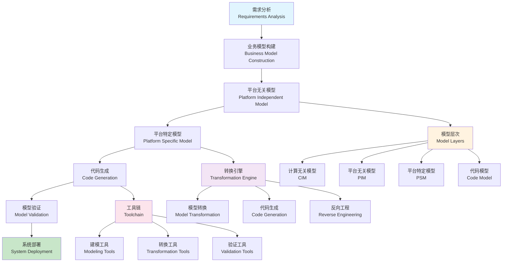

# 模型驱动工程理论 (Model-Driven Engineering Theory)

## 目录（Table of Contents）

- [模型驱动工程理论 (Model-Driven Engineering Theory)](#模型驱动工程理论-model-driven-engineering-theory)
  - [目录（Table of Contents）](#目录table-of-contents)
  - [概念定义](#概念定义)
    - [核心特征](#核心特征)
  - [理论基础](#理论基础)
    - [模型驱动工程理论](#模型驱动工程理论)
    - [模型驱动工程流程](#模型驱动工程流程)
    - [模型驱动设计层次理论](#模型驱动设计层次理论)
  - [核心组件](#核心组件)
    - [元模型定义](#元模型定义)
    - [模型转换定义](#模型转换定义)
    - [代码生成模板](#代码生成模板)
    - [模型验证规则](#模型验证规则)
  - [国际标准对标](#国际标准对标)
    - [模型驱动架构标准](#模型驱动架构标准)
      - [OMG MDA (Model-Driven Architecture)](#omg-mda-model-driven-architecture)
      - [OMG UML (Unified Modeling Language)](#omg-uml-unified-modeling-language)
      - [OMG MOF (Meta-Object Facility)](#omg-mof-meta-object-facility)
    - [模型转换标准](#模型转换标准)
      - [OMG QVT (Query/View/Transformation)](#omg-qvt-queryviewtransformation)
      - [ATL (Atlas Transformation Language)](#atl-atlas-transformation-language)
      - [Xtend](#xtend)
  - [著名大学课程对标](#著名大学课程对标)
    - [软件工程课程](#软件工程课程)
      - [MIT 6.170 - Software Studio](#mit-6170---software-studio)
      - [Stanford CS210 - Software Project Experience with Corporate Partners](#stanford-cs210---software-project-experience-with-corporate-partners)
      - [CMU 15-413 - Software Engineering](#cmu-15-413---software-engineering)
    - [编译器课程](#编译器课程)
      - [MIT 6.035 - Computer Language Engineering](#mit-6035---computer-language-engineering)
      - [Stanford CS143 - Compilers](#stanford-cs143---compilers)
  - [工程实践](#工程实践)
    - [MDE开发模式](#mde开发模式)
      - [瀑布式MDE模式](#瀑布式mde模式)
      - [敏捷MDE模式](#敏捷mde模式)
    - [MDE工具链模式](#mde工具链模式)
      - [集成开发环境](#集成开发环境)
      - [持续集成流水线](#持续集成流水线)
  - [最佳实践](#最佳实践)
    - [MDE设计原则](#mde设计原则)
    - [MDE开发原则](#mde开发原则)
    - [MDE维护原则](#mde维护原则)
  - [应用案例](#应用案例)
    - [企业应用开发](#企业应用开发)
    - [嵌入式系统开发](#嵌入式系统开发)
  - [相关概念](#相关概念)
    - [核心概念关联](#核心概念关联)
    - [应用领域关联](#应用领域关联)
    - [行业应用关联](#行业应用关联)
  - [参考文献](#参考文献)

## 概念定义

模型驱动工程理论是一种软件开发方法论，通过抽象层次化的模型来驱动整个软件开发生命周期。它强调以模型为中心，通过模型转换、代码生成、模型验证等方式，实现从需求分析到代码实现的自动化过程。

### 核心特征

1. **模型为中心**：以抽象模型作为开发的核心驱动力
2. **层次化抽象**：从业务模型到技术模型的层次化转换
3. **自动化转换**：模型间的自动转换和代码生成
4. **形式化验证**：基于模型的验证和验证
5. **平台无关性**：模型与具体技术平台的解耦

## 理论基础

### 模型驱动工程理论

模型驱动工程基于以下理论：

```text
MDE = (Models, Transformations, Metamodels, Tools, Processes)
```

其中：

- Models：模型（业务模型、平台模型、实现模型）
- Transformations：转换（模型转换、代码生成、反向工程）
- Metamodels：元模型（模型的结构和约束定义）
- Tools：工具（建模工具、转换引擎、验证工具）
- Processes：过程（MDE开发流程和方法）

### 模型驱动工程流程



### 模型驱动设计层次理论

```yaml
# 模型驱动设计层次
mde_design_hierarchy:
  computation_independent_model:
    - "业务模型"
    - "需求模型"
    - "领域模型"
    - "用例模型"
    
  platform_independent_model:
    - "分析模型"
    - "设计模型"
    - "架构模型"
    - "接口模型"
    
  platform_specific_model:
    - "实现模型"
    - "部署模型"
    - "配置模型"
    - "测试模型"
    
  code_model:
    - "源代码"
    - "配置文件"
    - "部署脚本"
    - "测试代码"
```

## 核心组件

### 元模型定义

```yaml
# 元模型定义
metamodel_definitions:
  - name: "business_metamodel"
    description: "业务元模型"
    version: "1.0.0"
    
    concepts:
      - name: "BusinessProcess"
        description: "业务流程"
        attributes:
          - name: "name"
            type: "String"
            description: "流程名称"
          - name: "description"
            type: "String"
            description: "流程描述"
          - name: "owner"
            type: "String"
            description: "流程负责人"
          - name: "version"
            type: "String"
            description: "流程版本"
        relationships:
          - name: "contains"
            target: "BusinessActivity"
            type: "composition"
            description: "包含业务活动"
          - name: "triggers"
            target: "BusinessEvent"
            type: "association"
            description: "触发业务事件"
            
      - name: "BusinessActivity"
        description: "业务活动"
        attributes:
          - name: "name"
            type: "String"
            description: "活动名称"
          - name: "type"
            type: "ActivityType"
            description: "活动类型"
          - name: "duration"
            type: "Duration"
            description: "预期持续时间"
          - name: "cost"
            type: "Money"
            description: "预期成本"
        relationships:
          - name: "performedBy"
            target: "BusinessRole"
            type: "association"
            description: "执行角色"
          - name: "produces"
            target: "BusinessArtifact"
            type: "association"
            description: "产生业务制品"
          - name: "consumes"
            target: "BusinessArtifact"
            type: "association"
            description: "消耗业务制品"
            
      - name: "BusinessRole"
        description: "业务角色"
        attributes:
          - name: "name"
            type: "String"
            description: "角色名称"
          - name: "description"
            type: "String"
            description: "角色描述"
          - name: "skills"
            type: "String[]"
            description: "所需技能"
          - name: "responsibilities"
            type: "String[]"
            description: "职责列表"
        relationships:
          - name: "assignedTo"
            target: "BusinessActor"
            type: "association"
            description: "分配给业务参与者"
          - name: "reportsTo"
            target: "BusinessRole"
            type: "association"
            description: "汇报给上级角色"
            
      - name: "BusinessArtifact"
        description: "业务制品"
        attributes:
          - name: "name"
            type: "String"
            description: "制品名称"
          - name: "type"
            type: "ArtifactType"
            description: "制品类型"
          - name: "format"
            type: "String"
            description: "制品格式"
          - name: "location"
            type: "String"
            description: "存储位置"
        relationships:
          - name: "createdBy"
            target: "BusinessActivity"
            type: "association"
            description: "创建活动"
          - name: "usedBy"
            target: "BusinessActivity"
            type: "association"
            description: "使用活动"
            
  - name: "system_metamodel"
    description: "系统元模型"
    version: "1.0.0"
    
    concepts:
      - name: "System"
        description: "系统"
        attributes:
          - name: "name"
            type: "String"
            description: "系统名称"
          - name: "description"
            type: "String"
            description: "系统描述"
          - name: "version"
            type: "String"
            description: "系统版本"
          - name: "architecture"
            type: "ArchitectureType"
            description: "架构类型"
        relationships:
          - name: "contains"
            target: "Component"
            type: "composition"
            description: "包含组件"
          - name: "interfaces"
            target: "Interface"
            type: "composition"
            description: "系统接口"
          - name: "deploys"
            target: "Deployment"
            type: "association"
            description: "部署配置"
            
      - name: "Component"
        description: "组件"
        attributes:
          - name: "name"
            type: "String"
            description: "组件名称"
          - name: "type"
            type: "ComponentType"
            description: "组件类型"
          - name: "technology"
            type: "String"
            description: "技术栈"
          - name: "version"
            type: "String"
            description: "组件版本"
        relationships:
          - name: "provides"
            target: "Interface"
            type: "composition"
            description: "提供接口"
          - name: "requires"
            target: "Interface"
            type: "association"
            description: "需要接口"
          - name: "dependsOn"
            target: "Component"
            type: "association"
            description: "依赖组件"
          - name: "contains"
            target: "Class"
            type: "composition"
            description: "包含类"
            
      - name: "Interface"
        description: "接口"
        attributes:
          - name: "name"
            type: "String"
            description: "接口名称"
          - name: "type"
            type: "InterfaceType"
            description: "接口类型"
          - name: "protocol"
            type: "String"
            description: "通信协议"
          - name: "version"
            type: "String"
            description: "接口版本"
        relationships:
          - name: "defines"
            target: "Operation"
            type: "composition"
            description: "定义操作"
          - name: "uses"
            target: "DataType"
            type: "association"
            description: "使用数据类型"
          - name: "implements"
            target: "Component"
            type: "association"
            description: "实现组件"
            
      - name: "Class"
        description: "类"
        attributes:
          - name: "name"
            type: "String"
            description: "类名称"
          - name: "visibility"
            type: "Visibility"
            description: "可见性"
          - name: "abstract"
            type: "Boolean"
            description: "是否抽象"
          - name: "final"
            type: "Boolean"
            description: "是否最终"
        relationships:
          - name: "hasAttributes"
            target: "Attribute"
            type: "composition"
            description: "拥有属性"
          - name: "hasMethods"
            target: "Method"
            type: "composition"
            description: "拥有方法"
          - name: "inheritsFrom"
            target: "Class"
            type: "association"
            description: "继承自"
          - name: "implements"
            target: "Interface"
            type: "association"
            description: "实现接口"
```

### 模型转换定义

```yaml
# 模型转换定义
transformation_definitions:
  - name: "business_to_system_transformation"
    description: "业务模型到系统模型转换"
    source: "business_metamodel"
    target: "system_metamodel"
    
    rules:
      - name: "process_to_system"
        description: "业务流程转换为系统"
        source_pattern: "BusinessProcess"
        target_pattern: "System"
        mapping:
          - source: "name"
            target: "name"
            transformation: "direct"
          - source: "description"
            target: "description"
            transformation: "direct"
          - source: "version"
            target: "version"
            transformation: "direct"
          - source: "contains"
            target: "contains"
            transformation: "activity_to_component"
            
      - name: "activity_to_component"
        description: "业务活动转换为组件"
        source_pattern: "BusinessActivity"
        target_pattern: "Component"
        mapping:
          - source: "name"
            target: "name"
            transformation: "direct"
          - source: "type"
            target: "type"
            transformation: "activity_type_to_component_type"
          - source: "performedBy"
            target: "provides"
            transformation: "role_to_interface"
            
      - name: "role_to_interface"
        description: "业务角色转换为接口"
        source_pattern: "BusinessRole"
        target_pattern: "Interface"
        mapping:
          - source: "name"
            target: "name"
            transformation: "direct"
          - source: "responsibilities"
            target: "defines"
            transformation: "responsibilities_to_operations"
            
  - name: "system_to_code_transformation"
    description: "系统模型到代码转换"
    source: "system_metamodel"
    target: "code_metamodel"
    
    rules:
      - name: "component_to_class"
        description: "组件转换为类"
        source_pattern: "Component"
        target_pattern: "Class"
        mapping:
          - source: "name"
            target: "name"
            transformation: "direct"
          - source: "type"
            target: "visibility"
            transformation: "component_type_to_visibility"
          - source: "provides"
            target: "implements"
            transformation: "interface_to_interface"
          - source: "contains"
            target: "hasMethods"
            transformation: "class_to_methods"
            
      - name: "interface_to_interface"
        description: "接口转换为代码接口"
        source_pattern: "Interface"
        target_pattern: "CodeInterface"
        mapping:
          - source: "name"
            target: "name"
            transformation: "direct"
          - source: "defines"
            target: "hasMethods"
            transformation: "operation_to_method"
          - source: "uses"
            target: "imports"
            transformation: "datatype_to_import"
            
      - name: "operation_to_method"
        description: "操作转换为方法"
        source_pattern: "Operation"
        target_pattern: "Method"
        mapping:
          - source: "name"
            target: "name"
            transformation: "direct"
          - source: "parameters"
            target: "parameters"
            transformation: "parameter_to_parameter"
          - source: "returnType"
            target: "returnType"
            transformation: "datatype_to_type"
```

### 代码生成模板

```yaml
# 代码生成模板
code_generation_templates:
  - name: "java_class_template"
    description: "Java类生成模板"
    language: "Java"
    
    template: |
      package {{package}};
      
      {{#imports}}
      import {{import}};
      {{/imports}}
      
      {{#annotations}}
      @{{annotation}}
      {{/annotations}}
      public {{#abstract}}abstract {{/abstract}}class {{className}} {{#extends}}extends {{superClass}} {{/extends}}{{#implements}}implements {{#interfaces}}{{interface}}{{^last}}, {{/last}}{{/interfaces}} {{/implements}}{
          
          {{#attributes}}
          {{#visibility}}{{visibility}} {{/visibility}}{{#static}}static {{/static}}{{#final}}final {{/final}}{{type}} {{name}}{{#initialValue}} = {{initialValue}}{{/initialValue}};
          {{/attributes}}
          
          {{#constructors}}
          public {{className}}({{#parameters}}{{type}} {{name}}{{^last}}, {{/last}}{{/parameters}}) {
              {{#superCall}}super({{#superParameters}}{{name}}{{^last}}, {{/last}}{{/superParameters}});
              {{/superCall}}
              {{#assignments}}
              this.{{attribute}} = {{value}};
              {{/assignments}}
          }
          {{/constructors}}
          
          {{#methods}}
          {{#visibility}}{{visibility}} {{/visibility}}{{#static}}static {{/static}}{{#final}}final {{/final}}{{returnType}} {{methodName}}({{#parameters}}{{type}} {{name}}{{^last}}, {{/last}}{{/parameters}}) {{#throws}}throws {{#exceptions}}{{exception}}{{^last}}, {{/last}}{{/exceptions}} {{/throws}}{
              {{#body}}
              {{line}}
              {{/body}}
          }
          {{/methods}}
      }
      
    variables:
      - name: "package"
        type: "String"
        description: "包名"
      - name: "imports"
        type: "String[]"
        description: "导入语句"
      - name: "annotations"
        type: "String[]"
        description: "注解"
      - name: "className"
        type: "String"
        description: "类名"
      - name: "abstract"
        type: "Boolean"
        description: "是否抽象"
      - name: "extends"
        type: "String"
        description: "继承的父类"
      - name: "implements"
        type: "String[]"
        description: "实现的接口"
      - name: "attributes"
        type: "Attribute[]"
        description: "属性列表"
      - name: "constructors"
        type: "Constructor[]"
        description: "构造函数"
      - name: "methods"
        type: "Method[]"
        description: "方法列表"
        
  - name: "java_interface_template"
    description: "Java接口生成模板"
    language: "Java"
    
    template: |
      package {{package}};
      
      {{#imports}}
      import {{import}};
      {{/imports}}
      
      {{#annotations}}
      @{{annotation}}
      {{/annotations}}
      public interface {{interfaceName}} {{#extends}}extends {{#superInterfaces}}{{superInterface}}{{^last}}, {{/last}}{{/superInterfaces}} {{/extends}}{
          
          {{#constants}}
          {{#visibility}}{{visibility}} {{/visibility}}static final {{type}} {{name}} = {{value}};
          {{/constants}}
          
          {{#methods}}
          {{returnType}} {{methodName}}({{#parameters}}{{type}} {{name}}{{^last}}, {{/last}}{{/parameters}}) {{#throws}}throws {{#exceptions}}{{exception}}{{^last}}, {{/last}}{{/exceptions}} {{/throws}};
          {{/methods}}
      }
      
    variables:
      - name: "package"
        type: "String"
        description: "包名"
      - name: "imports"
        type: "String[]"
        description: "导入语句"
      - name: "annotations"
        type: "String[]"
        description: "注解"
      - name: "interfaceName"
        type: "String"
        description: "接口名"
      - name: "extends"
        type: "String[]"
        description: "继承的接口"
      - name: "constants"
        type: "Constant[]"
        description: "常量列表"
      - name: "methods"
        type: "Method[]"
        description: "方法列表"
        
  - name: "spring_service_template"
    description: "Spring服务类生成模板"
    language: "Java"
    
    template: |
      package {{package}};
      
      import org.springframework.stereotype.Service;
      import org.springframework.beans.factory.annotation.Autowired;
      import org.springframework.transaction.annotation.Transactional;
      {{#imports}}
      import {{import}};
      {{/imports}}
      
      @Service
      @Transactional
      public class {{serviceName}} {
          
          {{#dependencies}}
          @Autowired
          private {{type}} {{name}};
          {{/dependencies}}
          
          {{#methods}}
          public {{returnType}} {{methodName}}({{#parameters}}{{type}} {{name}}{{^last}}, {{/last}}{{/parameters}}) {
              {{#body}}
              {{line}}
              {{/body}}
          }
          {{/methods}}
      }
      
    variables:
      - name: "package"
        type: "String"
        description: "包名"
      - name: "imports"
        type: "String[]"
        description: "导入语句"
      - name: "serviceName"
        type: "String"
        description: "服务类名"
      - name: "dependencies"
        type: "Dependency[]"
        description: "依赖注入"
      - name: "methods"
        type: "Method[]"
        description: "服务方法"
```

### 模型验证规则

```yaml
# 模型验证规则
validation_rules:
  - name: "business_model_validation"
    description: "业务模型验证规则"
    
    rules:
      - name: "process_completeness"
        description: "流程完整性验证"
        condition: "BusinessProcess.contains->size() > 0"
        message: "业务流程必须包含至少一个业务活动"
        severity: "error"
        
      - name: "activity_consistency"
        description: "活动一致性验证"
        condition: "BusinessActivity.performedBy->notEmpty()"
        message: "业务活动必须指定执行角色"
        severity: "warning"
        
      - name: "role_hierarchy"
        description: "角色层次验证"
        condition: "BusinessRole.reportsTo->forAll(r | r <> self)"
        message: "角色不能向自己汇报"
        severity: "error"
        
      - name: "artifact_usage"
        description: "制品使用验证"
        condition: "BusinessArtifact.usedBy->notEmpty() or BusinessArtifact.createdBy->notEmpty()"
        message: "业务制品必须被使用或创建"
        severity: "warning"
        
  - name: "system_model_validation"
    description: "系统模型验证规则"
    
    rules:
      - name: "component_interface"
        description: "组件接口验证"
        condition: "Component.provides->notEmpty()"
        message: "组件必须提供至少一个接口"
        severity: "error"
        
      - name: "interface_operation"
        description: "接口操作验证"
        condition: "Interface.defines->notEmpty()"
        message: "接口必须定义至少一个操作"
        severity: "error"
        
      - name: "dependency_cycle"
        description: "依赖循环验证"
        condition: "Component.dependsOn->closure()->excludes(self)"
        message: "组件依赖不能形成循环"
        severity: "error"
        
      - name: "class_method"
        description: "类方法验证"
        condition: "Class.hasMethods->notEmpty()"
        message: "类必须包含至少一个方法"
        severity: "warning"
```

## 国际标准对标

### 模型驱动架构标准

#### OMG MDA (Model-Driven Architecture)

- **版本**：MDA 2.0
- **标准**：Object Management Group
- **核心概念**：CIM、PIM、PSM、代码模型
- **工具支持**：Eclipse Modeling Framework、Papyrus、MagicDraw

#### OMG UML (Unified Modeling Language)

- **版本**：UML 2.5.1
- **标准**：Object Management Group
- **核心概念**：类图、序列图、活动图、状态图
- **工具支持**：Enterprise Architect、Visual Paradigm、StarUML

#### OMG MOF (Meta-Object Facility)

- **版本**：MOF 2.5.1
- **标准**：Object Management Group
- **核心概念**：元模型、反射、抽象语法
- **工具支持**：Eclipse EMF、ATL、QVT

### 模型转换标准

#### OMG QVT (Query/View/Transformation)

- **版本**：QVT 1.3
- **标准**：Object Management Group
- **核心概念**：模型转换、查询、视图
- **工具支持**：Eclipse QVTd、ATL、Medini QVT

#### ATL (Atlas Transformation Language)

- **版本**：ATL 3.0
- **标准**：Eclipse Foundation
- **核心概念**：声明式转换、命令式转换、辅助函数
- **工具支持**：Eclipse ATL、ATL Zoo

#### Xtend

- **版本**：Xtend 2.25
- **标准**：Eclipse Foundation
- **核心概念**：表达式语言、模板、代码生成
- **工具支持**：Eclipse Xtext、Xtend IDE

## 著名大学课程对标

### 软件工程课程

#### MIT 6.170 - Software Studio

- **课程内容**：软件工程、设计模式、模型驱动开发
- **MDE相关**：UML建模、代码生成、模型验证
- **实践项目**：模型驱动的Web应用开发
- **相关技术**：UML、Eclipse、代码生成

#### Stanford CS210 - Software Project Experience with Corporate Partners

- **课程内容**：软件项目、企业合作、工程实践
- **MDE相关**：需求建模、系统设计、代码生成
- **实践项目**：企业级软件项目开发
- **相关技术**：需求工程、系统架构、开发工具

#### CMU 15-413 - Software Engineering

- **课程内容**：软件工程、开发方法、质量保证
- **MDE相关**：模型驱动开发、自动化测试、持续集成
- **实践项目**：大型软件系统开发
- **相关技术**：敏捷开发、测试驱动、CI/CD

### 编译器课程

#### MIT 6.035 - Computer Language Engineering

- **课程内容**：编译器、语言设计、代码生成
- **MDE相关**：抽象语法树、代码生成、优化
- **实践项目**：编译器实现
- **相关技术**：ANTLR、LLVM、代码生成

#### Stanford CS143 - Compilers

- **课程内容**：编译器原理、语法分析、代码生成
- **MDE相关**：语法树、语义分析、代码生成
- **实践项目**：编译器前端实现
- **相关技术**：Flex、Bison、AST

## 工程实践

### MDE开发模式

#### 瀑布式MDE模式

```yaml
# 瀑布式MDE模式
waterfall_mde_pattern:
  description: "瀑布式模型驱动工程"
  phases:
    - name: "需求分析"
      description: "业务需求分析"
      activities:
        - "业务建模"
        - "需求收集"
        - "需求分析"
        - "需求验证"
      outputs:
        - "业务模型"
        - "需求文档"
        - "用例模型"
        
    - name: "系统设计"
      description: "系统架构设计"
      activities:
        - "架构设计"
        - "详细设计"
        - "接口设计"
        - "数据设计"
      outputs:
        - "系统模型"
        - "架构文档"
        - "设计模型"
        
    - name: "代码生成"
      description: "自动代码生成"
      activities:
        - "模型转换"
        - "代码生成"
        - "配置生成"
        - "测试生成"
      outputs:
        - "源代码"
        - "配置文件"
        - "测试代码"
        
    - name: "测试验证"
      description: "系统测试验证"
      activities:
        - "单元测试"
        - "集成测试"
        - "系统测试"
        - "验收测试"
      outputs:
        - "测试报告"
        - "缺陷报告"
        - "验证结果"
        
    - name: "部署维护"
      description: "系统部署维护"
      activities:
        - "系统部署"
        - "用户培训"
        - "系统维护"
        - "版本更新"
      outputs:
        - "部署文档"
        - "用户手册"
        - "维护记录"
```

#### 敏捷MDE模式

```yaml
# 敏捷MDE模式
agile_mde_pattern:
  description: "敏捷模型驱动工程"
  principles:
    - "迭代开发"
    - "持续集成"
    - "快速反馈"
    - "模型演化"
    
  iterations:
    - name: "迭代规划"
      description: "迭代计划制定"
      activities:
        - "需求优先级排序"
        - "模型增量设计"
        - "转换规则定义"
        - "测试用例设计"
        
    - name: "模型开发"
      description: "模型增量开发"
      activities:
        - "模型创建"
        - "模型验证"
        - "模型转换"
        - "代码生成"
        
    - name: "集成测试"
      description: "持续集成测试"
      activities:
        - "代码集成"
        - "自动化测试"
        - "回归测试"
        - "性能测试"
        
    - name: "评审交付"
      description: "迭代评审交付"
      activities:
        - "模型评审"
        - "代码评审"
        - "测试评审"
        - "用户验收"
```

### MDE工具链模式

#### 集成开发环境

```yaml
# 集成开发环境
integrated_development_environment:
  description: "MDE集成开发环境"
  components:
    - name: "建模工具"
      description: "可视化建模工具"
      features:
        - "图形化建模"
        - "模型编辑器"
        - "模型浏览器"
        - "模型验证器"
      tools:
        - "Eclipse Papyrus"
        - "Visual Paradigm"
        - "Enterprise Architect"
        - "MagicDraw"
        
    - name: "转换引擎"
      description: "模型转换引擎"
      features:
        - "模型转换"
        - "代码生成"
        - "反向工程"
        - "转换验证"
      tools:
        - "Eclipse ATL"
        - "Eclipse QVTd"
        - "Xtend"
        - "Acceleo"
        
    - name: "版本控制"
      description: "模型版本控制"
      features:
        - "模型版本管理"
        - "分支合并"
        - "冲突解决"
        - "历史追踪"
      tools:
        - "Git"
        - "SVN"
        - "Eclipse EGit"
        - "Model Version Control"
        
    - name: "协作平台"
      description: "团队协作平台"
      features:
        - "模型共享"
        - "团队协作"
        - "权限管理"
        - "工作流管理"
      tools:
        - "Eclipse Sirius"
        - "WebGME"
        - "MetaEdit+"
        - "Collaborative Modeling"
```

#### 持续集成流水线

```yaml
# 持续集成流水线
continuous_integration_pipeline:
  description: "MDE持续集成流水线"
  stages:
    - name: "模型构建"
      description: "模型构建和验证"
      activities:
        - "模型检查"
        - "模型验证"
        - "模型测试"
        - "模型质量评估"
      tools:
        - "Eclipse EMF"
        - "OCL Validator"
        - "Model Testing Framework"
        
    - name: "代码生成"
      description: "自动代码生成"
      activities:
        - "模型转换"
        - "代码生成"
        - "配置生成"
        - "文档生成"
      tools:
        - "Eclipse ATL"
        - "Xtend"
        - "Acceleo"
        - "Code Generation Engine"
        
    - name: "代码构建"
      description: "代码编译构建"
      activities:
        - "代码编译"
        - "依赖管理"
        - "打包构建"
        - "制品管理"
      tools:
        - "Maven"
        - "Gradle"
        - "Ant"
        - "Build Tools"
        
    - name: "自动化测试"
      description: "自动化测试执行"
      activities:
        - "单元测试"
        - "集成测试"
        - "回归测试"
        - "性能测试"
      tools:
        - "JUnit"
        - "TestNG"
        - "Selenium"
        - "Performance Testing Tools"
        
    - name: "部署发布"
      description: "自动部署发布"
      activities:
        - "环境部署"
        - "配置管理"
        - "服务启动"
        - "健康检查"
      tools:
        - "Docker"
        - "Kubernetes"
        - "Jenkins"
        - "Deployment Tools"
```

## 最佳实践

### MDE设计原则

1. **模型优先**：以模型为中心进行设计
2. **抽象层次**：建立清晰的抽象层次
3. **自动化转换**：最大化自动化转换
4. **质量保证**：在模型层面保证质量

### MDE开发原则

1. **迭代演进**：支持模型的迭代演进
2. **工具集成**：集成完整的工具链
3. **团队协作**：支持团队协作开发
4. **持续集成**：建立持续集成机制

### MDE维护原则

1. **模型同步**：保持模型与代码同步
2. **版本管理**：有效的模型版本管理
3. **变更追踪**：追踪模型变更影响
4. **文档更新**：及时更新相关文档

## 应用案例

### 企业应用开发

```yaml
# 企业应用开发
enterprise_application_development:
  description: "基于MDE的企业应用开发"
  components:
    - name: "业务建模"
      description: "业务领域建模"
      models:
        - "业务流程模型"
        - "业务规则模型"
        - "业务数据模型"
        - "业务服务模型"
        
    - name: "系统设计"
      description: "系统架构设计"
      models:
        - "系统架构模型"
        - "组件设计模型"
        - "接口设计模型"
        - "部署设计模型"
        
    - name: "代码生成"
      description: "自动代码生成"
      outputs:
        - "Java实体类"
        - "Spring服务类"
        - "REST API接口"
        - "数据库脚本"
        - "配置文件"
        
    - name: "测试验证"
      description: "自动化测试"
      tests:
        - "单元测试"
        - "集成测试"
        - "API测试"
        - "性能测试"
        
    - name: "部署运维"
      description: "自动化部署"
      activities:
        - "容器化部署"
        - "配置管理"
        - "监控告警"
        - "日志管理"
```

### 嵌入式系统开发

```yaml
# 嵌入式系统开发
embedded_system_development:
  description: "基于MDE的嵌入式系统开发"
  components:
    - name: "系统建模"
      description: "嵌入式系统建模"
      models:
        - "硬件架构模型"
        - "软件架构模型"
        - "通信协议模型"
        - "时序模型"
        
    - name: "代码生成"
      description: "嵌入式代码生成"
      outputs:
        - "C/C++代码"
        - "硬件抽象层"
        - "驱动代码"
        - "应用代码"
        
    - name: "仿真验证"
      description: "系统仿真验证"
      activities:
        - "模型仿真"
        - "代码仿真"
        - "硬件仿真"
        - "系统验证"
        
    - name: "部署测试"
      description: "硬件部署测试"
      activities:
        - "硬件部署"
        - "功能测试"
        - "性能测试"
        - "可靠性测试"
```

## 相关概念

### 核心概念关联

- [模型转换](./model-transformation.md) - 模型转换是MDE的核心技术，实现模型间的自动转换
- [代码生成](./code-generation.md) - 代码生成是MDE的重要应用，实现从模型到代码的自动生成
- [形式化验证](./formal-verification.md) - 形式化验证为MDE提供模型验证和正确性保证
- [领域特定语言](./domain-specific-language.md) - DSL为MDE提供领域特定的建模语言
- [形式化建模](./formal-modeling.md) - 形式化建模为MDE提供理论基础
- [递归建模](./recursive-modeling.md) - 递归建模支持MDE的层次化模型处理

### 应用领域关联

- [数据建模](../data-model/theory.md) - 数据模型驱动工程和数据库代码生成
- [功能建模](../functional-model/theory.md) - 功能模型驱动工程和业务逻辑生成
- [交互建模](../interaction-model/theory.md) - 交互模型驱动工程和接口代码生成
- [运行时建模](../runtime-model/theory.md) - 运行时模型驱动工程和配置生成

### 行业应用关联

- [金融架构](../../industry-model/finance-architecture/) - 金融业务模型驱动工程和交易系统生成
- [AI基础设施](../../industry-model/ai-infrastructure-architecture/) - AI模型驱动工程和推理代码生成
- [云原生架构](../../industry-model/cloud-native-architecture/) - 云配置模型驱动工程和部署代码生成

## 参考文献

1. Schmidt, D. C. (2006). "Model-Driven Engineering"
2. Bézivin, J. (2005). "On the Unification Power of Models"
3. Selic, B. (2003). "The Pragmatics of Model-Driven Development"
4. OMG (2015). "Model Driven Architecture (MDA)"
5. OMG (2017). "Unified Modeling Language (UML)"
6. Eclipse Foundation (2023). "Eclipse Modeling Framework (EMF)"
