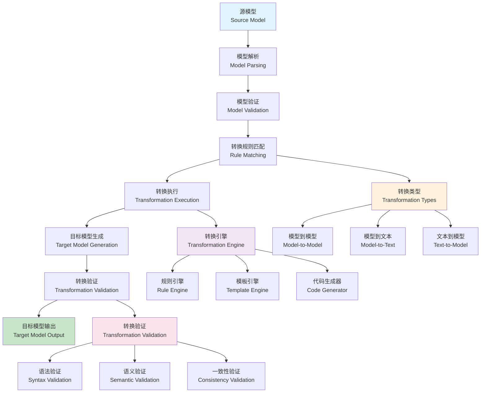

# 模型转换理论与技术 (Model Transformation Theory and Technology)

## 目录（Table of Contents）

- [模型转换理论与技术 (Model Transformation Theory and Technology)](#模型转换理论与技术-model-transformation-theory-and-technology)
  - [目录（Table of Contents）](#目录table-of-contents)
  - [概念定义](#概念定义)
    - [核心特征](#核心特征)
  - [理论基础](#理论基础)
    - [模型转换理论](#模型转换理论)
    - [模型转换流程](#模型转换流程)
    - [转换类型理论](#转换类型理论)
  - [核心组件](#核心组件)
    - [转换规则模型](#转换规则模型)
    - [转换引擎模型](#转换引擎模型)
    - [转换验证模型](#转换验证模型)
    - [转换策略模型](#转换策略模型)
  - [国际标准对标](#国际标准对标)
    - [模型转换标准](#模型转换标准)
      - [QVT (Query/View/Transformation)](#qvt-queryviewtransformation)
      - [ATL (Atlas Transformation Language)](#atl-atlas-transformation-language)
      - [Xtend](#xtend)
    - [模型驱动标准](#模型驱动标准)
      - [MDA (Model-Driven Architecture)](#mda-model-driven-architecture)
      - [EMF (Eclipse Modeling Framework)](#emf-eclipse-modeling-framework)
      - [Xtext](#xtext)
    - [图转换标准](#图转换标准)
      - [AGG (Attributed Graph Grammar)](#agg-attributed-graph-grammar)
      - [GROOVE](#groove)
  - [著名大学课程对标](#著名大学课程对标)
    - [软件工程课程](#软件工程课程)
      - [MIT 6.170 - Software Studio](#mit-6170---software-studio)
      - [Stanford CS210 - Software Engineering](#stanford-cs210---software-engineering)
      - [CMU 15-413 - Software Engineering](#cmu-15-413---software-engineering)
    - [编译器课程](#编译器课程)
      - [MIT 6.035 - Computer Language Engineering](#mit-6035---computer-language-engineering)
      - [Stanford CS143 - Compilers](#stanford-cs143---compilers)
      - [CMU 15-411 - Compiler Design](#cmu-15-411---compiler-design)
  - [工程实践](#工程实践)
    - [模型转换设计模式](#模型转换设计模式)
      - [规则链模式](#规则链模式)
      - [规则树模式](#规则树模式)
      - [规则网络模式](#规则网络模式)
    - [模型转换实现模式](#模型转换实现模式)
      - [转换引擎核心模式](#转换引擎核心模式)
      - [分布式转换模式](#分布式转换模式)
  - [最佳实践](#最佳实践)
    - [模型转换设计原则](#模型转换设计原则)
    - [转换规则设计原则](#转换规则设计原则)
    - [转换策略选择原则](#转换策略选择原则)
  - [应用案例](#应用案例)
    - [代码生成系统](#代码生成系统)
    - [模型同步系统](#模型同步系统)
  - [相关概念](#相关概念)
    - [核心概念关联](#核心概念关联)
    - [应用领域关联](#应用领域关联)
    - [行业应用关联](#行业应用关联)
  - [参考文献](#参考文献)

## 概念定义

模型转换理论与技术是一种将源模型自动转换为目标模型的技术。它通过转换规则、转换引擎、验证机制等方法，实现不同抽象层次、不同表示形式、不同领域模型之间的自动转换，是模型驱动工程的核心技术。

### 核心特征

1. **自动化转换**：基于规则的自动模型转换
2. **多方向转换**：支持双向和多向转换
3. **增量转换**：支持增量式模型更新
4. **转换验证**：确保转换的正确性和一致性
5. **可追溯性**：支持转换过程的追溯和调试

## 理论基础

### 模型转换理论

模型转换基于以下理论：

```text
ModelTransformation = (SourceModel, TargetModel, Rules, Engine, Validation)
```

其中：

- SourceModel：源模型（输入模型、源语言、源元模型）
- TargetModel：目标模型（输出模型、目标语言、目标元模型）
- Rules：转换规则（映射规则、转换逻辑、约束条件）
- Engine：转换引擎（规则执行、转换控制、优化策略）
- Validation：转换验证（正确性验证、一致性检查、质量保证）

### 模型转换流程



### 转换类型理论

```yaml
# 转换类型分类
transformation_types:
  model_to_model:
    description: "模型到模型转换"
    characteristics:
      - "同构转换"
      - "异构转换"
      - "抽象层次转换"
    examples:
      - "UML到ER图转换"
      - "BPMN到Petri网转换"
      - "SysML到Simulink转换"
      
  model_to_text:
    description: "模型到文本转换"
    characteristics:
      - "代码生成"
      - "文档生成"
      - "配置生成"
    examples:
      - "UML到Java代码"
      - "ER图到SQL DDL"
      - "BPMN到BPEL"
      
  text_to_model:
    description: "文本到模型转换"
    characteristics:
      - "反向工程"
      - "模型提取"
      - "模型重构"
    examples:
      - "Java代码到UML"
      - "SQL到ER图"
      - "XML到模型"
      
  model_to_model_synchronization:
    description: "模型同步转换"
    characteristics:
      - "双向同步"
      - "增量更新"
      - "冲突解决"
    examples:
      - "UML与代码同步"
      - "设计与实现同步"
      - "需求与设计同步"
```

## 核心组件

### 转换规则模型

```yaml
# 转换规则定义
transformation_rules:
  - name: "mapping_rules"
    description: "映射规则"
    
    rules:
      - name: "element_mapping"
        description: "元素映射"
        source: "UML.Class"
        target: "Java.Class"
        mapping:
          - source: "name"
            target: "className"
            type: "direct"
          - source: "attributes"
            target: "fields"
            type: "collection"
          - source: "operations"
            target: "methods"
            type: "collection"
            
      - name: "relationship_mapping"
        description: "关系映射"
        source: "UML.Association"
        target: "Java.Reference"
        mapping:
          - source: "source"
            target: "fromClass"
            type: "reference"
          - source: "target"
            target: "toClass"
            type: "reference"
          - source: "multiplicity"
            target: "cardinality"
            type: "transformation"
            
      - name: "constraint_mapping"
        description: "约束映射"
        source: "UML.Constraint"
        target: "Java.Annotation"
        mapping:
          - source: "specification"
            target: "annotationType"
            type: "lookup"
          - source: "constrainedElement"
            target: "annotatedElement"
            type: "reference"
            
  - name: "transformation_rules"
    description: "转换规则"
    
    rules:
      - name: "class_to_interface"
        description: "类到接口转换"
        condition: "class.isAbstract = true"
        transformation:
          - operation: "create"
            target: "Java.Interface"
            properties:
              name: "class.name"
              methods: "class.abstractMethods"
              
      - name: "association_to_field"
        description: "关联到字段转换"
        condition: "association.end1.multiplicity.max = 1"
        transformation:
          - operation: "create"
            target: "Java.Field"
            properties:
              name: "association.end2.name"
              type: "association.end2.type"
              visibility: "private"
              
      - name: "operation_to_method"
        description: "操作到方法转换"
        transformation:
          - operation: "create"
            target: "Java.Method"
            properties:
              name: "operation.name"
              returnType: "operation.returnType"
              parameters: "operation.parameters"
              body: "generateMethodBody(operation)"
```

### 转换引擎模型

```yaml
# 转换引擎定义
transformation_engines:
  - name: "rule_engine"
    description: "规则引擎"
    
    engine:
      - name: "rule_matching"
        description: "规则匹配"
        algorithm: "pattern_matching"
        features:
          - "模式匹配"
          - "条件评估"
          - "优先级处理"
          - "冲突解决"
          
      - name: "rule_execution"
        description: "规则执行"
        algorithm: "forward_chaining"
        features:
          - "规则调度"
          - "执行控制"
          - "状态管理"
          - "错误处理"
          
      - name: "rule_optimization"
        description: "规则优化"
        algorithm: "rule_analysis"
        features:
          - "规则分析"
          - "依赖分析"
          - "并行化"
          - "缓存优化"
          
  - name: "graph_transformation"
    description: "图转换引擎"
    
    engine:
      - name: "graph_matching"
        description: "图匹配"
        algorithm: "subgraph_isomorphism"
        features:
          - "子图匹配"
          - "模式匹配"
          - "约束检查"
          - "匹配优化"
          
      - name: "graph_rewriting"
        description: "图重写"
        algorithm: "graph_grammar"
        features:
          - "节点操作"
          - "边操作"
          - "属性更新"
          - "结构变换"
          
      - name: "graph_analysis"
        description: "图分析"
        algorithm: "graph_analysis"
        features:
          - "连通性分析"
          - "循环检测"
          - "依赖分析"
          - "影响分析"
          
  - name: "template_engine"
    description: "模板引擎"
    
    engine:
      - name: "template_parsing"
        description: "模板解析"
        algorithm: "template_parser"
        features:
          - "语法解析"
          - "变量绑定"
          - "表达式计算"
          - "控制结构"
          
      - name: "template_rendering"
        description: "模板渲染"
        algorithm: "template_renderer"
        features:
          - "变量替换"
          - "循环处理"
          - "条件处理"
          - "格式化输出"
          
      - name: "template_optimization"
        description: "模板优化"
        algorithm: "template_optimizer"
        features:
          - "缓存优化"
          - "预编译"
          - "并行渲染"
          - "内存优化"
```

### 转换验证模型

```yaml
# 转换验证定义
transformation_validation:
  - name: "correctness_validation"
    description: "正确性验证"
    
    validation:
      - name: "syntactic_validation"
        description: "语法验证"
        checks:
          - "语法正确性"
          - "类型一致性"
          - "引用完整性"
          - "约束满足性"
          
      - name: "semantic_validation"
        description: "语义验证"
        checks:
          - "语义一致性"
          - "行为等价性"
          - "属性保持性"
          - "约束保持性"
          
      - name: "structural_validation"
        description: "结构验证"
        checks:
          - "结构完整性"
          - "层次一致性"
          - "关系保持性"
          - "导航正确性"
          
  - name: "consistency_validation"
    description: "一致性验证"
    
    validation:
      - name: "model_consistency"
        description: "模型一致性"
        checks:
          - "内部一致性"
          - "跨模型一致性"
          - "版本一致性"
          - "配置一致性"
          
      - name: "transformation_consistency"
        description: "转换一致性"
        checks:
          - "转换规则一致性"
          - "转换结果一致性"
          - "转换过程一致性"
          - "转换历史一致性"
          
  - name: "quality_validation"
    description: "质量验证"
    
    validation:
      - name: "performance_validation"
        description: "性能验证"
        metrics:
          - "转换时间"
          - "内存使用"
          - "CPU使用"
          - "I/O操作"
          
      - name: "scalability_validation"
        description: "可扩展性验证"
        metrics:
          - "模型大小"
          - "规则数量"
          - "并发处理"
          - "资源使用"
          
      - name: "maintainability_validation"
        description: "可维护性验证"
        metrics:
          - "规则复杂度"
          - "代码质量"
          - "文档完整性"
          - "测试覆盖率"
```

### 转换策略模型

```yaml
# 转换策略定义
transformation_strategies:
  - name: "batch_transformation"
    description: "批量转换"
    strategy: "all_at_once"
    
    process:
      - "加载源模型"
      - "应用所有规则"
      - "生成目标模型"
      - "验证结果"
      
    advantages:
      - "简单直接"
      - "易于实现"
      - "结果完整"
      
    disadvantages:
      - "内存消耗大"
      - "错误定位困难"
      - "增量更新困难"
      
  - name: "incremental_transformation"
    description: "增量转换"
    strategy: "change_based"
    
    process:
      - "检测模型变化"
      - "识别影响范围"
      - "应用相关规则"
      - "更新目标模型"
      
    advantages:
      - "效率高"
      - "内存友好"
      - "支持实时更新"
      
    disadvantages:
      - "实现复杂"
      - "依赖管理困难"
      - "一致性保证困难"
      
  - name: "lazy_transformation"
    description: "惰性转换"
    strategy: "on_demand"
    
    process:
      - "延迟转换执行"
      - "按需转换元素"
      - "缓存转换结果"
      - "优化访问模式"
      
    advantages:
      - "资源友好"
      - "响应快速"
      - "支持大模型"
      
    disadvantages:
      - "首次访问慢"
      - "缓存管理复杂"
      - "一致性保证困难"
      
  - name: "parallel_transformation"
    description: "并行转换"
    strategy: "concurrent"
    
    process:
      - "分析依赖关系"
      - "并行执行规则"
      - "同步结果"
      - "合并输出"
      
    advantages:
      - "性能高"
      - "可扩展性好"
      - "支持大规模转换"
      
    disadvantages:
      - "实现复杂"
      - "调试困难"
      - "资源竞争"
```

## 国际标准对标

### 模型转换标准

#### QVT (Query/View/Transformation)

- **版本**：QVT 1.3
- **标准**：OMG QVT
- **核心概念**：QVT Relations、QVT Core、QVT Operational
- **工具支持**：Eclipse QVT、ATL、Medini QVT

#### ATL (Atlas Transformation Language)

- **版本**：ATL 4.0
- **标准**：Eclipse ATL
- **核心概念**：ATL Rules、Helpers、Lazy Rules
- **工具支持**：Eclipse ATL、ATL IDE

#### Xtend

- **版本**：Xtend 2.25+
- **标准**：Eclipse Xtend
- **核心概念**：Template Expressions、Active Annotations
- **工具支持**：Eclipse Xtend、Xtext

### 模型驱动标准

#### MDA (Model-Driven Architecture)

- **标准**：OMG MDA
- **版本**：MDA 2.0
- **核心概念**：PIM、PSM、CIM、模型转换
- **工具支持**：Eclipse Modeling Framework、ATL、QVT

#### EMF (Eclipse Modeling Framework)

- **版本**：EMF 2.35+
- **标准**：Eclipse EMF
- **核心概念**：Ecore、EMF Model、EMF Edit、EMF Query
- **工具支持**：Eclipse EMF、EMF Compare、EMF Validation

#### Xtext

- **版本**：Xtext 2.30+
- **标准**：Eclipse Xtext
- **核心概念**：Grammar、Code Generation、IDE
- **工具支持**：Eclipse Xtext、Xtext IDE

### 图转换标准

#### AGG (Attributed Graph Grammar)

- **版本**：AGG 2.0
- **标准**：Graph Transformation
- **核心概念**：Graph Grammar、Rule Application、Attributed Graphs
- **工具支持**：AGG Tool、GROOVE

#### GROOVE

- **版本**：GROOVE 6.0+
- **标准**：Graph Transformation
- **核心概念**：Graph States、Rules、Simulation
- **工具支持**：GROOVE Tool、GROOVE Simulator

## 著名大学课程对标

### 软件工程课程

#### MIT 6.170 - Software Studio

- **课程内容**：软件设计、架构、模型驱动开发
- **模型转换相关**：模型转换、代码生成、工具链集成
- **实践项目**：模型转换工具
- **相关技术**：ATL、QVT、EMF

#### Stanford CS210 - Software Engineering

- **课程内容**：软件工程、系统设计、模型驱动工程
- **模型转换相关**：模型转换技术、转换验证、工具开发
- **实践项目**：模型转换框架
- **相关技术**：Xtend、Xtext、EMF

#### CMU 15-413 - Software Engineering

- **课程内容**：软件工程、分布式系统、模型转换
- **模型转换相关**：分布式模型转换、转换优化、性能分析
- **实践项目**：分布式模型转换系统
- **相关技术**：ATL、QVT、EMF

### 编译器课程

#### MIT 6.035 - Computer Language Engineering

- **课程内容**：编译器设计、代码生成、程序转换
- **模型转换相关**：AST转换、代码生成、优化转换
- **实践项目**：编译器转换器
- **相关技术**：LLVM、代码生成、优化

#### Stanford CS143 - Compilers

- **课程内容**：编译器原理、程序分析、代码转换
- **模型转换相关**：中间代码转换、目标代码生成、优化
- **实践项目**：编译器后端
- **相关技术**：代码生成、优化、目标平台

#### CMU 15-411 - Compiler Design

- **课程内容**：编译器设计、程序转换、代码生成
- **模型转换相关**：程序转换、代码生成、优化技术
- **实践项目**：编译器实现
- **相关技术**：代码生成、优化、目标平台

## 工程实践

### 模型转换设计模式

#### 规则链模式

```yaml
# 规则链模式
rule_chain_pattern:
  description: "规则按链式顺序执行"
  structure:
    - name: "规则链"
      description: "规则依次执行"
      rules:
        - "validation_rule"
        - "transformation_rule"
        - "optimization_rule"
        - "generation_rule"
      execution:
        type: "sequential"
        stop_on_error: true
        
  benefits:
    - "清晰的执行顺序"
    - "易于调试和维护"
    - "支持复杂转换逻辑"
    
  use_cases:
    - "模型到代码转换"
    - "模型到模型转换"
    - "代码重构"
```

#### 规则树模式

```yaml
# 规则树模式
rule_tree_pattern:
  description: "规则按树形结构组织"
  structure:
    - name: "根规则"
      description: "主要转换规则"
      rule: "main_transformation_rule"
      branches:
        - condition: "is_class"
          rule: "class_transformation_rule"
        - condition: "is_interface"
          rule: "interface_transformation_rule"
        - condition: "is_enum"
          rule: "enum_transformation_rule"
        - condition: "default"
          rule: "default_transformation_rule"
          
  benefits:
    - "层次化的规则组织"
    - "支持复杂条件分支"
    - "易于理解和维护"
    
  use_cases:
    - "分类转换"
    - "条件转换"
    - "多路径转换"
```

#### 规则网络模式

```yaml
# 规则网络模式
rule_network_pattern:
  description: "规则按网络结构组织"
  structure:
    - name: "规则节点"
      description: "独立的规则节点"
      nodes:
        - "validation_node"
        - "transformation_node"
        - "optimization_node"
        - "generation_node"
      connections:
        - from: "validation_node"
          to: "transformation_node"
          condition: "validation_passed"
        - from: "transformation_node"
          to: "optimization_node"
          condition: "transformation_completed"
        - from: "optimization_node"
          to: "generation_node"
          condition: "optimization_completed"
          
  benefits:
    - "灵活的规则组合"
    - "支持复杂依赖关系"
    - "易于扩展和修改"
    
  use_cases:
    - "复杂转换流程"
    - "多步骤转换"
    - "工作流转换"
```

### 模型转换实现模式

#### 转换引擎核心模式

```yaml
# 转换引擎核心模式
transformation_engine_core_pattern:
  description: "转换引擎的核心组件"
  components:
    - name: "规则存储"
      description: "存储转换规则"
      features:
        - "规则持久化"
        - "版本管理"
        - "规则查询"
        
    - name: "规则编译器"
      description: "编译转换规则"
      features:
        - "语法解析"
        - "类型检查"
        - "代码生成"
        
    - name: "规则执行引擎"
      description: "执行转换规则"
      features:
        - "规则匹配"
        - "条件评估"
        - "动作执行"
        
    - name: "模型管理器"
      description: "管理源模型和目标模型"
      features:
        - "模型加载"
        - "模型存储"
        - "模型验证"
```

#### 分布式转换模式

```yaml
# 分布式转换模式
distributed_transformation_pattern:
  description: "分布式环境下的模型转换"
  challenges:
    - "规则分发"
    - "状态同步"
    - "一致性保证"
    - "性能优化"
    
  solutions:
    - name: "规则分发"
      description: "将规则分发到多个节点"
      implementation:
        - "规则分片"
        - "负载均衡"
        - "动态调度"
        
    - name: "状态管理"
      description: "管理分布式状态"
      implementation:
        - "状态复制"
        - "一致性协议"
        - "故障恢复"
        
    - name: "缓存机制"
      description: "规则和结果缓存"
      implementation:
        - "规则缓存"
        - "结果缓存"
        - "缓存失效"
```

## 最佳实践

### 模型转换设计原则

1. **模块化设计**：转换规则应该模块化，便于维护和扩展
2. **可配置性**：支持配置化的转换策略
3. **可扩展性**：支持新规则和新转换类型的扩展
4. **质量保证**：转换结果应该有质量保证机制

### 转换规则设计原则

1. **简洁性**：转换规则应该简洁易懂
2. **可重用性**：规则应该支持重用和组合
3. **可测试性**：规则应该支持测试和验证
4. **性能优化**：规则应该高效执行

### 转换策略选择原则

1. **问题匹配**：选择适合问题类型的转换策略
2. **性能要求**：考虑性能要求选择合适的策略
3. **维护成本**：考虑维护成本选择策略
4. **团队技能**：考虑团队技能选择策略

## 应用案例

### 代码生成系统

```yaml
# 代码生成系统
code_generation_system:
  description: "基于模型转换的代码生成系统"
  components:
    - name: "模型解析"
      description: "解析源模型"
      features:
        - "模型加载"
        - "语法检查"
        - "语义验证"
        
    - name: "转换引擎"
      description: "执行模型转换"
      features:
        - "规则匹配"
        - "转换执行"
        - "结果生成"
        
    - name: "代码生成"
      description: "生成目标代码"
      features:
        - "模板渲染"
        - "代码格式化"
        - "文件生成"
        
    - name: "质量验证"
      description: "验证生成代码"
      features:
        - "语法检查"
        - "语义检查"
        - "测试生成"
```

### 模型同步系统

```yaml
# 模型同步系统
model_synchronization_system:
  description: "基于模型转换的模型同步系统"
  components:
    - name: "变更检测"
      description: "检测模型变更"
      features:
        - "增量检测"
        - "变更分析"
        - "影响评估"
        
    - name: "同步引擎"
      description: "执行模型同步"
      features:
        - "双向转换"
        - "冲突解决"
        - "一致性保证"
        
    - name: "版本管理"
      description: "管理模型版本"
      features:
        - "版本控制"
        - "分支管理"
        - "合并处理"
        
    - name: "冲突解决"
      description: "解决同步冲突"
      features:
        - "冲突检测"
        - "冲突分析"
        - "冲突解决"
```

## 相关概念

### 核心概念关联

- [形式化建模](./formal-modeling.md) - 形式化建模为模型转换提供理论基础
- [抽象语法树](./abstract-syntax-tree.md) - AST为模型转换提供结构化表示
- [领域特定语言](./domain-specific-language.md) - DSL为模型转换提供领域特定表达
- [代码生成](./code-generation.md) - 代码生成是模型转换的重要应用
- [自动推理](./automated-reasoning.md) - 自动推理用于模型转换的智能处理
- [递归建模](./recursive-modeling.md) - 递归建模支持复杂模型转换的层次化处理

### 应用领域关联

- [数据建模](../data-model/theory.md) - 数据模型转换和格式转换
- [功能建模](../functional-model/theory.md) - 功能模型转换和业务逻辑转换
- [交互建模](../interaction-model/theory.md) - 交互模型转换和接口转换
- [运行时建模](../runtime-model/theory.md) - 运行时模型转换和配置转换

### 行业应用关联

- [金融架构](../../industry-model/finance-architecture/) - 金融业务模型转换和合规转换
- [AI基础设施](../../industry-model/ai-infrastructure-architecture/) - AI模型转换和推理转换
- [云原生架构](../../industry-model/cloud-native-architecture/) - 云配置转换和部署转换

## 参考文献

1. Czarnecki, K., & Helsen, S. (2006). "Feature-based survey of model transformation approaches"
2. Mens, T., & Van Gorp, P. (2006). "A taxonomy of model transformation"
3. Jouault, F., et al. (2008). "ATL: A model transformation tool"
4. Bézivin, J. (2005). "On the unification power of models"
5. Schmidt, D. C. (2006). "Model-driven engineering"
6. Sendall, S., & Kozaczynski, W. (2003). "Model transformation: the heart and soul of model-driven software development"
