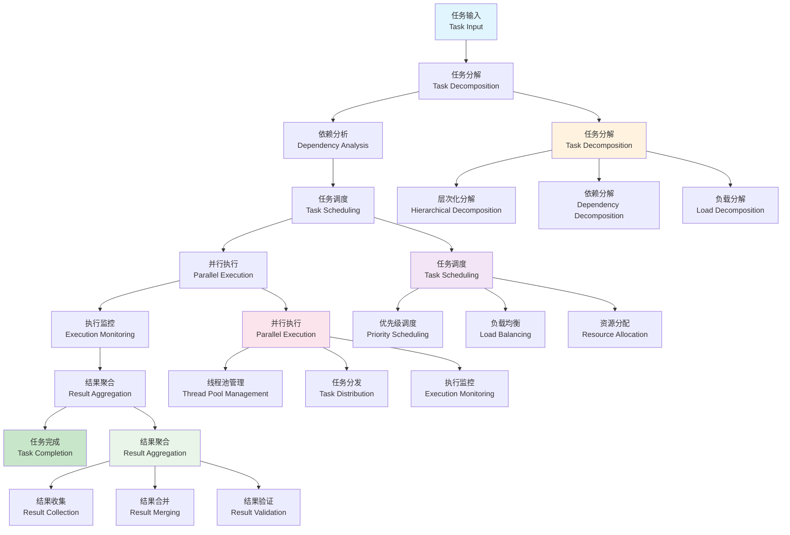

# 多线程任务协调器 (Multi-threaded Task Coordinator)

## 目录（Table of Contents）

- [多线程任务协调器 (Multi-threaded Task Coordinator)](#多线程任务协调器-multi-threaded-task-coordinator)
  - [目录（Table of Contents）](#目录table-of-contents)
  - [概念定义](#概念定义)
    - [核心特征](#核心特征)
  - [理论基础](#理论基础)
    - [任务协调理论](#任务协调理论)
    - [任务协调流程](#任务协调流程)
    - [多线程协调架构](#多线程协调架构)
  - [核心组件](#核心组件)
    - [任务分解引擎](#任务分解引擎)
    - [智能调度器](#智能调度器)
    - [并行执行管理器](#并行执行管理器)
  - [多线程并行处理](#多线程并行处理)
    - [并行执行策略](#并行执行策略)
    - [任务协调策略](#任务协调策略)
  - [工程实践](#工程实践)
    - [任务协调框架设计](#任务协调框架设计)
    - [性能优化策略](#性能优化策略)
  - [应用案例](#应用案例)
    - [大规模模型并行处理](#大规模模型并行处理)
    - [实时协作开发协调](#实时协作开发协调)
  - [国际标准对标](#国际标准对标)
    - [任务调度标准](#任务调度标准)
      - [OpenMP](#openmp)
      - [MPI](#mpi)
      - [Kubernetes](#kubernetes)
    - [工作流引擎标准](#工作流引擎标准)
      - [Apache Airflow](#apache-airflow)
      - [Apache Beam](#apache-beam)
      - [Temporal](#temporal)
  - [著名大学课程对标](#著名大学课程对标)
    - [并行计算课程](#并行计算课程)
      - [MIT 6.172 - Performance Engineering of Software Systems](#mit-6172---performance-engineering-of-software-systems)
      - [Stanford CS149 - Parallel Computing](#stanford-cs149---parallel-computing)
      - [CMU 15-418 - Parallel Computer Architecture and Programming](#cmu-15-418---parallel-computer-architecture-and-programming)
    - [分布式系统课程](#分布式系统课程)
      - [MIT 6.824 - Distributed Systems](#mit-6824---distributed-systems)
      - [Stanford CS244B - Distributed Systems](#stanford-cs244b---distributed-systems)
      - [CMU 15-440 - Distributed Systems](#cmu-15-440---distributed-systems)
  - [相关概念](#相关概念)
    - [核心概念关联](#核心概念关联)
    - [应用领域关联](#应用领域关联)
    - [行业应用关联](#行业应用关联)
  - [参考文献](#参考文献)

## 概念定义

多线程任务协调器是一个核心组件，负责协调和管理形式化框架中的多个并行任务，实现任务的分解、调度、执行、监控和结果聚合，确保多线程多任务的高效执行。

### 核心特征

1. **任务分解**：将复杂任务分解为可并行执行的子任务
2. **智能调度**：基于负载和优先级智能调度任务
3. **并行执行**：支持多线程并行执行多个任务
4. **结果聚合**：将并行执行的结果进行聚合和整合
5. **故障恢复**：支持任务失败时的自动恢复和重试

## 理论基础

### 任务协调理论

任务协调基于以下理论：

```text
TaskCoordination = (Decomposition, Scheduling, Execution, Monitoring, Aggregation)
```

其中：

- Decomposition：任务分解策略
- Scheduling：任务调度算法
- Execution：并行执行管理
- Monitoring：执行监控和状态管理
- Aggregation：结果聚合和整合

### 任务协调流程



### 多线程协调架构

```yaml
# 多线程协调架构
multi_threaded_coordination_architecture:
  description: "支持多线程并行的任务协调架构"
  architecture:
    - name: "task_decomposition_engine"
      description: "任务分解引擎"
      features:
        - "智能任务分解"
        - "依赖关系分析"
        - "负载评估"
        - "分解策略选择"
      
    - name: "intelligent_scheduler"
      description: "智能调度器"
      features:
        - "负载感知调度"
        - "优先级管理"
        - "资源分配"
        - "动态调整"
      
    - name: "parallel_execution_manager"
      description: "并行执行管理器"
      features:
        - "线程池管理"
        - "任务分发"
        - "执行监控"
        - "性能优化"
```

## 核心组件

### 任务分解引擎

```yaml
# 任务分解引擎
task_decomposition_engine:
  description: "将复杂任务分解为可并行执行的子任务"
  decomposition_strategies:
    - name: "hierarchical_decomposition"
      description: "层次化分解策略"
      strategies:
        - "树形结构分解"
        - "层次依赖管理"
        - "粒度控制"
        - "平衡优化"
      
    - name: "dependency_based_decomposition"
      description: "基于依赖关系的分解策略"
      strategies:
        - "依赖图分析"
        - "拓扑排序"
        - "并行度优化"
        - "瓶颈识别"
      
    - name: "load_based_decomposition"
      description: "基于负载的分解策略"
      strategies:
        - "负载评估"
        - "动态分解"
        - "负载均衡"
        - "性能预测"
```

### 智能调度器

```yaml
# 智能调度器
intelligent_scheduler:
  description: "基于多种策略的智能任务调度器"
  scheduling_strategies:
    - name: "priority_based_scheduling"
      description: "基于优先级的调度"
      strategies:
        - "静态优先级"
        - "动态优先级"
        - "优先级继承"
        - "优先级反转预防"
      
    - name: "load_balancing_scheduling"
      description: "负载均衡调度"
      strategies:
        - "轮询调度"
        - "最少连接调度"
        - "加权轮询调度"
        - "自适应调度"
      
    - name: "deadline_aware_scheduling"
      description: "截止时间感知调度"
      strategies:
        - "最早截止时间优先"
        - "最小松弛时间优先"
        - "截止时间监控"
        - "超时处理"
```

### 并行执行管理器

```yaml
# 并行执行管理器
parallel_execution_manager:
  description: "管理多线程并行执行"
  management_aspects:
    - name: "thread_pool_management"
      description: "线程池管理"
      management:
        - "动态线程创建"
        - "线程复用策略"
        - "线程生命周期管理"
        - "资源监控"
      
    - name: "task_distribution"
      description: "任务分发"
      distribution:
        - "任务队列管理"
        - "负载分发算法"
        - "任务优先级排序"
        - "任务依赖处理"
      
    - name: "execution_monitoring"
      description: "执行监控"
      monitoring:
        - "执行状态跟踪"
        - "性能指标收集"
        - "异常检测"
        - "资源使用监控"
```

## 多线程并行处理

### 并行执行策略

```yaml
# 并行执行策略
parallel_execution_strategies:
  description: "多线程并行执行策略"
  strategies:
    - name: "data_parallelism"
      description: "数据并行策略"
      approach:
        - "数据分片"
        - "并行处理"
        - "结果合并"
        - "负载均衡"
      
    - name: "task_parallelism"
      description: "任务并行策略"
      approach:
        - "任务分解"
        - "并行执行"
        - "依赖管理"
        - "同步协调"
      
    - name: "pipeline_parallelism"
      description: "流水线并行策略"
      approach:
        - "阶段划分"
        - "流水线调度"
        - "缓冲区管理"
        - "吞吐量优化"
```

### 任务协调策略

```yaml
# 任务协调策略
task_coordination_strategies:
  description: "多任务协调策略"
  strategies:
    - name: "master_worker_coordination"
      description: "主从协调策略"
      approach:
        - "主节点任务分发"
        - "工作节点执行"
        - "结果收集"
        - "负载监控"
      
    - name: "peer_to_peer_coordination"
      description: "对等协调策略"
      approach:
        - "对等任务交换"
        - "负载共享"
        - "结果同步"
        - "故障检测"
      
    - name: "hierarchical_coordination"
      description: "层次化协调策略"
      approach:
        - "层次任务分解"
        - "分层调度"
        - "结果聚合"
        - "全局优化"
```

## 工程实践

### 任务协调框架设计

```yaml
# 任务协调框架设计
task_coordination_framework:
  description: "任务协调框架的设计原则"
  design_principles:
    - name: "scalability"
      description: "可扩展性设计"
      principles:
        - "水平扩展能力"
        - "垂直扩展能力"
        - "动态负载调整"
        - "性能线性增长"
      
    - name: "reliability"
      description: "可靠性设计"
      principles:
        - "故障隔离"
        - "自动恢复"
        - "数据一致性"
        - "服务可用性"
      
    - name: "efficiency"
      description: "效率设计"
      principles:
        - "资源利用率优化"
        - "任务调度优化"
        - "通信开销最小化"
        - "性能监控优化"
```

### 性能优化策略

```yaml
# 性能优化策略
performance_optimization:
  description: "任务协调的性能优化策略"
  optimization_strategies:
    - name: "scheduling_optimization"
      description: "调度优化"
      strategies:
        - "调度算法优化"
        - "负载预测"
        - "动态调整"
        - "缓存优化"
      
    - name: "communication_optimization"
      description: "通信优化"
      strategies:
        - "批量通信"
        - "异步通信"
        - "压缩传输"
        - "本地缓存"
      
    - name: "resource_optimization"
      description: "资源优化"
      strategies:
        - "资源池化"
        - "动态分配"
        - "垃圾回收优化"
        - "内存管理优化"
```

## 应用案例

### 大规模模型并行处理

```yaml
# 大规模模型并行处理
large_scale_model_parallel_processing:
  description: "协调大规模模型的并行处理"
  processing_scenarios:
    - name: "distributed_model_verification"
      description: "分布式模型验证"
      coordination:
        - "验证任务分解"
        - "分布式调度"
        - "结果收集聚合"
        - "一致性保证"
      
    - name: "parallel_code_generation"
      description: "并行代码生成"
      coordination:
        - "生成任务分解"
        - "模板并行处理"
        - "代码片段聚合"
        - "质量验证"
      
    - name: "concurrent_model_transformation"
      description: "并发模型转换"
      coordination:
        - "转换规则并行化"
        - "模型分片转换"
        - "结果合并验证"
        - "依赖关系管理"
```

### 实时协作开发协调

```yaml
# 实时协作开发协调
real_time_collaborative_development_coordination:
  description: "协调实时协作开发任务"
  coordination_aspects:
    - name: "multi_user_task_coordination"
      description: "多用户任务协调"
      aspects:
        - "用户任务分配"
        - "冲突检测解决"
        - "结果同步"
        - "权限管理"
      
    - name: "version_control_coordination"
      description: "版本控制协调"
      aspects:
        - "变更跟踪"
        - "分支管理"
        - "合并策略"
        - "冲突解决"
      
    - name: "continuous_integration_coordination"
      description: "持续集成协调"
      aspects:
        - "构建任务调度"
        - "测试并行化"
        - "部署协调"
        - "质量门控"
```

## 国际标准对标

### 任务调度标准

#### OpenMP

- **标准**：OpenMP 5.0
- **版本**：OpenMP 5.0+
- **核心概念**：共享内存并行、任务并行、SIMD
- **工具支持**：GCC、Clang、Intel Compiler

#### MPI

- **标准**：MPI 4.0
- **版本**：MPI 4.0+
- **核心概念**：分布式内存并行、消息传递、集合通信
- **工具支持**：OpenMPI、MPICH、Intel MPI

#### Kubernetes

- **标准**：Kubernetes 1.25+
- **版本**：Kubernetes 1.25+
- **核心概念**：容器编排、任务调度、负载均衡
- **工具支持**：kubectl、Helm、Operator Framework

### 工作流引擎标准

#### Apache Airflow

- **标准**：Apache Airflow
- **版本**：Airflow 2.5+
- **核心概念**：工作流编排、任务调度、依赖管理
- **工具支持**：Airflow Web UI、CLI、REST API

#### Apache Beam

- **标准**：Apache Beam
- **版本**：Beam 2.40+
- **核心概念**：批流统一、并行处理、窗口化
- **工具支持**：Beam SDKs、Runner、IO Connectors

#### Temporal

- **标准**：Temporal
- **版本**：Temporal 1.20+
- **核心概念**：工作流编排、状态管理、故障恢复
- **工具支持**：Temporal Server、SDKs、CLI

## 著名大学课程对标

### 并行计算课程

#### MIT 6.172 - Performance Engineering of Software Systems

- **课程内容**：软件系统性能工程、并行计算、优化技术
- **任务协调相关**：并行算法、负载均衡、性能优化
- **实践项目**：并行任务协调系统
- **相关技术**：OpenMP、MPI、CUDA

#### Stanford CS149 - Parallel Computing

- **课程内容**：并行计算、多线程编程、分布式系统
- **任务协调相关**：任务分解、调度算法、协调机制
- **实践项目**：分布式任务协调框架
- **相关技术**：Threading、MPI、Distributed Computing

#### CMU 15-418 - Parallel Computer Architecture and Programming

- **课程内容**：并行计算机架构、并行编程、性能优化
- **任务协调相关**：架构优化、并行算法、任务调度
- **实践项目**：高性能任务协调系统
- **相关技术**：SIMD、GPU Computing、Distributed Computing

### 分布式系统课程

#### MIT 6.824 - Distributed Systems

- **课程内容**：分布式系统、一致性、容错性
- **任务协调相关**：分布式协调、一致性协议、故障恢复
- **实践项目**：分布式任务协调系统
- **相关技术**：Raft、Paxos、Distributed Coordination

#### Stanford CS244B - Distributed Systems

- **课程内容**：分布式系统、网络编程、系统设计
- **任务协调相关**：网络通信、任务分发、结果聚合
- **实践项目**：网络任务协调系统
- **相关技术**：gRPC、Protocol Buffers、Network Programming

#### CMU 15-440 - Distributed Systems

- **课程内容**：分布式系统、系统设计、性能优化
- **任务协调相关**：系统架构、任务调度、性能监控
- **实践项目**：高性能分布式协调系统
- **相关技术**：System Design、Performance Tuning、Distributed Coordination

## 相关概念

### 核心概念关联

- [性能优化与扩展](./performance-optimization.md) - 性能优化为多线程任务协调提供性能提升
- [智能代码补全](./intelligent-code-completion.md) - 智能代码补全使用多线程任务协调提升补全效率
- [形式化验证](./formal-verification.md) - 形式化验证使用多线程任务协调提升验证效率
- [模型转换](./model-transformation.md) - 模型转换使用多线程任务协调提升转换效率
- [自动推理](./automated-reasoning.md) - 自动推理使用多线程任务协调提升推理效率
- [递归建模](./recursive-modeling.md) - 递归建模使用多线程任务协调提升建模效率

### 应用领域关联

- [数据建模](../data-model/theory.md) - 数据模型多线程处理和并行查询
- [功能建模](../functional-model/theory.md) - 功能模型多线程处理和并行业务逻辑
- [交互建模](../interaction-model/theory.md) - 交互模型多线程处理和并行接口处理
- [运行时建模](../runtime-model/theory.md) - 运行时模型多线程处理和并行配置管理

### 行业应用关联

- [金融架构](../../industry-model/finance-architecture/) - 金融系统多线程任务协调和并行交易处理
- [AI基础设施](../../industry-model/ai-infrastructure-architecture/) - AI模型多线程任务协调和并行推理
- [云原生架构](../../industry-model/cloud-native-architecture/) - 云服务多线程任务协调和并行资源管理

## 参考文献

1. Mattson, T. G., et al. (2004). "Patterns for Parallel Programming"
2. Herlihy, M., & Shavit, N. (2012). "The Art of Multiprocessor Programming"
3. Lamport, L. (1998). "The Part-Time Parliament"
4. Ongaro, D., & Ousterhout, J. (2014). "In Search of an Understandable Consensus Algorithm"
5. Dean, J., & Ghemawat, S. (2008). "MapReduce: Simplified Data Processing on Large Clusters"
6. Zaharia, M., et al. (2010). "Spark: Cluster Computing with Working Sets"
