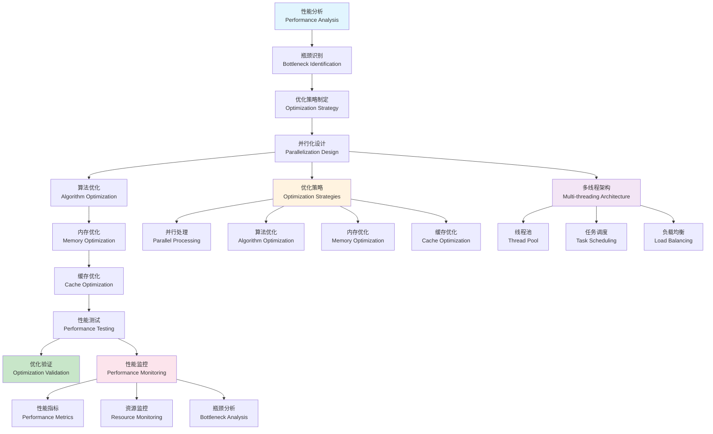

# 性能优化与扩展 (Performance Optimization and Extension)

**本节要点**：（1）性能优化的概念、理论与流程；（2）核心组件（多线程并行、内存优化）与架构；（3）工程实践与应用案例。  
**预计阅读时间**：约 35–45 分钟；建议分 2–3 次阅读，每次 1–2 节。

## 目录（Table of Contents）

- [性能优化与扩展 (Performance Optimization and Extension)](#性能优化与扩展-performance-optimization-and-extension)
  - [目录（Table of Contents）](#目录table-of-contents)
  - [概念定义](#概念定义)
    - [核心特征](#核心特征)
  - [理论基础](#理论基础)
    - [性能优化理论](#性能优化理论)
    - [性能优化流程](#性能优化流程)
    - [多线程性能架构](#多线程性能架构)
  - [核心组件](#核心组件)
    - [多线程并行处理引擎](#多线程并行处理引擎)
    - [内存优化引擎](#内存优化引擎)
    - [算法优化引擎](#算法优化引擎)
  - [多线程并行处理](#多线程并行处理)
    - [并行算法策略](#并行算法策略)
    - [线程管理策略](#线程管理策略)
  - [工程实践](#工程实践)
    - [性能优化框架设计](#性能优化框架设计)
    - [性能测试与评估](#性能测试与评估)
  - [应用案例](#应用案例)
    - [大规模模型并行处理](#大规模模型并行处理)
    - [实时性能优化](#实时性能优化)
  - [国际标准对标](#国际标准对标)
    - [性能优化标准](#性能优化标准)
      - [Java性能优化](#java性能优化)
      - [C++性能优化](#c性能优化)
      - [Python性能优化](#python性能优化)
    - [并行计算标准](#并行计算标准)
      - [OpenMP](#openmp)
      - [MPI](#mpi)
      - [CUDA](#cuda)
  - [著名大学课程对标](#著名大学课程对标)
    - [性能优化课程](#性能优化课程)
      - [MIT 6.172 - Performance Engineering of Software Systems](#mit-6172---performance-engineering-of-software-systems)
      - [Stanford CS149 - Parallel Computing](#stanford-cs149---parallel-computing)
      - [CMU 15-418 - Parallel Computer Architecture and Programming](#cmu-15-418---parallel-computer-architecture-and-programming)
    - [系统优化课程](#系统优化课程)
      - [MIT 6.033 - Computer System Engineering](#mit-6033---computer-system-engineering)
      - [Stanford CS140 - Operating Systems](#stanford-cs140---operating-systems)
      - [CMU 15-410 - Operating System Design and Implementation](#cmu-15-410---operating-system-design-and-implementation)
  - [相关概念](#相关概念)
    - [核心概念关联](#核心概念关联)
    - [应用领域关联](#应用领域关联)
    - [行业应用关联](#行业应用关联)
  - [参考文献](#参考文献)

## 概念定义

性能优化与扩展是指通过多线程并行处理、算法优化、内存管理优化、缓存策略等技术手段，提升形式化框架的整体性能和可扩展性，支持大规模模型的高效处理。

### 核心特征

1. **多线程并行**：支持多线程并行处理
2. **算法优化**：优化核心算法性能
3. **内存管理**：高效的内存使用和回收
4. **缓存策略**：智能缓存和预取
5. **可扩展性**：支持水平扩展和垂直扩展

## 理论基础

### 性能优化理论

性能优化基于以下理论：

```text
PerformanceOptimization = (Parallelism, Algorithm, Memory, Cache, Scalability)
```

其中：

- Parallelism：并行处理能力
- Algorithm：算法优化
- Memory：内存管理优化
- Cache：缓存策略优化
- Scalability：可扩展性设计

### 性能优化流程



### 多线程性能架构

```yaml
# 多线程性能架构
multi_threaded_performance_architecture:
  description: "支持多线程并行的性能优化架构"
  architecture:
    - name: "parallel_processing_engine"
      description: "并行处理引擎"
      features:
        - "任务分解与调度"
        - "负载均衡"
        - "线程池管理"
        - "性能监控"
      
    - name: "memory_optimization_engine"
      description: "内存优化引擎"
      features:
        - "内存池管理"
        - "垃圾回收优化"
        - "内存压缩"
        - "缓存管理"
      
    - name: "algorithm_optimization_engine"
      description: "算法优化引擎"
      features:
        - "算法并行化"
        - "数据结构优化"
        - "启发式算法"
        - "性能分析"
```

## 核心组件

### 多线程并行处理引擎

```yaml
# 多线程并行处理引擎
parallel_processing_engine:
  description: "多线程并行处理引擎实现"
  components:
    - name: "task_decomposer"
      description: "任务分解器"
      implementation:
        - "任务粒度分析"
        - "依赖关系分析"
        - "负载评估"
        - "分解策略选择"
      
    - name: "thread_pool_manager"
      description: "线程池管理器"
      implementation:
        - "动态线程创建"
        - "线程复用策略"
        - "负载均衡算法"
        - "性能监控"
      
    - name: "scheduler"
      description: "任务调度器"
      implementation:
        - "优先级调度"
        - "公平调度"
        - "工作窃取算法"
        - "死锁预防"
```

### 内存优化引擎

```yaml
# 内存优化引擎
memory_optimization_engine:
  description: "内存使用优化引擎"
  optimization_strategies:
    - name: "memory_pool_management"
      description: "内存池管理"
      strategies:
        - "对象池设计"
        - "内存分片管理"
        - "碎片整理"
        - "预分配策略"
      
    - name: "garbage_collection_optimization"
      description: "垃圾回收优化"
      strategies:
        - "分代回收"
        - "并发回收"
        - "增量回收"
        - "压缩回收"
      
    - name: "memory_compression"
      description: "内存压缩"
      strategies:
        - "数据压缩"
        - "指针压缩"
        - "结构压缩"
        - "延迟解压"
```

### 算法优化引擎

```yaml
# 算法优化引擎
algorithm_optimization_engine:
  description: "算法性能优化引擎"
  optimization_methods:
    - name: "algorithm_parallelization"
      description: "算法并行化"
      methods:
        - "数据并行化"
        - "任务并行化"
        - "流水线并行化"
        - "分治并行化"
      
    - name: "data_structure_optimization"
      description: "数据结构优化"
      methods:
        - "缓存友好设计"
        - "内存布局优化"
        - "访问模式优化"
        - "压缩数据结构"
      
    - name: "heuristic_optimization"
      description: "启发式优化"
      methods:
        - "局部搜索"
        - "遗传算法"
        - "模拟退火"
        - "禁忌搜索"
```

## 多线程并行处理

### 并行算法策略

```yaml
# 并行算法策略
parallel_algorithm_strategies:
  description: "多线程并行算法策略"
  strategies:
    - name: "data_parallelism"
      description: "数据并行策略"
      approach:
        - "数据分片"
        - "并行处理"
        - "结果合并"
        - "负载均衡"
      
    - name: "task_parallelism"
      description: "任务并行策略"
      approach:
        - "任务分解"
        - "并行执行"
        - "依赖管理"
        - "同步协调"
      
    - name: "pipeline_parallelism"
      description: "流水线并行策略"
      approach:
        - "阶段划分"
        - "流水线调度"
        - "缓冲区管理"
        - "吞吐量优化"
```

### 线程管理策略

```yaml
# 线程管理策略
thread_management_strategies:
  description: "多线程管理的策略"
  strategies:
    - name: "thread_pool_strategies"
      description: "线程池策略"
      strategies:
        - "固定大小线程池"
        - "可扩展线程池"
        - "工作窃取线程池"
        - "优先级线程池"
      
    - name: "load_balancing_strategies"
      description: "负载均衡策略"
      strategies:
        - "轮询调度"
        - "最少连接调度"
        - "加权轮询调度"
        - "自适应调度"
      
    - name: "synchronization_strategies"
      description: "同步策略"
      strategies:
        - "锁机制"
        - "无锁数据结构"
        - "原子操作"
        - "内存屏障"
```

## 工程实践

### 性能优化框架设计

```yaml
# 性能优化框架设计
performance_optimization_framework:
  description: "性能优化框架的设计原则"
  design_principles:
    - name: "modularity"
      description: "模块化设计"
      principles:
        - "清晰的模块边界"
        - "松耦合设计"
        - "高内聚实现"
        - "接口标准化"
      
    - name: "scalability"
      description: "可扩展性设计"
      principles:
        - "水平扩展能力"
        - "垂直扩展能力"
        - "动态负载调整"
        - "性能线性增长"
      
    - name: "monitoring"
      description: "监控设计"
      principles:
        - "性能指标监控"
        - "资源使用监控"
        - "瓶颈识别"
        - "预警机制"
```

### 性能测试与评估

```yaml
# 性能测试与评估
performance_testing_and_evaluation:
  description: "性能测试与评估方法"
  testing_methods:
    - name: "benchmark_testing"
      description: "基准测试"
      methods:
        - "标准基准测试"
        - "自定义基准测试"
        - "压力测试"
        - "稳定性测试"
      
    - name: "profiling"
      description: "性能分析"
      methods:
        - "CPU分析"
        - "内存分析"
        - "I/O分析"
        - "网络分析"
      
    - name: "monitoring"
      description: "性能监控"
      methods:
        - "实时监控"
        - "历史数据分析"
        - "趋势分析"
        - "异常检测"
```

## 应用案例

### 大规模模型并行处理

```yaml
# 大规模模型并行处理
large_scale_model_parallel_processing:
  description: "处理大规模模型的并行策略"
  processing_scenarios:
    - name: "large_ast_processing"
      description: "大型抽象语法树处理"
      processing:
        - "树分片策略"
        - "并行遍历算法"
        - "结果聚合机制"
        - "内存优化管理"
      
    - name: "complex_model_transformation"
      description: "复杂模型转换"
      processing:
        - "转换规则并行化"
        - "模型分片转换"
        - "依赖关系管理"
        - "结果一致性保证"
      
    - name: "distributed_verification"
      description: "分布式验证"
      processing:
        - "验证任务分发"
        - "并行验证执行"
        - "结果收集聚合"
        - "错误处理机制"
```

### 实时性能优化

```yaml
# 实时性能优化
real_time_performance_optimization:
  description: "实时系统的性能优化"
  optimization_aspects:
    - name: "latency_optimization"
      description: "延迟优化"
      aspects:
        - "关键路径优化"
        - "缓存优化"
        - "预取策略"
        - "异步处理"
      
    - name: "throughput_optimization"
      description: "吞吐量优化"
      aspects:
        - "并行处理"
        - "流水线优化"
        - "资源池化"
        - "负载均衡"
      
    - name: "resource_optimization"
      description: "资源优化"
      aspects:
        - "内存使用优化"
        - "CPU使用优化"
        - "I/O优化"
        - "网络优化"
```

## 国际标准对标

### 性能优化标准

#### Java性能优化

- **标准**：Java Performance Tuning
- **版本**：Java 8+
- **核心概念**：JVM调优、垃圾回收、内存管理
- **工具支持**：JProfiler、YourKit、VisualVM

#### C++性能优化

- **标准**：C++ Performance Guidelines
- **版本**：C++11+
- **核心概念**：内存管理、模板优化、内联优化
- **工具支持**：Valgrind、gprof、Intel VTune

#### Python性能优化

- **标准**：Python Performance Optimization
- **版本**：Python 3.6+
- **核心概念**：多线程、多进程、异步编程
- **工具支持**：cProfile、line_profiler、memory_profiler

### 并行计算标准

#### OpenMP

- **标准**：OpenMP 5.0
- **版本**：OpenMP 5.0+
- **核心概念**：共享内存并行、任务并行、SIMD
- **工具支持**：GCC、Clang、Intel Compiler

#### MPI

- **标准**：MPI 4.0
- **版本**：MPI 4.0+
- **核心概念**：分布式内存并行、消息传递、集合通信
- **工具支持**：OpenMPI、MPICH、Intel MPI

#### CUDA

- **标准**：CUDA 11.0
- **版本**：CUDA 11.0+
- **核心概念**：GPU并行、内存层次、线程块
- **工具支持**：NVIDIA CUDA Toolkit、cuDNN、TensorRT

## 著名大学课程对标

### 性能优化课程

#### MIT 6.172 - Performance Engineering of Software Systems

- **课程内容**：软件系统性能工程、优化技术、并行计算
- **性能相关**：性能分析、优化策略、并行算法
- **实践项目**：性能优化工具开发
- **相关技术**：Profiling、Benchmarking、Parallel Computing

#### Stanford CS149 - Parallel Computing

- **课程内容**：并行计算、多线程编程、分布式系统
- **性能相关**：并行算法、负载均衡、同步机制
- **实践项目**：并行计算框架
- **相关技术**：OpenMP、MPI、CUDA

#### CMU 15-418 - Parallel Computer Architecture and Programming

- **课程内容**：并行计算机架构、并行编程、性能优化
- **性能相关**：架构优化、算法并行化、性能分析
- **实践项目**：并行性能优化
- **相关技术**：SIMD、GPU Computing、Distributed Computing

### 系统优化课程

#### MIT 6.033 - Computer System Engineering

- **课程内容**：计算机系统工程、性能优化、系统设计
- **性能相关**：系统性能、资源管理、优化策略
- **实践项目**：系统性能优化
- **相关技术**：System Design、Performance Tuning、Resource Management

#### Stanford CS140 - Operating Systems

- **课程内容**：操作系统、系统性能、资源管理
- **性能相关**：调度算法、内存管理、I/O优化
- **实践项目**：操作系统性能优化
- **相关技术**：Process Scheduling、Memory Management、I/O Systems

#### CMU 15-410 - Operating System Design and Implementation

- **课程内容**：操作系统设计、实现、性能优化
- **性能相关**：系统性能、资源优化、算法优化
- **实践项目**：操作系统性能优化
- **相关技术**：Kernel Design、Performance Optimization、System Tuning

## 相关概念

### 核心概念关联

- [抽象语法树](./abstract-syntax-tree.md) - AST为性能优化提供程序结构信息
- [代码生成](./code-generation.md) - 代码生成与性能优化相结合提升生成代码性能
- [形式化验证](./formal-verification.md) - 形式化验证使用性能优化提升验证效率
- [模型转换](./model-transformation.md) - 模型转换使用性能优化提升转换效率
- [自动推理](./automated-reasoning.md) - 自动推理使用性能优化提升推理效率
- [递归建模](./recursive-modeling.md) - 递归建模使用性能优化提升建模效率

### 应用领域关联

- [数据建模](../data-model/theory.md) - 数据模型性能优化和查询优化
- [功能建模](../functional-model/theory.md) - 功能模型性能优化和业务逻辑优化
- [交互建模](../interaction-model/theory.md) - 交互模型性能优化和接口优化
- [运行时建模](../runtime-model/theory.md) - 运行时模型性能优化和配置优化

### 行业应用关联

- [金融架构](../../industry-model/finance-architecture/) - 金融系统性能优化和交易性能提升
- [AI基础设施](../../industry-model/ai-infrastructure-architecture/) - AI模型性能优化和推理加速
- [云原生架构](../../industry-model/cloud-native-architecture/) - 云服务性能优化和资源优化

## 参考文献

1. Goetz, B. (2006). "Java Concurrency in Practice"
2. Sutter, H. (2005). "The Free Lunch Is Over: A Fundamental Turn Toward Concurrency in Software"
3. Hennessy, J. L., & Patterson, D. A. (2017). "Computer Architecture: A Quantitative Approach"
4. Mattson, T. G., et al. (2004). "Patterns for Parallel Programming"
5. Herlihy, M., & Shavit, N. (2012). "The Art of Multiprocessor Programming"
6. Williams, A. (2012). "C++ Concurrency in Action"
