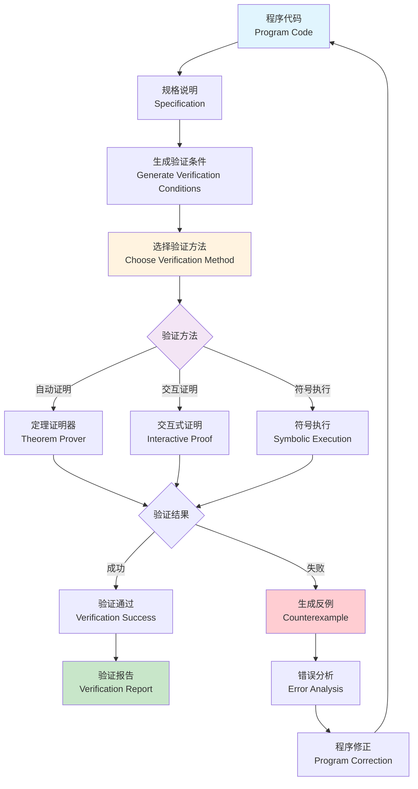

# 程序验证理论 (Program Verification Theory)

## 目录（Table of Contents）

- [程序验证理论 (Program Verification Theory)](#程序验证理论-program-verification-theory)
  - [目录（Table of Contents）](#目录table-of-contents)
  - [概念定义](#概念定义)
    - [核心特征](#核心特征)
  - [理论基础](#理论基础)
    - [形式化定义](#形式化定义)
    - [Hoare逻辑](#hoare逻辑)
      - [Hoare三元组](#hoare三元组)
      - [推理规则](#推理规则)
      - [示例：数组求和](#示例数组求和)
    - [程序不变式](#程序不变式)
      - [不变式类型](#不变式类型)
      - [循环不变式设计](#循环不变式设计)
    - [最弱前置条件](#最弱前置条件)
      - [WP计算规则](#wp计算规则)
      - [示例：WP计算](#示例wp计算)
    - [程序验证流程](#程序验证流程)
  - [核心组件](#核心组件)
    - [前置条件与后置条件](#前置条件与后置条件)
      - [前置条件（Precondition）](#前置条件precondition)
      - [后置条件（Postcondition）](#后置条件postcondition)
    - [循环不变式](#循环不变式)
      - [设计原则](#设计原则)
      - [常见模式](#常见模式)
    - [函数契约](#函数契约)
      - [契约结构](#契约结构)
      - [示例](#示例)
    - [模块化验证](#模块化验证)
      - [组合规则](#组合规则)
  - [国际标准对标](#国际标准对标)
    - [相关标准](#相关标准)
      - [IEEE标准](#ieee标准)
      - [ISO标准](#iso标准)
    - [行业标准](#行业标准)
  - [著名大学课程对标](#著名大学课程对标)
    - [相关课程](#相关课程)
      - [CMU 15-414: Automated Program Verification and Testing](#cmu-15-414-automated-program-verification-and-testing)
      - [MIT 6.883: Program Analysis](#mit-6883-program-analysis)
      - [Stanford CS243: Program Analysis and Optimization](#stanford-cs243-program-analysis-and-optimization)
  - [工程实践](#工程实践)
    - [定理证明工具](#定理证明工具)
      - [Coq](#coq)
      - [Isabelle](#isabelle)
      - [Lean](#lean)
    - [验证方法](#验证方法)
      - [演绎验证（Deductive Verification）](#演绎验证deductive-verification)
      - [符号执行（Symbolic Execution）](#符号执行symbolic-execution)
      - [抽象解释（Abstract Interpretation）](#抽象解释abstract-interpretation)
    - [验证策略](#验证策略)
      - [自底向上验证](#自底向上验证)
      - [自顶向下验证](#自顶向下验证)
      - [模块化验证](#模块化验证-1)
  - [最佳实践](#最佳实践)
    - [设计原则](#设计原则-1)
    - [实施建议](#实施建议)
  - [应用案例](#应用案例)
    - [典型案例](#典型案例)
      - [案例1：排序算法验证](#案例1排序算法验证)
      - [案例2：并发程序验证](#案例2并发程序验证)
    - [行业应用](#行业应用)
      - [安全关键系统](#安全关键系统)
      - [金融系统](#金融系统)
      - [操作系统](#操作系统)
  - [相关概念](#相关概念)
    - [核心概念关联](#核心概念关联)
    - [应用领域关联](#应用领域关联)
    - [行业应用关联](#行业应用关联)
  - [思考与练习](#思考与练习)
    - [概念理解](#概念理解)
    - [实践应用](#实践应用)
    - [自我验证清单](#自我验证清单)
  - [参考文献](#参考文献)

## 概念定义

程序验证（Program Verification）是一种使用数学方法证明程序正确性的技术。它通过形式化规格说明、逻辑推理和定理证明，确保程序满足其规格说明的要求。

### 核心特征

1. **数学严谨性**：基于严格的数学逻辑和推理规则
2. **完全正确性**：能够证明程序的完全正确性，而非仅测试
3. **自动化支持**：支持自动化定理证明工具
4. **模块化验证**：支持程序的模块化验证和组合
5. **可重用性**：验证结果可以重用和组合

## 理论基础

### 形式化定义

程序验证基于以下形式化框架：

```text
ProgramVerification = (Program, Specification, Proof, Verification)

其中：
- Program: 程序代码
- Specification: 形式化规格说明（前置条件、后置条件）
- Proof: 证明过程（推理步骤）
- Verification: 验证结果（正确性证明）
```

### Hoare逻辑

Hoare逻辑（Hoare Logic）是程序验证的基础逻辑系统，由C.A.R. Hoare在1969年提出。

#### Hoare三元组

Hoare三元组的形式为：`{P} S {Q}`

- **P**: 前置条件（Precondition）
- **S**: 程序语句（Statement）
- **Q**: 后置条件（Postcondition）

**含义**：如果在执行S之前P成立，且S终止，则执行S后Q成立。

#### 推理规则

**赋值规则（Assignment Rule）**：

```text
{Q[E/x]} x := E {Q}
```

**序列规则（Sequence Rule）**：

```text
{P} S₁ {R}, {R} S₂ {Q}
────────────────────────
{P} S₁; S₂ {Q}
```

**条件规则（Conditional Rule）**：

```text
{P ∧ B} S₁ {Q}, {P ∧ ¬B} S₂ {Q}
─────────────────────────────────
{P} if B then S₁ else S₂ {Q}
```

**循环规则（While Rule）**：

```text
{P ∧ B} S {P}
─────────────────────────────
{P} while B do S {P ∧ ¬B}
```

其中P是循环不变式（Loop Invariant）。

**强化前置条件（Strengthening Precondition）**：

```text
P' → P, {P} S {Q}
──────────────────
{P'} S {Q}
```

**弱化后置条件（Weakening Postcondition）**：

```text
{P} S {Q}, Q → Q'
──────────────────
{P} S {Q'}
```

#### 示例：数组求和

```text
程序：
  i := 0;
  sum := 0;
  while i < n do
    sum := sum + A[i];
    i := i + 1
  end

规格说明：
  {n ≥ 0}
  [程序]
  {sum = Σⱼ₌₀ⁿ⁻¹ A[j]}

证明：

1. 初始化：
   {n ≥ 0}
   i := 0; sum := 0
   {i = 0 ∧ sum = 0 ∧ n ≥ 0}

2. 循环不变式：
   P ≡ i ≤ n ∧ sum = Σⱼ₌₀ⁱ⁻¹ A[j]

3. 循环体：
   {P ∧ i < n}
   sum := sum + A[i]; i := i + 1
   {P}

4. 循环终止：
   {P ∧ i ≥ n}
   {i = n ∧ sum = Σⱼ₌₀ⁿ⁻¹ A[j]}
```

### 程序不变式

程序不变式（Program Invariant）是在程序执行过程中始终保持为真的性质。

#### 不变式类型

1. **循环不变式**：在循环执行过程中保持为真
2. **类不变式**：在对象生命周期中保持为真
3. **全局不变式**：在整个程序执行过程中保持为真

#### 循环不变式设计

循环不变式应满足：

1. **初始化**：循环开始前成立
2. **保持**：每次迭代后仍成立
3. **终止**：循环终止时能推出后置条件

**示例：二分查找**

```text
程序：
  left := 0; right := n - 1;
  while left ≤ right do
    mid := (left + right) / 2;
    if A[mid] = key then return mid
    else if A[mid] < key then left := mid + 1
    else right := mid - 1
  end
  return -1

循环不变式：
  P ≡ (0 ≤ left ≤ right < n) ∧ 
      (∀i: 0 ≤ i < left → A[i] < key) ∧
      (∀i: right < i < n → A[i] > key)
```

### 最弱前置条件

最弱前置条件（Weakest Precondition, WP）是使得程序执行后满足后置条件的最弱前置条件。

#### WP计算规则

**赋值**：
```text
wp(x := E, Q) = Q[E/x]
```

**序列**：
```text
wp(S₁; S₂, Q) = wp(S₁, wp(S₂, Q))
```

**条件**：
```text
wp(if B then S₁ else S₂, Q) = 
  (B → wp(S₁, Q)) ∧ (¬B → wp(S₂, Q))
```

**循环**：
```text
wp(while B do S, Q) = 
  ∃k: I(k) ∧ (∀i < k: B → wp(S, I(i))) ∧ (¬B → Q)
```

其中I是循环不变式。

#### 示例：WP计算

```text
程序：x := x + 1; y := y + x
后置条件：y > 10

wp(y := y + x, y > 10) = (y + x > 10)
wp(x := x + 1, y + x > 10) = (y + (x + 1) > 10) = (y + x > 9)
```

### 程序验证流程



## 核心组件

### 前置条件与后置条件

#### 前置条件（Precondition）

前置条件描述程序执行前必须满足的条件。

**示例**：
```text
{0 ≤ i < length(A)}
A[i] := x
{A[i] = x}
```

#### 后置条件（Postcondition）

后置条件描述程序执行后必须满足的条件。

**示例**：
```text
{x ≥ 0}
y := sqrt(x)
{y² = x ∧ y ≥ 0}
```

### 循环不变式

循环不变式是循环验证的关键。

#### 设计原则

1. **充分性**：能够推出后置条件
2. **可证明性**：能够被证明成立
3. **简洁性**：尽可能简单

#### 常见模式

**累加模式**：
```text
sum = Σⱼ₌₀ⁱ⁻¹ A[j]
```

**数组遍历**：
```text
∀j: 0 ≤ j < i → P(A[j])
```

**搜索模式**：
```text
key不在已搜索区域中
```

### 函数契约

函数契约（Function Contract）定义函数的规格说明。

#### 契约结构

```text
requires P    // 前置条件
ensures Q     // 后置条件
modifies M    // 修改的变量
```

#### 示例

```text
function BinarySearch(A: array, key: int): int
  requires sorted(A) ∧ 0 ≤ length(A)
  ensures (result ≥ 0 → A[result] = key) ∧
          (result = -1 → key ∉ A)
  modifies nothing
```

### 模块化验证

模块化验证允许独立验证程序模块，然后组合验证结果。

#### 组合规则

```text
{P₁} M₁ {Q₁}, {P₂} M₂ {Q₂}, Q₁ → P₂
────────────────────────────────────
{P₁} M₁; M₂ {Q₂}
```

## 国际标准对标

### 相关标准

#### IEEE标准

- **IEEE 1012-2024**: 软件验证和确认标准，包含程序验证方法
- **IEEE 830-1998**: 软件需求规格说明标准，支持形式化规格

#### ISO标准

- **ISO/IEC 12207**: 软件生命周期过程标准，包含验证活动
- **ISO/IEC 25010**: 软件质量模型标准，支持正确性验证

### 行业标准

- **SPARK**: Ada语言的程序验证子集
- **Dafny**: 支持程序验证的编程语言
- **ACSL**: ANSI/ISO C Specification Language

## 著名大学课程对标

### 相关课程

#### CMU 15-414: Automated Program Verification and Testing

**对标内容**：
- Hoare逻辑完整体系
- 程序不变式理论
- 自动定理证明工具使用
- 验证条件生成

**项目对齐**：
- 本项目的程序验证理论文档
- Hoare逻辑形式化定义
- 定理证明工具集成指南

#### MIT 6.883: Program Analysis

**对标内容**：
- 程序分析理论
- 静态分析方法
- 符号执行技术

**项目对齐**：
- 程序分析方法文档
- 静态分析工具集成

#### Stanford CS243: Program Analysis and Optimization

**对标内容**：
- 程序优化验证
- 编译器验证
- 优化正确性证明

## 工程实践

### 定理证明工具

#### Coq

**特点**：
- 交互式定理证明器
- 基于构造性类型论
- 支持程序提取

**示例**：

```coq
Fixpoint factorial (n : nat) : nat :=
  match n with
  | 0 => 1
  | S n' => n * factorial n'
  end.

Theorem factorial_positive : forall n, factorial n > 0.
Proof.
  induction n.
  - simpl. omega.
  - simpl. omega.
Qed.
```

#### Isabelle

**特点**：
- 通用定理证明器
- 支持多种逻辑系统
- 自动化程度高

**示例**：

```isabelle
lemma "factorial n > 0"
proof (induct n)
  case 0
  show ?case by simp
next
  case (Suc n)
  then show ?case by simp
qed
```

#### Lean

**特点**：
- 现代定理证明器
- 支持数学库
- 活跃的社区

**示例**：

```lean
theorem factorial_positive (n : ℕ) : factorial n > 0 :=
begin
  induction n with n ih,
  { simp },
  { simp [factorial_succ, mul_pos, ih] }
end
```

### 验证方法

#### 演绎验证（Deductive Verification）

使用逻辑推理证明程序正确性。

**工具**：
- Coq
- Isabelle
- Dafny

#### 符号执行（Symbolic Execution）

使用符号值而非具体值执行程序。

**工具**：
- KLEE
- SAGE
- CUTE

#### 抽象解释（Abstract Interpretation）

使用抽象域分析程序性质。

**工具**：
- Astrée
- Polyspace
- Frama-C

### 验证策略

#### 自底向上验证

从基本操作开始，逐步验证复杂操作。

#### 自顶向下验证

从顶层规格开始，逐步细化到实现。

#### 模块化验证

独立验证各个模块，然后组合结果。

## 最佳实践

### 设计原则

1. **规格先行**：先写规格说明，再写代码
2. **不变式设计**：仔细设计循环不变式
3. **模块化**：使用模块化验证方法
4. **工具辅助**：充分利用自动化工具

### 实施建议

1. **从简单开始**：先验证简单程序
2. **逐步复杂化**：逐步验证复杂程序
3. **工具选择**：根据需求选择合适的工具
4. **持续改进**：根据验证结果改进程序

## 应用案例

### 典型案例

#### 案例1：排序算法验证

**问题**：验证快速排序算法的正确性

**规格说明**：
```text
{true}
quicksort(A)
{sorted(A) ∧ permutation(A, A₀)}
```

**验证方法**：使用Coq进行形式化证明

#### 案例2：并发程序验证

**问题**：验证生产者-消费者程序的正确性

**规格说明**：
```text
{true}
producer_consumer()
{所有生产的数据都被消费}
```

**验证方法**：使用时序逻辑和模型检验

### 行业应用

#### 安全关键系统

- **航空软件**：使用SPARK验证飞行控制软件
- **医疗设备**：使用形式化方法验证医疗设备软件

#### 金融系统

- **交易系统**：验证交易逻辑的正确性
- **风控系统**：验证风控规则的正确性

#### 操作系统

- **seL4微内核**：使用Isabelle完全验证
- **CompCert编译器**：使用Coq验证编译器正确性

## 相关概念

### 核心概念关联

- **[形式化验证](../formal-verification.md)** - 程序验证是形式化验证的应用
- **[时序逻辑](../temporal-logic.md)** - 时序逻辑用于并发程序验证
- **[自动推理](../automated-reasoning.md)** - 自动推理用于定理证明

### 应用领域关联

- **[功能模型](../../functional-model/theory.md)** - 程序验证用于功能模型验证
- **[测试模型](../../testing-model/theory.md)** - 程序验证补充测试方法
- **[代码生成](../code-generation.md)** - 程序验证确保生成代码的正确性

### 行业应用关联

- **[金融架构](../../../industry-model/finance-architecture/)** - 程序验证用于金融系统验证
- **[IoT架构](../../../industry-model/iot-architecture/)** - 程序验证用于IoT系统验证
- **[云原生架构](../../../industry-model/cloud-native-architecture/)** - 程序验证用于云原生系统验证

## 思考与练习

### 概念理解

1. 请用自己的话解释什么是程序验证
2. Hoare三元组 `{P} S {Q}` 的含义是什么？
3. 循环不变式的作用是什么？如何设计循环不变式？

### 实践应用

1. 使用Hoare逻辑证明一个简单的赋值语句
2. 设计一个循环的循环不变式
3. 使用Coq或Isabelle证明一个简单的程序性质

### 自我验证清单

- [ ] 是否理解程序验证的基本概念？
- [ ] 能否使用Hoare逻辑进行简单证明？
- [ ] 能否设计循环不变式？
- [ ] 能否使用定理证明工具？

## 参考文献

1. Hoare, C. A. R. (1969). "An axiomatic basis for computer programming". *Communications of the ACM*.

2. Dijkstra, E. W. (1975). "Guarded commands, nondeterminacy and formal derivation of programs". *Communications of the ACM*.

3. Gries, D. (1981). *The Science of Programming*. Springer.

4. Leino, K. R. M. (2010). "Dafny: An automatic program verifier for functional correctness". *LPAR*.

5. Leroy, X. (2009). "Formal verification of a realistic compiler". *Communications of the ACM*.

6. CMU 15-414 Course Materials: [Automated Program Verification and Testing](https://www.cs.cmu.edu/~15414/)

7. IEEE 1012-2024: Standard for System, Software, and Hardware Verification and Validation

---

**难度等级**：⭐⭐⭐⭐ (高级)  
**前置知识**：[形式化验证](../formal-verification.md), [逻辑学基础](#), [程序语言理论](#)  
**学习时间**：约5-6小时
