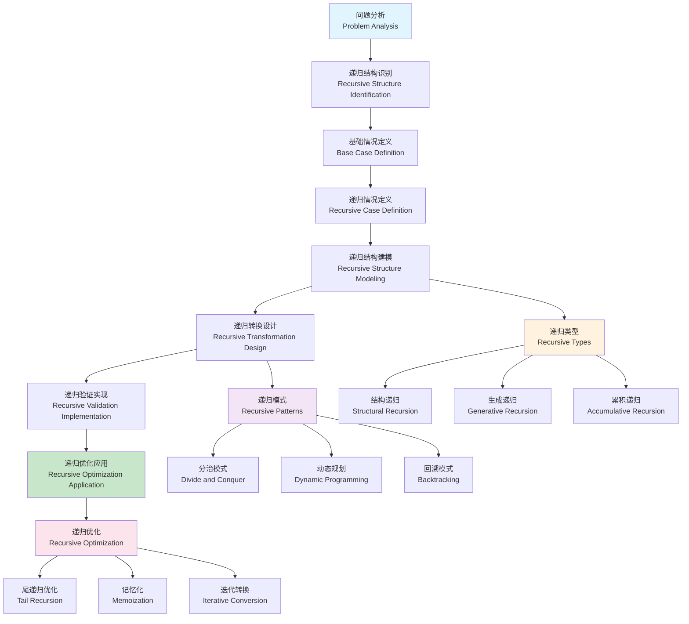

# 递归建模理论 (Recursive Modeling Theory)

## 目录（Table of Contents）

- [递归建模理论 (Recursive Modeling Theory)](#递归建模理论-recursive-modeling-theory)
  - [目录（Table of Contents）](#目录table-of-contents)
  - [概念定义](#概念定义)
    - [核心特征](#核心特征)
  - [理论基础](#理论基础)
    - [递归建模理论](#递归建模理论)
    - [递归建模流程](#递归建模流程)
    - [递归设计层次理论](#递归设计层次理论)
  - [核心组件](#核心组件)
    - [递归结构模型](#递归结构模型)
    - [递归转换模型](#递归转换模型)
    - [递归验证模型](#递归验证模型)
    - [递归优化模型](#递归优化模型)
  - [国际标准对标](#国际标准对标)
    - [递归理论标准](#递归理论标准)
      - [递归函数理论](#递归函数理论)
      - [类型理论](#类型理论)
    - [编程语言标准](#编程语言标准)
      - [函数式编程](#函数式编程)
      - [面向对象编程](#面向对象编程)
  - [著名大学课程对标](#著名大学课程对标)
    - [计算机科学课程](#计算机科学课程)
      - [MIT 6.006 - Introduction to Algorithms](#mit-6006---introduction-to-algorithms)
      - [Stanford CS161 - Design and Analysis of Algorithms](#stanford-cs161---design-and-analysis-of-algorithms)
      - [CMU 15-150 - Principles of Functional Programming](#cmu-15-150---principles-of-functional-programming)
    - [数学课程](#数学课程)
      - [MIT 18.404 - Theory of Computation](#mit-18404---theory-of-computation)
  - [工程实践](#工程实践)
    - [递归设计模式](#递归设计模式)
      - [分治模式](#分治模式)
      - [动态规划模式](#动态规划模式)
    - [递归实现模式](#递归实现模式)
      - [尾递归模式](#尾递归模式)
      - [记忆化模式](#记忆化模式)
  - [最佳实践](#最佳实践)
    - [递归设计原则](#递归设计原则)
    - [递归实现原则](#递归实现原则)
    - [递归优化原则](#递归优化原则)
  - [应用案例](#应用案例)
    - [算法实现](#算法实现)
    - [数据结构实现](#数据结构实现)
  - [相关概念](#相关概念)
    - [核心概念关联](#核心概念关联)
    - [应用领域关联](#应用领域关联)
    - [行业应用关联](#行业应用关联)
  - [参考文献](#参考文献)

## 概念定义

递归建模理论是一种形式化建模方法，用于描述和处理具有递归结构的数据和算法。它通过递归定义、递归转换、递归验证等方式，实现复杂结构的简化和自动化处理，支持自相似、分形、树形等递归结构的建模和分析。

### 核心特征

1. **递归定义**：通过自身定义自身的结构
2. **自相似性**：结构在不同层次上具有相似性
3. **分形特性**：具有无限细节的复杂结构
4. **层次化处理**：支持多层次的处理和分析
5. **自动化转换**：递归结构的自动转换和生成

## 理论基础

### 递归建模理论

递归建模基于以下理论：

```text
RecursiveModel = (BaseCase, RecursiveCase, Transformation, Validation, Optimization)
```

其中：

- BaseCase：基础情况（递归的终止条件）
- RecursiveCase：递归情况（递归的定义和展开）
- Transformation：转换（递归结构的转换规则）
- Validation：验证（递归结构的验证机制）
- Optimization：优化（递归结构的优化策略）

### 递归建模流程



### 递归设计层次理论

```yaml
# 递归设计层次
recursive_design_hierarchy:
  base_layer:
    - "基础情况"
    - "终止条件"
    - "边界处理"
    - "初始状态"
    
  recursive_layer:
    - "递归定义"
    - "递归展开"
    - "递归合并"
    - "递归优化"
    
  transformation_layer:
    - "结构转换"
    - "类型转换"
    - "格式转换"
    - "语义转换"
    
  validation_layer:
    - "结构验证"
    - "类型验证"
    - "语义验证"
    - "性能验证"
    
  optimization_layer:
    - "空间优化"
    - "时间优化"
    - "内存优化"
    - "算法优化"
```

## 核心组件

### 递归结构模型

```yaml
# 递归结构定义
recursive_structure_definitions:
  - name: "tree_structure"
    description: "树形递归结构"
    
    structures:
      - name: "BinaryTree"
        description: "二叉树结构"
        definition:
          base_case: "Empty"
          recursive_case: "Node(left, value, right)"
        properties:
          - name: "height"
            type: "Integer"
            description: "树的高度"
            calculation: "max(left.height, right.height) + 1"
          - name: "size"
            type: "Integer"
            description: "树的节点数"
            calculation: "left.size + right.size + 1"
          - name: "is_balanced"
            type: "Boolean"
            description: "是否平衡"
            calculation: "abs(left.height - right.height) <= 1"
        operations:
          - name: "insert"
            description: "插入节点"
            algorithm: "递归插入算法"
          - name: "search"
            description: "搜索节点"
            algorithm: "递归搜索算法"
          - name: "traverse"
            description: "遍历树"
            algorithm: "递归遍历算法"
            
      - name: "ExpressionTree"
        description: "表达式树结构"
        definition:
          base_case: "Literal(value)"
          recursive_case: "Operator(left, op, right)"
        properties:
          - name: "evaluate"
            type: "Number"
            description: "表达式求值"
            calculation: "op(left.evaluate, right.evaluate)"
          - name: "complexity"
            type: "Integer"
            description: "表达式复杂度"
            calculation: "max(left.complexity, right.complexity) + 1"
        operations:
          - name: "evaluate"
            description: "求值操作"
            algorithm: "递归求值算法"
          - name: "simplify"
            description: "简化操作"
            algorithm: "递归简化算法"
          - name: "differentiate"
            description: "求导操作"
            algorithm: "递归求导算法"
            
      - name: "FileSystemTree"
        description: "文件系统树结构"
        definition:
          base_case: "File(name, content)"
          recursive_case: "Directory(name, children)"
        properties:
          - name: "size"
            type: "Integer"
            description: "文件大小"
            calculation: "sum(child.size for child in children)"
          - name: "depth"
            type: "Integer"
            description: "目录深度"
            calculation: "max(child.depth for child in children) + 1"
        operations:
          - name: "find"
            description: "查找文件"
            algorithm: "递归查找算法"
          - name: "copy"
            description: "复制目录"
            algorithm: "递归复制算法"
          - name: "delete"
            description: "删除目录"
            algorithm: "递归删除算法"
            
  - name: "list_structure"
    description: "列表递归结构"
    
    structures:
      - name: "LinkedList"
        description: "链表结构"
        definition:
          base_case: "Empty"
          recursive_case: "Node(value, next)"
        properties:
          - name: "length"
            type: "Integer"
            description: "链表长度"
            calculation: "1 + next.length"
          - name: "is_empty"
            type: "Boolean"
            description: "是否为空"
            calculation: "false"
        operations:
          - name: "append"
            description: "追加元素"
            algorithm: "递归追加算法"
          - name: "reverse"
            description: "反转链表"
            algorithm: "递归反转算法"
          - name: "filter"
            description: "过滤元素"
            algorithm: "递归过滤算法"
            
      - name: "NestedList"
        description: "嵌套列表结构"
        definition:
          base_case: "Element(value)"
          recursive_case: "List(elements)"
        properties:
          - name: "flatten"
            type: "List"
            description: "扁平化列表"
            calculation: "concatenate(element.flatten for element in elements)"
          - name: "depth"
            type: "Integer"
            description: "嵌套深度"
            calculation: "max(element.depth for element in elements) + 1"
        operations:
          - name: "flatten"
            description: "扁平化操作"
            algorithm: "递归扁平化算法"
          - name: "map"
            description: "映射操作"
            algorithm: "递归映射算法"
          - name: "reduce"
            description: "归约操作"
            algorithm: "递归归约算法"
```

### 递归转换模型

```yaml
# 递归转换定义
recursive_transformation_definitions:
  - name: "structural_transformation"
    description: "结构转换"
    
    transformations:
      - name: "tree_to_list"
        description: "树到列表转换"
        source: "BinaryTree"
        target: "List"
        algorithm:
          - name: "inorder_traversal"
            description: "中序遍历转换"
            steps:
              - "递归遍历左子树"
              - "访问根节点"
              - "递归遍历右子树"
            code: |
              def tree_to_list(tree):
                  if tree.is_empty():
                      return []
                  return (tree_to_list(tree.left) + 
                          [tree.value] + 
                          tree_to_list(tree.right))
                          
      - name: "list_to_tree"
        description: "列表到树转换"
        source: "List"
        target: "BinaryTree"
        algorithm:
          - name: "balanced_tree_construction"
            description: "平衡树构建"
            steps:
              - "找到中间元素"
              - "递归构建左子树"
              - "递归构建右子树"
            code: |
              def list_to_tree(lst):
                  if not lst:
                      return Empty()
                  mid = len(lst) // 2
                  return Node(
                      list_to_tree(lst[:mid]),
                      lst[mid],
                      list_to_tree(lst[mid+1:])
                  )
                  
      - name: "expression_simplification"
        description: "表达式简化"
        source: "ExpressionTree"
        target: "ExpressionTree"
        algorithm:
          - name: "recursive_simplification"
            description: "递归简化"
            rules:
              - "0 + x = x"
              - "x + 0 = x"
              - "1 * x = x"
              - "x * 1 = x"
              - "0 * x = 0"
              - "x * 0 = 0"
            code: |
              def simplify(expr):
                  if expr.is_literal():
                      return expr
                  left = simplify(expr.left)
                  right = simplify(expr.right)
                  return apply_simplification_rules(left, expr.op, right)
                  
  - name: "type_transformation"
    description: "类型转换"
    
    transformations:
      - name: "type_inference"
        description: "类型推理"
        algorithm:
          - name: "recursive_type_inference"
            description: "递归类型推理"
            rules:
              - "Literal: 根据值推断类型"
              - "Operator: 根据操作符和操作数类型推断"
              - "Function: 根据参数和返回值类型推断"
            code: |
              def infer_type(expr):
                  if expr.is_literal():
                      return type_of(expr.value)
                  if expr.is_operator():
                      left_type = infer_type(expr.left)
                      right_type = infer_type(expr.right)
                      return infer_operator_type(expr.op, left_type, right_type)
                      
      - name: "type_conversion"
        description: "类型转换"
        algorithm:
          - name: "recursive_type_conversion"
            description: "递归类型转换"
            rules:
              - "隐式转换: 自动类型提升"
              - "显式转换: 强制类型转换"
              - "安全转换: 类型安全检查"
            code: |
              def convert_type(expr, target_type):
                  if expr.type == target_type:
                      return expr
                  if is_convertible(expr.type, target_type):
                      return convert_value(expr, target_type)
                  else:
                      raise TypeError(f"Cannot convert {expr.type} to {target_type}")
```

### 递归验证模型

```yaml
# 递归验证定义
recursive_validation_definitions:
  - name: "structural_validation"
    description: "结构验证"
    
    validations:
      - name: "tree_validation"
        description: "树结构验证"
        rules:
          - name: "acyclic"
            description: "无环验证"
            condition: "树中不存在环"
            algorithm: "深度优先搜索检测环"
            
          - name: "connected"
            description: "连通性验证"
            condition: "所有节点都是连通的"
            algorithm: "广度优先搜索验证连通性"
            
          - name: "balanced"
            description: "平衡性验证"
            condition: "左右子树高度差不超过1"
            algorithm: "递归计算高度差"
            
      - name: "expression_validation"
        description: "表达式验证"
        rules:
          - name: "well_formed"
            description: "良构性验证"
            condition: "表达式结构正确"
            algorithm: "递归验证语法结构"
            
          - name: "type_safe"
            description: "类型安全验证"
            condition: "所有操作类型兼容"
            algorithm: "递归类型检查"
            
          - name: "termination"
            description: "终止性验证"
            condition: "递归操作能够终止"
            algorithm: "递归深度限制检查"
            
  - name: "semantic_validation"
    description: "语义验证"
    
    validations:
      - name: "correctness_validation"
        description: "正确性验证"
        rules:
          - name: "functional_correctness"
            description: "功能正确性"
            condition: "函数行为符合预期"
            algorithm: "递归测试用例验证"
            
          - name: "invariant_preservation"
            description: "不变量保持"
            condition: "递归操作保持不变量"
            algorithm: "递归不变量检查"
            
      - name: "performance_validation"
        description: "性能验证"
        rules:
          - name: "time_complexity"
            description: "时间复杂度"
            condition: "递归操作时间复杂度合理"
            algorithm: "递归复杂度分析"
            
          - name: "space_complexity"
            description: "空间复杂度"
            condition: "递归操作空间复杂度合理"
            algorithm: "递归空间分析"
            
          - name: "stack_overflow"
            description: "栈溢出检查"
            condition: "递归深度不会导致栈溢出"
            algorithm: "递归深度限制"
```

### 递归优化模型

```yaml
# 递归优化定义
recursive_optimization_definitions:
  - name: "algorithm_optimization"
    description: "算法优化"
    
    optimizations:
      - name: "tail_recursion_optimization"
        description: "尾递归优化"
        technique:
          - name: "tail_call_elimination"
            description: "尾调用消除"
            transformation:
              - "识别尾递归调用"
              - "转换为循环结构"
              - "优化栈空间使用"
            example: |
              # 原始尾递归
              def factorial(n, acc=1):
                  if n <= 1:
                      return acc
                  return factorial(n-1, n*acc)
                  
              # 优化后循环
              def factorial_optimized(n):
                  acc = 1
                  while n > 1:
                      acc *= n
                      n -= 1
                  return acc
                  
      - name: "memoization"
        description: "记忆化优化"
        technique:
          - name: "caching"
            description: "缓存中间结果"
            implementation:
              - "使用哈希表缓存"
              - "检查缓存命中"
              - "存储计算结果"
            example: |
              def fibonacci_memo(n, cache={}):
                  if n in cache:
                      return cache[n]
                  if n <= 1:
                      return n
                  cache[n] = fibonacci_memo(n-1) + fibonacci_memo(n-2)
                  return cache[n]
                  
      - name: "dynamic_programming"
        description: "动态规划优化"
        technique:
          - name: "bottom_up"
            description: "自底向上计算"
            transformation:
              - "识别重叠子问题"
              - "构建状态表"
              - "自底向上填充"
            example: |
              def fibonacci_dp(n):
                  if n <= 1:
                      return n
                  dp = [0] * (n + 1)
                  dp[1] = 1
                  for i in range(2, n + 1):
                      dp[i] = dp[i-1] + dp[i-2]
                  return dp[n]
                  
  - name: "data_structure_optimization"
    description: "数据结构优化"
    
    optimizations:
      - name: "tree_balancing"
        description: "树平衡优化"
        techniques:
          - name: "AVL_tree"
            description: "AVL树平衡"
            algorithm:
              - "计算平衡因子"
              - "执行旋转操作"
              - "维护平衡性质"
              
          - name: "red_black_tree"
            description: "红黑树平衡"
            algorithm:
              - "维护红黑性质"
              - "执行颜色调整"
              - "执行旋转操作"
              
      - name: "cache_optimization"
        description: "缓存优化"
        techniques:
          - name: "locality_optimization"
            description: "局部性优化"
            strategy:
              - "数据局部性"
              - "时间局部性"
              - "空间局部性"
              
          - name: "prefetching"
            description: "预取优化"
            strategy:
              - "预测性预取"
              - "顺序预取"
              - "随机预取"
```

## 国际标准对标

### 递归理论标准

#### 递归函数理论

- **标准**：递归函数论
- **核心概念**：原始递归、μ递归、递归可枚举
- **理论基础**：Church-Turing论题、递归论
- **应用领域**：计算理论、形式化语言

#### 类型理论

- **标准**：递归类型理论
- **核心概念**：递归类型、归纳类型、共归纳类型
- **理论基础**：Martin-Löf类型论、同伦类型论
- **应用领域**：函数式编程、形式化验证

### 编程语言标准

#### 函数式编程

- **标准**：Haskell、ML、Scheme
- **核心概念**：递归函数、模式匹配、尾递归优化
- **理论基础**：λ演算、组合子逻辑
- **应用领域**：函数式编程、编译器设计

#### 面向对象编程

- **标准**：Java、C++、C#
- **核心概念**：递归类、继承、多态
- **理论基础**：对象演算、类型系统
- **应用领域**：软件工程、系统设计

## 著名大学课程对标

### 计算机科学课程

#### MIT 6.006 - Introduction to Algorithms

- **课程内容**：算法设计、递归算法、动态规划
- **递归建模相关**：递归算法分析、递归优化、递归数据结构
- **实践项目**：递归算法实现和优化
- **相关技术**：递归算法、动态规划、分治算法

#### Stanford CS161 - Design and Analysis of Algorithms

- **课程内容**：算法设计、递归分析、算法优化
- **递归建模相关**：递归复杂度分析、递归优化技术、递归数据结构
- **实践项目**：递归算法设计和分析
- **相关技术**：递归算法、算法分析、优化技术

#### CMU 15-150 - Principles of Functional Programming

- **课程内容**：函数式编程、递归函数、类型系统
- **递归建模相关**：递归函数设计、递归类型、递归数据结构
- **实践项目**：递归函数实现
- **相关技术**：SML、递归函数、类型系统

### 数学课程

#### MIT 18.404 - Theory of Computation

- **课程内容**：计算理论、递归函数、形式化语言
- **递归建模相关**：递归函数论、递归可枚举、递归复杂度
- **实践项目**：递归函数理论应用
- **相关技术**：递归函数、图灵机、形式化语言

## 工程实践

### 递归设计模式

#### 分治模式

```yaml
# 分治模式
divide_and_conquer_pattern:
  description: "分治递归模式"
  structure:
    - name: "分解"
      description: "将问题分解为子问题"
      activities:
        - "问题分析"
        - "子问题识别"
        - "分解策略"
        
    - name: "解决"
      description: "递归解决子问题"
      activities:
        - "递归调用"
        - "基础情况处理"
        - "子问题解决"
        
    - name: "合并"
      description: "合并子问题解"
      activities:
        - "结果合并"
        - "解的组合"
        - "最终结果"
        
  examples:
    - name: "归并排序"
      description: "分治排序算法"
      algorithm:
        - "分解: 将数组分为两半"
        - "解决: 递归排序两半"
        - "合并: 合并两个有序数组"
        
    - name: "快速排序"
      description: "分治排序算法"
      algorithm:
        - "分解: 选择轴心元素分区"
        - "解决: 递归排序分区"
        - "合并: 分区自然有序"
        
    - name: "二分查找"
      description: "分治搜索算法"
      algorithm:
        - "分解: 将搜索空间分为两半"
        - "解决: 递归搜索一半"
        - "合并: 返回搜索结果"
```

#### 动态规划模式

```yaml
# 动态规划模式
dynamic_programming_pattern:
  description: "动态规划递归模式"
  structure:
    - name: "状态定义"
      description: "定义问题状态"
      activities:
        - "状态识别"
        - "状态表示"
        - "状态空间"
        
    - name: "状态转移"
      description: "定义状态转移关系"
      activities:
        - "转移方程"
        - "边界条件"
        - "优化策略"
        
    - name: "计算顺序"
      description: "确定计算顺序"
      activities:
        - "依赖分析"
        - "计算顺序"
        - "空间优化"
        
  examples:
    - name: "斐波那契数列"
      description: "经典动态规划问题"
      algorithm:
        - "状态: F(n)表示第n个斐波那契数"
        - "转移: F(n) = F(n-1) + F(n-2)"
        - "边界: F(0) = 0, F(1) = 1"
        
    - name: "最长公共子序列"
      description: "字符串动态规划"
      algorithm:
        - "状态: LCS(i,j)表示前i个和前j个字符的LCS"
        - "转移: LCS(i,j) = max(LCS(i-1,j), LCS(i,j-1))"
        - "边界: LCS(0,j) = LCS(i,0) = 0"
        
    - name: "背包问题"
      description: "优化动态规划"
      algorithm:
        - "状态: dp[i][w]表示前i个物品重量w的最大价值"
        - "转移: dp[i][w] = max(dp[i-1][w], dp[i-1][w-wi] + vi)"
        - "边界: dp[0][w] = 0"
```

### 递归实现模式

#### 尾递归模式

```yaml
# 尾递归模式
tail_recursion_pattern:
  description: "尾递归实现模式"
  structure:
    - name: "参数累积"
      description: "使用参数累积结果"
      technique:
        - "累加器参数"
        - "状态参数"
        - "辅助参数"
        
    - name: "尾调用"
      description: "确保递归调用是尾调用"
      technique:
        - "直接返回"
        - "无额外计算"
        - "栈空间复用"
        
    - name: "优化转换"
      description: "转换为循环结构"
      technique:
        - "识别尾递归"
        - "转换为循环"
        - "优化空间使用"
        
  examples:
    - name: "阶乘计算"
      description: "尾递归阶乘"
      implementation: |
        def factorial_tail(n, acc=1):
            if n <= 1:
                return acc
            return factorial_tail(n-1, n*acc)
            
    - name: "列表反转"
      description: "尾递归反转"
      implementation: |
        def reverse_tail(lst, acc=[]):
            if not lst:
                return acc
            return reverse_tail(lst[1:], [lst[0]] + acc)
            
    - name: "树遍历"
      description: "尾递归遍历"
      implementation: |
        def traverse_tail(tree, acc=[]):
            if tree.is_empty():
                return acc
            return traverse_tail(tree.right, 
                               traverse_tail(tree.left, acc) + [tree.value])
```

#### 记忆化模式

```yaml
# 记忆化模式
memoization_pattern:
  description: "记忆化递归模式"
  structure:
    - name: "缓存表"
      description: "存储计算结果"
      technique:
        - "哈希表缓存"
        - "数组缓存"
        - "LRU缓存"
        
    - name: "缓存检查"
      description: "检查缓存命中"
      technique:
        - "键值查找"
        - "缓存命中"
        - "缓存未命中"
        
    - name: "结果存储"
      description: "存储计算结果"
      technique:
        - "计算新值"
        - "存储结果"
        - "返回结果"
        
  examples:
    - name: "斐波那契记忆化"
      description: "记忆化斐波那契"
      implementation: |
        def fibonacci_memo(n, cache={}):
            if n in cache:
                return cache[n]
            if n <= 1:
                return n
            cache[n] = fibonacci_memo(n-1) + fibonacci_memo(n-2)
            return cache[n]
            
    - name: "组合数记忆化"
      description: "记忆化组合数"
      implementation: |
        def combination_memo(n, k, cache={}):
            key = (n, k)
            if key in cache:
                return cache[key]
            if k == 0 or k == n:
                return 1
            cache[key] = (combination_memo(n-1, k-1) + 
                         combination_memo(n-1, k))
            return cache[key]
```

## 最佳实践

### 递归设计原则

1. **明确基础情况**：确保递归有明确的终止条件
2. **简化问题规模**：每次递归调用都要减小问题规模
3. **避免重复计算**：使用记忆化避免重复计算
4. **考虑尾递归**：尽可能使用尾递归优化

### 递归实现原则

1. **清晰的结构**：保持递归结构清晰易懂
2. **正确的边界**：正确处理边界情况
3. **高效的算法**：选择高效的递归算法
4. **适当的优化**：在必要时进行优化

### 递归优化原则

1. **识别优化机会**：识别可以优化的递归模式
2. **选择合适的优化**：根据具体情况选择合适的优化策略
3. **验证优化效果**：验证优化后的正确性和性能
4. **保持代码可读性**：在优化的同时保持代码可读性

## 应用案例

### 算法实现

```yaml
# 递归算法实现
recursive_algorithm_implementation:
  description: "递归算法实现案例"
  algorithms:
    - name: "排序算法"
      description: "递归排序算法"
      implementations:
        - name: "归并排序"
          description: "分治归并排序"
          complexity: "O(n log n)"
          space: "O(n)"
          
        - name: "快速排序"
          description: "分治快速排序"
          complexity: "O(n log n) average"
          space: "O(log n)"
          
        - name: "堆排序"
          description: "递归堆排序"
          complexity: "O(n log n)"
          space: "O(1)"
          
    - name: "搜索算法"
      description: "递归搜索算法"
      implementations:
        - name: "二分查找"
          description: "分治二分查找"
          complexity: "O(log n)"
          space: "O(log n)"
          
        - name: "深度优先搜索"
          description: "递归深度优先搜索"
          complexity: "O(V + E)"
          space: "O(V)"
          
        - name: "广度优先搜索"
          description: "递归广度优先搜索"
          complexity: "O(V + E)"
          space: "O(V)"
          
    - name: "图算法"
      description: "递归图算法"
      implementations:
        - name: "拓扑排序"
          description: "递归拓扑排序"
          complexity: "O(V + E)"
          space: "O(V)"
          
        - name: "强连通分量"
          description: "递归强连通分量"
          complexity: "O(V + E)"
          space: "O(V)"
          
        - name: "最小生成树"
          description: "递归最小生成树"
          complexity: "O(E log V)"
          space: "O(V)"
```

### 数据结构实现

```yaml
# 递归数据结构实现
recursive_data_structure_implementation:
  description: "递归数据结构实现案例"
  structures:
    - name: "树结构"
      description: "递归树结构"
      implementations:
        - name: "二叉树"
          description: "递归二叉树"
          operations:
            - "插入: O(log n)"
            - "查找: O(log n)"
            - "删除: O(log n)"
            
        - name: "AVL树"
          description: "递归AVL树"
          operations:
            - "插入: O(log n)"
            - "查找: O(log n)"
            - "删除: O(log n)"
            
        - name: "红黑树"
          description: "递归红黑树"
          operations:
            - "插入: O(log n)"
            - "查找: O(log n)"
            - "删除: O(log n)"
            
    - name: "图结构"
      description: "递归图结构"
      implementations:
        - name: "邻接表"
          description: "递归邻接表"
          operations:
            - "添加边: O(1)"
            - "查找边: O(degree)"
            - "遍历: O(V + E)"
            
        - name: "邻接矩阵"
          description: "递归邻接矩阵"
          operations:
            - "添加边: O(1)"
            - "查找边: O(1)"
            - "遍历: O(V²)"
            
    - name: "表达式树"
      description: "递归表达式树"
      implementations:
        - name: "算术表达式"
          description: "递归算术表达式"
          operations:
            - "求值: O(n)"
            - "求导: O(n)"
            - "简化: O(n)"
            
        - name: "逻辑表达式"
          description: "递归逻辑表达式"
          operations:
            - "求值: O(n)"
            - "化简: O(n)"
            - "标准化: O(n)"
```

## 相关概念

### 核心概念关联

- [抽象语法树](./abstract-syntax-tree.md) - AST是递归建模的典型应用，具有递归的树形结构
- [模型转换](./model-transformation.md) - 模型转换使用递归建模处理复杂结构的转换
- [语义分析](./semantic-analysis.md) - 语义分析基于递归建模进行语法树的递归分析
- [自动推理](./automated-reasoning.md) - 自动推理使用递归建模处理复杂推理过程
- [形式化建模](./formal-modeling.md) - 形式化建模为递归建模提供理论基础
- [代码生成](./code-generation.md) - 代码生成使用递归建模处理复杂代码结构

### 应用领域关联

- [数据建模](../data-model/theory.md) - 数据模型使用递归建模处理层次化数据结构
- [功能建模](../functional-model/theory.md) - 功能模型使用递归建模处理复杂业务逻辑
- [交互建模](../interaction-model/theory.md) - 交互模型使用递归建模处理嵌套接口结构
- [运行时建模](../runtime-model/theory.md) - 运行时模型使用递归建模处理复杂配置结构

### 行业应用关联

- [金融架构](../../industry-model/finance-architecture/) - 金融业务规则使用递归建模处理复杂决策树
- [AI基础设施](../../industry-model/ai-infrastructure-architecture/) - AI模型使用递归建模处理神经网络结构
- [云原生架构](../../industry-model/cloud-native-architecture/) - 云配置使用递归建模处理层次化部署结构

## 参考文献

1. Sipser, M. (2012). "Introduction to the Theory of Computation"
2. Hopcroft, J. E., et al. (2006). "Introduction to Automata Theory, Languages, and Computation"
3. Pierce, B. C. (2002). "Types and Programming Languages"
4. Bird, R. (1998). "Introduction to Functional Programming using Haskell"
5. Graham, R. L., et al. (1994). "Concrete Mathematics: A Foundation for Computer Science"
6. Knuth, D. E. (1997). "The Art of Computer Programming"
