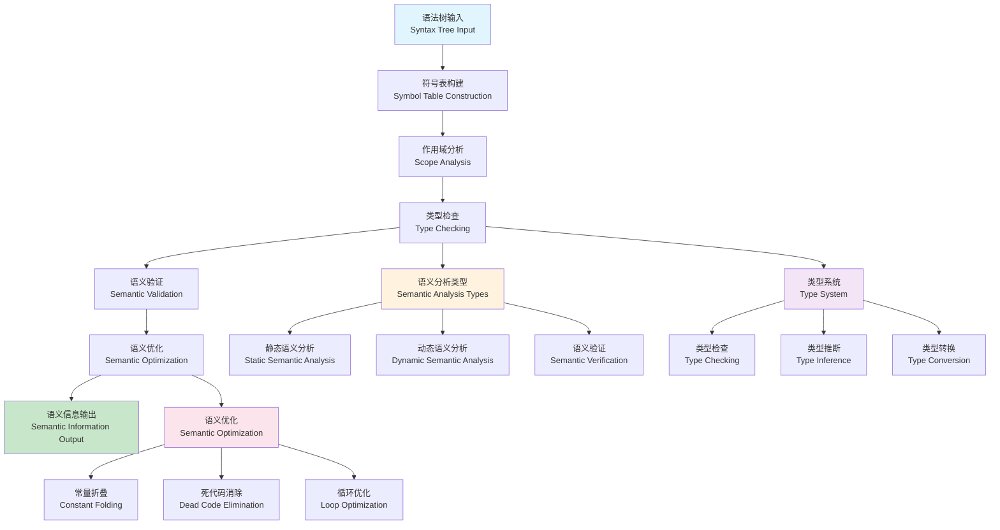

# 语义分析理论与技术 (Semantic Analysis Theory and Technology)

## 目录（Table of Contents）

- [语义分析理论与技术 (Semantic Analysis Theory and Technology)](#语义分析理论与技术-semantic-analysis-theory-and-technology)
  - [目录（Table of Contents）](#目录table-of-contents)
  - [概念定义](#概念定义)
    - [核心特征](#核心特征)
  - [理论基础](#理论基础)
    - [语义分析理论](#语义分析理论)
    - [语义分析流程](#语义分析流程)
    - [语义分析类型理论](#语义分析类型理论)
  - [核心组件](#核心组件)
    - [符号表模型](#符号表模型)
    - [类型系统模型](#类型系统模型)
    - [作用域分析模型](#作用域分析模型)
    - [语义验证模型](#语义验证模型)
  - [国际标准对标](#国际标准对标)
    - [语义分析标准](#语义分析标准)
      - [TypeScript](#typescript)
      - [Flow](#flow)
      - [Rust](#rust)
    - [程序分析标准](#程序分析标准)
      - [LLVM](#llvm)
      - [GCC](#gcc)
      - [Clang Static Analyzer](#clang-static-analyzer)
    - [语义网标准](#语义网标准)
      - [RDF (Resource Description Framework)](#rdf-resource-description-framework)
      - [OWL (Web Ontology Language)](#owl-web-ontology-language)
      - [SPARQL](#sparql)
  - [著名大学课程对标](#著名大学课程对标)
    - [编译器课程](#编译器课程)
      - [MIT 6.035 - Computer Language Engineering](#mit-6035---computer-language-engineering)
      - [Stanford CS143 - Compilers](#stanford-cs143---compilers)
      - [CMU 15-411 - Compiler Design](#cmu-15-411---compiler-design)
    - [程序分析课程](#程序分析课程)
      - [MIT 6.883 - Program Analysis](#mit-6883---program-analysis)
      - [Stanford CS243 - Program Analysis and Optimization](#stanford-cs243---program-analysis-and-optimization)
      - [CMU 15-414 - Bug Catching: Automated Program Verification](#cmu-15-414---bug-catching-automated-program-verification)
  - [工程实践](#工程实践)
    - [语义分析设计模式](#语义分析设计模式)
      - [访问者模式](#访问者模式)
      - [符号表模式](#符号表模式)
      - [类型系统模式](#类型系统模式)
    - [语义分析实现模式](#语义分析实现模式)
      - [语义分析器核心模式](#语义分析器核心模式)
      - [增量语义分析模式](#增量语义分析模式)
  - [最佳实践](#最佳实践)
    - [语义分析设计原则](#语义分析设计原则)
    - [类型系统设计原则](#类型系统设计原则)
    - [作用域分析原则](#作用域分析原则)
  - [应用案例](#应用案例)
    - [编译器语义分析器](#编译器语义分析器)
    - [静态分析工具](#静态分析工具)
  - [相关概念](#相关概念)
    - [核心概念关联](#核心概念关联)
    - [应用领域关联](#应用领域关联)
    - [行业应用关联](#行业应用关联)
  - [参考文献](#参考文献)

## 概念定义

语义分析理论与技术是一种分析程序语义和含义的技术。它通过类型检查、作用域分析、语义验证等方法，确保程序的语义正确性，理解程序的行为和意图，是编译器和程序分析工具的核心技术。

### 核心特征

1. **语义理解**：深入理解程序的语义含义
2. **类型安全**：确保类型安全和类型一致性
3. **作用域分析**：分析变量和函数的作用域
4. **语义验证**：验证程序的语义正确性
5. **优化支持**：为程序优化提供语义信息

## 理论基础

### 语义分析理论

语义分析基于以下理论：

```text
SemanticAnalysis = (SyntaxTree, SymbolTable, TypeSystem, ScopeRules, Validation)
```

其中：

- SyntaxTree：语法树（抽象语法树、解析树）
- SymbolTable：符号表（变量、函数、类型定义）
- TypeSystem：类型系统（类型检查、类型推断）
- ScopeRules：作用域规则（作用域分析、可见性）
- Validation：语义验证（语义检查、错误检测）

### 语义分析流程



### 语义分析类型理论

```yaml
# 语义分析类型分类
semantic_analysis_types:
  static_semantic_analysis:
    description: "静态语义分析"
    characteristics:
      - "编译时分析"
      - "类型检查"
      - "作用域分析"
    examples:
      - "类型检查"
      - "变量声明检查"
      - "函数调用检查"
      
  dynamic_semantic_analysis:
    description: "动态语义分析"
    characteristics:
      - "运行时分析"
      - "行为分析"
      - "性能分析"
    examples:
      - "内存泄漏检测"
      - "性能分析"
      - "异常检测"
      
  semantic_verification:
    description: "语义验证"
    characteristics:
      - "形式化验证"
      - "语义等价性"
      - "行为一致性"
    examples:
      - "程序等价性验证"
      - "语义保持性验证"
      - "行为一致性验证"
      
  semantic_optimization:
    description: "语义优化"
    characteristics:
      - "语义保持优化"
      - "性能优化"
      - "代码优化"
    examples:
      - "常量折叠"
      - "死代码消除"
      - "循环优化"
```

## 核心组件

### 符号表模型

```yaml
# 符号表定义
symbol_table_definitions:
  - name: "symbol_structure"
    description: "符号结构定义"
    
    symbol:
      - name: "variable_symbol"
        description: "变量符号"
        fields:
          - name: "name"
            type: "string"
            description: "变量名称"
            
          - name: "type"
            type: "Type"
            description: "变量类型"
            
          - name: "scope"
            type: "Scope"
            description: "作用域"
            
          - name: "value"
            type: "Value"
            optional: true
            description: "变量值"
            
          - name: "is_constant"
            type: "boolean"
            default: false
            description: "是否为常量"
            
          - name: "is_initialized"
            type: "boolean"
            default: false
            description: "是否已初始化"
            
      - name: "function_symbol"
        description: "函数符号"
        fields:
          - name: "name"
            type: "string"
            description: "函数名称"
            
          - name: "return_type"
            type: "Type"
            description: "返回类型"
            
          - name: "parameters"
            type: "Parameter[]"
            description: "参数列表"
            
          - name: "scope"
            type: "Scope"
            description: "作用域"
            
          - name: "is_overloaded"
            type: "boolean"
            default: false
            description: "是否重载"
            
          - name: "is_virtual"
            type: "boolean"
            default: false
            description: "是否为虚函数"
            
      - name: "type_symbol"
        description: "类型符号"
        fields:
          - name: "name"
            type: "string"
            description: "类型名称"
            
          - name: "kind"
            type: "TypeKind"
            enum: ["primitive", "array", "struct", "class", "interface"]
            description: "类型种类"
            
          - name: "size"
            type: "integer"
            description: "类型大小"
            
          - name: "members"
            type: "Member[]"
            optional: true
            description: "成员列表"
            
          - name: "methods"
            type: "Method[]"
            optional: true
            description: "方法列表"
            
  - name: "symbol_table_operations"
    description: "符号表操作"
    
    operations:
      - name: "insert_symbol"
        description: "插入符号"
        parameters:
          - name: "symbol"
            type: "Symbol"
            description: "要插入的符号"
        returns: "boolean"
        description: "插入是否成功"
        
      - name: "lookup_symbol"
        description: "查找符号"
        parameters:
          - name: "name"
            type: "string"
            description: "符号名称"
          - name: "scope"
            type: "Scope"
            optional: true
            description: "查找作用域"
        returns: "Symbol"
        description: "找到的符号"
        
      - name: "remove_symbol"
        description: "删除符号"
        parameters:
          - name: "name"
            type: "string"
            description: "符号名称"
        returns: "boolean"
        description: "删除是否成功"
        
      - name: "update_symbol"
        description: "更新符号"
        parameters:
          - name: "name"
            type: "string"
            description: "符号名称"
          - name: "updates"
            type: "SymbolUpdate"
            description: "更新内容"
        returns: "boolean"
        description: "更新是否成功"
```

### 类型系统模型

```yaml
# 类型系统定义
type_system_definitions:
  - name: "type_hierarchy"
    description: "类型层次结构"
    
    hierarchy:
      - name: "primitive_types"
        description: "基本类型"
        types:
          - name: "integer"
            description: "整数类型"
            variants:
              - "int8"
              - "int16"
              - "int32"
              - "int64"
              - "uint8"
              - "uint16"
              - "uint32"
              - "uint64"
              
          - name: "floating_point"
            description: "浮点类型"
            variants:
              - "float32"
              - "float64"
              - "decimal"
              
          - name: "boolean"
            description: "布尔类型"
            values: ["true", "false"]
            
          - name: "character"
            description: "字符类型"
            variants:
              - "char"
              - "wchar"
              - "rune"
              
          - name: "string"
            description: "字符串类型"
            variants:
              - "string"
              - "wstring"
              
      - name: "composite_types"
        description: "复合类型"
        types:
          - name: "array"
            description: "数组类型"
            properties:
              - "element_type"
              - "length"
              - "bounds"
              
          - name: "struct"
            description: "结构体类型"
            properties:
              - "fields"
              - "methods"
              - "visibility"
              
          - name: "class"
            description: "类类型"
            properties:
              - "fields"
              - "methods"
              - "inheritance"
              - "polymorphism"
              
          - name: "interface"
            description: "接口类型"
            properties:
              - "methods"
              - "contracts"
              
      - name: "reference_types"
        description: "引用类型"
        types:
          - name: "pointer"
            description: "指针类型"
            properties:
              - "pointed_type"
              - "nullability"
              
          - name: "reference"
            description: "引用类型"
            properties:
              - "referenced_type"
              - "mutability"
              
          - name: "function"
            description: "函数类型"
            properties:
              - "parameter_types"
              - "return_type"
              - "calling_convention"
              
  - name: "type_operations"
    description: "类型操作"
    
    operations:
      - name: "type_compatibility"
        description: "类型兼容性检查"
        parameters:
          - name: "source_type"
            type: "Type"
            description: "源类型"
          - name: "target_type"
            type: "Type"
            description: "目标类型"
        returns: "boolean"
        description: "是否兼容"
        
      - name: "type_conversion"
        description: "类型转换"
        parameters:
          - name: "source_type"
            type: "Type"
            description: "源类型"
          - name: "target_type"
            type: "Type"
            description: "目标类型"
          - name: "value"
            type: "Value"
            description: "要转换的值"
        returns: "Value"
        description: "转换后的值"
        
      - name: "type_inference"
        description: "类型推断"
        parameters:
          - name: "expression"
            type: "Expression"
            description: "表达式"
          - name: "context"
            type: "TypeContext"
            description: "类型上下文"
        returns: "Type"
        description: "推断出的类型"
        
      - name: "type_unification"
        description: "类型统一"
        parameters:
          - name: "type1"
            type: "Type"
            description: "类型1"
          - name: "type2"
            type: "Type"
            description: "类型2"
        returns: "Type"
        description: "统一的类型"
```

### 作用域分析模型

```yaml
# 作用域分析定义
scope_analysis_definitions:
  - name: "scope_structure"
    description: "作用域结构"
    
    scope:
      - name: "global_scope"
        description: "全局作用域"
        properties:
          - "is_root"
          - "parent"
          - "symbols"
          - "children"
          
      - name: "function_scope"
        description: "函数作用域"
        properties:
          - "function_name"
          - "parameters"
          - "local_variables"
          - "nested_scopes"
          
      - name: "block_scope"
        description: "块作用域"
        properties:
          - "block_type"
          - "local_variables"
          - "nested_blocks"
          
      - name: "class_scope"
        description: "类作用域"
        properties:
          - "class_name"
          - "fields"
          - "methods"
          - "nested_classes"
          
      - name: "namespace_scope"
        description: "命名空间作用域"
        properties:
          - "namespace_name"
          - "symbols"
          - "nested_namespaces"
          
  - name: "scope_operations"
    description: "作用域操作"
    
    operations:
      - name: "enter_scope"
        description: "进入作用域"
        parameters:
          - name: "scope_type"
            type: "ScopeType"
            description: "作用域类型"
          - name: "scope_name"
            type: "string"
            optional: true
            description: "作用域名称"
        returns: "Scope"
        description: "新创建的作用域"
        
      - name: "exit_scope"
        description: "退出作用域"
        parameters:
          - name: "scope"
            type: "Scope"
            description: "要退出的作用域"
        returns: "Scope"
        description: "父作用域"
        
      - name: "lookup_symbol_in_scope"
        description: "在作用域中查找符号"
        parameters:
          - name: "name"
            type: "string"
            description: "符号名称"
          - name: "scope"
            type: "Scope"
            description: "查找作用域"
        returns: "Symbol"
        description: "找到的符号"
        
      - name: "lookup_symbol_in_scope_chain"
        description: "在作用域链中查找符号"
        parameters:
          - name: "name"
            type: "string"
            description: "符号名称"
          - name: "start_scope"
            type: "Scope"
            description: "起始作用域"
        returns: "Symbol"
        description: "找到的符号"
```

### 语义验证模型

```yaml
# 语义验证定义
semantic_validation_definitions:
  - name: "type_checking"
    description: "类型检查"
    
    checks:
      - name: "assignment_type_check"
        description: "赋值类型检查"
        condition: "source_type is compatible with target_type"
        error: "Type mismatch in assignment"
        
      - name: "function_call_type_check"
        description: "函数调用类型检查"
        condition: "argument_types match parameter_types"
        error: "Type mismatch in function call"
        
      - name: "return_type_check"
        description: "返回类型检查"
        condition: "return_value_type matches function_return_type"
        error: "Return type mismatch"
        
      - name: "expression_type_check"
        description: "表达式类型检查"
        condition: "expression_type is valid for operation"
        error: "Invalid type for operation"
        
  - name: "scope_checking"
    description: "作用域检查"
    
    checks:
      - name: "variable_declaration_check"
        description: "变量声明检查"
        condition: "variable is not already declared in current scope"
        error: "Variable already declared"
        
      - name: "variable_usage_check"
        description: "变量使用检查"
        condition: "variable is declared and accessible"
        error: "Undefined variable"
        
      - name: "function_declaration_check"
        description: "函数声明检查"
        condition: "function is not already declared"
        error: "Function already declared"
        
      - name: "function_call_check"
        description: "函数调用检查"
        condition: "function is declared and accessible"
        error: "Undefined function"
        
  - name: "semantic_consistency_checking"
    description: "语义一致性检查"
    
    checks:
      - name: "initialization_check"
        description: "初始化检查"
        condition: "variable is initialized before use"
        error: "Variable used before initialization"
        
      - name: "reachability_check"
        description: "可达性检查"
        condition: "all code paths are reachable"
        error: "Unreachable code"
        
      - name: "termination_check"
        description: "终止性检查"
        condition: "all loops have termination condition"
        error: "Potential infinite loop"
        
      - name: "resource_check"
        description: "资源检查"
        condition: "resources are properly managed"
        error: "Resource leak detected"
```

## 国际标准对标

### 语义分析标准

#### TypeScript

- **版本**：TypeScript 5.0+
- **标准**：Microsoft TypeScript
- **核心概念**：Static Typing、Type Inference、Type Checking
- **工具支持**：TypeScript Compiler、TypeScript Language Server

#### Flow

- **版本**：Flow 0.200+
- **标准**：Facebook Flow
- **核心概念**：Static Type Checking、Type Inference、Type Annotations
- **工具支持**：Flow Type Checker、Flow Language Server

#### Rust

- **版本**：Rust 1.70+
- **标准**：Rust Language
- **核心概念**：Ownership、Borrowing、Lifetimes、Type Safety
- **工具支持**：Rust Compiler、Cargo、Rust Analyzer

### 程序分析标准

#### LLVM

- **版本**：LLVM 16.0+
- **标准**：LLVM Project
- **核心概念**：Static Analysis、Type Checking、Optimization
- **工具支持**：Clang、LLVM Passes、Static Analyzer

#### GCC

- **版本**：GCC 13.0+
- **标准**：GNU Compiler Collection
- **核心概念**：Static Analysis、Type Checking、Optimization
- **工具支持**：GCC Compiler、GCC Plugins

#### Clang Static Analyzer

- **版本**：Clang Static Analyzer 16.0+
- **标准**：LLVM Project
- **核心概念**：Static Analysis、Bug Detection、Path Analysis
- **工具支持**：Clang Static Analyzer、Scan-build

### 语义网标准

#### RDF (Resource Description Framework)

- **版本**：RDF 1.1
- **标准**：W3C RDF
- **核心概念**：Triple、Subject、Predicate、Object
- **工具支持**：Apache Jena、RDF4J、GraphDB

#### OWL (Web Ontology Language)

- **版本**：OWL 2
- **标准**：W3C OWL
- **核心概念**：Class、Property、Individual、Axiom
- **工具支持**：Protégé、HermiT、Pellet

#### SPARQL

- **版本**：SPARQL 1.1
- **标准**：W3C SPARQL
- **核心概念**：Query、Pattern、Filter、Aggregation
- **工具支持**：Apache Jena、RDF4J、Virtuoso

## 著名大学课程对标

### 编译器课程

#### MIT 6.035 - Computer Language Engineering

- **课程内容**：编译器设计、语义分析、类型检查
- **语义分析相关**：语义分析、类型系统、作用域分析
- **实践项目**：语义分析器实现
- **相关技术**：LLVM、Clang、Type Checking

#### Stanford CS143 - Compilers

- **课程内容**：编译器原理、语义分析、程序分析
- **语义分析相关**：语义分析、类型检查、静态分析
- **实践项目**：编译器语义分析器
- **相关技术**：GCC、LLVM、Static Analysis

#### CMU 15-411 - Compiler Design

- **课程内容**：编译器设计、语义分析、程序优化
- **语义分析相关**：语义分析、类型系统、优化分析
- **实践项目**：编译器实现
- **相关技术**：Compiler Design、Type Systems

### 程序分析课程

#### MIT 6.883 - Program Analysis

- **课程内容**：程序分析、语义分析、静态分析
- **语义分析相关**：语义分析、程序理解、分析技术
- **实践项目**：程序分析工具
- **相关技术**：Static Analysis、Program Understanding

#### Stanford CS243 - Program Analysis and Optimization

- **课程内容**：程序分析、语义分析、代码优化
- **语义分析相关**：语义分析、优化分析、性能分析
- **实践项目**：程序分析系统
- **相关技术**：LLVM、Program Analysis

#### CMU 15-414 - Bug Catching: Automated Program Verification

- **课程内容**：程序验证、语义分析、错误检测
- **语义分析相关**：语义分析、错误检测、程序验证
- **实践项目**：程序验证工具
- **相关技术**：Program Verification、Bug Detection

## 工程实践

### 语义分析设计模式

#### 访问者模式

```yaml
# 访问者模式
visitor_pattern:
  description: "基于访问者模式的语义分析"
  structure:
    - name: "AST访问者"
      description: "访问抽象语法树"
      visitors:
        - "TypeCheckingVisitor"
        - "ScopeAnalysisVisitor"
        - "SemanticValidationVisitor"
        
    - name: "节点处理"
      description: "处理不同类型的节点"
      nodes:
        - "ExpressionNode"
        - "StatementNode"
        - "DeclarationNode"
        
    - name: "语义信息收集"
      description: "收集语义分析信息"
      information:
        - "类型信息"
        - "作用域信息"
        - "符号信息"
        
  benefits:
    - "清晰的职责分离"
    - "易于扩展"
    - "支持多种分析"
    
  use_cases:
    - "类型检查"
    - "作用域分析"
    - "语义验证"
```

#### 符号表模式

```yaml
# 符号表模式
symbol_table_pattern:
  description: "基于符号表的语义分析"
  structure:
    - name: "符号表层次"
      description: "层次化的符号表"
      levels:
        - "全局符号表"
        - "函数符号表"
        - "块符号表"
        
    - name: "符号管理"
      description: "管理符号的插入和查找"
      operations:
        - "插入符号"
        - "查找符号"
        - "更新符号"
        - "删除符号"
        
    - name: "作用域管理"
      description: "管理作用域的进入和退出"
      operations:
        - "进入作用域"
        - "退出作用域"
        - "作用域查找"
        
  benefits:
    - "高效的作用域管理"
    - "快速的符号查找"
    - "清晰的作用域结构"
    
  use_cases:
    - "变量声明检查"
    - "函数调用检查"
    - "作用域分析"
```

#### 类型系统模式

```yaml
# 类型系统模式
type_system_pattern:
  description: "基于类型系统的语义分析"
  structure:
    - name: "类型层次"
      description: "类型层次结构"
      hierarchy:
        - "基本类型"
        - "复合类型"
        - "引用类型"
        
    - name: "类型操作"
      description: "类型相关的操作"
      operations:
        - "类型检查"
        - "类型推断"
        - "类型转换"
        - "类型统一"
        
    - name: "类型约束"
      description: "类型约束和规则"
      constraints:
        - "类型兼容性"
        - "类型安全"
        - "类型推断规则"
        
  benefits:
    - "类型安全保证"
    - "错误早期检测"
    - "代码质量提升"
    
  use_cases:
    - "类型检查"
    - "类型推断"
    - "类型安全验证"
```

### 语义分析实现模式

#### 语义分析器核心模式

```yaml
# 语义分析器核心模式
semantic_analyzer_core_pattern:
  description: "语义分析器的核心组件"
  components:
    - name: "符号表管理器"
      description: "管理符号表"
      features:
        - "符号插入"
        - "符号查找"
        - "作用域管理"
        
    - name: "类型检查器"
      description: "执行类型检查"
      features:
        - "类型兼容性检查"
        - "类型推断"
        - "类型转换"
        
    - name: "作用域分析器"
      description: "分析作用域"
      features:
        - "作用域构建"
        - "作用域查找"
        - "可见性分析"
        
    - name: "语义验证器"
      description: "验证语义正确性"
      features:
        - "语义一致性检查"
        - "错误检测"
        - "警告生成"
```

#### 增量语义分析模式

```yaml
# 增量语义分析模式
incremental_semantic_analysis_pattern:
  description: "增量式的语义分析"
  challenges:
    - "变更检测"
    - "影响分析"
    - "增量更新"
    - "一致性保证"
    
  solutions:
    - name: "变更检测"
      description: "检测代码变更"
      implementation:
        - "语法树比较"
        - "增量解析"
        - "变更传播"
        
    - name: "影响分析"
      description: "分析变更影响"
      implementation:
        - "依赖分析"
        - "影响范围计算"
        - "重新分析调度"
        
    - name: "增量更新"
      description: "增量更新分析结果"
      implementation:
        - "部分重新分析"
        - "结果合并"
        - "缓存优化"
```

## 最佳实践

### 语义分析设计原则

1. **模块化设计**：语义分析器应该模块化，便于维护和扩展
2. **可配置性**：支持配置化的分析策略
3. **可扩展性**：支持新的分析类型和规则
4. **性能优化**：分析过程应该高效

### 类型系统设计原则

1. **类型安全**：确保类型安全
2. **类型推断**：支持类型推断
3. **类型兼容性**：定义清晰的类型兼容性规则
4. **错误处理**：提供清晰的类型错误信息

### 作用域分析原则

1. **作用域清晰**：定义清晰的作用域规则
2. **符号管理**：高效管理符号
3. **可见性控制**：正确控制符号可见性
4. **错误检测**：检测作用域相关错误

## 应用案例

### 编译器语义分析器

```yaml
# 编译器语义分析器
compiler_semantic_analyzer:
  description: "编译器中的语义分析器"
  components:
    - name: "语法树构建"
      description: "构建抽象语法树"
      features:
        - "语法解析"
        - "AST构建"
        - "错误恢复"
        
    - name: "符号表构建"
      description: "构建符号表"
      features:
        - "符号收集"
        - "作用域分析"
        - "符号解析"
        
    - name: "类型检查"
      description: "执行类型检查"
      features:
        - "类型推断"
        - "类型验证"
        - "类型错误报告"
        
    - name: "语义验证"
      description: "验证语义正确性"
      features:
        - "语义一致性检查"
        - "错误检测"
        - "警告生成"
```

### 静态分析工具

```yaml
# 静态分析工具
static_analysis_tool:
  description: "基于语义分析的静态分析工具"
  components:
    - name: "代码解析"
      description: "解析源代码"
      features:
        - "多语言支持"
        - "增量解析"
        - "错误处理"
        
    - name: "语义分析"
      description: "执行语义分析"
      features:
        - "类型分析"
        - "数据流分析"
        - "控制流分析"
        
    - name: "缺陷检测"
      description: "检测代码缺陷"
      features:
        - "错误模式识别"
        - "缺陷报告"
        - "修复建议"
        
    - name: "质量评估"
      description: "评估代码质量"
      features:
        - "复杂度分析"
        - "质量指标"
        - "改进建议"
```

## 相关概念

### 核心概念关联

- [抽象语法树](./abstract-syntax-tree.md) - AST为语义分析提供程序结构信息
- [形式化验证](./formal-verification.md) - 形式化验证基于语义分析进行程序验证
- [自动推理](./automated-reasoning.md) - 自动推理用于语义分析的智能处理
- [代码生成](./code-generation.md) - 代码生成基于语义分析进行代码生成
- [递归建模](./recursive-modeling.md) - 递归建模支持语义分析的层次化处理
- [模型转换](./model-transformation.md) - 模型转换使用语义分析进行模型验证

### 应用领域关联

- [数据建模](../data-model/theory.md) - 数据模型语义分析和类型检查
- [功能建模](../functional-model/theory.md) - 功能模型语义分析和业务逻辑验证
- [交互建模](../interaction-model/theory.md) - 交互模型语义分析和接口验证
- [运行时建模](../runtime-model/theory.md) - 运行时模型语义分析和配置验证

### 行业应用关联

- [金融架构](../../industry-model/finance-architecture/) - 金融业务规则语义分析和合规验证
- [AI基础设施](../../industry-model/ai-infrastructure-architecture/) - AI模型语义分析和性能验证
- [云原生架构](../../industry-model/cloud-native-architecture/) - 云配置语义分析和部署验证

## 参考文献

1. Aho, A. V., et al. (2006). "Compilers: Principles, Techniques, and Tools"
2. Pierce, B. C. (2002). "Types and Programming Languages"
3. Appel, A. W. (2004). "Modern Compiler Implementation in Java"
4. Cooper, K. D., & Torczon, L. (2011). "Engineering a Compiler"
5. Nielson, F., et al. (2015). "Principles of Program Analysis"
6. Cousot, P., & Cousot, R. (1977). "Abstract Interpretation"
