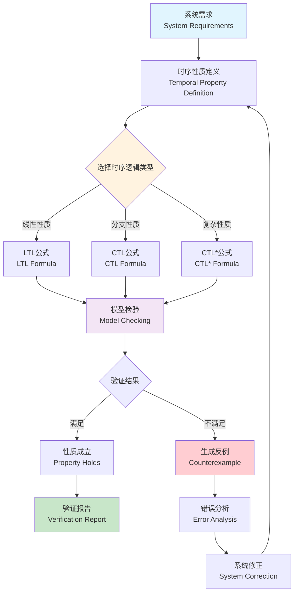

# 时序逻辑 (Temporal Logic)

**本节要点**：（1）时序逻辑的概念、形式化定义与类型（LTL、CTL、CTL*）；（2）与形式化验证、模型检验的对应；（3）国际标准/课程对标与相关概念。  
**预计阅读时间**：约 40–50 分钟；建议分 2–4 次阅读，每次 1–2 节。

## 目录（Table of Contents）

- [时序逻辑 (Temporal Logic)](#时序逻辑-temporal-logic)
  - [目录（Table of Contents）](#目录table-of-contents)
  - [概念定义](#概念定义)
    - [核心特征](#核心特征)
  - [理论基础](#理论基础)
    - [形式化定义](#形式化定义)
    - [时序逻辑类型](#时序逻辑类型)
      - [1. LTL (Linear Temporal Logic) - 线性时序逻辑](#1-ltl-linear-temporal-logic---线性时序逻辑)
      - [2. CTL (Computation Tree Logic) - 计算树逻辑](#2-ctl-computation-tree-logic---计算树逻辑)
      - [3. CTL\* (Extended Computation Tree Logic) - 扩展计算树逻辑](#3-ctl-extended-computation-tree-logic---扩展计算树逻辑)
    - [时序逻辑流程](#时序逻辑流程)
  - [核心组件](#核心组件)
    - [LTL (线性时序逻辑)](#ltl-线性时序逻辑)
      - [基本操作符](#基本操作符)
      - [常用模式](#常用模式)
    - [CTL (计算树逻辑)](#ctl-计算树逻辑)
      - [路径量词与时序操作符组合](#路径量词与时序操作符组合)
      - [常用模式](#常用模式-1)
    - [CTL\* (扩展计算树逻辑)](#ctl-扩展计算树逻辑)
  - [国际标准对标](#国际标准对标)
    - [相关标准](#相关标准)
      - [形式化方法标准](#形式化方法标准)
      - [模型检验标准](#模型检验标准)
    - [行业标准](#行业标准)
  - [著名大学课程对标](#著名大学课程对标)
    - [相关课程](#相关课程)
      - [Stanford CS256: Formal Methods for Reactive Systems](#stanford-cs256-formal-methods-for-reactive-systems)
      - [CMU 15-414: Automated Program Verification and Testing](#cmu-15-414-automated-program-verification-and-testing)
      - [MIT 6.035: Computer Language Engineering](#mit-6035-computer-language-engineering)
  - [工程实践](#工程实践)
    - [模型检验应用](#模型检验应用)
      - [SPIN工具使用](#spin工具使用)
      - [TLA+工具使用](#tla工具使用)
    - [TLA+工具使用](#tla工具使用-1)
      - [TLA+语法基础](#tla语法基础)
      - [TLA+工具链](#tla工具链)
    - [SPIN工具使用](#spin工具使用-1)
      - [Promela语言基础](#promela语言基础)
      - [SPIN验证流程](#spin验证流程)
  - [最佳实践](#最佳实践)
    - [设计原则](#设计原则)
    - [实施建议](#实施建议)
  - [应用案例](#应用案例)
    - [典型案例](#典型案例)
      - [案例1：互斥锁验证](#案例1互斥锁验证)
      - [案例2：请求-响应协议](#案例2请求-响应协议)
    - [行业应用](#行业应用)
      - [云原生系统](#云原生系统)
      - [金融系统](#金融系统)
      - [IoT系统](#iot系统)
  - [相关概念](#相关概念)
    - [核心概念关联](#核心概念关联)
    - [行业应用关联](#行业应用关联)
  - [思考与练习](#思考与练习)
    - [概念理解](#概念理解)
    - [实践应用](#实践应用)
    - [自我验证清单](#自我验证清单)
  - [参考文献](#参考文献)

## 概念定义

时序逻辑（Temporal Logic）是一种用于描述和推理系统随时间变化行为的模态逻辑。它扩展了经典逻辑，增加了时间相关的操作符，能够表达"总是"、"最终"、"直到"等时间相关的性质。

### 核心特征

1. **时间语义**：能够表达时间相关的系统性质
2. **形式化严格性**：基于严格的数学逻辑基础
3. **模型检验支持**：支持自动化模型检验工具
4. **反应式系统适用**：特别适用于并发和反应式系统
5. **可证明性**：支持形式化证明和验证

## 理论基础

理论深化见 [逻辑学基础](../theory-enhancement/logic-foundation.md)、[形式化验证理论](../theory-enhancement/formal-verification-theory.md)；与 L2 行为规约、L3_D08 验证的对应见 [AUTHORITY_ALIGNMENT_INDEX](../../reference/AUTHORITY_ALIGNMENT_INDEX.md) 第 3 节课程对标。

### 形式化定义

时序逻辑基于Kripke结构（Kripke Structure）进行形式化定义：

```text
Kripke Structure = (S, S₀, R, L)

其中：
- S: 状态集合
- S₀ ⊆ S: 初始状态集合
- R ⊆ S × S: 转移关系
- L: S → 2^AP: 标记函数，将状态映射到原子命题集合
```

### 时序逻辑类型

#### 1. LTL (Linear Temporal Logic) - 线性时序逻辑

LTL用于描述线性执行路径上的性质。

**语法定义**：

```text
φ ::= p | ¬φ | φ₁ ∧ φ₂ | φ₁ ∨ φ₂ | X φ | F φ | G φ | φ₁ U φ₂

其中：
- p: 原子命题
- X: Next（下一个状态）
- F: Finally（最终）
- G: Globally（总是）
- U: Until（直到）
```

**语义定义**：

对于路径 π = s₀s₁s₂...：

- **X φ**: 在下一个状态满足φ
- **F φ**: 在路径的某个状态满足φ
- **G φ**: 在路径的所有状态都满足φ
- **φ₁ U φ₂**: φ₁一直成立直到φ₂成立

**示例**：

```text
G (request → F response)     // 总是：如果请求，则最终会有响应
G (¬(critical₁ ∧ critical₂)) // 总是：两个临界区不能同时进入
```

#### 2. CTL (Computation Tree Logic) - 计算树逻辑

CTL用于描述计算树上的性质，区分路径量词和时序操作符。

**语法定义**：

```text
φ ::= p | ¬φ | φ₁ ∧ φ₂ | E φ | A φ | X φ | F φ | G φ | φ₁ U φ₂

其中：
- E: Exists（存在路径）
- A: All（所有路径）
- X, F, G, U: 时序操作符（同LTL）
```

**路径量词与时序操作符组合**：

- **EX φ**: 存在下一个状态满足φ
- **AX φ**: 所有下一个状态都满足φ
- **EF φ**: 存在路径最终满足φ
- **AF φ**: 所有路径最终都满足φ
- **EG φ**: 存在路径总是满足φ
- **AG φ**: 所有路径总是满足φ
- **E[φ₁ U φ₂]**: 存在路径φ₁直到φ₂
- **A[φ₁ U φ₂]**: 所有路径φ₁直到φ₂

**示例**：

```text
AG (request → AF response)        // 所有路径总是：如果请求，则最终会有响应
AG EF restart                     // 所有路径总是：存在重启的可能
```

#### 3. CTL* (Extended Computation Tree Logic) - 扩展计算树逻辑

CTL*结合了LTL和CTL的表达能力，允许路径量词和时序操作符的任意组合。

**语法定义**：

```text
State formulas:
  φ ::= p | ¬φ | φ₁ ∧ φ₂ | E α | A α

Path formulas:
  α ::= φ | ¬α | α₁ ∧ α₂ | X α | F α | G α | α₁ U α₂
```

### 时序逻辑流程



## 核心组件

### LTL (线性时序逻辑)

#### 基本操作符

| 操作符 | 名称 | 含义 | 示例 |
|--------|------|------|------|
| X | Next | 下一个状态 | X p |
| F | Finally | 最终 | F p |
| G | Globally | 总是 | G p |
| U | Until | 直到 | p U q |
| R | Release | 释放 | p R q |

#### 常用模式

```text
# 响应性 (Response)
G (request → F response)

# 持续性 (Persistence)
F G p

# 安全性 (Safety)
G (¬error)

# 活性 (Liveness)
G F p

# 公平性 (Fairness)
G F enabled → G F executed
```

### CTL (计算树逻辑)

#### 路径量词与时序操作符组合

| 组合 | 含义 | 示例 |
|------|------|------|
| EX | 存在下一个状态 | EX p |
| AX | 所有下一个状态 | AX p |
| EF | 存在路径最终 | EF p |
| AF | 所有路径最终 | AF p |
| EG | 存在路径总是 | EG p |
| AG | 所有路径总是 | AG p |
| E[U] | 存在路径直到 | E[p U q] |
| A[U] | 所有路径直到 | A[p U q] |

#### 常用模式

```text
# 可达性 (Reachability)
EF goal

# 安全性 (Safety)
AG (¬error)

# 活性 (Liveness)
AG (request → AF response)

# 公平性 (Fairness)
AG EF enabled
```

### CTL* (扩展计算树逻辑)

CTL*允许更灵活的表达，但模型检验复杂度更高。

## 国际标准对标

### 相关标准

#### 形式化方法标准

- **IEEE 1012-2024**: 软件验证和确认标准，包含时序逻辑验证方法
- **ISO/IEC 15408**: 信息技术安全评估标准，使用时序逻辑描述安全性质

#### 模型检验标准

- **SPIN**: Promela语言和LTL模型检验工具
- **TLA+**: 时序逻辑动作规范语言
- **NuSMV**: 符号模型检验工具，支持CTL和LTL

### 行业标准

- **UML时序图**: 使用时序逻辑描述系统行为
- **SysML**: 系统建模语言，支持时序约束

## 著名大学课程对标

### 相关课程

#### Stanford CS256: Formal Methods for Reactive Systems

**对标内容**：
- LTL和CTL的完整形式化定义
- 模型检验算法（显式和符号）
- 反应式系统的时序性质验证

**项目对齐**：
- 本项目的时序逻辑理论文档
- 模型检验工具集成规范
- 反应式系统建模指南

#### CMU 15-414: Automated Program Verification and Testing

**对标内容**：
- 时序逻辑在程序验证中的应用
- 状态空间探索方法
- 反例生成和分析

**项目对齐**：
- 程序验证理论文档（待创建）
- 验证工具链集成

#### MIT 6.035: Computer Language Engineering

**对标内容**：
- 时序逻辑在编译器验证中的应用
- 程序优化性质的时序描述

## 工程实践

### 模型检验应用

#### SPIN工具使用

**Promela语言示例**：

```promela
// 互斥锁示例
bool lock = false;
bool critical1 = false;
bool critical2 = false;

active proctype Process1() {
    do
    :: !lock ->
        lock = true;
        critical1 = true;
        // 临界区代码
        critical1 = false;
        lock = false
    od
}

active proctype Process2() {
    do
    :: !lock ->
        lock = true;
        critical2 = true;
        // 临界区代码
        critical2 = false;
        lock = false
    od
}

// LTL性质：两个进程不能同时进入临界区
ltl mutex { G !(critical1 && critical2) }
```

**验证命令**：

```bash
spin -a mutex.pml
gcc -o pan pan.c
./pan -a -N mutex
```

#### TLA+工具使用

**TLA+规范示例**：

```tla
EXTENDS Naturals, TLC

VARIABLES x, y

Init == (x = 0) /\ (y = 0)

Next == \/ (x < 10) /\ (x' = x + 1) /\ (y' = y)
        \/ (y < 10) /\ (y' = y + 1) /\ (x' = x)

Spec == Init /\ [][Next]_<<x, y>>

TypeOK == (x \in Nat) /\ (y \in Nat)

\* 时序性质：最终x或y达到10
Eventually == <>(x = 10 \/ y = 10)
```

**验证命令**：

```bash
tlc Spec.tla
```

### TLA+工具使用

#### TLA+语法基础

**基本结构**：

```tla
EXTENDS Naturals, Sequences

VARIABLES x, y

Init == (x = 0) /\ (y = 0)

Next == \/ (x < 10) /\ (x' = x + 1) /\ (y' = y)
        \/ (y < 10) /\ (y' = y + 1) /\ (x' = x)

Spec == Init /\ [][Next]_<<x, y>>
```

**时序操作符**：

- `[]P`: 总是P (Globally)
- `<>P`: 最终P (Finally)
- `P ~> Q`: P导致Q (Leads to)
- `P => Q`: P蕴含Q

#### TLA+工具链

1. **TLA+ Toolbox**: Eclipse插件，提供编辑和验证环境
2. **TLC Model Checker**: 显式状态模型检验器
3. **TLAPS**: TLA+证明系统，支持定理证明

### SPIN工具使用

#### Promela语言基础

**进程定义**：

```promela
proctype Process(int id) {
    // 进程代码
}
```

**通道通信**：

```promela
chan ch = [10] of {int};

ch ! value;  // 发送
ch ? value;  // 接收
```

#### SPIN验证流程

1. **编写Promela规范**
2. **定义LTL性质**
3. **运行SPIN验证**
4. **分析验证结果**

## 最佳实践

### 设计原则

1. **性质分类**：区分安全性和活性性质
2. **逻辑选择**：根据性质类型选择LTL或CTL
3. **公式简化**：使用等价变换简化公式
4. **工具选择**：根据系统规模选择合适工具

### 实施建议

1. **从简单开始**：先验证基本安全性性质
2. **逐步复杂化**：逐步添加更复杂的性质
3. **反例分析**：仔细分析反例，理解系统行为
4. **性能优化**：使用符号方法处理大规模系统

## 应用案例

### 典型案例

#### 案例1：互斥锁验证

**问题**：验证两个进程的互斥锁实现

**LTL性质**：
```text
G !(critical1 && critical2)
```

**验证结果**：使用SPIN验证通过

#### 案例2：请求-响应协议

**问题**：验证请求总是得到响应

**LTL性质**：
```text
G (request → F response)
```

**CTL性质**：
```text
AG (request → AF response)
```

### 行业应用

#### 云原生系统

- **Kubernetes调度器**：验证调度公平性
- **Istio服务网格**：验证流量管理性质

#### 金融系统

- **支付系统**：验证事务一致性
- **风控系统**：验证规则执行性质

#### IoT系统

- **实时控制系统**：验证时序约束
- **设备管理**：验证状态转换性质

## 相关概念

### 核心概念关联

- [逻辑学基础](../theory-enhancement/logic-foundation.md) - 时序逻辑的理论基础；[形式化验证理论](../theory-enhancement/formal-verification-theory.md) - 与本概念对应的理论深化
- [形式化验证](./formal-verification.md) - 时序逻辑是形式化验证的重要方法；模型检验是形式化验证的核心技术
- [自动推理](./automated-reasoning.md) - 时序逻辑推理是自动推理的应用
- [程序验证](./program-verification.md) - 时序逻辑用于程序性质验证；特别适用于反应式系统与并发系统

### 行业应用关联

- **[云原生架构](../../industry-model/cloud-native-architecture/)** - 时序逻辑用于云原生系统验证
- **[IoT架构](../../industry-model/iot-architecture/)** - 时序逻辑用于IoT实时系统验证
- **[金融架构](../../industry-model/finance-architecture/)** - 时序逻辑用于金融系统性质验证

## 思考与练习

### 概念理解

1. 请用自己的话解释什么是时序逻辑
2. LTL和CTL的区别是什么？各自适用于什么场景？
3. 时序逻辑中的"安全性"和"活性"性质分别指什么？

### 实践应用

1. 使用LTL描述一个简单的互斥锁性质
2. 使用CTL描述一个请求-响应协议的性质
3. 使用TLA+或SPIN验证一个简单的系统模型

### 自我验证清单

- [ ] 是否理解时序逻辑的基本概念？
- [ ] 能否区分LTL和CTL的适用场景？
- [ ] 能否使用时序逻辑描述系统性质？
- [ ] 能否使用模型检验工具进行验证？

## 参考文献

1. Clarke, E. M., Grumberg, O., & Peled, D. (1999). *Model Checking*. MIT Press.

2. Baier, C., & Katoen, J. P. (2008). *Principles of Model Checking*. MIT Press.

3. Lamport, L. (2002). *Specifying Systems: The TLA+ Language and Tools for Hardware and Software Engineers*. Addison-Wesley.

4. Holzmann, G. J. (2003). *The SPIN Model Checker: Primer and Reference Manual*. Addison-Wesley.

5. Stanford CS256 Course Materials: [Formal Methods for Reactive Systems](https://cs256.stanford.edu/)

6. IEEE 1012-2024: Standard for System, Software, and Hardware Verification and Validation

---

**难度等级**：⭐⭐⭐⭐ (高级)  
**前置知识**：[形式化验证](./formal-verification.md)、[逻辑学基础](../theory-enhancement/logic-foundation.md)  
**学习时间**：约4-5小时
