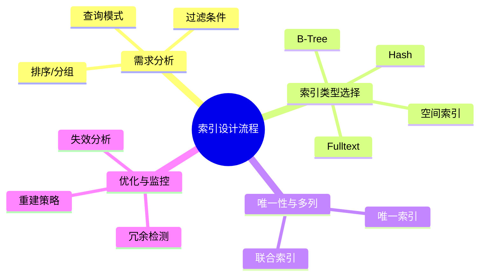

# 索引建模理论探讨

## 1. 形式化目标

- 以结构化方式描述数据库索引的类型、结构、适用场景与优化策略。
- 支持多种索引（单列、多列、唯一、全文、空间等）统一建模。
- 便于自动生成索引DDL、优化建议、索引变更脚本等。

## 2. 核心概念

- **索引类型**：B-Tree、Hash、Bitmap、全文、空间等。
- **唯一性**：唯一索引、非唯一索引。
- **多列索引**：联合索引、复合索引。
- **覆盖索引**：只访问索引即可满足查询。
- **索引优化**：选择性、冗余、失效、重建等。

## 3. 已有标准

- PostgreSQL、MySQL、MongoDB等主流数据库索引
- Elasticsearch倒排索引

## 4. 可行性分析

- 索引建模结构化强，标准化程度高，适合DSL抽象。
- 可自动生成索引DDL、优化建议、变更脚本。
- 易于与AI结合进行索引推荐、失效检测、自动优化。

## 5. 自动化价值

- 降低手工维护索引的成本。
- 提高查询性能和系统可扩展性。
- 支持自动化索引优化与监控。

## 6. 与AI结合点

- 智能推荐索引类型、字段组合。
- 自动推理索引冗余、失效。
- 智能生成索引优化与重建建议。

---

## 7. 常见索引类型与特性一览（表格）

| 索引类型   | 结构/算法   | 适用场景           | 是否唯一 | 典型数据库支持 |
|------------|-------------|--------------------|---------|---------------|
| B-Tree     | 平衡树      | 范围/等值查询      | 可选    | MySQL, PG     |
| Hash       | 哈希表      | 等值查询           | 否      | PG, MongoDB   |
| Bitmap     | 位图        | 低基数聚合         | 否      | Oracle, PG    |
| Fulltext   | 倒排索引    | 文本检索           | 否      | MySQL, ES     |
| Spatial    | R-Tree等    | 地理空间查询       | 否      | PG, MySQL     |

---

## 8. 索引设计流程思维导图

---

## 9. 形式化推理/证明片段

**定理（索引覆盖性）**：
若查询Q的所有字段均包含于索引I的字段集，则Q可仅通过I完成，无需回表。

*证明思路*：
设Q = SELECT a, b FROM T WHERE c = ?，I = (a, b, c)，则Q所需字段均在I中，扫描I即可返回结果。

**推论（冗余索引检测）**：
若存在索引I1 = (a, b)，I2 = (a)，则I2为I1的前缀，且I1未被覆盖时I2可视为冗余。
