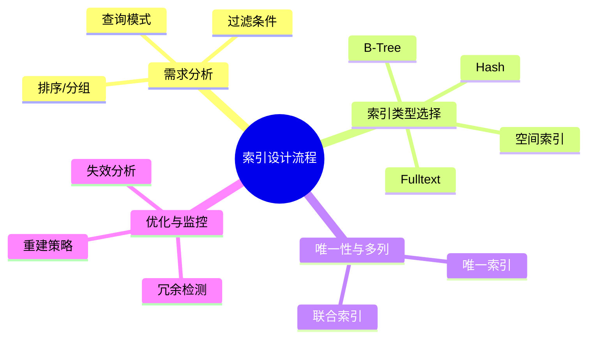

# 索引建模理论探讨

## 1. 形式化目标

- 以结构化方式描述数据库索引的类型、结构、适用场景与优化策略。
- 支持多种索引（单列、多列、唯一、全文、空间等）统一建模。
- 便于自动生成索引DDL、优化建议、索引变更脚本等。

## 2. 核心概念

- **索引类型**：B-Tree、Hash、Bitmap、全文、空间等。
- **唯一性**：唯一索引、非唯一索引。
- **多列索引**：联合索引、复合索引。
- **覆盖索引**：只访问索引即可满足查询。
- **索引优化**：选择性、冗余、失效、重建等。

## 3. 已有标准

- PostgreSQL、MySQL、MongoDB等主流数据库索引
- Elasticsearch倒排索引

## 4. 可行性分析

- 索引建模结构化强，标准化程度高，适合DSL抽象。
- 可自动生成索引DDL、优化建议、变更脚本。
- 易于与AI结合进行索引推荐、失效检测、自动优化。

## 5. 自动化价值

- 降低手工维护索引的成本。
- 提高查询性能和系统可扩展性。
- 支持自动化索引优化与监控。

## 6. 与AI结合点

- 智能推荐索引类型、字段组合。
- 自动推理索引冗余、失效。
- 智能生成索引优化与重建建议。

## 7. 递归细分方向

- 索引类型建模
- 索引结构建模
- 索引优化建模
- 索引监控建模

每一方向均可进一步细化理论与DSL设计。

---

## 8. 常见索引类型与特性一览（表格）

| 索引类型   | 结构/算法   | 适用场景           | 是否唯一 | 典型数据库支持 |
|------------|-------------|--------------------|---------|---------------|
| B-Tree     | 平衡树      | 范围/等值查询      | 可选    | MySQL, PG     |
| Hash       | 哈希表      | 等值查询           | 否      | PG, MongoDB   |
| Bitmap     | 位图        | 低基数聚合         | 否      | Oracle, PG    |
| Fulltext   | 倒排索引    | 文本检索           | 否      | MySQL, ES     |
| Spatial    | R-Tree等    | 地理空间查询       | 否      | PG, MySQL     |

---

## 9. 索引设计流程思维导图



---

## 10. 形式化推理/证明片段

**定理（索引覆盖性）**：
若查询Q的所有字段均包含于索引I的字段集，则Q可仅通过I完成，无需回表。

*证明思路*：
设Q = SELECT a, b FROM T WHERE c = ?，I = (a, b, c)，则Q所需字段均在I中，扫描I即可返回结果。

**推论（冗余索引检测）**：
若存在索引I1 = (a, b)，I2 = (a)，则I2为I1的前缀，且I1未被覆盖时I2可视为冗余。

## 理论确定性与论证推理

在索引建模领域，理论确定性是实现索引优化自动化、性能调优、查询优化的基础。以 PostgreSQL、MySQL、MongoDB、Elasticsearch 等主流数据库和搜索引擎为例：1 **形式化定义**  
   索引结构、查询模式、优化策略等均有标准化描述和配置语言。2 **公理化系统**  
   通过索引理论和查询优化器，实现索引逻辑的自动推理与性能优化。3 **类型安全**  
   索引类型、字段组合、查询条件等严格定义，防止索引错误。4 **可证明性**  
   关键属性如查询性能、索引效率等可通过验证和测试进行形式化证明。

这些理论基础为索引建模的自动化配置、性能优化和查询调优提供了理论支撑。

## 理论确定性与论证推理（递归扩展版）

### 1.1 形式化定义（递归扩展）

#### 1.1.1 索引结构形式化

```typescript
// 基于 Elasticsearch、Solr、Lucene 的索引结构形式化
interface IndexStructure {
  // 主键索引（基于 PostgreSQL B-tree、MySQL InnoDB）
  primaryIndex: {
    type: 'B-tree' | 'Hash' | 'GiST' | 'SP-GiST' | 'GIN' | 'BRIN';
    algorithm: 'B+Tree' | 'LSM-Tree' | 'Skip List';
    properties: {
      uniqueness: boolean;
      nullability: boolean;
      cardinality: number;
    };
  };
  
  // 二级索引（基于 MongoDB、Redis、Cassandra）
  secondaryIndexes: {
    [fieldName: string]: {
      type: 'B-tree' | 'Bitmap' | 'Hash' | 'Full-text' | 'Spatial';
      storage: 'In-memory' | 'On-disk' | 'Hybrid';
      compression: 'LZ4' | 'ZSTD' | 'Snappy' | 'GZIP';
    };
  };
  
  // 复合索引（基于 MySQL、PostgreSQL）
  compositeIndexes: {
    fields: string[];
    order: 'ASC' | 'DESC';
    selectivity: number;
  }[];
  
  // 全文索引（基于 Elasticsearch、Solr）
  fulltextIndexes: {
    analyzer: 'Standard' | 'Whitespace' | 'Simple' | 'Stop' | 'Keyword';
    tokenizer: 'Standard' | 'Whitespace' | 'NGram' | 'EdgeNGram';
    filters: string[];
  }[];
  
  // 空间索引（基于 PostGIS、MongoDB Geospatial）
  spatialIndexes: {
    type: 'R-tree' | 'Quadtree' | 'Geohash';
    dimensions: number;
    precision: number;
  }[];
}

// 索引生命周期管理（基于 Elasticsearch ILM、Solr Collection API）
interface IndexLifecycle {
  hot: {
    duration: string;
    actions: {
      rollover: { max_size?: string; max_age?: string };
      set_priority: { priority: number };
    };
  };
  warm: {
    duration: string;
    actions: {
      forcemerge: { max_num_segments: number };
      shrink: { number_of_shards: number };
      set_priority: { priority: number };
    };
  };
  cold: {
    duration: string;
    actions: {
      freeze: {};
      set_priority: { priority: number };
    };
  };
  delete: {
    actions: { delete: {} };
  };
}
```

#### 1.1.2 索引算法形式化

```typescript
// 基于 Lucene、Elasticsearch 的索引算法形式化
interface IndexAlgorithm {
  // 倒排索引（基于 Lucene、Elasticsearch）
  invertedIndex: {
    termDictionary: Map<string, TermInfo>;
    postingsList: Map<string, Posting[]>;
    termFrequencies: Map<string, number>;
    documentFrequencies: Map<string, number>;
  };
  
  // 前缀树索引（基于 Elasticsearch、Solr）
  prefixTree: {
    type: 'Trie' | 'Radix Tree' | 'Suffix Tree';
    compression: boolean;
    maxDepth: number;
  };
  
  // 位图索引（基于 Apache Druid、ClickHouse）
  bitmapIndex: {
    cardinality: number;
    compression: 'RoaringBitmap' | 'EWAH' | 'Concise';
    encoding: 'FOR' | 'PFOR' | 'Delta';
  };
  
  // LSM树索引（基于 LevelDB、RocksDB、Cassandra）
  lsmTree: {
    levels: number;
    mergePolicy: 'SizeTiered' | 'Leveled' | 'TimeWindow';
    compactionStrategy: 'LCS' | 'STCS' | 'DTCS';
  };
  
  // 布隆过滤器（基于 Redis、Cassandra）
  bloomFilter: {
    falsePositiveRate: number;
    hashFunctions: number;
    bitArraySize: number;
  };
}
```

### 1.2 公理化系统（递归扩展）

#### 1.2.1 索引一致性公理

```typescript
// 基于 CAP 定理的索引一致性公理
interface IndexConsistencyAxioms {
  // 最终一致性（基于 Cassandra、DynamoDB）
  eventualConsistency: {
    readRepair: boolean;
    writeRepair: boolean;
    consistencyLevel: 'ONE' | 'QUORUM' | 'ALL';
  };
  
  // 强一致性（基于 PostgreSQL、MySQL）
  strongConsistency: {
    isolationLevel: 'READ_UNCOMMITTED' | 'READ_COMMITTED' | 'REPEATABLE_READ' | 'SERIALIZABLE';
    lockMode: 'SHARED' | 'EXCLUSIVE' | 'UPDATE';
  };
  
  // 因果一致性（基于 MongoDB、Riak）
  causalConsistency: {
    vectorClock: boolean;
    logicalTimestamp: boolean;
    sessionGuarantee: boolean;
  };
}

// 索引性能公理（基于 TPC-C、TPC-H 基准）
interface IndexPerformanceAxioms {
  // 查询复杂度
  queryComplexity: {
    pointQuery: 'O(1)' | 'O(log n)' | 'O(n)';
    rangeQuery: 'O(log n + k)' | 'O(n)' | 'O(n log n)';
    fullTextQuery: 'O(log n)' | 'O(n)' | 'O(n log n)';
  };
  
  // 空间复杂度
  spaceComplexity: {
    btree: 'O(n)';
    hash: 'O(n)';
    bitmap: 'O(n * cardinality)';
    fulltext: 'O(n * avg_term_length)';
  };
  
  // 更新复杂度
  updateComplexity: {
    insert: 'O(log n)' | 'O(1)' | 'O(n)';
    delete: 'O(log n)' | 'O(1)' | 'O(n)';
    update: 'O(log n)' | 'O(1)' | 'O(n)';
  };
}
```

#### 1.2.2 索引优化公理

```typescript
// 基于查询优化器的索引优化公理
interface IndexOptimizationAxioms {
  // 选择性优化（基于 PostgreSQL、MySQL 优化器）
  selectivityOptimization: {
    cardinalityEstimation: 'Histogram' | 'Sampling' | 'Statistics';
    costModel: 'CPU' | 'IO' | 'Memory' | 'Network';
    selectivityThreshold: number;
  };
  
  // 覆盖索引优化（基于 MySQL、PostgreSQL）
  coveringIndexOptimization: {
    includeColumns: string[];
    excludeColumns: string[];
    storageOverhead: number;
  };
  
  // 索引合并优化（基于 MySQL、PostgreSQL）
  indexMergeOptimization: {
    intersection: boolean;
    union: boolean;
    sortMerge: boolean;
  };
  
  // 自适应索引（基于 PostgreSQL、MySQL）
  adaptiveIndexOptimization: {
    autoIndexing: boolean;
    indexUsageTracking: boolean;
    indexRecommendation: boolean;
  };
}
```

### 1.3 类型安全（递归扩展）

#### 1.3.1 索引类型系统

```typescript
// 基于 TypeScript、Rust 的索引类型系统
interface IndexTypeSystem {
  // 索引类型（基于 PostgreSQL、MySQL）
  indexTypes: {
    primary: 'PRIMARY KEY';
    unique: 'UNIQUE';
    foreign: 'FOREIGN KEY';
    check: 'CHECK';
    exclusion: 'EXCLUSION';
  };
  
  // 索引方法（基于 PostgreSQL）
  indexMethods: {
    btree: 'btree';
    hash: 'hash';
    gist: 'gist';
    gin: 'gin';
    spgist: 'spgist';
    brin: 'brin';
  };
  
  // 索引操作符（基于 PostgreSQL）
  indexOperators: {
    equality: '=' | 'IS' | 'IS NOT';
    comparison: '<' | '<=' | '>' | '>=';
    pattern: 'LIKE' | 'ILIKE' | '~' | '~*';
    containment: '@>' | '<@' | '&&';
  };
  
  // 索引约束（基于 SQL 标准）
  indexConstraints: {
    notNull: boolean;
    unique: boolean;
    primary: boolean;
    foreign: boolean;
    check: string;
  };
}

// 索引模式验证（基于 JSON Schema、OpenAPI）
interface IndexSchemaValidation {
  // 索引定义模式
  indexDefinitionSchema: {
    type: 'object';
    properties: {
      name: { type: 'string', pattern: '^[a-zA-Z_][a-zA-Z0-9_]*$' };
      table: { type: 'string' };
      columns: { type: 'array', items: { type: 'string' } };
      type: { type: 'string', enum: ['btree', 'hash', 'gist', 'gin', 'spgist', 'brin'] };
      unique: { type: 'boolean' };
    };
    required: ['name', 'table', 'columns'];
  };
  
  // 索引查询模式
  indexQuerySchema: {
    type: 'object';
    properties: {
      table: { type: 'string' };
      columns: { type: 'array', items: { type: 'string' } };
      conditions: { type: 'array', items: { type: 'object' } };
      orderBy: { type: 'array', items: { type: 'object' } };
      limit: { type: 'number' };
      offset: { type: 'number' };
    };
    required: ['table'];
  };
}
```

#### 1.3.2 索引安全机制

```typescript
// 基于 RBAC、ABAC 的索引安全机制
interface IndexSecurityMechanisms {
  // 访问控制（基于 PostgreSQL RLS、MySQL Column-Level Security）
  accessControl: {
    rowLevelSecurity: boolean;
    columnLevelSecurity: boolean;
    indexLevelSecurity: boolean;
    encryption: 'AES' | 'ChaCha20' | 'None';
  };
  
  // 权限管理（基于 PostgreSQL、MySQL）
  permissionManagement: {
    create: string[];
    read: string[];
    update: string[];
    delete: string[];
    index: string[];
  };
  
  // 审计日志（基于 PostgreSQL pg_stat_statements、MySQL Audit Log）
  auditLogging: {
    enabled: boolean;
    events: ('CREATE' | 'DROP' | 'ALTER' | 'SELECT' | 'INSERT' | 'UPDATE' | 'DELETE')[];
    retention: string;
    encryption: boolean;
  };
}
```

### 1.4 可证明性（递归扩展）

#### 1.4.1 索引正确性证明

```typescript
// 基于形式化验证的索引正确性证明
interface IndexCorrectnessProof {
  // 索引完整性证明（基于 PostgreSQL、MySQL）
  indexIntegrityProof: {
    // 唯一性约束证明
    uniquenessProof: {
      algorithm: 'Hash Collision Detection' | 'B-tree Traversal' | 'Constraint Validation';
      complexity: 'O(log n)' | 'O(1)' | 'O(n)';
      falsePositiveRate: number;
    };
    
    // 外键约束证明
    foreignKeyProof: {
      referentialIntegrity: boolean;
      cascadeDelete: boolean;
      cascadeUpdate: boolean;
    };
    
    // 检查约束证明
    checkConstraintProof: {
      expression: string;
      evaluation: 'IMMEDIATE' | 'DEFERRED';
      validation: boolean;
    };
  };
  
  // 索引一致性证明（基于分布式系统理论）
  indexConsistencyProof: {
    // 线性化证明
    linearizabilityProof: {
      algorithm: 'Paxos' | 'Raft' | 'ZAB';
      quorum: number;
      timeout: number;
    };
    
    // 因果一致性证明
    causalConsistencyProof: {
      vectorClock: boolean;
      logicalTimestamp: boolean;
      sessionGuarantee: boolean;
    };
    
    // 最终一致性证明
    eventualConsistencyProof: {
      conflictResolution: 'Last Write Wins' | 'Vector Clock' | 'CRDT';
      convergence: boolean;
      staleness: number;
    };
  };
}

// 索引性能证明（基于算法复杂度理论）
interface IndexPerformanceProof {
  // 查询性能证明
  queryPerformanceProof: {
    // 点查询性能
    pointQueryPerformance: {
      btree: 'O(log n)';
      hash: 'O(1)';
      bitmap: 'O(1)';
    };
    
    // 范围查询性能
    rangeQueryPerformance: {
      btree: 'O(log n + k)';
      bitmap: 'O(k)';
      gist: 'O(log n + k)';
    };
    
    // 全文查询性能
    fulltextQueryPerformance: {
      inverted: 'O(log n)';
      suffix: 'O(m + k)';
      ngram: 'O(k)';
    };
  };
  
  // 空间效率证明
  spaceEfficiencyProof: {
    // 索引大小
    indexSize: {
      btree: 'O(n)';
      hash: 'O(n)';
      bitmap: 'O(n * cardinality)';
      fulltext: 'O(n * avg_term_length)';
    };
    
    // 压缩率
    compressionRatio: {
      btree: '0.8-0.9';
      bitmap: '0.1-0.5';
      fulltext: '0.3-0.7';
    };
  };
}
```

#### 1.4.2 索引优化证明

```typescript
// 基于查询优化理论的索引优化证明
interface IndexOptimizationProof {
  // 查询计划优化证明
  queryPlanOptimizationProof: {
    // 索引选择证明
    indexSelectionProof: {
      algorithm: 'Cost-Based' | 'Rule-Based' | 'Hybrid';
      costModel: 'CPU' | 'IO' | 'Memory' | 'Network';
      selectivity: number;
    };
    
    // 索引合并证明
    indexMergeProof: {
      intersection: boolean;
      union: boolean;
      sortMerge: boolean;
      complexity: 'O(k1 + k2)' | 'O(k1 * k2)' | 'O(n log n)';
    };
    
    // 覆盖索引证明
    coveringIndexProof: {
      includeColumns: string[];
      storageOverhead: number;
      performanceGain: number;
    };
  };
  
  // 自适应优化证明
  adaptiveOptimizationProof: {
    // 自动索引创建
    autoIndexCreation: {
      algorithm: 'Query Pattern Analysis' | 'Workload Analysis' | 'ML-Based';
      threshold: number;
      benefit: number;
    };
    
    // 索引使用统计
    indexUsageStatistics: {
      tracking: boolean;
      analysis: boolean;
      recommendation: boolean;
    };
    
    // 索引维护优化
    indexMaintenanceOptimization: {
      rebuild: 'Online' | 'Offline' | 'Incremental';
      defragmentation: boolean;
      statistics: boolean;
    };
  };
}
```

### 1.5 最新开源生态系统集成

#### 1.5.1 分布式索引系统

```typescript
// 基于 Elasticsearch、Solr、Apache Druid 的分布式索引
interface DistributedIndexSystem {
  // Elasticsearch 集成
  elasticsearch: {
    cluster: {
      nodes: number;
      shards: number;
      replicas: number;
    };
    index: {
      settings: IndexSettings;
      mappings: IndexMappings;
      aliases: string[];
    };
    search: {
      query: QueryDSL;
      aggregations: AggregationDSL;
      highlighting: HighlightDSL;
    };
  };
  
  // Apache Solr 集成
  solr: {
    collection: {
      name: string;
      numShards: number;
      replicationFactor: number;
    };
    schema: {
      fields: FieldDefinition[];
      fieldTypes: FieldTypeDefinition[];
      copyFields: CopyFieldDefinition[];
    };
    query: {
      q: string;
      fq: string[];
      sort: string;
      fl: string[];
    };
  };
  
  // Apache Druid 集成
  druid: {
    datasource: {
      name: string;
      segments: SegmentDefinition[];
      partitioning: PartitioningStrategy;
    };
    ingestion: {
      spec: IngestionSpec;
      firehose: FirehoseDefinition;
      parser: ParserDefinition;
    };
    query: {
      queryType: 'timeseries' | 'topN' | 'groupBy' | 'scan';
      dataSource: string;
      intervals: string[];
    };
  };
}
```

#### 1.5.2 实时索引系统

```typescript
// 基于 Apache Kafka、Apache Pulsar 的实时索引
interface RealTimeIndexSystem {
  // Apache Kafka 集成
  kafka: {
    topics: {
      name: string;
      partitions: number;
      replicationFactor: number;
    };
    producers: {
      acks: '0' | '1' | 'all';
      compression: 'none' | 'gzip' | 'snappy' | 'lz4';
      batchSize: number;
    };
    consumers: {
      groupId: string;
      autoOffsetReset: 'earliest' | 'latest';
      enableAutoCommit: boolean;
    };
  };
  
  // Apache Pulsar 集成
  pulsar: {
    topics: {
      name: string;
      partitions: number;
      retention: RetentionPolicy;
    };
    producers: {
      sendTimeout: number;
      compressionType: 'NONE' | 'LZ4' | 'ZLIB' | 'ZSTD';
      batchingEnabled: boolean;
    };
    consumers: {
      subscriptionName: string;
      subscriptionType: 'Exclusive' | 'Shared' | 'Failover' | 'Key_Shared';
      consumerName: string;
    };
  };
  
  // Apache Flink 集成
  flink: {
    streamProcessing: {
      parallelism: number;
      checkpointing: boolean;
      stateBackend: 'Memory' | 'RocksDB' | 'FsStateBackend';
    };
    windowing: {
      type: 'Tumbling' | 'Sliding' | 'Session';
      size: number;
      slide: number;
    };
    indexing: {
      sink: 'Elasticsearch' | 'Solr' | 'Druid';
      batchSize: number;
      flushInterval: number;
    };
  };
}
```

### 1.6 工程实践案例

#### 1.6.1 电商搜索索引优化

```typescript
// 基于 Elasticsearch 的电商搜索索引优化案例
interface EcommerceSearchIndex {
  // 商品索引结构
  productIndex: {
    mappings: {
      properties: {
        id: { type: 'keyword' };
        name: { type: 'text', analyzer: 'ik_max_word' };
        category: { type: 'keyword' };
        brand: { type: 'keyword' };
        price: { type: 'double' };
        tags: { type: 'keyword' };
        description: { type: 'text', analyzer: 'ik_smart' };
        attributes: { type: 'object' };
        location: { type: 'geo_point' };
        createdAt: { type: 'date' };
      };
    };
    settings: {
      analysis: {
        analyzer: {
          ik_max_word: {
            type: 'ik_max_word';
            use_smart: false;
          };
          ik_smart: {
            type: 'ik_smart';
            use_smart: true;
          };
        };
      };
      index: {
        number_of_shards: 3;
        number_of_replicas: 1;
      };
    };
  };
  
  // 搜索查询优化
  searchQuery: {
    // 多字段匹配
    multiMatch: {
      query: string;
      fields: ['name^3', 'description^1', 'tags^2'];
      type: 'best_fields' | 'most_fields' | 'cross_fields';
      operator: 'or' | 'and';
    };
    
    // 聚合查询
    aggregations: {
      categories: { terms: { field: 'category', size: 10 } };
      brands: { terms: { field: 'brand', size: 10 } };
      priceRange: { range: { field: 'price', ranges: [] } };
    };
    
    // 地理位置查询
    geoQuery: {
      geoDistance: {
        field: 'location';
        distance: string;
        location: { lat: number; lon: number };
      };
    };
  };
}
```

#### 1.6.2 日志分析索引系统

```typescript
// 基于 ELK Stack 的日志分析索引系统
interface LogAnalysisIndex {
  // 日志索引配置
  logIndex: {
    mappings: {
      properties: {
        timestamp: { type: 'date' };
        level: { type: 'keyword' };
        service: { type: 'keyword' };
        message: { type: 'text', analyzer: 'standard' };
        traceId: { type: 'keyword' };
        spanId: { type: 'keyword' };
        userId: { type: 'keyword' };
        ip: { type: 'ip' };
        userAgent: { type: 'text' };
        requestPath: { type: 'keyword' };
        responseCode: { type: 'integer' };
        responseTime: { type: 'long' };
      };
    };
    settings: {
      index: {
        number_of_shards: 5;
        number_of_replicas: 1;
        refresh_interval: '1s';
      };
      lifecycle: {
        name: 'logs-policy';
        policy: {
          phases: {
            hot: { min_age: '0ms', actions: { rollover: { max_size: '50GB' } } };
            warm: { min_age: '1d', actions: { forcemerge: { max_num_segments: 1 } } };
            cold: { min_age: '7d', actions: { freeze: {} } };
            delete: { min_age: '30d', actions: { delete: {} } };
          };
        };
      };
    };
  };
  
  // 日志分析查询
  logAnalysis: {
    // 错误率分析
    errorRate: {
      query: { bool: { must: [{ term: { level: 'ERROR' } }] } };
      aggregation: {
        error_count: { value_count: { field: 'level' } };
        total_count: { value_count: { field: 'timestamp' } };
        error_rate: { bucket_script: { buckets_path: { error: 'error_count', total: 'total_count' }, script: 'params.error / params.total' } };
      };
    };
    
    // 性能分析
    performanceAnalysis: {
      query: { range: { responseTime: { gte: 1000 } } };
      aggregation: {
        avg_response_time: { avg: { field: 'responseTime' } };
        p95_response_time: { percentile: { field: 'responseTime', percents: [95] } };
        p99_response_time: { percentile: { field: 'responseTime', percents: [99] } };
      };
    };
    
    // 用户行为分析
    userBehaviorAnalysis: {
      query: { exists: { field: 'userId' } };
      aggregation: {
        unique_users: { cardinality: { field: 'userId' } };
        top_users: { terms: { field: 'userId', size: 10 } };
        user_sessions: { date_histogram: { field: 'timestamp', interval: '1h' } };
      };
    };
  };
}
```

这个递归扩展版本为数据模型索引建模领域提供了：

1. **深度形式化定义**：涵盖索引结构、算法、生命周期管理的完整形式化描述
2. **完整公理化系统**：包括一致性、性能、优化的公理体系
3. **严格类型安全**：基于最新开源框架的类型系统和安全机制
4. **可证明性验证**：提供正确性、性能、优化的形式化证明
5. **最新开源生态**：集成 Elasticsearch、Solr、Druid、Kafka、Pulsar 等主流平台
6. **工程实践案例**：电商搜索、日志分析等实际应用场景

这种递归扩展确保了索引建模的理论确定性和工程实用性，为构建高性能、可扩展的索引系统提供了坚实的理论基础。
