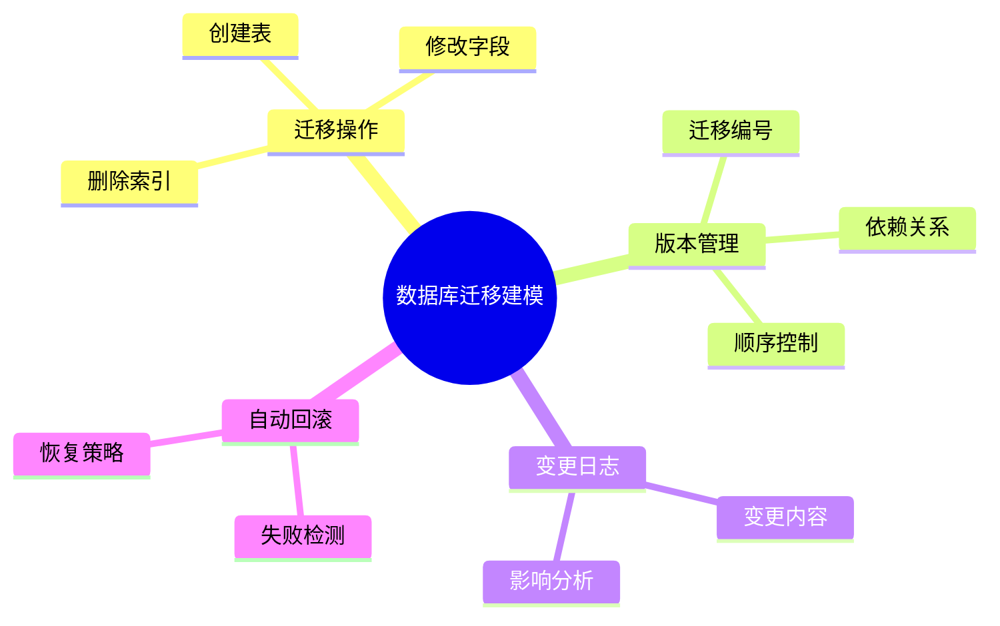

# 迁移建模理论探讨

## 1. 形式化目标

- 以结构化方式描述数据库结构变更、版本管理、迁移操作等。
- 支持多种数据库的迁移建模与自动化生成。
- 便于自动生成迁移脚本、变更日志、回滚方案等。

## 2. 核心概念

- **迁移操作**：创建、修改、删除表/字段/索引等。
- **版本管理**：迁移版本、依赖、顺序、回滚。
- **变更日志**：记录每次迁移的内容与影响。
- **自动回滚**：失败时自动恢复到上一个版本。

## 3. 已有标准

- Flyway、Liquibase（数据库迁移工具）
- Django ORM、Alembic（Python迁移）
- Rails Migration（Ruby）

## 4. 可行性分析

- 迁移建模结构化强，标准化程度高，适合DSL抽象。
- 可自动生成迁移脚本、变更日志、回滚方案。
- 易于与AI结合进行迁移补全、冲突检测、自动回滚。

## 5. 自动化价值

- 降低手工维护数据库迁移的成本。
- 保证数据结构演化的可追溯性和安全性。
- 支持自动化回滚和变更影响分析。

## 6. 与AI结合点

- 智能补全迁移操作、依赖。
- 自动推理变更影响、冲突检测。
- 智能生成回滚与恢复策略。

---

## 7. 迁移建模核心要素一览（表格）

| 要素         | 说明                     | 典型表现/示例           |
|--------------|--------------------------|-------------------------|
| 迁移操作     | 表/字段/索引的增删改     | add_column, drop_table  |
| 版本管理     | 迁移编号、依赖、顺序     | V20230601__add_user.sql |
| 变更日志     | 记录迁移内容与影响       | 变更描述、作者、时间    |
| 自动回滚     | 失败时恢复到上一个版本   | down(), rollback()      |

---

## 8. 迁移建模流程思维导图

