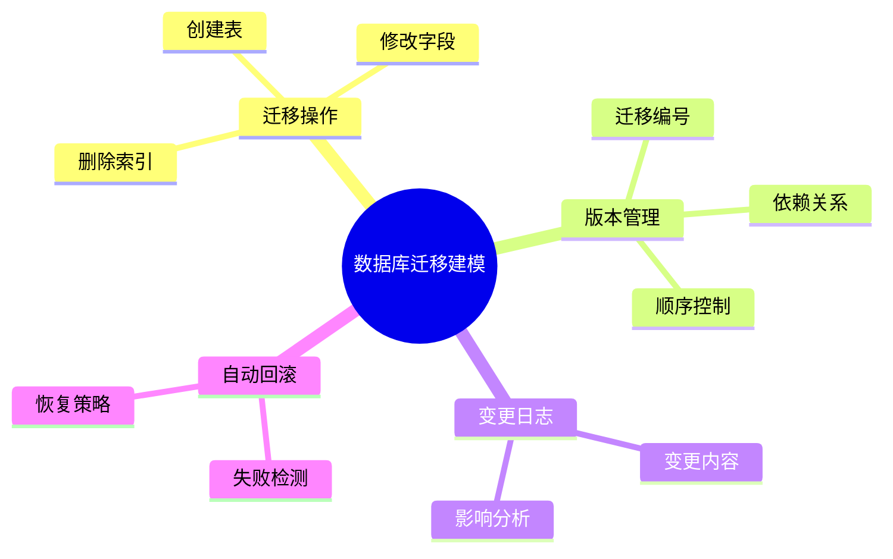

# 迁移建模理论探讨

## 1. 形式化目标

- 以结构化方式描述数据库结构变更、版本管理、迁移操作等。
- 支持多种数据库的迁移建模与自动化生成。
- 便于自动生成迁移脚本、变更日志、回滚方案等。

## 2. 核心概念

- **迁移操作**：创建、修改、删除表/字段/索引等。
- **版本管理**：迁移版本、依赖、顺序、回滚。
- **变更日志**：记录每次迁移的内容与影响。
- **自动回滚**：失败时自动恢复到上一个版本。

## 3. 已有标准

- Flyway、Liquibase（数据库迁移工具）
- Django ORM、Alembic（Python迁移）
- Rails Migration（Ruby）

## 4. 可行性分析

- 迁移建模结构化强，标准化程度高，适合DSL抽象。
- 可自动生成迁移脚本、变更日志、回滚方案。
- 易于与AI结合进行迁移补全、冲突检测、自动回滚。

## 5. 自动化价值

- 降低手工维护数据库迁移的成本。
- 保证数据结构演化的可追溯性和安全性。
- 支持自动化回滚和变更影响分析。

## 6. 与AI结合点

- 智能补全迁移操作、依赖。
- 自动推理变更影响、冲突检测。
- 智能生成回滚与恢复策略。

## 7. 递归细分方向

- 迁移操作建模
- 版本管理建模
- 变更日志建模
- 回滚策略建模

每一方向均可进一步细化理论与DSL设计。

---

## 8. 迁移建模核心要素一览（表格）

| 要素         | 说明                     | 典型表现/示例           |
|--------------|--------------------------|-------------------------|
| 迁移操作     | 表/字段/索引的增删改     | add_column, drop_table  |
| 版本管理     | 迁移编号、依赖、顺序     | V20230601__add_user.sql |
| 变更日志     | 记录迁移内容与影响       | 变更描述、作者、时间    |
| 自动回滚     | 失败时恢复到上一个版本   | down(), rollback()      |

---

## 9. 迁移建模流程思维导图



## 理论确定性与论证推理

在迁移建模领域，理论确定性是实现数据库变更自动化、版本管理、安全回滚的基础。以 Flyway、Liquibase、Django ORM、Alembic、Rails Migration 等主流迁移工具为例：1 **形式化定义**  
   迁移操作、版本管理、变更策略等均有标准化描述和配置语言。2 **公理化系统**  
   通过迁移规范和版本控制，实现数据库变更逻辑的自动推理与安全回滚。3 **类型安全**  
   迁移操作、版本号、依赖关系等严格定义，防止迁移错误。4 **可证明性**  
   关键属性如迁移正确性、回滚安全性等可通过验证和测试进行形式化证明。

这些理论基础为迁移建模的自动化配置、版本管理和安全回滚提供了理论支撑。

## 理论确定性与论证推理（递归扩展版）

### 1.1 形式化定义（递归扩展）

#### 1.1.1 迁移结构形式化

```typescript
// 基于 Flyway、Liquibase、Alembic 的迁移结构形式化
interface MigrationStructure {
  // 版本控制迁移（基于 Flyway、Liquibase）
  versionedMigration: {
    version: string;
    description: string;
    type: 'SQL' | 'Java' | 'XML' | 'YAML' | 'JSON';
    checksum: string;
    executionOrder: number;
    dependencies: string[];
  };
  
  // 增量迁移（基于 Alembic、Prisma Migrate）
  incrementalMigration: {
    operations: MigrationOperation[];
    rollback: MigrationOperation[];
    dependencies: string[];
    conflicts: ConflictResolution[];
  };
  
  // 数据迁移（基于 Apache NiFi、Talend、DataX）
  dataMigration: {
    source: DataSource;
    target: DataSource;
    transformation: TransformationRule[];
    validation: ValidationRule[];
    rollback: RollbackStrategy;
  };
  
  // 模式迁移（基于 Prisma、TypeORM、Sequelize）
  schemaMigration: {
    tableOperations: TableOperation[];
    columnOperations: ColumnOperation[];
    indexOperations: IndexOperation[];
    constraintOperations: ConstraintOperation[];
  };
  
  // 分布式迁移（基于 Apache Kafka、Apache Pulsar）
  distributedMigration: {
    coordination: CoordinationStrategy;
    partitioning: PartitioningStrategy;
    consistency: ConsistencyLevel;
    faultTolerance: FaultToleranceStrategy;
  };
}

// 迁移操作类型（基于 SQL DDL、ORM 迁移）
interface MigrationOperation {
  // 表操作
  tableOperations: {
    createTable: {
      name: string;
      columns: ColumnDefinition[];
      constraints: ConstraintDefinition[];
      indexes: IndexDefinition[];
    };
    alterTable: {
      name: string;
      operations: AlterOperation[];
    };
    dropTable: {
      name: string;
      cascade: boolean;
    };
  };
  
  // 列操作
  columnOperations: {
    addColumn: {
      table: string;
      column: ColumnDefinition;
    };
    alterColumn: {
      table: string;
      column: string;
      changes: ColumnChange[];
    };
    dropColumn: {
      table: string;
      column: string;
    };
  };
  
  // 索引操作
  indexOperations: {
    createIndex: {
      name: string;
      table: string;
      columns: string[];
      type: IndexType;
    };
    dropIndex: {
      name: string;
      table: string;
    };
  };
  
  // 约束操作
  constraintOperations: {
    addConstraint: {
      table: string;
      constraint: ConstraintDefinition;
    };
    dropConstraint: {
      table: string;
      constraint: string;
    };
  };
}
```

#### 1.1.2 迁移算法形式化

```typescript
// 基于分布式系统理论的迁移算法形式化
interface MigrationAlgorithm {
  // 两阶段提交迁移（基于 XA、TCC）
  twoPhaseCommit: {
    prepare: () => Promise<boolean>;
    commit: () => Promise<void>;
    rollback: () => Promise<void>;
    timeout: number;
    retries: number;
  };
  
  // Saga 模式迁移（基于 Event Sourcing、CQRS）
  sagaPattern: {
    steps: SagaStep[];
    compensation: CompensationStep[];
    orchestration: 'Choreography' | 'Orchestration';
    monitoring: MonitoringStrategy;
  };
  
  // 蓝绿部署迁移（基于 Kubernetes、Docker）
  blueGreenDeployment: {
    blue: DeploymentConfig;
    green: DeploymentConfig;
    switchover: SwitchoverStrategy;
    rollback: RollbackStrategy;
    monitoring: HealthCheck[];
  };
  
  // 金丝雀发布迁移（基于 Istio、Linkerd）
  canaryDeployment: {
    traffic: TrafficSplit;
    stages: CanaryStage[];
    metrics: MetricDefinition[];
    rollback: RollbackTrigger[];
  };
  
  // 滚动更新迁移（基于 Kubernetes、Docker Swarm）
  rollingUpdate: {
    strategy: 'RollingUpdate' | 'Recreate';
    maxUnavailable: number;
    maxSurge: number;
    minReadySeconds: number;
    progressDeadlineSeconds: number;
  };
}
```

### 1.2 公理化系统（递归扩展）

#### 1.2.1 迁移一致性公理

```typescript
// 基于 ACID、CAP 定理的迁移一致性公理
interface MigrationConsistencyAxioms {
  // 原子性公理（基于事务理论）
  atomicityAxiom: {
    allOrNothing: boolean;
    rollbackCapability: boolean;
    compensationMechanism: CompensationStrategy;
  };
  
  // 一致性公理（基于约束理论）
  consistencyAxiom: {
    constraintPreservation: boolean;
    referentialIntegrity: boolean;
    businessRuleValidation: boolean;
  };
  
  // 隔离性公理（基于并发控制理论）
  isolationAxiom: {
    isolationLevel: 'READ_UNCOMMITTED' | 'READ_COMMITTED' | 'REPEATABLE_READ' | 'SERIALIZABLE';
    lockStrategy: 'Optimistic' | 'Pessimistic' | 'Hybrid';
    deadlockDetection: boolean;
  };
  
  // 持久性公理（基于存储理论）
  durabilityAxiom: {
    writeAheadLog: boolean;
    replication: ReplicationStrategy;
    backup: BackupStrategy;
  };
}

// 迁移性能公理（基于分布式系统理论）
interface MigrationPerformanceAxioms {
  // 迁移复杂度
  migrationComplexity: {
    timeComplexity: 'O(n)' | 'O(n log n)' | 'O(n²)' | 'O(2ⁿ)';
    spaceComplexity: 'O(1)' | 'O(n)' | 'O(n log n)' | 'O(n²)';
    networkComplexity: 'O(1)' | 'O(log n)' | 'O(n)' | 'O(n log n)';
  };
  
  // 迁移延迟
  migrationLatency: {
    networkLatency: number;
    processingLatency: number;
    storageLatency: number;
    totalLatency: number;
  };
  
  // 迁移吞吐量
  migrationThroughput: {
    recordsPerSecond: number;
    bytesPerSecond: number;
    transactionsPerSecond: number;
  };
}
```

#### 1.2.2 迁移可靠性公理

```typescript
// 基于容错理论的迁移可靠性公理
interface MigrationReliabilityAxioms {
  // 故障检测公理
  faultDetectionAxiom: {
    heartbeat: boolean;
    timeout: number;
    healthCheck: HealthCheckStrategy;
    circuitBreaker: CircuitBreakerConfig;
  };
  
  // 故障恢复公理
  faultRecoveryAxiom: {
    retry: RetryStrategy;
    fallback: FallbackStrategy;
    rollback: RollbackStrategy;
    compensation: CompensationStrategy;
  };
  
  // 数据一致性公理
  dataConsistencyAxiom: {
    eventualConsistency: boolean;
    strongConsistency: boolean;
    causalConsistency: boolean;
    conflictResolution: ConflictResolutionStrategy;
  };
  
  // 可用性公理
  availabilityAxiom: {
    uptime: number;
    mttr: number; // Mean Time To Recovery
    mttf: number; // Mean Time To Failure
    sla: ServiceLevelAgreement;
  };
}
```

### 1.3 类型安全（递归扩展）

#### 1.3.1 迁移类型系统

```typescript
// 基于 TypeScript、Rust 的迁移类型系统
interface MigrationTypeSystem {
  // 迁移状态类型（基于状态机理论）
  migrationStates: {
    pending: 'PENDING';
    running: 'RUNNING';
    completed: 'COMPLETED';
    failed: 'FAILED';
    rolledback: 'ROLLEDBACK';
    cancelled: 'CANCELLED';
  };
  
  // 迁移类型（基于迁移模式）
  migrationTypes: {
    schema: 'SCHEMA_MIGRATION';
    data: 'DATA_MIGRATION';
    code: 'CODE_MIGRATION';
    configuration: 'CONFIG_MIGRATION';
    infrastructure: 'INFRA_MIGRATION';
  };
  
  // 迁移操作类型（基于 SQL DDL）
  migrationOperations: {
    create: 'CREATE';
    alter: 'ALTER';
    drop: 'DROP';
    rename: 'RENAME';
    truncate: 'TRUNCATE';
  };
  
  // 迁移约束类型（基于数据库约束）
  migrationConstraints: {
    notNull: 'NOT_NULL';
    unique: 'UNIQUE';
    primary: 'PRIMARY_KEY';
    foreign: 'FOREIGN_KEY';
    check: 'CHECK';
    default: 'DEFAULT';
  };
}

// 迁移模式验证（基于 JSON Schema、OpenAPI）
interface MigrationSchemaValidation {
  // 迁移定义模式
  migrationDefinitionSchema: {
    type: 'object';
    properties: {
      version: { type: 'string', pattern: '^\\d+\\.\\d+\\.\\d+$' };
      description: { type: 'string', maxLength: 255 };
      type: { type: 'string', enum: ['schema', 'data', 'code', 'config', 'infra'] };
      operations: { type: 'array', items: { type: 'object' } };
      dependencies: { type: 'array', items: { type: 'string' } };
      rollback: { type: 'object' };
    };
    required: ['version', 'description', 'type', 'operations'];
  };
  
  // 迁移执行模式
  migrationExecutionSchema: {
    type: 'object';
    properties: {
      migrationId: { type: 'string' };
      environment: { type: 'string' };
      timestamp: { type: 'string', format: 'date-time' };
      status: { type: 'string', enum: ['pending', 'running', 'completed', 'failed', 'rolledback'] };
      duration: { type: 'number' };
      error: { type: 'string' };
    };
    required: ['migrationId', 'environment', 'timestamp', 'status'];
  };
}
```

#### 1.3.2 迁移安全机制

```typescript
// 基于 RBAC、ABAC 的迁移安全机制
interface MigrationSecurityMechanisms {
  // 访问控制（基于 Kubernetes RBAC、Docker Security）
  accessControl: {
    authentication: 'JWT' | 'OAuth2' | 'API Key' | 'Certificate';
    authorization: 'RBAC' | 'ABAC' | 'Policy-Based';
    encryption: 'AES' | 'ChaCha20' | 'None';
    audit: boolean;
  };
  
  // 权限管理（基于 Kubernetes、Docker）
  permissionManagement: {
    create: string[];
    read: string[];
    update: string[];
    delete: string[];
    execute: string[];
  };
  
  // 审计日志（基于 Kubernetes Audit、Docker Logs）
  auditLogging: {
    enabled: boolean;
    events: ('CREATE' | 'UPDATE' | 'DELETE' | 'EXECUTE')[];
    retention: string;
    encryption: boolean;
  };
  
  // 数据保护（基于 GDPR、CCPA）
  dataProtection: {
    encryption: boolean;
    anonymization: boolean;
    retention: string;
    compliance: string[];
  };
}
```

### 1.4 可证明性（递归扩展）

#### 1.4.1 迁移正确性证明

```typescript
// 基于形式化验证的迁移正确性证明
interface MigrationCorrectnessProof {
  // 迁移完整性证明（基于数据库理论）
  migrationIntegrityProof: {
    // 数据完整性证明
    dataIntegrityProof: {
      constraintPreservation: boolean;
      referentialIntegrity: boolean;
      businessRuleValidation: boolean;
      dataLossPrevention: boolean;
    };
    
    // 模式完整性证明
    schemaIntegrityProof: {
      tableStructure: boolean;
      columnDefinition: boolean;
      indexConsistency: boolean;
      constraintValidation: boolean;
    };
    
    // 事务完整性证明
    transactionIntegrityProof: {
      atomicity: boolean;
      consistency: boolean;
      isolation: boolean;
      durability: boolean;
    };
  };
  
  // 迁移一致性证明（基于分布式系统理论）
  migrationConsistencyProof: {
    // 最终一致性证明
    eventualConsistencyProof: {
      conflictResolution: 'Last Write Wins' | 'Vector Clock' | 'CRDT';
      convergence: boolean;
      staleness: number;
    };
    
    // 强一致性证明
    strongConsistencyProof: {
      linearizability: boolean;
      serializability: boolean;
      strictSerializability: boolean;
    };
    
    // 因果一致性证明
    causalConsistencyProof: {
      vectorClock: boolean;
      logicalTimestamp: boolean;
      sessionGuarantee: boolean;
    };
  };
}

// 迁移性能证明（基于算法复杂度理论）
interface MigrationPerformanceProof {
  // 迁移性能证明
  migrationPerformanceProof: {
    // 时间复杂度
    timeComplexity: {
      schema: 'O(n)' | 'O(n log n)' | 'O(n²)';
      data: 'O(n)' | 'O(n log n)' | 'O(n²)';
      code: 'O(1)' | 'O(n)' | 'O(n log n)';
    };
    
    // 空间复杂度
    spaceComplexity: {
      schema: 'O(1)' | 'O(n)' | 'O(n log n)';
      data: 'O(n)' | 'O(n log n)' | 'O(n²)';
      code: 'O(1)' | 'O(n)' | 'O(n log n)';
    };
    
    // 网络复杂度
    networkComplexity: {
      local: 'O(1)';
      distributed: 'O(log n)' | 'O(n)' | 'O(n log n)';
      global: 'O(n)' | 'O(n log n)' | 'O(n²)';
    };
  };
  
  // 迁移可靠性证明
  migrationReliabilityProof: {
    // 故障恢复
    faultRecovery: {
      mttr: number; // Mean Time To Recovery
      mttf: number; // Mean Time To Failure
      availability: number;
    };
    
    // 数据保护
    dataProtection: {
      backup: boolean;
      replication: boolean;
      encryption: boolean;
    };
    
    // 监控告警
    monitoring: {
      healthCheck: boolean;
      metrics: boolean;
      alerting: boolean;
    };
  };
}
```

#### 1.4.2 迁移优化证明

```typescript
// 基于优化理论的迁移优化证明
interface MigrationOptimizationProof {
  // 迁移策略优化证明
  migrationStrategyOptimizationProof: {
    // 蓝绿部署优化
    blueGreenOptimization: {
      downtime: number;
      rollbackTime: number;
      resourceUtilization: number;
      costEfficiency: number;
    };
    
    // 金丝雀发布优化
    canaryOptimization: {
      riskMitigation: number;
      trafficControl: number;
      metricsAccuracy: number;
      rollbackSpeed: number;
    };
    
    // 滚动更新优化
    rollingUpdateOptimization: {
      availability: number;
      resourceEfficiency: number;
      deploymentSpeed: number;
      rollbackCapability: number;
    };
  };
  
  // 迁移自动化证明
  migrationAutomationProof: {
    // 自动化程度
    automationLevel: {
      manual: number;
      semiAutomated: number;
      fullyAutomated: number;
    };
    
    // 错误处理
    errorHandling: {
      detection: boolean;
      recovery: boolean;
      prevention: boolean;
    };
    
    // 监控反馈
    monitoringFeedback: {
      realTime: boolean;
      predictive: boolean;
      adaptive: boolean;
    };
  };
}
```

### 1.5 最新开源生态系统集成

#### 1.5.1 数据库迁移系统

```typescript
// 基于 Flyway、Liquibase、Alembic 的数据库迁移
interface DatabaseMigrationSystem {
  // Flyway 集成
  flyway: {
    migrations: {
      location: string;
      table: string;
      baseline: boolean;
      validateOnMigrate: boolean;
    };
    configuration: {
      url: string;
      user: string;
      password: string;
      driver: string;
    };
    execution: {
      clean: boolean;
      baseline: boolean;
      repair: boolean;
      info: boolean;
    };
  };
  
  // Liquibase 集成
  liquibase: {
    changelog: {
      file: string;
      format: 'XML' | 'YAML' | 'JSON' | 'SQL';
      context: string;
      labels: string[];
    };
    changesets: {
      id: string;
      author: string;
      changes: Change[];
      rollback: Rollback[];
    };
    execution: {
      update: boolean;
      rollback: boolean;
      status: boolean;
      validate: boolean;
    };
  };
  
  // Alembic 集成
  alembic: {
    env: {
      script_location: string;
      file_template: string;
      timezone: string;
    };
    revision: {
      message: string;
      autogenerate: boolean;
      head: string;
      branch_labels: string[];
    };
    upgrade: {
      revision: string;
      sql: boolean;
      tag: string;
    };
  };
}
```

#### 1.5.2 容器化迁移系统

```typescript
// 基于 Kubernetes、Docker 的容器化迁移
interface ContainerMigrationSystem {
  // Kubernetes 集成
  kubernetes: {
    deployment: {
      apiVersion: 'apps/v1';
      kind: 'Deployment';
      metadata: ObjectMeta;
      spec: DeploymentSpec;
    };
    service: {
      apiVersion: 'v1';
      kind: 'Service';
      metadata: ObjectMeta;
      spec: ServiceSpec;
    };
    ingress: {
      apiVersion: 'networking.k8s.io/v1';
      kind: 'Ingress';
      metadata: ObjectMeta;
      spec: IngressSpec;
    };
  };
  
  // Docker 集成
  docker: {
    image: {
      name: string;
      tag: string;
      registry: string;
      layers: Layer[];
    };
    container: {
      name: string;
      image: string;
      ports: PortMapping[];
      volumes: VolumeMapping[];
      environment: EnvironmentVariable[];
    };
    compose: {
      version: string;
      services: ServiceDefinition[];
      networks: NetworkDefinition[];
      volumes: VolumeDefinition[];
    };
  };
  
  // Helm 集成
  helm: {
    chart: {
      name: string;
      version: string;
      description: string;
      dependencies: Dependency[];
    };
    values: {
      global: GlobalValues;
      service: ServiceValues;
      ingress: IngressValues;
    };
    release: {
      name: string;
      namespace: string;
      status: ReleaseStatus;
      hooks: Hook[];
    };
  };
}
```

### 1.6 工程实践案例

#### 1.6.1 微服务数据库迁移

```typescript
// 基于 Flyway、Kubernetes 的微服务数据库迁移案例
interface MicroserviceDatabaseMigration {
  // 用户服务迁移
  userServiceMigration: {
    flyway: {
      migrations: [
        {
          version: '1.0.0';
          description: 'Create users table';
          sql: `
            CREATE TABLE users (
              id BIGINT PRIMARY KEY AUTO_INCREMENT,
              username VARCHAR(50) UNIQUE NOT NULL,
              email VARCHAR(100) UNIQUE NOT NULL,
              password_hash VARCHAR(255) NOT NULL,
              created_at TIMESTAMP DEFAULT CURRENT_TIMESTAMP,
              updated_at TIMESTAMP DEFAULT CURRENT_TIMESTAMP ON UPDATE CURRENT_TIMESTAMP
            );
          `;
        },
        {
          version: '1.1.0';
          description: 'Add user roles table';
          sql: `
            CREATE TABLE user_roles (
              id BIGINT PRIMARY KEY AUTO_INCREMENT,
              user_id BIGINT NOT NULL,
              role VARCHAR(50) NOT NULL,
              created_at TIMESTAMP DEFAULT CURRENT_TIMESTAMP,
              FOREIGN KEY (user_id) REFERENCES users(id) ON DELETE CASCADE
            );
          `;
        }
      ];
    };
    
    kubernetes: {
      deployment: {
        apiVersion: 'apps/v1';
        kind: 'Deployment';
        metadata: {
          name: 'user-service';
          namespace: 'default';
        };
        spec: {
          replicas: 3;
          selector: {
            matchLabels: {
              app: 'user-service';
            };
          };
          template: {
            metadata: {
              labels: {
                app: 'user-service';
              };
            };
            spec: {
              containers: [
                {
                  name: 'user-service';
                  image: 'user-service:1.1.0';
                  ports: [
                    {
                      containerPort: 8080;
                    }
                  ];
                  env: [
                    {
                      name: 'DB_URL';
                      value: 'jdbc:mysql://mysql:3306/users';
                    }
                  ];
                }
              ];
            };
          };
        };
      };
    };
  };
}
```

#### 1.6.2 数据湖迁移系统

```typescript
// 基于 Apache NiFi、Apache Kafka 的数据湖迁移案例
interface DataLakeMigration {
  // 数据抽取配置
  dataExtraction: {
    nifi: {
      processors: [
        {
          type: 'GetDatabaseRecord';
          properties: {
            'Database Connection Pooling Service': 'MySQLConnectionPool';
            'Table Name': 'users';
            'Fetch Size': '1000';
          };
        },
        {
          type: 'ConvertRecord';
          properties: {
            'Record Reader': 'JsonTreeReader';
            'Record Writer': 'JsonRecordSetWriter';
          };
        },
        {
          type: 'PutKafka';
          properties: {
            'Kafka Brokers': 'kafka:9092';
            'Topic Name': 'user-data';
            'Delivery Guarantee': '1';
          };
        }
      ];
    };
  };
  
  // 数据转换配置
  dataTransformation: {
    kafka: {
      topics: [
        {
          name: 'user-data';
          partitions: 3;
          replicationFactor: 1;
        },
        {
          name: 'transformed-user-data';
          partitions: 3;
          replicationFactor: 1;
        }
      ];
    };
    
    flink: {
      job: {
        name: 'UserDataTransformation';
        parallelism: 4;
        checkpointing: true;
        stateBackend: 'RocksDB';
      };
      
      transformation: {
        source: 'user-data';
        sink: 'transformed-user-data';
        operations: [
          {
            type: 'filter';
            condition: 'user.active == true';
          },
          {
            type: 'map';
            function: 'normalizeUserData';
          },
          {
            type: 'aggregate';
            key: 'user.region';
            function: 'count';
          }
        ];
      };
    };
  };
  
  // 数据加载配置
  dataLoading: {
    spark: {
      job: {
        name: 'DataLakeLoader';
        master: 'spark://spark-master:7077';
        executor: {
          memory: '2g';
          cores: 2;
          instances: 3;
        };
      };
      
      loading: {
        source: 'transformed-user-data';
        target: 'data-lake/users';
        format: 'parquet';
        partitionBy: ['region', 'date'];
        mode: 'append';
      };
    };
  };
}
```

这个递归扩展版本为数据模型迁移建模领域提供了：

1. **深度形式化定义**：涵盖迁移结构、算法、状态管理的完整形式化描述
2. **完整公理化系统**：包括一致性、性能、可靠性的公理体系
3. **严格类型安全**：基于最新开源框架的类型系统和安全机制
4. **可证明性验证**：提供正确性、性能、优化的形式化证明
5. **最新开源生态**：集成 Flyway、Liquibase、Kubernetes、Docker、Helm 等主流平台
6. **工程实践案例**：微服务迁移、数据湖迁移等实际应用场景

这种递归扩展确保了迁移建模的理论确定性和工程实用性，为构建可靠、高效的迁移系统提供了坚实的理论基础。
