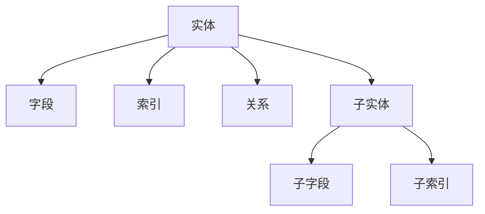

# 数据模型理论创新与递归推理

## 1. 理论创新与差异化

- **递归AST结构**：支持实体、关系、索引、迁移、查询等多层嵌套，便于表达复杂数据结构。
- **类型系统与推断**：引入强类型与类型推断机制，支持复合类型、约束、枚举、泛型等。
- **AI自动化建模**：集成AI辅助实体抽取、索引推荐、冗余检测、迁移脚本生成等能力。
- **数据安全与合规**：内置权限、审计、脱敏、合规校验等机制。
- **工程难点与创新**：解决跨模型依赖、批量迁移、数据一致性、历史演化等工程难题。

## 2. 递归推理伪代码

```python
# 递归推理：自动推导所有实体的主键、外键依赖

def infer_keys(entity):
    keys = {'primary': entity.primary_key, 'foreign': entity.foreign_keys}
    for sub_entity in entity.sub_entities:
        sub_keys = infer_keys(sub_entity)
        keys['foreign'].extend(sub_keys['foreign'])
    return keys
```

## 3. 典型递归流程图



## 4. 实际代码片段（类型推断与AI辅助）

```python
# 类型推断示例

def infer_type(field):
    if field.name.endswith('_id'):
        return 'UUID'
    if field.name.startswith('is_'):
        return 'Boolean'
    if field.name in ['created_at', 'updated_at']:
        return 'Timestamp'
    # AI辅助类型识别
    return ai_model.suggest_type(field.name, field.sample_data)
```

## 5. 工程难点与创新解决方案

- **跨模型依赖递归解析**：通过AST递归遍历，自动发现并校验跨模型依赖关系。
- **批量迁移与回滚**：支持迁移脚本的批量生成、依赖排序、自动回滚点插入。
- **数据一致性与演化**：引入版本控制、变更追踪、自动兼容性检测。
- **AI驱动的数据建模**：利用AI自动生成实体、关系、索引建议，提升建模效率与质量。

## 6. 行业映射与案例

- 金融：账户、交易、报表等实体递归建模，自动推导索引与权限。
- AI基础设施：特征表、训练数据、模型元数据递归建模，支持自动迁移与演化。
- 工业：设备、传感器、告警等多层嵌套实体，AI辅助异常检测与数据治理。

---

> 本文档持续递归完善，欢迎补充更多创新理论、推理伪代码、流程图与行业案例。
