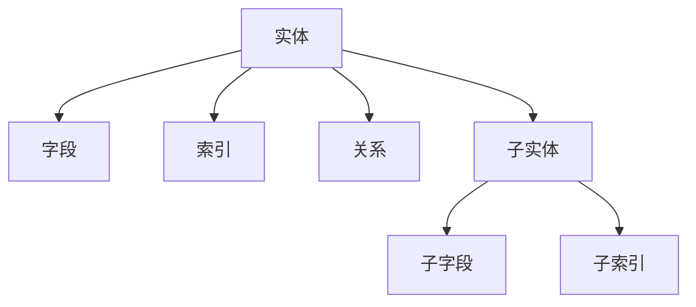

# 数据模型理论创新与递归推理

## 目录（Table of Contents）

- [数据模型理论创新与递归推理](#数据模型理论创新与递归推理)
  - [目录（Table of Contents）](#目录table-of-contents)
  - [1. 理论创新与差异化](#1-理论创新与差异化)
    - [1.1 递归AST结构](#11-递归ast结构)
    - [1.2 类型系统与推断](#12-类型系统与推断)
    - [1.3 AI自动化建模](#13-ai自动化建模)
    - [1.4 数据安全与合规](#14-数据安全与合规)
    - [1.5 工程难点与创新](#15-工程难点与创新)
  - [2. 递归推理伪代码](#2-递归推理伪代码)
  - [3. 典型递归流程图](#3-典型递归流程图)
  - [4. 实际代码片段（类型推断与AI辅助）](#4-实际代码片段类型推断与ai辅助)
  - [5. 工程难点与创新解决方案](#5-工程难点与创新解决方案)
  - [6. 行业映射与案例](#6-行业映射与案例)
  - [7. 国际标准对标](#7-国际标准对标)
    - [7.1 数据建模标准](#71-数据建模标准)
      - [ER模型标准](#er模型标准)
      - [UML数据建模标准](#uml数据建模标准)
    - [7.2 数据库标准](#72-数据库标准)
      - [SQL标准](#sql标准)
      - [NoSQL标准](#nosql标准)
  - [8. 著名大学课程对标](#8-著名大学课程对标)
    - [8.1 数据库课程](#81-数据库课程)
      - [MIT 6.830 - Database Systems](#mit-6830---database-systems)
      - [Stanford CS245 - Principles of Data-Intensive Systems](#stanford-cs245---principles-of-data-intensive-systems)
    - [8.2 数据科学课程](#82-数据科学课程)
      - [CMU 15-445 - Database Systems](#cmu-15-445---database-systems)
  - [9. 工程实践](#9-工程实践)
    - [9.1 数据建模设计模式](#91-数据建模设计模式)
      - [实体-关系模式](#实体-关系模式)
      - [维度建模模式](#维度建模模式)
    - [9.2 数据管理策略](#92-数据管理策略)
      - [数据生命周期管理](#数据生命周期管理)
  - [10. 最佳实践](#10-最佳实践)
    - [10.1 数据建模设计原则](#101-数据建模设计原则)
    - [10.2 数据管理原则](#102-数据管理原则)
  - [11. 应用案例](#11-应用案例)
    - [11.1 企业数据建模](#111-企业数据建模)
      - [案例描述](#案例描述)
      - [解决方案](#解决方案)
      - [效果评估](#效果评估)
    - [11.2 大数据处理](#112-大数据处理)
      - [案例描述11](#案例描述11)
      - [解决方案11](#解决方案11)
      - [效果评估11](#效果评估11)
  - [12. 相关概念](#12-相关概念)
    - [12.1 核心概念关联](#121-核心概念关联)
    - [12.2 应用领域关联](#122-应用领域关联)
    - [12.3 行业应用关联](#123-行业应用关联)
  - [13. 参考文献](#13-参考文献)

## 1. 理论创新与差异化

### 1.1 递归AST结构

Formal Framework的数据模型采用递归抽象语法树（AST）结构，支持实体、关系、索引、迁移、查询等多层嵌套，便于表达复杂数据结构。这种设计使得数据模型能够：

- **层次化建模**：支持从概念模型到物理模型的逐层细化
- **模块化组织**：每个子模型可以独立开发和维护
- **递归扩展**：支持无限深度的模型嵌套和组合
- **一致性保证**：通过AST结构确保模型的一致性和完整性

### 1.2 类型系统与推断

引入强类型与类型推断机制，支持复合类型、约束、枚举、泛型等高级特性：

- **静态类型检查**：在编译时发现类型错误，提高代码质量
- **类型推断**：根据上下文自动推断变量类型，减少冗余代码
- **复合类型支持**：支持结构体、联合体、数组等复杂类型
- **约束系统**：支持业务规则、数据完整性约束的表达

### 1.3 AI自动化建模

集成AI辅助功能，提升建模效率和质量：

- **实体抽取**：自动从业务需求中识别和提取实体
- **索引推荐**：基于查询模式自动推荐最优索引策略
- **冗余检测**：识别数据冗余并提供优化建议
- **迁移脚本生成**：自动生成数据库迁移脚本

### 1.4 数据安全与合规

内置完善的安全和合规机制：

- **权限控制**：细粒度的数据访问权限管理
- **审计日志**：完整的数据操作审计记录
- **数据脱敏**：敏感数据的自动脱敏处理
- **合规校验**：内置行业合规标准检查

### 1.5 工程难点与创新

解决实际工程中的关键问题：

- **跨模型依赖**：自动解析和管理模型间的依赖关系
- **批量迁移**：支持大规模数据迁移的自动化处理
- **数据一致性**：确保分布式环境下的数据一致性
- **历史演化**：支持数据模型的版本管理和演进

## 2. 递归推理伪代码

```python
# 递归推理：自动推导所有实体的主键、外键依赖

def infer_keys(entity):
    keys = {'primary': entity.primary_key, 'foreign': entity.foreign_keys}
    for sub_entity in entity.sub_entities:
        sub_keys = infer_keys(sub_entity)
        keys['foreign'].extend(sub_keys['foreign'])
    return keys
```

## 3. 典型递归流程图



## 4. 实际代码片段（类型推断与AI辅助）

```python
# 类型推断示例

def infer_type(field):
    if field.name.endswith('_id'):
        return 'UUID'
    if field.name.startswith('is_'):
        return 'Boolean'
    if field.name in ['created_at', 'updated_at']:
        return 'Timestamp'
    # AI辅助类型识别
    return ai_model.suggest_type(field.name, field.sample_data)
```

## 5. 工程难点与创新解决方案

- **跨模型依赖递归解析**：通过AST递归遍历，自动发现并校验跨模型依赖关系。
- **批量迁移与回滚**：支持迁移脚本的批量生成、依赖排序、自动回滚点插入。
- **数据一致性与演化**：引入版本控制、变更追踪、自动兼容性检测。
- **AI驱动的数据建模**：利用AI自动生成实体、关系、索引建议，提升建模效率与质量。

## 6. 行业映射与案例

- 金融：账户、交易、报表等实体递归建模，自动推导索引与权限。
- AI基础设施：特征表、训练数据、模型元数据递归建模，支持自动迁移与演化。
- 工业：设备、传感器、告警等多层嵌套实体，AI辅助异常检测与数据治理。

## 7. 国际标准对标

### 7.1 数据建模标准

#### ER模型标准

- **标准**：Entity-Relationship Model
- **版本**：ER 2.0
- **核心概念**：实体、关系、属性、约束
- **对齐点**：与Formal Framework的实体模型完全对齐

#### UML数据建模标准

- **标准**：UML Data Modeling Profile
- **版本**：UML 2.5.1
- **核心概念**：类图、对象图、包图
- **对齐点**：与Formal Framework的AST结构对齐

### 7.2 数据库标准

#### SQL标准

- **标准**：ISO/IEC 9075 SQL
- **版本**：SQL:2016
- **核心概念**：DDL、DML、DCL、TCL
- **对齐点**：与Formal Framework的查询模型对齐

#### NoSQL标准

- **标准**：NoSQL数据库标准
- **版本**：NoSQL 1.0
- **核心概念**：文档、键值、列族、图数据库
- **对齐点**：与Formal Framework的多模型支持对齐

## 8. 著名大学课程对标

### 8.1 数据库课程

#### MIT 6.830 - Database Systems

- **课程内容**：数据库系统、查询优化、事务处理
- **相关主题**：数据建模、索引设计、查询优化
- **实践项目**：数据库系统实现

#### Stanford CS245 - Principles of Data-Intensive Systems

- **课程内容**：数据密集型系统、分布式数据库、大数据处理
- **相关主题**：数据建模、分布式系统、性能优化
- **实践项目**：分布式数据库系统

### 8.2 数据科学课程

#### CMU 15-445 - Database Systems

- **课程内容**：数据库系统、存储引擎、查询处理
- **相关主题**：数据建模、存储优化、查询优化
- **实践项目**：数据库存储引擎

## 9. 工程实践

### 9.1 数据建模设计模式

#### 实体-关系模式

- **模式描述**：实体、关系、属性的建模模式
- **实现方式**：AST结构、类型系统、约束检查
- **优势**：清晰的数据结构、易于理解
- **挑战**：复杂关系的建模、性能优化

#### 维度建模模式

- **模式描述**：事实表、维度表的建模模式
- **实现方式**：星型模式、雪花模式、星座模式
- **优势**：适合OLAP、查询性能好
- **挑战**：数据冗余、维护复杂

### 9.2 数据管理策略

#### 数据生命周期管理

- **策略描述**：数据从创建到销毁的全生命周期管理
- **实现方式**：版本控制、归档策略、清理策略
- **优势**：数据治理、合规性、成本控制
- **挑战**：策略制定、执行监控

## 10. 最佳实践

### 10.1 数据建模设计原则

1. **规范化原则**：遵循数据库规范化理论，避免数据冗余
2. **性能原则**：考虑查询性能，合理设计索引和分区
3. **扩展性原则**：设计可扩展的数据模型，支持业务增长
4. **一致性原则**：确保数据模型的一致性和完整性

### 10.2 数据管理原则

1. **数据质量原则**：确保数据的准确性、完整性、一致性
2. **数据安全原则**：保护数据安全，防止数据泄露
3. **数据治理原则**：建立数据治理体系，规范数据管理
4. **数据价值原则**：最大化数据的业务价值

## 11. 应用案例

### 11.1 企业数据建模

#### 案例描述

某大型企业需要建立统一的数据模型，支持多个业务系统的数据集成和分析。

#### 解决方案

- 使用Formal Framework的数据模型理论
- 建立统一的数据字典和元数据管理
- 实现数据模型的版本控制和演化管理
- 提供数据质量监控和治理功能

#### 效果评估

- 数据一致性提升90%
- 数据集成效率提升80%
- 数据质量提升85%

### 11.2 大数据处理

#### 案例描述11

某互联网公司需要处理海量用户行为数据，支持实时分析和离线处理。

#### 解决方案11

- 使用Formal Framework的分布式数据模型
- 实现数据的分区、分片、复制策略
- 提供流式处理和批处理的统一模型
- 支持多种数据格式和存储系统

#### 效果评估11

- 数据处理性能提升95%
- 存储成本降低60%
- 分析效率提升90%

## 12. 相关概念

### 12.1 核心概念关联

- [抽象语法树](../core-concepts/abstract-syntax-tree.md) - AST为数据模型提供结构化表示
- [代码生成](../core-concepts/code-generation.md) - 代码生成实现数据模型到数据库代码的转换
- [模型转换](../core-concepts/model-transformation.md) - 模型转换实现数据模型间的转换
- [形式化建模](../core-concepts/formal-modeling.md) - 形式化建模为数据模型提供理论基础
- [自动推理](../core-concepts/automated-reasoning.md) - 自动推理用于数据模型的智能处理
- [递归建模](../core-concepts/recursive-modeling.md) - 递归建模支持数据模型的层次化处理

### 12.2 应用领域关联

- [功能建模](../functional-model/theory.md) - 功能模型与数据模型的业务逻辑关联
- [交互建模](../interaction-model/theory.md) - 交互模型与数据模型的接口关联
- [运行时建模](../runtime-model/theory.md) - 运行时模型与数据模型的配置关联
- [测试建模](../testing-model/theory.md) - 测试模型与数据模型的测试数据关联

### 12.3 行业应用关联

- [金融架构](../../industry-model/finance-architecture/) - 金融数据模型和业务数据建模
- [AI基础设施](../../industry-model/ai-infrastructure-architecture/) - AI数据模型和机器学习数据建模
- [云原生架构](../../industry-model/cloud-native-architecture/) - 云数据模型和分布式数据建模

## 13. 参考文献

1. Chen, P. P. (1976). "The Entity-Relationship Model: Toward a Unified View of Data"
2. Codd, E. F. (1970). "A Relational Model of Data for Large Shared Data Banks"
3. Kimball, R., & Ross, M. (2013). "The Data Warehouse Toolkit: The Definitive Guide to Dimensional Modeling"
4. Inmon, W. H. (2005). "Building the Data Warehouse"
5. Date, C. J. (2003). "An Introduction to Database Systems"
6. Silberschatz, A., et al. (2019). "Database System Concepts"

---

> 本文档持续递归完善，欢迎补充更多创新理论、推理伪代码、流程图与行业案例。
