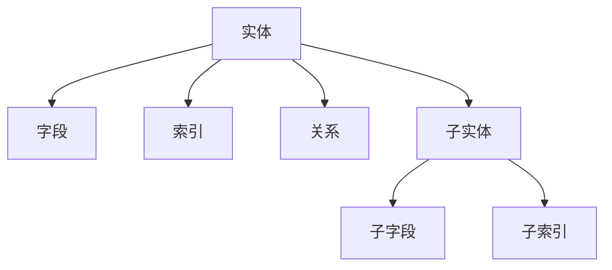

# 数据模型理论创新与递归推理

## 目录（Table of Contents）

- [数据模型理论创新与递归推理](#数据模型理论创新与递归推理)
  - [目录（Table of Contents）](#目录table-of-contents)
  - [1. 理论创新与差异化](#1-理论创新与差异化)
    - [1.1 递归AST结构](#11-递归ast结构)
    - [1.2 类型系统与推断](#12-类型系统与推断)
    - [1.3 AI自动化建模](#13-ai自动化建模)
    - [1.4 数据安全与合规](#14-数据安全与合规)
    - [1.5 工程难点与创新](#15-工程难点与创新)
  - [2. 递归推理伪代码](#2-递归推理伪代码)
  - [3. 典型递归流程图](#3-典型递归流程图)
  - [4. 实际代码片段（类型推断与AI辅助）](#4-实际代码片段类型推断与ai辅助)
  - [5. 工程难点与创新解决方案](#5-工程难点与创新解决方案)
  - [6. 行业映射与案例](#6-行业映射与案例)

## 1. 理论创新与差异化

### 1.1 递归AST结构

Formal Framework的数据模型采用递归抽象语法树（AST）结构，支持实体、关系、索引、迁移、查询等多层嵌套，便于表达复杂数据结构。这种设计使得数据模型能够：

- **层次化建模**：支持从概念模型到物理模型的逐层细化
- **模块化组织**：每个子模型可以独立开发和维护
- **递归扩展**：支持无限深度的模型嵌套和组合
- **一致性保证**：通过AST结构确保模型的一致性和完整性

### 1.2 类型系统与推断

引入强类型与类型推断机制，支持复合类型、约束、枚举、泛型等高级特性：

- **静态类型检查**：在编译时发现类型错误，提高代码质量
- **类型推断**：根据上下文自动推断变量类型，减少冗余代码
- **复合类型支持**：支持结构体、联合体、数组等复杂类型
- **约束系统**：支持业务规则、数据完整性约束的表达

### 1.3 AI自动化建模

集成AI辅助功能，提升建模效率和质量：

- **实体抽取**：自动从业务需求中识别和提取实体
- **索引推荐**：基于查询模式自动推荐最优索引策略
- **冗余检测**：识别数据冗余并提供优化建议
- **迁移脚本生成**：自动生成数据库迁移脚本

### 1.4 数据安全与合规

内置完善的安全和合规机制：

- **权限控制**：细粒度的数据访问权限管理
- **审计日志**：完整的数据操作审计记录
- **数据脱敏**：敏感数据的自动脱敏处理
- **合规校验**：内置行业合规标准检查

### 1.5 工程难点与创新

解决实际工程中的关键问题：

- **跨模型依赖**：自动解析和管理模型间的依赖关系
- **批量迁移**：支持大规模数据迁移的自动化处理
- **数据一致性**：确保分布式环境下的数据一致性
- **历史演化**：支持数据模型的版本管理和演进

## 2. 递归推理伪代码

```python
# 递归推理：自动推导所有实体的主键、外键依赖

def infer_keys(entity):
    keys = {'primary': entity.primary_key, 'foreign': entity.foreign_keys}
    for sub_entity in entity.sub_entities:
        sub_keys = infer_keys(sub_entity)
        keys['foreign'].extend(sub_keys['foreign'])
    return keys
```

## 3. 典型递归流程图



## 4. 实际代码片段（类型推断与AI辅助）

```python
# 类型推断示例

def infer_type(field):
    if field.name.endswith('_id'):
        return 'UUID'
    if field.name.startswith('is_'):
        return 'Boolean'
    if field.name in ['created_at', 'updated_at']:
        return 'Timestamp'
    # AI辅助类型识别
    return ai_model.suggest_type(field.name, field.sample_data)
```

## 5. 工程难点与创新解决方案

- **跨模型依赖递归解析**：通过AST递归遍历，自动发现并校验跨模型依赖关系。
- **批量迁移与回滚**：支持迁移脚本的批量生成、依赖排序、自动回滚点插入。
- **数据一致性与演化**：引入版本控制、变更追踪、自动兼容性检测。
- **AI驱动的数据建模**：利用AI自动生成实体、关系、索引建议，提升建模效率与质量。

## 6. 行业映射与案例

- 金融：账户、交易、报表等实体递归建模，自动推导索引与权限。
- AI基础设施：特征表、训练数据、模型元数据递归建模，支持自动迁移与演化。
- 工业：设备、传感器、告警等多层嵌套实体，AI辅助异常检测与数据治理。

---

> 本文档持续递归完善，欢迎补充更多创新理论、推理伪代码、流程图与行业案例。
