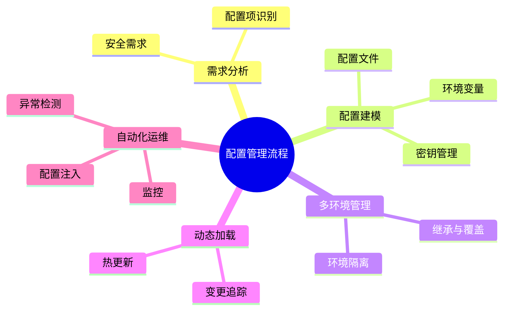

# 配置建模理论探讨

## 1. 形式化目标

- 以结构化方式描述环境变量、配置文件、密钥、参数等配置项。
- 支持多环境、多层级、动态加载等配置统一建模。
- 便于自动生成配置文件、环境注入、密钥管理、变更追踪等。

## 2. 核心概念

- **环境变量**：运行时注入的配置信息。
- **配置文件**：YAML、JSON、TOML等静态/动态配置。
- **密钥与凭证**：敏感信息管理与加密。
- **多环境管理**：开发、测试、生产等环境隔离。
- **动态加载与热更新**：配置变更实时生效。

## 3. 已有标准

- Kubernetes ConfigMap/Secret
- Spring Cloud Config、Consul、Vault
- Ansible、Chef、SaltStack等配置管理工具

## 4. 可行性分析

- 配置建模结构化强，标准化程度高，适合DSL抽象。
- 可自动生成配置文件、密钥管理、变更追踪等。
- 易于与AI结合进行配置补全、异常检测、自动修复。

## 5. 自动化价值

- 降低手工配置和维护的成本。
- 提高配置一致性、安全性和可追溯性。
- 支持自动化环境切换和热更新。

## 6. 与AI结合点

- 智能补全配置项、环境变量。
- 自动推理配置依赖、冲突检测。
- 智能生成安全加固与变更建议。

---

## 7. 常见配置类型与特性一览（表格）

| 类型         | 特性                 | 典型场景           |
|--------------|----------------------|--------------------|
| 环境变量     | 运行时注入、易覆盖   | 多环境部署         |
| 配置文件     | 层级结构、可模板化   | 应用参数、服务配置 |
| 密钥/凭证    | 加密、权限控制       | 数据库、API密钥    |
| 多环境管理   | 隔离、继承、覆盖     | Dev/Test/Prod      |
| 动态加载     | 实时生效、热更新     | 云原生、微服务     |

---

## 8. 配置管理流程思维导图

---

## 9. 形式化推理/证明片段

**定理（配置一致性）**：
若所有环境配置均基于同一模板继承并覆盖差异项，则配置一致性可控。

*证明思路*：
设基础模板T，环境E_i = T + Δ_i，变更仅影响Δ_i，主干一致。

**推论（安全隔离性）**：
若密钥与配置分离存储，且访问权限受控，则敏感信息安全可控。
