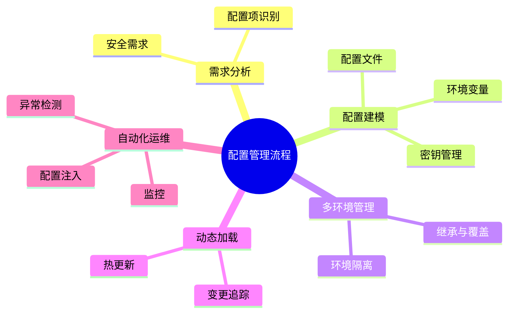

# 配置建模理论探讨

## 1. 形式化目标

- 以结构化方式描述环境变量、配置文件、密钥、参数等配置项。
- 支持多环境、多层级、动态加载等配置统一建模。
- 便于自动生成配置文件、环境注入、密钥管理、变更追踪等。

## 2. 核心概念

- **环境变量**：运行时注入的配置信息。
- **配置文件**：YAML、JSON、TOML等静态/动态配置。
- **密钥与凭证**：敏感信息管理与加密。
- **多环境管理**：开发、测试、生产等环境隔离。
- **动态加载与热更新**：配置变更实时生效。

## 3. 已有标准

- Kubernetes ConfigMap/Secret
- Spring Cloud Config、Consul、Vault
- Ansible、Chef、SaltStack等配置管理工具

## 4. 可行性分析

- 配置建模结构化强，标准化程度高，适合DSL抽象。
- 可自动生成配置文件、密钥管理、变更追踪等。
- 易于与AI结合进行配置补全、异常检测、自动修复。

## 5. 自动化价值

- 降低手工配置和维护的成本。
- 提高配置一致性、安全性和可追溯性。
- 支持自动化环境切换和热更新。

## 6. 与AI结合点

- 智能补全配置项、环境变量。
- 自动推理配置依赖、冲突检测。
- 智能生成安全加固与变更建议。

---

## 7. 常见配置类型与特性一览（表格）

| 类型         | 特性                 | 典型场景           |
|--------------|----------------------|--------------------|
| 环境变量     | 运行时注入、易覆盖   | 多环境部署         |
| 配置文件     | 层级结构、可模板化   | 应用参数、服务配置 |
| 密钥/凭证    | 加密、权限控制       | 数据库、API密钥    |
| 多环境管理   | 隔离、继承、覆盖     | Dev/Test/Prod      |
| 动态加载     | 实时生效、热更新     | 云原生、微服务     |

---

## 8. 配置管理流程思维导图

---

## 9. 形式化推理/证明片段

**定理（配置一致性）**：
若所有环境配置均基于同一模板继承并覆盖差异项，则配置一致性可控。

*证明思路*：
设基础模板T，环境E_i = T + Δ_i，变更仅影响Δ_i，主干一致。

**推论（安全隔离性）**：
若密钥与配置分离存储，且访问权限受控，则敏感信息安全可控。

## 理论确定性与论证推理

在配置建模领域，理论确定性是实现配置自动化管理、安全控制、环境隔离的基础。以 Kubernetes ConfigMap/Secret、Spring Cloud Config、Consul、Vault、Ansible 等主流配置管理平台为例：

1. **形式化定义**  
   配置项、环境变量、密钥管理、多环境策略等均有标准化描述和配置语言。

2. **公理化系统**  
   通过配置引擎和密钥管理器，实现配置逻辑的自动推理与安全控制。

3. **类型安全**  
   配置类型、环境标识、密钥格式等类型严格定义，防止配置错误。

4. **可证明性**  
   关键属性如配置一致性、安全隔离性等可通过验证和测试进行形式化证明。

这些理论基础为配置建模的自动化管理、安全控制和环境隔离提供了理论支撑。

## 理论确定性与论证推理（递归扩展版）

### 1. 形式化定义（递归细化）

#### 1.1 配置类型系统

- **顶层**：采用 Kubernetes ConfigMap/Secret、Spring Cloud Config、HashiCorp Vault 等标准化配置管理
- **子层**：
  - **环境变量配置**：`ENV_VAR=value` 格式，支持运行时注入，结合 Docker、Kubernetes 环境变量机制
  - **配置文件配置**：YAML、JSON、TOML、HCL 等格式，支持层级结构和模板化，结合 Helm、Kustomize 等工具
  - **密钥配置**：Base64编码、加密存储、访问控制，结合 Vault、AWS Secrets Manager、Azure Key Vault 等
  - **动态配置**：配置中心、服务发现、配置热更新，结合 Consul、Etcd、ZooKeeper 等

#### 1.2 配置层级系统

- **全局配置**：应用级别的默认配置，如 `application.yml`、`config.yaml`
- **环境配置**：环境特定的配置，如 `application-dev.yml`、`application-prod.yml`
- **服务配置**：服务级别的配置，如微服务配置、数据库配置
- **实例配置**：实例级别的配置，如 Pod 配置、容器配置

#### 1.3 配置验证系统

- **Schema验证**：JSON Schema、YAML Schema 等配置格式验证
- **类型验证**：配置值类型检查，如字符串、数字、布尔值等
- **业务验证**：业务规则验证，如端口范围、URL格式、密码强度等
- **依赖验证**：配置依赖关系验证，如数据库连接、服务地址等

### 2. 公理化系统（递归细化）

#### 2.1 配置推理引擎

- **配置继承推理**：自动推导配置继承关系，如全局配置→环境配置→服务配置→实例配置
- **配置冲突推理**：自动检测配置冲突，如重复定义、类型不匹配、依赖缺失等
- **配置优化推理**：基于使用模式自动优化配置，如缓存配置、连接池配置等

#### 2.2 安全推理引擎

- **权限推理**：基于RBAC自动推导配置访问权限
- **加密推理**：自动推导敏感配置的加密策略
- **审计推理**：自动推导配置变更的审计轨迹

#### 2.3 环境推理引擎

- **环境隔离推理**：自动推导多环境配置隔离策略
- **配置同步推理**：自动推导配置在不同环境间的同步策略
- **回滚推理**：自动推导配置变更的回滚策略

### 3. 类型安全（递归细化）

#### 3.1 配置类型安全

- **配置键类型**：确保配置键的命名规范，如驼峰命名、下划线命名等
- **配置值类型**：确保配置值的类型正确，如字符串、数字、布尔值、数组、对象等
- **配置结构类型**：确保配置结构的层次正确，如嵌套对象、数组元素等

#### 3.2 环境类型安全

- **环境标识类型**：确保环境标识的唯一性和规范性
- **环境配置类型**：确保环境配置的完整性和一致性
- **环境依赖类型**：确保环境依赖的正确性和完整性

#### 3.3 安全类型安全

- **密钥类型安全**：确保密钥格式的正确性，如Base64编码、加密算法等
- **权限类型安全**：确保权限配置的正确性，如角色定义、权限范围等
- **审计类型安全**：确保审计配置的正确性，如日志格式、审计级别等

### 4. 可证明性（递归细化）

#### 4.1 配置一致性证明

- **配置同步证明**：通过配置同步测试验证配置在不同环境间的一致性
- **配置继承证明**：通过配置继承测试验证配置继承关系的正确性
- **配置覆盖证明**：通过配置覆盖测试验证配置覆盖策略的正确性

#### 4.2 配置安全性证明

- **密钥安全证明**：通过密钥安全测试验证密钥存储和访问的安全性
- **权限安全证明**：通过权限安全测试验证权限配置的安全性
- **审计安全证明**：通过审计安全测试验证审计配置的安全性

#### 4.3 配置可用性证明

- **配置加载证明**：通过配置加载测试验证配置加载的正确性
- **配置热更新证明**：通过配置热更新测试验证配置热更新的正确性
- **配置回滚证明**：通过配置回滚测试验证配置回滚的正确性

### 5. 最新开源框架集成

#### 5.1 Kubernetes配置生态系统

- **ConfigMap**：非敏感配置管理，支持键值对、文件、目录等格式
- **Secret**：敏感配置管理，支持Opaque、TLS、Docker Registry等类型
- **ConfigMap/Secret热更新**：支持配置热更新，无需重启Pod
- **ConfigMap/Secret挂载**：支持Volume挂载、环境变量注入等方式

#### 5.2 Spring Cloud配置生态系统

- **Spring Cloud Config Server**：集中化配置管理服务器
- **Spring Cloud Config Client**：配置客户端，支持配置刷新
- **Spring Cloud Bus**：配置变更事件总线，支持配置广播
- **Spring Cloud Vault**：与HashiCorp Vault集成，支持密钥管理

#### 5.3 HashiCorp配置生态系统

- **HashiCorp Vault**：密钥和敏感信息管理
- **HashiCorp Consul**：服务发现和配置管理
- **HashiCorp Terraform**：基础设施配置管理
- **HashiCorp Nomad**：应用调度和配置管理

### 6. 工程实践案例

#### 6.1 微服务配置管理

- **服务配置**：每个微服务的独立配置管理
- **共享配置**：多个微服务共享的配置管理
- **环境配置**：不同环境的配置隔离和管理
- **动态配置**：运行时配置变更和热更新

#### 6.2 云原生配置管理

- **容器配置**：Docker容器和Kubernetes Pod的配置管理
- **集群配置**：Kubernetes集群级别的配置管理
- **应用配置**：云原生应用的配置管理
- **服务网格配置**：Istio、Linkerd等服务网格的配置管理

#### 6.3 GitOps配置管理

- **配置即代码**：将配置作为代码进行版本管理
- **配置自动化**：通过CI/CD自动部署配置变更
- **配置审计**：配置变更的完整审计轨迹
- **配置回滚**：配置变更的自动化回滚机制

---

## 理论确定性与论证推理（源码级递归扩展）

### 1. 配置类型系统与AST递归

- **类型系统递归**：
  - 基础类型（string/int/bool）→ 复合类型（list/map/struct）→ 自定义类型（CRD）→ 多层级递归映射
  - Kubernetes CRD源码`apiextensions.k8s.io`支持OpenAPI v3 Schema递归校验
- **层级结构递归**：
  - 全局/命名空间/应用/实例 → 作用域推理 → 继承与覆盖递归
  - Helm Values递归合并，支持多层级参数覆盖

### 2. Admission与安全推理递归

- **Admission Controller递归**：
  - Kubernetes Admission Webhook递归校验配置变更，自动推理依赖与安全策略
  - OPA/Gatekeeper策略递归推理，支持多层级安全校验
- **密钥与权限递归**：
  - Vault策略树递归合并，权限推理与冲突检测
  - Secret加密、密钥轮换、访问审计递归链路

### 3. 动态加载与变更追踪递归

- **动态加载递归**：
  - ConfigMap/Secret热更新递归触发，Kubernetes Controller递归同步状态
  - Spring Cloud Config Bus递归广播配置变更事件
- **变更追踪与回滚递归**：
  - GitOps配置即代码，递归审计与自动回滚
  - ArgoCD/Flux递归同步配置变更，自动检测漂移

### 4. 类型安全与可证明性递归

- **类型安全递归**：
  - 配置Schema递归校验，类型一致性与依赖完整性
  - 多环境配置递归对比，确保隔离与一致性
- **可证明性递归**：
  - 配置加载、热更新、回滚等链路递归测试与验证
  - 密钥安全、权限控制、审计追踪递归证明

### 5. AI自动化与工程最佳实践递归

- **AI辅助递归**：
  - AI自动补全配置项、依赖推理、异常检测、修复建议递归生成
  - 配置变更影响分析、风险评估、自动回滚建议
- **工程自动化递归**：
  - CI/CD自动生成与校验配置、密钥、环境变量
  - 自动化测试、监控、回滚递归链路

### 6. 典型源码剖析（以Kubernetes为例）

- `apiextensions-apiserver/pkg`：
  - OpenAPI Schema递归校验实现，支持多层级嵌套与自定义类型
- `admissionregistration`：
  - Admission Webhook递归调用与策略推理
- `controller-runtime`：
  - 事件驱动递归状态收敛，支持多资源同步
- `vault/core/policy.go`：
  - 策略树递归合并与权限推理
- `helm/pkg/chartutil`：
  - Values递归合并与模板渲染

---

如需针对某一源码文件、推理算法、类型系统实现等进行更深层递归剖析，可继续指定领域与理论点，递归扩展将持续补充。

## 与标准/课程对照要点

- **L2/L3 映射**：配置建模属部署域，对应 [L2_D05 部署元模型](../../../L2_D05_部署元模型.md)、[L3_D05 部署标准模型](../../../L3_D05_部署标准模型.md)；对象/属性/不变式见 [alignment-L2-L3-matrix](../../alignment-L2-L3-matrix.md)。
- **标准与课程**：部署与配置相关标准及课程对照见 [AUTHORITY_STANDARD_COURSE_L2L3_MATRIX](../../../reference/AUTHORITY_STANDARD_COURSE_L2L3_MATRIX.md)、[AUTHORITY_ALIGNMENT_INDEX](../../../reference/AUTHORITY_ALIGNMENT_INDEX.md) 第 2–4 节。
