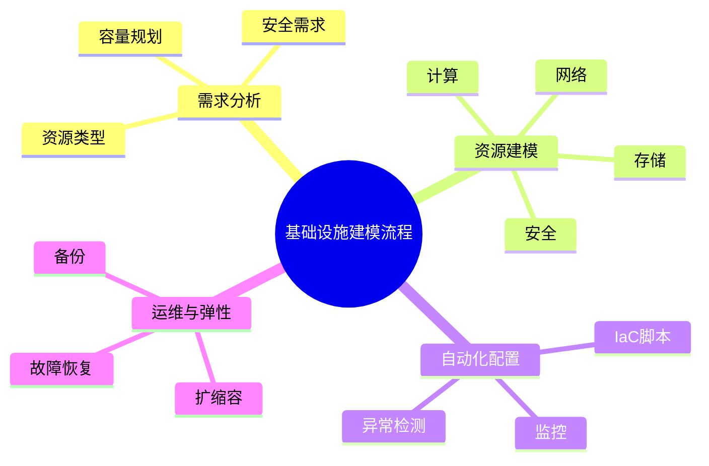

# 基础设施建模理论探讨

## 1. 形式化目标

- 以结构化方式描述云主机、网络、存储、负载均衡等基础设施资源。
- 支持多云、混合云、本地等多种基础设施统一建模。
- 便于自动生成IaC脚本、资源配置、监控与测试用例等。

## 2. 核心概念

- **计算资源**：虚拟机、物理机、容器主机。
- **网络资源**：VPC、子网、路由、负载均衡。
- **存储资源**：块存储、对象存储、文件存储。
- **安全与权限**：安全组、ACL、密钥管理。
- **弹性与高可用**：自动扩缩容、故障转移、备份。

## 3. 已有标准

- Terraform、Pulumi（IaC）
- AWS CloudFormation、Azure ARM、Google Deployment Manager
- OpenStack Heat、K8s Cluster API

## 4. 可行性分析

- 基础设施建模结构化强，标准化程度高，适合DSL抽象。
- 可自动生成IaC脚本、资源配置、监控等。
- 易于与AI结合进行资源优化、异常检测、自动修复。

## 5. 自动化价值

- 降低手工配置和维护基础设施的成本。
- 提高资源利用率和弹性。
- 支持自动化扩缩容、故障恢复和安全加固。

## 6. 与AI结合点

- 智能补全资源配置、容量规划。
- 自动推理依赖关系、异常检测。
- 智能生成弹性伸缩与容灾建议。

---

## 7. 常见基础设施类型与特性一览（表格）

| 类型         | 特性                 | 典型场景           |
|--------------|----------------------|--------------------|
| 虚拟机       | 弹性、隔离、易管理   | 云主机、批量计算   |
| 物理机       | 高性能、专用         | 大数据、AI训练     |
| 容器主机     | 快速部署、弹性伸缩   | 微服务、DevOps     |
| VPC/子网     | 网络隔离、灵活拓扑   | 多租户、分区       |
| 负载均衡     | 流量分配、高可用     | Web服务、API网关   |
| 块/对象存储  | 持久化、弹性、备份   | 数据库、归档       |

---

## 8. 基础设施建模流程思维导图

---

## 9. 形式化推理/证明片段

**定理（资源弹性伸缩性）**：
若基础设施支持自动扩缩容，则可根据负载动态调整资源，无需人工干预。

*证明思路*：
设有自动扩缩容策略，监控负载变化，触发资源调整，系统始终满足需求。

**推论（高可用性）**：
若资源分布于多个可用区，单区故障不影响整体服务可用性。
