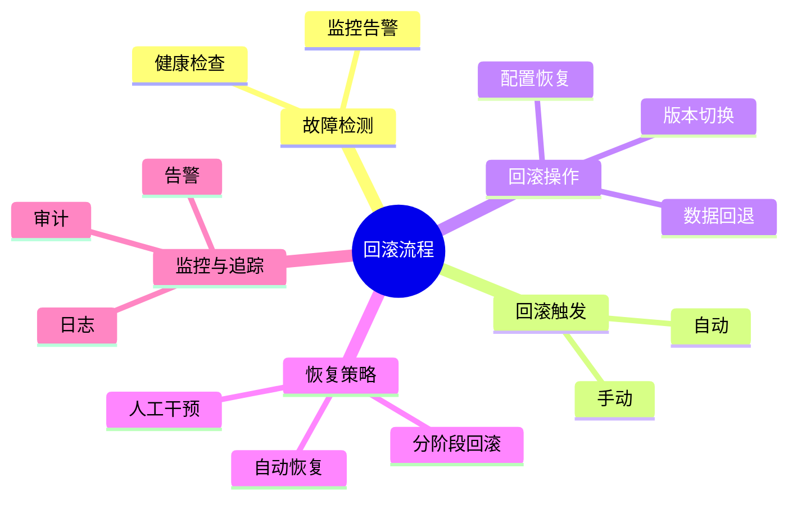

# 回滚建模理论探讨

## 1. 形式化目标

- 以结构化方式描述故障检测、回滚触发、回滚操作、恢复策略等。
- 支持多种回滚策略（自动、手动、分阶段、灰度等）统一建模。
- 便于自动生成回滚脚本、监控配置、变更追踪等。

## 2. 核心概念

- **回滚触发**：健康检查失败、监控告警、手动触发等。
- **回滚操作**：版本切换、配置恢复、数据回退等。
- **恢复策略**：自动恢复、人工干预、分阶段回滚。
- **回滚依赖**：依赖服务、数据一致性、顺序控制。
- **回滚监控**：回滚过程监控、日志、告警。

## 3. 已有标准

- Kubernetes Rollback、Helm Rollback
- GitOps自动回滚、ArgoCD、Spinnaker
- Ansible、SaltStack回滚剧本

## 4. 可行性分析

- 回滚建模结构化强，标准化程度高，适合DSL抽象。
- 可自动生成回滚脚本、监控配置、变更追踪等。
- 易于与AI结合进行回滚补全、异常检测、自动恢复。

## 5. 自动化价值

- 降低手工回滚和恢复的成本。
- 提高系统的可用性和安全性。
- 支持自动化回滚和异常恢复。

## 6. 与AI结合点

- 智能补全回滚策略、依赖。
- 自动推理回滚影响、异常检测。
- 智能生成恢复与补偿建议。

---

## 7. 常见回滚策略与特性一览（表格）

| 策略         | 特性                 | 典型场景           |
|--------------|----------------------|--------------------|
| 自动回滚     | 健康检查、自动触发   | K8s、CI/CD         |
| 手动回滚     | 人工干预、审批流程   | 生产环境           |
| 分阶段回滚   | 灰度、逐步恢复       | 大规模发布         |
| 数据回退     | 数据快照、备份恢复   | 数据库、存储       |
| 配置回滚     | 配置变更、热更新     | 微服务、云原生     |

---

## 8. 回滚流程思维导图

---

## 9. 形式化推理/证明片段

**定理（回滚可恢复性）**：
若每次变更均有快照/备份，则回滚可恢复至任意历史状态。

*证明思路*：
任意变更前做快照，回滚操作恢复至快照点。

**推论（分阶段回滚安全性）**：
若每阶段回滚均有健康检查，则整体回滚过程安全、可控。
