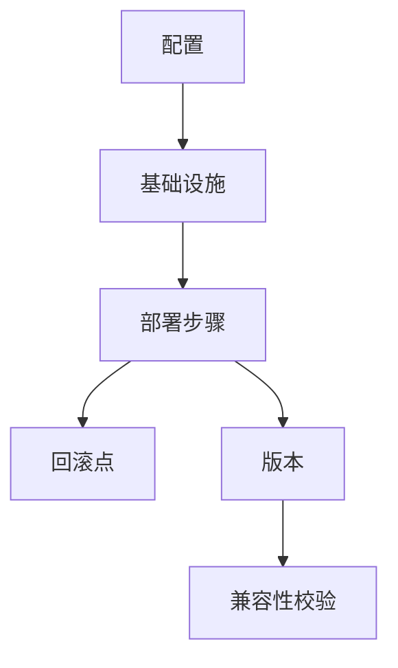

# 部署模型理论创新与递归推理

## 1. 理论创新与差异化

- **递归部署AST结构**：支持配置、基础设施、回滚、版本等多层嵌套与组合，表达复杂部署流程。
- **依赖与回滚推理**：引入依赖链递归解析、自动回滚点生成、版本兼容性校验等机制。
- **AI自动化**：集成AI辅助配置生成、变更影响分析、异常检测、自动回滚建议。
- **工程难点与创新**：解决多环境部署、依赖冲突、回滚一致性、灰度发布等工程难题。

## 2. 递归推理伪代码

```python
# 递归推理：自动推导部署依赖与回滚链路

def infer_deploy_plan(node):
    plan = []
    for dep in node.dependencies:
        plan.extend(infer_deploy_plan(dep))
    plan.append(node)
    return plan

# 自动生成回滚点

def generate_rollback_points(deploy_steps):
    points = []
    for i, step in enumerate(deploy_steps):
        if step.is_critical:
            points.append(i)
    return points
```

## 3. 典型递归流程图



## 4. 实际代码片段（AI辅助配置与回滚）

```python
# AI辅助生成部署配置

def ai_generate_deploy_config(context):
    # context: 包含环境、依赖、历史部署等
    return ai_model.suggest_deploy_config(context)

# 递归检测部署异常

def detect_deploy_issues(node):
    issues = []
    if not node.health_check():
        issues.append(node)
    for dep in node.dependencies:
        issues.extend(detect_deploy_issues(dep))
    return issues
```

## 5. 工程难点与创新解决方案

- **多环境部署递归解析**：自动发现配置、基础设施、依赖间的递归关系。
- **回滚一致性与自动化**：支持回滚点自动生成、回滚链路校验与异常补偿。
- **灰度发布与兼容性**：递归检测版本兼容性、支持灰度/蓝绿/金丝雀发布。
- **AI驱动的部署优化**：利用AI分析历史部署轨迹，自动优化配置与回滚策略。

## 6. 行业映射与案例

- 金融：多环境合规部署、自动回滚与异常检测，AI辅助配置生成。
- 云原生：基础设施即代码、自动化部署与回滚，AI优化多集群配置。
- 工业：设备固件递归部署、异常回滚与兼容性校验，AI辅助异常检测。

---

> 本文档持续递归完善，欢迎补充更多创新理论、推理伪代码、流程图与行业案例。
