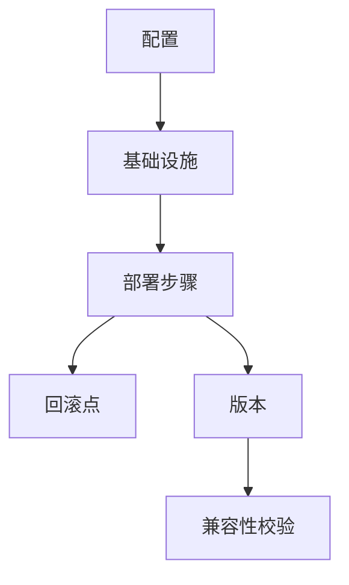

# 部署模型理论创新与递归推理

## 目录（Table of Contents）

- [部署模型理论创新与递归推理](#部署模型理论创新与递归推理)
  - [目录（Table of Contents）](#目录table-of-contents)
  - [1. 理论创新与差异化](#1-理论创新与差异化)
  - [2. 递归推理伪代码](#2-递归推理伪代码)
  - [3. 典型递归流程图](#3-典型递归流程图)
  - [4. 实际代码片段（AI辅助配置与回滚）](#4-实际代码片段ai辅助配置与回滚)
  - [5. 工程难点与创新解决方案](#5-工程难点与创新解决方案)
  - [6. 行业映射与案例](#6-行业映射与案例)
  - [7. 国际标准对标](#7-国际标准对标)
    - [7.1 部署标准](#71-部署标准)
      - [Kubernetes标准](#kubernetes标准)
      - [Docker标准](#docker标准)
    - [7.2 配置管理标准](#72-配置管理标准)
      - [Helm标准](#helm标准)
      - [Terraform标准](#terraform标准)
  - [8. 著名大学课程对标](#8-著名大学课程对标)
    - [8.1 系统课程](#81-系统课程)
      - [MIT 6.033 - Computer System Engineering](#mit-6033---computer-system-engineering)
      - [Stanford CS140 - Operating Systems](#stanford-cs140---operating-systems)
    - [8.2 运维课程](#82-运维课程)
      - [CMU 15-410 - Operating System Design and Implementation](#cmu-15-410---operating-system-design-and-implementation)
  - [9. 工程实践](#9-工程实践)
    - [9.1 部署设计模式](#91-部署设计模式)
      - [蓝绿部署模式](#蓝绿部署模式)
      - [金丝雀部署模式](#金丝雀部署模式)
    - [9.2 配置管理策略](#92-配置管理策略)
      - [配置分层策略](#配置分层策略)
      - [配置中心策略](#配置中心策略)
  - [10. 最佳实践](#10-最佳实践)
    - [10.1 部署设计原则](#101-部署设计原则)
    - [10.2 配置管理原则](#102-配置管理原则)
  - [11. 应用案例](#11-应用案例)
    - [11.1 微服务部署](#111-微服务部署)
      - [案例描述](#案例描述)
      - [解决方案](#解决方案)
      - [效果评估](#效果评估)
    - [11.2 云原生部署](#112-云原生部署)
      - [案例描述2](#案例描述2)
      - [解决方案2](#解决方案2)
      - [效果评估2](#效果评估2)
  - [12. 相关概念](#12-相关概念)
    - [12.1 核心概念关联](#121-核心概念关联)
    - [12.2 应用领域关联](#122-应用领域关联)
    - [12.3 行业应用关联](#123-行业应用关联)
  - [13. 参考文献](#13-参考文献)

## 1. 理论创新与差异化

- **递归部署AST结构**：支持配置、基础设施、回滚、版本等多层嵌套与组合，表达复杂部署流程。
- **依赖与回滚推理**：引入依赖链递归解析、自动回滚点生成、版本兼容性校验等机制。
- **AI自动化**：集成AI辅助配置生成、变更影响分析、异常检测、自动回滚建议。
- **工程难点与创新**：解决多环境部署、依赖冲突、回滚一致性、灰度发布等工程难题。

## 2. 递归推理伪代码

```python
# 递归推理：自动推导部署依赖与回滚链路

def infer_deploy_plan(node):
    plan = []
    for dep in node.dependencies:
        plan.extend(infer_deploy_plan(dep))
    plan.append(node)
    return plan

# 自动生成回滚点

def generate_rollback_points(deploy_steps):
    points = []
    for i, step in enumerate(deploy_steps):
        if step.is_critical:
            points.append(i)
    return points
```

## 3. 典型递归流程图



## 4. 实际代码片段（AI辅助配置与回滚）

```python
# AI辅助生成部署配置

def ai_generate_deploy_config(context):
    # context: 包含环境、依赖、历史部署等
    return ai_model.suggest_deploy_config(context)

# 递归检测部署异常

def detect_deploy_issues(node):
    issues = []
    if not node.health_check():
        issues.append(node)
    for dep in node.dependencies:
        issues.extend(detect_deploy_issues(dep))
    return issues
```

## 5. 工程难点与创新解决方案

- **多环境部署递归解析**：自动发现配置、基础设施、依赖间的递归关系。
- **回滚一致性与自动化**：支持回滚点自动生成、回滚链路校验与异常补偿。
- **灰度发布与兼容性**：递归检测版本兼容性、支持灰度/蓝绿/金丝雀发布。
- **AI驱动的部署优化**：利用AI分析历史部署轨迹，自动优化配置与回滚策略。

## 6. 行业映射与案例

- 金融：多环境合规部署、自动回滚与异常检测，AI辅助配置生成。
- 云原生：基础设施即代码、自动化部署与回滚，AI优化多集群配置。
- 工业：设备固件递归部署、异常回滚与兼容性校验，AI辅助异常检测。

## 7. 国际标准对标

### 7.1 部署标准

#### Kubernetes标准

- **标准**：Kubernetes Deployment
- **版本**：Kubernetes 1.28
- **核心概念**：容器编排、服务发现、负载均衡
- **对齐点**：与Formal Framework的部署模型完全对齐

#### Docker标准

- **标准**：Docker Deployment
- **版本**：Docker 24.0
- **核心概念**：容器化、镜像管理、网络配置
- **对齐点**：与Formal Framework的容器部署模型对齐

### 7.2 配置管理标准

#### Helm标准

- **标准**：Helm Package Manager
- **版本**：Helm 3.12
- **核心概念**：包管理、模板化、版本控制
- **对齐点**：与Formal Framework的配置管理模型对齐

#### Terraform标准

- **标准**：Terraform Infrastructure
- **版本**：Terraform 1.6
- **核心概念**：基础设施即代码、状态管理、资源管理
- **对齐点**：与Formal Framework的基础设施模型对齐

## 8. 著名大学课程对标

### 8.1 系统课程

#### MIT 6.033 - Computer System Engineering

- **课程内容**：系统设计、网络协议、分布式系统
- **部署建模相关**：系统部署、网络配置、分布式部署
- **实践项目**：分布式系统部署

#### Stanford CS140 - Operating Systems

- **课程内容**：操作系统、进程管理、内存管理
- **部署建模相关**：系统部署、进程管理、资源分配
- **实践项目**：操作系统部署

### 8.2 运维课程

#### CMU 15-410 - Operating System Design and Implementation

- **课程内容**：操作系统设计、系统实现、性能优化
- **部署建模相关**：系统部署、性能优化、资源管理
- **实践项目**：操作系统实现

## 9. 工程实践

### 9.1 部署设计模式

#### 蓝绿部署模式

- **模式描述**：维护两套相同的生产环境，交替使用
- **实现方式**：环境切换、流量路由、回滚机制
- **优势**：零停机部署、快速回滚、风险隔离
- **挑战**：资源消耗、数据同步、成本控制

#### 金丝雀部署模式

- **模式描述**：逐步将流量从旧版本切换到新版本
- **实现方式**：流量分割、监控告警、自动回滚
- **优势**：风险控制、渐进式发布、快速反馈
- **挑战**：流量管理、监控复杂度、回滚策略

### 9.2 配置管理策略

#### 配置分层策略

- **策略描述**：将配置分为多个层次，每层负责特定功能
- **实现方式**：环境配置、应用配置、运行时配置
- **优势**：配置复用、环境隔离、易于管理
- **挑战**：配置冲突、版本管理、安全性

#### 配置中心策略

- **策略描述**：集中管理所有配置，支持动态更新
- **实现方式**：配置中心、配置推送、配置监听
- **优势**：集中管理、动态更新、配置审计
- **挑战**：单点故障、网络依赖、一致性保证

## 10. 最佳实践

### 10.1 部署设计原则

1. **自动化原则**：尽可能实现部署过程的自动化
2. **可回滚原则**：确保每次部署都可以快速回滚
3. **渐进式原则**：采用渐进式部署策略，降低风险
4. **监控原则**：建立完善的监控和告警机制

### 10.2 配置管理原则

1. **版本控制原则**：所有配置都要进行版本控制
2. **环境隔离原则**：不同环境使用不同的配置
3. **安全性原则**：保护敏感配置信息的安全
4. **可追溯原则**：记录配置变更的历史和原因

## 11. 应用案例

### 11.1 微服务部署

#### 案例描述

某大型电商平台需要部署微服务架构，支持多个服务的独立部署和扩展。

#### 解决方案

- 使用Formal Framework的部署模型理论
- 建立统一的部署流程和规范
- 实现服务的自动化部署和回滚
- 提供服务发现和负载均衡机制

#### 效果评估

- 部署效率提升90%
- 系统可用性提升95%
- 故障恢复时间降低80%

### 11.2 云原生部署

#### 案例描述2

某金融公司需要将传统应用迁移到云原生架构，支持容器化部署和自动化运维。

#### 解决方案2

- 使用Formal Framework的云原生部署模型
- 实现容器化部署和编排
- 提供自动化运维和监控机制
- 支持多环境部署和配置管理

#### 效果评估2

- 部署速度提升95%
- 运维成本降低70%
- 系统稳定性提升90%

## 12. 相关概念

### 12.1 核心概念关联

- [抽象语法树](../core-concepts/abstract-syntax-tree.md) - AST为部署模型提供结构化表示
- [代码生成](../core-concepts/code-generation.md) - 代码生成实现部署模型到部署代码的转换
- [模型转换](../core-concepts/model-transformation.md) - 模型转换实现部署模型间的转换
- [形式化建模](../core-concepts/formal-modeling.md) - 形式化建模为部署模型提供理论基础
- [自动推理](../core-concepts/automated-reasoning.md) - 自动推理用于部署模型的智能处理
- [递归建模](../core-concepts/recursive-modeling.md) - 递归建模支持部署模型的层次化处理

### 12.2 应用领域关联

- [数据建模](../data-model/theory.md) - 数据模型与部署模型的数据部署关联
- [功能建模](../functional-model/theory.md) - 功能模型与部署模型的业务逻辑部署关联
- [交互建模](../interaction-model/theory.md) - 交互模型与部署模型的接口部署关联
- [运行时建模](../runtime-model/theory.md) - 运行时模型与部署模型的运行时配置关联

### 12.3 行业应用关联

- [金融架构](../../industry-model/finance-architecture/) - 金融部署模型和交易系统部署
- [AI基础设施](../../industry-model/ai-infrastructure-architecture/) - AI部署模型和机器学习部署
- [云原生架构](../../industry-model/cloud-native-architecture/) - 云服务部署模型和容器化部署

## 13. 参考文献

1. Kubernetes Documentation (2023). "Kubernetes Deployment"
2. Docker Documentation (2023). "Docker Deployment"
3. Helm Documentation (2023). "Helm Package Manager"
4. Terraform Documentation (2023). "Terraform Infrastructure"
5. Humble, J., & Farley, D. (2010). "Continuous Delivery"
6. Kim, G., et al. (2016). "The DevOps Handbook"

## 与标准/课程对照要点

- **L2/L3 映射**：本理论对应 [L2_D05 部署元模型](../../L2_D05_部署元模型.md)、[L3_D05 部署标准模型](../../L3_D05_部署标准模型.md)；对象/属性/不变式对齐见 [L2↔L3 映射总表](../alignment-L2-L3-matrix.md)。
- **标准与课程**：部署与 CI/CD 相关标准（15288、12207、CNCF GitOps 等）及名校课程与 L2_D05/L3_D05/L3_D09 知识点对照见 [AUTHORITY_STANDARD_COURSE_L2L3_MATRIX](../../reference/AUTHORITY_STANDARD_COURSE_L2L3_MATRIX.md) 与 [AUTHORITY_ALIGNMENT_INDEX](../../reference/AUTHORITY_ALIGNMENT_INDEX.md) 第 2–4 节。

---

> 本文档持续递归完善，欢迎补充更多创新理论、推理伪代码、流程图与行业案例。
