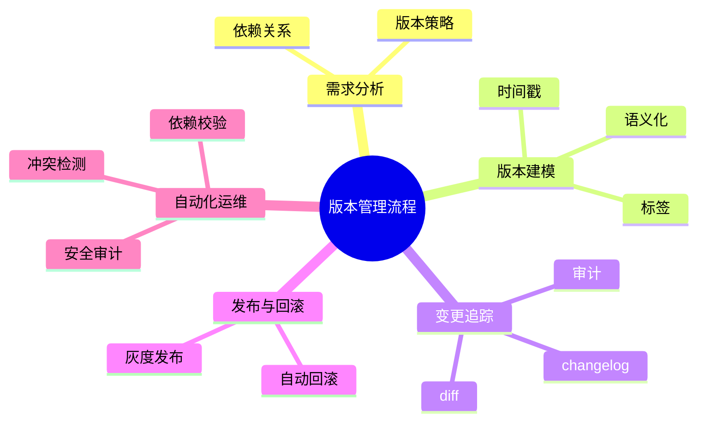

# 版本建模理论探讨

## 1. 形式化目标

- 以结构化方式描述部署包、镜像、版本号、变更记录、依赖等。
- 支持多种版本管理策略（语义化、快照、标签等）统一建模。
- 便于自动生成版本发布、回滚、依赖校验、变更追踪等。

## 2. 核心概念

- **版本号**：语义化（SemVer）、时间戳、标签等。
- **变更记录**：changelog、diff、作者、时间。
- **依赖管理**：版本依赖、兼容性、冲突检测。
- **发布与回滚**：版本切换、灰度发布、回滚策略。
- **多环境版本**：dev/test/prod等环境隔离。

## 3. 已有标准

- Git、SVN、Mercurial等VCS
- Docker镜像标签、Helm Chart版本
- SemVer、Pip/Conda/NPM等包管理

## 4. 可行性分析

- 版本建模结构化强，标准化程度高，适合DSL抽象。
- 可自动生成版本发布、回滚、依赖校验等。
- 易于与AI结合进行版本补全、冲突检测、自动回滚。

## 5. 自动化价值

- 降低手工管理和维护版本的成本。
- 提高发布一致性、可追溯性和安全性。
- 支持自动化回滚和依赖校验。

## 6. 与AI结合点

- 智能补全版本号、依赖。
- 自动推理兼容性、冲突检测。
- 智能生成回滚与发布建议。

---

## 7. 常见版本管理方式与特性一览（表格）

| 方式         | 特性                 | 典型场景           |
|--------------|----------------------|--------------------|
| 语义化版本   | 主/次/修订号         | API、包管理        |
| 时间戳版本   | 构建时间、唯一性     | 快照、CI/CD        |
| 标签         | 任意标识、分支管理   | 灰度、A/B测试      |
| 变更记录     | 详细diff、作者、时间 | 审计、回溯         |
| 依赖管理     | 版本依赖、冲突检测   | 多模块、微服务     |

---

## 8. 版本管理流程思维导图

---

## 9. 形式化推理/证明片段

**定理（版本可回溯性）**：
若每次变更均有唯一版本号与变更记录，则任意历史状态可回溯。

*证明思路*：
通过版本号索引变更记录，依次回滚可还原任意历史状态。

**推论（依赖一致性）**：
若所有依赖均锁定版本，则构建结果唯一、可复现。
