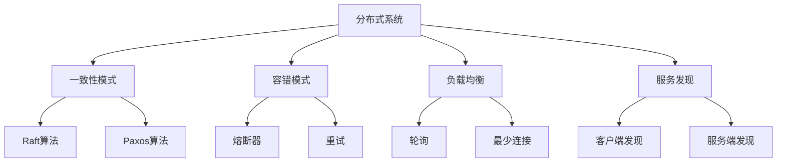

# 分布式模式建模理论 (Distributed Pattern Modeling Theory)

## 目录（Table of Contents）

- [分布式模式建模理论 (Distributed Pattern Modeling Theory)](#分布式模式建模理论-distributed-pattern-modeling-theory)
  - [目录（Table of Contents）](#目录table-of-contents)
  - [概念定义](#概念定义)
    - [核心特征](#核心特征)
  - [理论基础](#理论基础)
    - [分布式系统理论](#分布式系统理论)
    - [CAP理论](#cap理论)
  - [核心组件](#核心组件)
    - [容错模式模型](#容错模式模型)
    - [一致性模式模型](#一致性模式模型)
    - [负载均衡模式模型](#负载均衡模式模型)
    - [服务发现模式模型](#服务发现模式模型)
  - [国际标准对标](#国际标准对标)
    - [分布式系统标准](#分布式系统标准)
      - [一致性协议标准](#一致性协议标准)
      - [服务网格标准](#服务网格标准)
    - [行业标准](#行业标准)
      - [微服务标准](#微服务标准)
      - [分布式数据库标准](#分布式数据库标准)
  - [著名大学课程对标](#著名大学课程对标)
    - [分布式系统课程](#分布式系统课程)
      - [MIT 6.824 - Distributed Systems](#mit-6824---distributed-systems)
      - [Stanford CS244 - Advanced Topics in Networking](#stanford-cs244---advanced-topics-in-networking)
      - [CMU 15-440 - Distributed Systems](#cmu-15-440---distributed-systems)
    - [系统设计课程](#系统设计课程)
      - [MIT 6.170 - Software Studio](#mit-6170---software-studio)
      - [Stanford CS210 - Software Engineering](#stanford-cs210---software-engineering)
  - [工程实践](#工程实践)
    - [分布式架构模式](#分布式架构模式)
      - [微服务架构](#微服务架构)
      - [事件驱动架构](#事件驱动架构)
    - [容错策略](#容错策略)
      - [熔断器模式](#熔断器模式)
      - [重试模式](#重试模式)
  - [最佳实践](#最佳实践)
    - [分布式设计原则](#分布式设计原则)
    - [性能优化原则](#性能优化原则)
    - [监控告警原则](#监控告警原则)
  - [分布式系统理论创新与递归推理](#分布式系统理论创新与递归推理)
    - [理论创新与差异化](#理论创新与差异化)
      - [递归分布式AST结构](#递归分布式ast结构)
      - [形式化分布式理论](#形式化分布式理论)
      - [AI自动化分布式设计](#ai自动化分布式设计)
    - [递归推理伪代码](#递归推理伪代码)
    - [典型递归流程图](#典型递归流程图)
    - [实际代码片段（分布式模式实现）](#实际代码片段分布式模式实现)
    - [工程难点与创新解决方案](#工程难点与创新解决方案)
    - [行业映射与案例](#行业映射与案例)
      - [金融行业分布式模式](#金融行业分布式模式)
      - [电商行业分布式模式](#电商行业分布式模式)
      - [社交媒体分布式模式](#社交媒体分布式模式)
  - [分布式系统设计模式](#分布式系统设计模式)
    - [微服务架构模式](#微服务架构模式)
    - [分布式数据模式](#分布式数据模式)
    - [分布式计算模式](#分布式计算模式)
  - [相关概念](#相关概念)
  - [相关概念1](#相关概念1)
    - [核心概念关联](#核心概念关联)
    - [应用领域关联](#应用领域关联)
    - [行业应用关联](#行业应用关联)
  - [参考文献](#参考文献)

## 概念定义

分布式模式建模理论是一种形式化建模方法，用于描述和管理分布式系统的各种模式和架构。
它通过结构化的方式定义容错模式、一致性模式、负载均衡模式、服务发现模式等，实现分布式系统的自动化和标准化。

### 核心特征

1. **容错性**：支持故障检测、自动恢复和优雅降级
2. **一致性**：提供强一致性、最终一致性和可用性权衡
3. **可扩展性**：支持水平扩展和垂直扩展
4. **高可用性**：通过冗余和故障转移保证系统可用性
5. **性能优化**：负载均衡、缓存策略和异步处理

## 理论基础

### 分布式系统理论

分布式模式建模基于以下理论：

```text
DistributedSystem = (Nodes, Communication, Consistency, FaultTolerance)
```

其中：

- Nodes：分布式节点集合
- Communication：节点间通信机制
- Consistency：一致性协议
- FaultTolerance：容错机制

### CAP理论

```yaml
# CAP理论权衡
cap_theory:
  consistency:
    description: "一致性"
    characteristics:
      - "所有节点看到相同的数据"
      - "强一致性保证"
      - "可能影响可用性"
      
  availability:
    description: "可用性"
    characteristics:
      - "每个请求都能得到响应"
      - "不保证数据一致性"
      - "可能返回过时数据"
      
  partition_tolerance:
    description: "分区容错性"
    characteristics:
      - "网络分区时系统继续运行"
      - "节点间通信可能失败"
      - "必须选择C或A"
```

## 核心组件

### 容错模式模型

```yaml
# 容错模式定义
fault_tolerance_patterns:
  - name: "circuit_breaker"
    description: "熔断器模式"
    states:
      - state: "closed"
        description: "正常状态"
        behavior: "请求正常通过"
        
      - state: "open"
        description: "熔断状态"
        behavior: "快速失败，不调用远程服务"
        
      - state: "half_open"
        description: "半开状态"
        behavior: "允许少量请求尝试"
        
    configuration:
      failure_threshold: 5
      timeout: "60s"
      success_threshold: 2
      
  - name: "retry"
    description: "重试模式"
    strategies:
      - strategy: "exponential_backoff"
        initial_delay: "1s"
        max_delay: "30s"
        multiplier: 2
        max_attempts: 3
        
      - strategy: "fixed_delay"
        delay: "5s"
        max_attempts: 3
        
  - name: "bulkhead"
    description: "舱壁模式"
    isolation:
      - resource: "thread_pool"
        max_threads: 10
        queue_size: 100
        
      - resource: "connection_pool"
        max_connections: 20
        timeout: "30s"
```

### 一致性模式模型

```yaml
# 一致性模式定义
consistency_patterns:
  - name: "strong_consistency"
    description: "强一致性"
    characteristics:
      - "所有节点数据完全一致"
      - "写入后立即可读"
      - "性能较低"
    use_cases:
      - "金融交易"
      - "库存管理"
      - "用户账户"
      
  - name: "eventual_consistency"
    description: "最终一致性"
    characteristics:
      - "数据最终会一致"
      - "允许临时不一致"
      - "性能较高"
    use_cases:
      - "社交媒体"
      - "内容管理"
      - "日志系统"
      
  - name: "causal_consistency"
    description: "因果一致性"
    characteristics:
      - "保持因果关系"
      - "允许并发写入"
      - "中等性能"
    use_cases:
      - "协作编辑"
      - "消息系统"
      - "评论系统"
```

### 负载均衡模式模型

```yaml
# 负载均衡模式定义
load_balancing_patterns:
  - name: "round_robin"
    description: "轮询负载均衡"
    algorithm: "round_robin"
    characteristics:
      - "依次分配请求"
      - "简单高效"
      - "不考虑服务器状态"
    configuration:
      weight: 1
      
  - name: "least_connections"
    description: "最少连接负载均衡"
    algorithm: "least_connections"
    characteristics:
      - "选择连接数最少的服务器"
      - "动态负载分配"
      - "适合长连接"
    configuration:
      health_check: true
      health_check_interval: "30s"
      
  - name: "weighted_round_robin"
    description: "加权轮询负载均衡"
    algorithm: "weighted_round_robin"
    characteristics:
      - "根据权重分配请求"
      - "支持服务器能力差异"
      - "静态权重配置"
    configuration:
      weights:
        - server: "server1"
          weight: 3
        - server: "server2"
          weight: 2
        - server: "server3"
          weight: 1
```

### 服务发现模式模型

```yaml
# 服务发现模式定义
service_discovery_patterns:
  - name: "client_side_discovery"
    description: "客户端服务发现"
    architecture:
      - "客户端直接查询服务注册中心"
      - "客户端缓存服务列表"
      - "客户端实现负载均衡"
    advantages:
      - "减少网络跳数"
      - "客户端控制负载均衡"
      - "更好的性能"
    disadvantages:
      - "客户端复杂性增加"
      - "服务注册中心耦合"
      
  - name: "server_side_discovery"
    description: "服务端服务发现"
    architecture:
      - "负载均衡器查询服务注册中心"
      - "负载均衡器转发请求"
      - "客户端不感知服务发现"
    advantages:
      - "客户端简单"
      - "集中式负载均衡"
      - "更好的安全性"
    disadvantages:
      - "额外的网络跳数"
      - "负载均衡器单点故障"
```

## 国际标准对标

### 分布式系统标准

#### 一致性协议标准

- **Raft**：分布式一致性算法
- **Paxos**：经典分布式一致性算法
- **ZAB**：Zookeeper原子广播协议
- **PBFT**：实用拜占庭容错算法

#### 服务网格标准

- **Istio**：服务网格平台
- **Linkerd**：轻量级服务网格
- **Consul Connect**：服务网格解决方案
- **Envoy**：云原生代理

### 行业标准

#### 微服务标准

- **Spring Cloud**：微服务框架
- **Netflix OSS**：微服务工具集
- **Kubernetes**：容器编排平台
- **Docker Swarm**：容器集群管理

#### 分布式数据库标准

- **MongoDB**：文档数据库
- **Cassandra**：列族数据库
- **Redis**：内存数据库
- **Elasticsearch**：搜索引擎

## 著名大学课程对标

### 分布式系统课程

#### MIT 6.824 - Distributed Systems

- **课程内容**：分布式系统、容错、一致性
- **分布式相关**：Raft算法、MapReduce、分布式事务
- **实践项目**：分布式键值存储
- **相关技术**：Go、Raft、etcd

#### Stanford CS244 - Advanced Topics in Networking

- **课程内容**：网络协议、性能优化、分布式网络
- **分布式相关**：分布式网络、负载均衡、服务发现
- **实践项目**：分布式网络工具
- **相关技术**：TCP/IP、HTTP/2、gRPC

#### CMU 15-440 - Distributed Systems

- **课程内容**：分布式系统、网络编程、系统设计
- **分布式相关**：分布式算法、容错机制、一致性协议
- **实践项目**：分布式系统实现
- **相关技术**：Java、RPC、分布式锁

### 系统设计课程

#### MIT 6.170 - Software Studio

- **课程内容**：软件设计、架构、分布式架构
- **分布式相关**：微服务架构、服务网格、云原生
- **实践项目**：分布式应用设计
- **相关技术**：Spring Boot、Docker、Kubernetes

#### Stanford CS210 - Software Engineering

- **课程内容**：软件工程、分布式系统、架构设计
- **分布式相关**：分布式设计模式、容错策略、性能优化
- **实践项目**：分布式系统设计
- **相关技术**：微服务、负载均衡、缓存

## 工程实践

### 分布式架构模式

#### 微服务架构

```yaml
# 微服务架构模式
microservice_architecture:
  service_decomposition:
    - service: "user-service"
      responsibility: "用户管理"
      database: "user-db"
      api: "/api/users"
      
    - service: "order-service"
      responsibility: "订单管理"
      database: "order-db"
      api: "/api/orders"
      
    - service: "payment-service"
      responsibility: "支付处理"
      database: "payment-db"
      api: "/api/payments"
      
  service_communication:
    - type: "synchronous"
      protocol: "HTTP/REST"
      use_cases: ["用户查询", "订单创建"]
      
    - type: "asynchronous"
      protocol: "Message Queue"
      use_cases: ["订单状态更新", "支付通知"]
      
  service_discovery:
    - type: "client_side"
      registry: "Consul"
      health_check: true
      
  load_balancing:
    - type: "round_robin"
      health_check: true
      failover: true
```

#### 事件驱动架构

```yaml
# 事件驱动架构模式
event_driven_architecture:
  event_bus:
    - type: "message_broker"
      technology: "Apache Kafka"
      partitions: 3
      replication: 2
      
  event_types:
    - type: "user_created"
      schema: "user_schema.json"
      consumers: ["email-service", "analytics-service"]
      
    - type: "order_placed"
      schema: "order_schema.json"
      consumers: ["inventory-service", "payment-service"]
      
    - type: "payment_processed"
      schema: "payment_schema.json"
      consumers: ["order-service", "notification-service"]
      
  event_handling:
    - pattern: "event_sourcing"
      storage: "event_store"
      replay: true
      
    - pattern: "saga_pattern"
      compensation: true
      rollback: true
```

### 容错策略

#### 熔断器模式

```yaml
# 熔断器模式实现
circuit_breaker_implementation:
  configuration:
    - service: "payment-service"
      failure_threshold: 5
      timeout: "60s"
      success_threshold: 2
      monitoring_window: "10s"
      
  fallback_strategies:
    - strategy: "cache"
      description: "使用缓存数据"
      ttl: "5m"
      
    - strategy: "default_response"
      description: "返回默认响应"
      response: "service_unavailable"
      
    - strategy: "degraded_service"
      description: "降级服务"
      features: ["basic_payment"]
```

#### 重试模式

```yaml
# 重试模式实现
retry_pattern_implementation:
  strategies:
    - name: "exponential_backoff"
      initial_delay: "1s"
      max_delay: "30s"
      multiplier: 2
      max_attempts: 3
      jitter: true
      
    - name: "fixed_delay"
      delay: "5s"
      max_attempts: 3
      
    - name: "immediate_retry"
      max_attempts: 2
      conditions: ["network_timeout"]
      
  retryable_errors:
    - error_code: "500"
      retryable: true
      
    - error_code: "503"
      retryable: true
      
    - error_code: "429"
      retryable: true
      backoff: "exponential"
```

## 最佳实践

### 分布式设计原则

1. **容错优先**：设计时优先考虑故障情况
2. **最终一致性**：在性能和一致性间找到平衡
3. **异步通信**：减少同步依赖，提高性能
4. **幂等性**：确保操作可以安全重试

### 性能优化原则

1. **缓存策略**：合理使用多级缓存
2. **负载均衡**：动态分配负载
3. **异步处理**：减少阻塞操作
4. **批量操作**：减少网络开销

### 监控告警原则

1. **全面监控**：监控所有关键指标
2. **实时告警**：及时发现和处理问题
3. **根因分析**：快速定位问题原因
4. **自动恢复**：实现故障自动恢复

## 分布式系统理论创新与递归推理

### 理论创新与差异化

#### 递归分布式AST结构

Formal Framework的分布式模式模型采用递归抽象语法树（AST）结构，支持容错、一致性、负载均衡、服务发现等多层嵌套，便于表达复杂分布式系统架构。这种设计使得分布式模式能够：

- **层次化建模**：支持从概念模式到实现模式的逐层细化
- **模块化组织**：每个分布式模式可以独立开发和维护
- **递归扩展**：支持无限深度的模式嵌套和组合
- **一致性保证**：通过AST结构确保分布式模式的一致性和完整性

#### 形式化分布式理论

引入强形式化理论，支持分布式一致性、容错性、可扩展性等高级特性：

- **CAP定理形式化**：一致性、可用性、分区容错性的数学建模
- **分布式一致性算法**：Raft、Paxos、PBFT等算法的形式化描述
- **容错模式**：熔断器、重试、舱壁等模式的形式化定义
- **负载均衡算法**：轮询、最少连接、加权等算法的形式化建模

#### AI自动化分布式设计

集成AI辅助功能，提升分布式系统设计效率和质量：

- **模式推荐**：基于系统需求自动推荐合适的分布式模式
- **性能优化**：基于历史数据自动优化分布式系统性能
- **故障预测**：预测分布式系统中的潜在故障点
- **自动调优**：自动调整分布式系统参数以优化性能

### 递归推理伪代码

```python
# 递归推理：自动推导分布式模式依赖关系

def infer_distributed_dependencies(pattern):
    deps = set(pattern.dependencies)
    for sub_pattern in pattern.sub_patterns:
        deps.update(infer_distributed_dependencies(sub_pattern))
    return deps

# AI辅助分布式系统设计

def ai_distributed_design(requirements, constraints):
    return ai_model.suggest_distributed_architecture(requirements, constraints)

# 自动负载均衡配置

def auto_load_balancer_config(services, traffic_pattern):
    return ai_model.optimize_load_balancing(services, traffic_pattern)
```

### 典型递归流程图



### 实际代码片段（分布式模式实现）

```python
# 熔断器模式实现

class CircuitBreaker:
    def __init__(self, failure_threshold=5, timeout=60, success_threshold=2):
        self.failure_threshold = failure_threshold
        self.timeout = timeout
        self.success_threshold = success_threshold
        self.state = 'CLOSED'
        self.failure_count = 0
        self.success_count = 0
        self.last_failure_time = None
        
    def call(self, func, *args, **kwargs):
        if self.state == 'OPEN':
            if time.time() - self.last_failure_time > self.timeout:
                self.state = 'HALF_OPEN'
            else:
                raise CircuitBreakerOpenException()
                
        try:
            result = func(*args, **kwargs)
            self.on_success()
            return result
        except Exception as e:
            self.on_failure()
            raise e
            
    def on_success(self):
        self.failure_count = 0
        if self.state == 'HALF_OPEN':
            self.success_count += 1
            if self.success_count >= self.success_threshold:
                self.state = 'CLOSED'
                self.success_count = 0
                
    def on_failure(self):
        self.failure_count += 1
        self.last_failure_time = time.time()
        if self.failure_count >= self.failure_threshold:
            self.state = 'OPEN'

# 一致性哈希实现

class ConsistentHash:
    def __init__(self, nodes=None, replicas=3):
        self.replicas = replicas
        self.ring = {}
        self.sorted_keys = []
        
        if nodes:
            for node in nodes:
                self.add_node(node)
                
    def add_node(self, node):
        for i in range(self.replicas):
            key = self.hash(f"{node}:{i}")
            self.ring[key] = node
            self.sorted_keys.append(key)
        self.sorted_keys.sort()
        
    def remove_node(self, node):
        for i in range(self.replicas):
            key = self.hash(f"{node}:{i}")
            del self.ring[key]
            self.sorted_keys.remove(key)
            
    def get_node(self, key):
        if not self.ring:
            return None
            
        hash_key = self.hash(key)
        for ring_key in self.sorted_keys:
            if hash_key <= ring_key:
                return self.ring[ring_key]
        return self.ring[self.sorted_keys[0]]
        
    def hash(self, key):
        return hashlib.md5(key.encode()).hexdigest()
```

### 工程难点与创新解决方案

- **分布式一致性**：通过形式化建模和AI辅助设计，自动选择最适合的一致性算法
- **容错设计**：递归建模容错模式，AI自动生成容错策略和恢复机制
- **性能优化**：基于历史数据和实时监控，AI自动优化分布式系统性能
- **服务发现**：智能服务发现和负载均衡，自动适应系统变化

### 行业映射与案例

#### 金融行业分布式模式

```yaml
financial_distributed_patterns:
  trading_system:
    consistency: "strong_consistency"
    fault_tolerance: "byzantine_fault_tolerance"
    load_balancing: "weighted_round_robin"
    service_discovery: "client_side"
    
  payment_system:
    consistency: "eventual_consistency"
    fault_tolerance: "circuit_breaker"
    load_balancing: "least_connections"
    service_discovery: "server_side"
    
  risk_management:
    consistency: "causal_consistency"
    fault_tolerance: "retry_with_backoff"
    load_balancing: "consistent_hashing"
    service_discovery: "hybrid"
```

#### 电商行业分布式模式

```yaml
ecommerce_distributed_patterns:
  order_system:
    consistency: "eventual_consistency"
    fault_tolerance: "saga_pattern"
    load_balancing: "round_robin"
    service_discovery: "client_side"
    
  inventory_system:
    consistency: "strong_consistency"
    fault_tolerance: "two_phase_commit"
    load_balancing: "weighted_round_robin"
    service_discovery: "server_side"
    
  recommendation_system:
    consistency: "eventual_consistency"
    fault_tolerance: "circuit_breaker"
    load_balancing: "consistent_hashing"
    service_discovery: "hybrid"
```

#### 社交媒体分布式模式

```yaml
social_media_distributed_patterns:
  feed_system:
    consistency: "eventual_consistency"
    fault_tolerance: "event_sourcing"
    load_balancing: "consistent_hashing"
    service_discovery: "client_side"
    
  messaging_system:
    consistency: "causal_consistency"
    fault_tolerance: "retry_with_backoff"
    load_balancing: "least_connections"
    service_discovery: "server_side"
    
  notification_system:
    consistency: "eventual_consistency"
    fault_tolerance: "circuit_breaker"
    load_balancing: "round_robin"
    service_discovery: "hybrid"
```

## 分布式系统设计模式

### 微服务架构模式

```yaml
microservice_patterns:
  service_decomposition:
    - pattern: "database_per_service"
      description: "每个服务拥有独立的数据库"
      benefits: ["数据隔离", "独立扩展", "技术多样性"]
      challenges: ["数据一致性", "分布式事务", "数据查询"]
      
    - pattern: "api_gateway"
      description: "统一的API入口"
      benefits: ["统一认证", "请求路由", "协议转换"]
      challenges: ["单点故障", "性能瓶颈", "复杂性"]
      
    - pattern: "event_sourcing"
      description: "事件溯源模式"
      benefits: ["完整审计", "时间旅行", "事件重放"]
      challenges: ["存储开销", "查询复杂性", "事件版本"]
      
  communication_patterns:
    - pattern: "synchronous"
      protocol: "HTTP/REST"
      use_cases: ["用户查询", "订单创建", "支付处理"]
      benefits: ["简单直接", "易于调试", "强一致性"]
      challenges: ["耦合度高", "可用性低", "性能差"]
      
    - pattern: "asynchronous"
      protocol: "Message Queue"
      use_cases: ["订单状态更新", "支付通知", "库存同步"]
      benefits: ["解耦合", "高可用", "高性能"]
      challenges: ["复杂性", "消息丢失", "重复处理"]
```

### 分布式数据模式

```yaml
distributed_data_patterns:
  replication:
    - pattern: "master_slave"
      description: "主从复制"
      consistency: "eventual"
      use_cases: ["读多写少", "数据分析", "备份"]
      
    - pattern: "master_master"
      description: "主主复制"
      consistency: "eventual"
      use_cases: ["多地域", "高可用", "负载均衡"]
      
    - pattern: "peer_to_peer"
      description: "对等复制"
      consistency: "eventual"
      use_cases: ["分布式存储", "区块链", "P2P网络"]
      
  partitioning:
    - pattern: "horizontal_partitioning"
      description: "水平分区"
      strategy: "range_based"
      use_cases: ["大数据", "时间序列", "地理位置"]
      
    - pattern: "vertical_partitioning"
      description: "垂直分区"
      strategy: "column_based"
      use_cases: ["宽表", "稀疏数据", "列存储"]
      
    - pattern: "functional_partitioning"
      description: "功能分区"
      strategy: "service_based"
      use_cases: ["微服务", "领域驱动", "业务隔离"]
```

### 分布式计算模式

```yaml
distributed_computing_patterns:
  map_reduce:
    - pattern: "batch_processing"
      description: "批处理"
      use_cases: ["数据分析", "ETL", "机器学习"]
      frameworks: ["Hadoop", "Spark", "Flink"]
      
    - pattern: "stream_processing"
      description: "流处理"
      use_cases: ["实时分析", "事件处理", "监控告警"]
      frameworks: ["Kafka Streams", "Storm", "Flink"]
      
  distributed_coordination:
    - pattern: "leader_election"
      description: "领导者选举"
      algorithms: ["Raft", "Paxos", "ZAB"]
      use_cases: ["集群管理", "配置管理", "任务调度"]
      
    - pattern: "distributed_lock"
      description: "分布式锁"
      implementations: ["Redis", "Zookeeper", "etcd"]
      use_cases: ["资源互斥", "任务调度", "配置更新"]
      
    - pattern: "distributed_consensus"
      description: "分布式共识"
      algorithms: ["Raft", "Paxos", "PBFT"]
      use_cases: ["状态复制", "配置管理", "区块链"]
```

## 相关概念

- [数据建模](../data-model/theory.md)
- [功能建模](../functional-model/theory.md)
- [交互建模](../interaction-model/theory.md)
- [监控建模](../monitoring-model/theory.md)
- [运行时建模](../runtime-model/theory.md)

## 相关概念1

### 核心概念关联

- [抽象语法树](../core-concepts/abstract-syntax-tree.md) - AST为分布式模式模型提供结构化表示
- [代码生成](../core-concepts/code-generation.md) - 代码生成实现分布式模式模型到分布式代码的转换
- [模型转换](../core-concepts/model-transformation.md) - 模型转换实现分布式模式模型间的转换
- [形式化建模](../core-concepts/formal-modeling.md) - 形式化建模为分布式模式模型提供理论基础
- [自动推理](../core-concepts/automated-reasoning.md) - 自动推理用于分布式模式模型的智能处理
- [递归建模](../core-concepts/recursive-modeling.md) - 递归建模支持分布式模式模型的层次化处理

### 应用领域关联

- [数据建模](../data-model/theory.md) - 数据模型与分布式模式模型的数据分布关联
- [功能建模](../functional-model/theory.md) - 功能模型与分布式模式模型的业务逻辑关联
- [交互建模](../interaction-model/theory.md) - 交互模型与分布式模式模型的通信关联
- [运行时建模](../runtime-model/theory.md) - 运行时模型与分布式模式模型的运行时环境关联

### 行业应用关联

- [金融架构](../../industry-model/finance-architecture/) - 金融分布式模式模型和交易系统架构
- [AI基础设施](../../industry-model/ai-infrastructure-architecture/) - AI分布式模式模型和机器学习架构
- [云原生架构](../../industry-model/cloud-native-architecture/) - 云服务分布式模式模型和容器化架构

## 参考文献

1. Kleppmann, M. (2017). "Designing Data-Intensive Applications"
2. Newman, S. (2021). "Building Microservices"
3. Richardson, C. (2018). "Microservices Patterns"
4. Vernon, V. (2013). "Implementing Domain-Driven Design"
5. Hohpe, G., & Woolf, B. (2003). "Enterprise Integration Patterns"
6. Fowler, M. (2018). "Patterns of Enterprise Application Architecture"
7. Tanenbaum, A. S., & Van Steen, M. (2017). "Distributed Systems: Principles and Paradigms"
8. Coulouris, G., Dollimore, J., Kindberg, T., & Blair, G. (2011). "Distributed Systems: Concepts and Design"

## 与标准/课程对照要点

- **L2/L3 映射**：本理论对应 [L3_D10 分布式模式标准模型](../../L3_D10_分布式模式标准模型.md)；对象/属性/不变式对齐见 [L2↔L3 映射总表](../alignment-L2-L3-matrix.md)。
- **标准与课程**：分布式系统相关标准及名校课程（如 ETH Distributed Systems、Stanford CS 210 等）与 L3_D10 知识点对照见 [AUTHORITY_STANDARD_COURSE_L2L3_MATRIX](../../reference/AUTHORITY_STANDARD_COURSE_L2L3_MATRIX.md) 与 [AUTHORITY_ALIGNMENT_INDEX](../../reference/AUTHORITY_ALIGNMENT_INDEX.md) 第 2–5 节。
